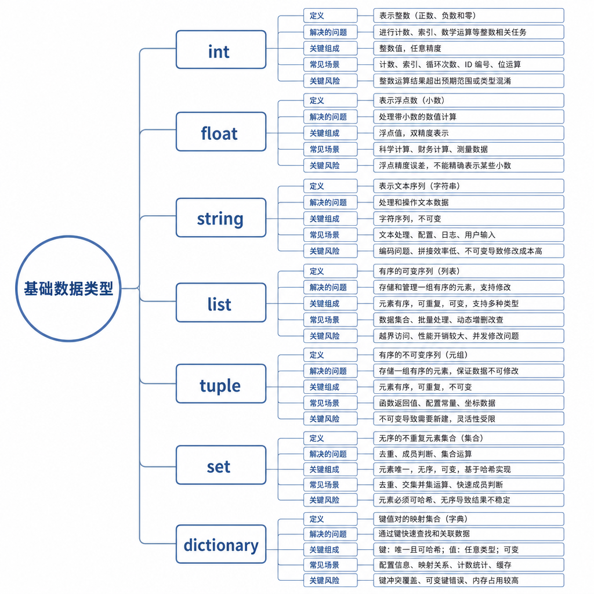
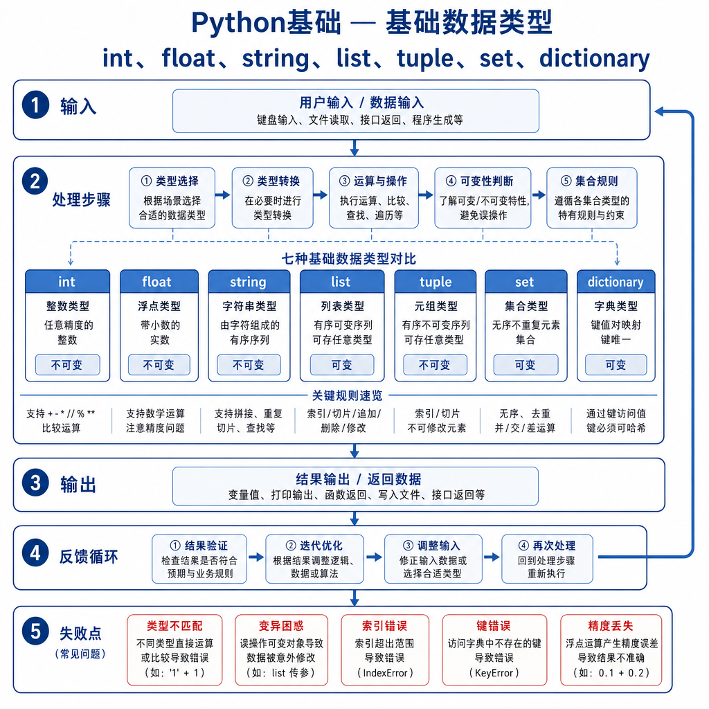
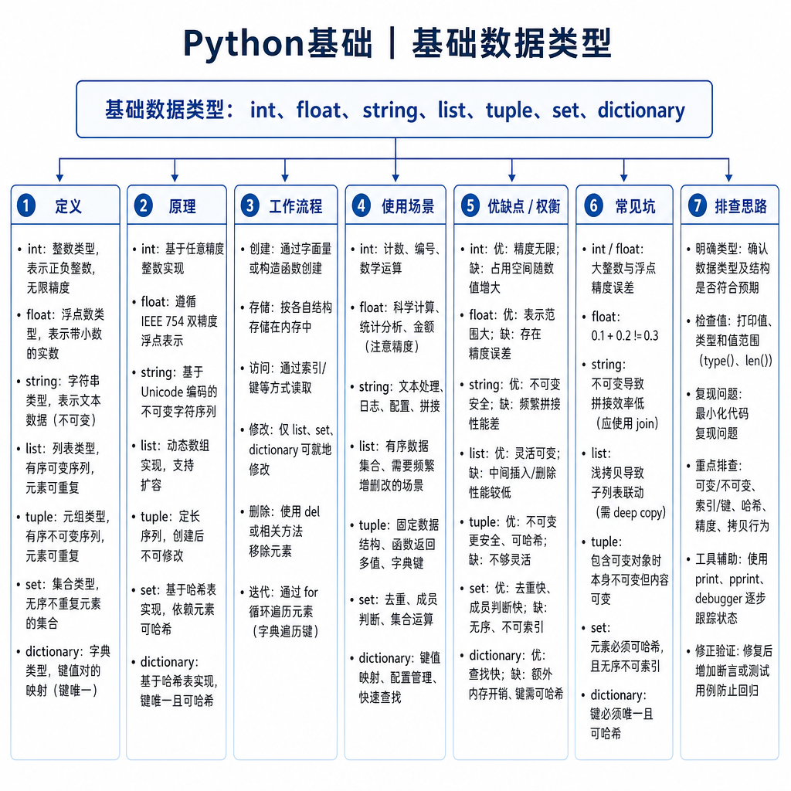

# 基础数据类型：int、float、str、list、tuple、set、dict

接口联调时，新人最容易犯的错，是把所有数据都当成“能打印出来的值”。年龄从请求里拿到就是 `"18"`，价格用 `0.1` 和 `0.2` 直接相加，标签用逗号拼成字符串，用户信息再塞进一个大字典。代码一开始能跑，到了比较大小、金额校验、去重、排序、按字段查找时，问题就集中爆出来。

面试官问基础数据类型，不是让你背一串名字，而是看你能不能把“业务含义”落到合适的数据结构上。类型选错，后面再写多少判断都像补洞；类型选对，代码往往自然变短。

## 从一个统计 bug 开始

假设你要统计每个用户访问过哪些页面，原始日志长这样：

```python
records = [("u1", "/home"), ("u1", "/pay"), ("u1", "/home")]
```

有人写成：

```python
result = {}
for user_id, page in records:
    result[user_id] = result.get(user_id, []) + [page]
```

结果看起来没错，但它至少埋了两个问题。第一，页面列表会保留重复访问，如果需求是“访问过哪些页面”，重复值没有意义。第二，`+ [page]` 每次都会创建新列表，数据量大时会产生很多临时对象。

更贴近需求的写法是：

```python
result = {}
for user_id, page in records:
    result.setdefault(user_id, set()).add(page)
```

这里 `dict` 负责通过用户 ID 快速定位，`set` 负责去重。你没有额外写“如果重复就跳过”的判断，因为数据结构已经替你表达了这条规则。

## 核心矛盾：值、顺序、唯一性和查找

Python 基础类型可以先按用途分层：`int`、`float` 表达数字，`str` 表达文本，`list`、`tuple` 表达有序集合，`set` 表达唯一集合，`dict` 表达键值映射。真正面试时，不要只说“有哪些类型”，要接着说它们解决的矛盾不同。



`list` 有序、可变、允许重复，适合保存步骤、消息历史、排序结果。`tuple` 有序、不可变、允许重复，适合表达固定结构，比如坐标 `(x, y)`、函数返回的多项结果、数据库行。`set` 无序、可变、元素唯一，适合去重、交集、并集和成员判断。`dict` 保存 key 到 value 的映射，适合配置、JSON 对象、索引表和缓存。

一个简单判断方法是：如果你关心位置和顺序，用 `list` 或 `tuple`；如果你关心“有没有”，用 `set`；如果你关心“通过一个标识找到一份数据”，用 `dict`。

## 底层机制：为什么 dict 和 set 查得快

`list` 可以理解为动态数组。按下标访问平均是 `O(1)`，因为解释器能直接计算元素位置；但在中间插入或删除，后面的元素可能要移动，所以成本会升高。

`dict` 和 `set` 基于哈希表。查询时会先计算 key 或元素的哈希值，再根据哈希值定位桶位，因此平均查询接近 `O(1)`。代价是 key 必须可哈希，也就是哈希值在生命周期内保持稳定。所以 `str`、`int`、只包含可哈希对象的 `tuple` 常能作为 key，而 `list`、`dict`、`set` 不能作为 key。

```python
users = {
    "u1": {"name": "Ada", "age": 18},
    "u2": {"name": "Lin", "age": 20},
}

print(users["u1"]["name"])

permissions = {"read", "write"}
if "write" in permissions:
    print("can update")
```



这里 `users` 用 `dict`，因为用户 ID 是天然索引；`permissions` 用 `set`，因为权限判断只关心存在性，不关心顺序。

## 工程例子：分页接口怎么组织数据

写分页接口时，返回值一般不会用嵌套列表硬凑，而会用 `dict` 表达结构：

```python
response = {
    "total": 126,
    "page": 1,
    "items": [
        {"id": 1, "title": "Python 基础"},
        {"id": 2, "title": "面试题"},
    ],
}
```

`response` 是 `dict`，因为它有明确字段；`items` 是 `list`，因为分页结果的顺序有意义；每条记录还是 `dict`，因为字段名比位置更容易读。如果把每条记录写成 `(1, "Python 基础")`，也能跑，但后续字段一多，调用方就要记住“第 0 位是 id，第 1 位是 title”，维护成本会变高。

金额计算是另一个常见坑。`float` 使用二进制浮点表示，`0.1 + 0.2` 可能不是精确的 `0.3`：

```python
print(0.1 + 0.2 == 0.3)  # False
```

如果是金额，常见做法是用整数分保存，或者使用 `decimal.Decimal`。这不是“Python 算错了”，而是二进制浮点无法精确表示某些十进制小数。

## 边界和风险

第一，不要把 `dict` 和 `set` 说成永远 `O(1)`。哈希冲突、扩容、key 的哈希计算成本都会影响实际性能。平均 `O(1)` 是常见条件下的结论，不是每一次操作的承诺。

第二，不要说 `tuple` 里面的东西都不能变。`tuple` 不可变，指的是它保存的引用位置不能改；如果里面放了列表，列表本身仍然可以被修改。

```python
t = ([1, 2], "ok")
t[0].append(3)
print(t)  # ([1, 2, 3], 'ok')
```

第三，字符串是不可变对象。`s += "x"` 看起来像追加，通常是创建新字符串再让变量指向它。循环拼接大量字符串时，更稳的是先放进列表，最后 `"".join(parts)`。

## 追问拆解：为什么不能只背类型名

面试官常会把题目放进一个小需求里问。比如“用户搜索历史要保存最近 20 条，还要去重，怎么设计？”如果你只说用 `list`，去重就要额外判断；只说用 `set`，最近顺序又丢了。更合理的思路是：用 `list` 保存展示顺序，用 `set` 辅助判断是否已存在，插入新记录时先删除旧位置，再放到最前面，最后截断到 20 条。

再比如“黑名单用户判断”，如果你每次都在 `list` 里 `in`，用户量大时会线性扫描；换成 `set` 或以用户 ID 为 key 的 `dict`，查询成本会稳定很多。也就是说，基础类型题真正考的是你能不能从访问模式反推数据结构：是频繁遍历、频繁按下标访问、频繁判断存在，还是频繁按 key 查找。

## 高频面试追问

- Python 常见基础数据类型有哪些？分别适合什么场景？
- `list` 和 `tuple` 的区别是什么？什么时候用 `tuple`？
- `dict` 和 `set` 为什么查询快？它们对 key 或元素有什么要求？
- 为什么 `0.1 + 0.2 != 0.3`？金额计算怎么处理？
- `tuple` 一定可以作为字典 key 吗？
- 什么时候用 `list`，什么时候用 `set`？

## 可复述答案

Python 基础数据类型可以按语义理解：`int`、`float` 表示数值，`str` 表示文本，`list` 表示有序可变集合，`tuple` 表示有序固定结构，`set` 表示唯一集合，`dict` 表示键值映射。底层上，`list` 类似动态数组，适合按顺序保存和按下标访问；`dict` 和 `set` 基于哈希表，平均查询效率高，但 key 或元素必须可哈希。工程中我会根据是否需要顺序、是否允许重复、是否要快速查找、对象是否会变化来选类型，而不是只按习惯写列表或字典。



## 排查和实践建议

遇到类型相关 bug，先打印 `type()` 和关键字段值，确认数据有没有被提前转成字符串。然后追问四件事：顺序是否重要、重复是否允许、是否需要按 key 快速查找、元素是否会被修改。接口入参要尽早做类型转换和校验，金额不要直接用 `float` 做精确计算，权限、标签、去重列表优先考虑 `set`。面试回答按“场景问题 → 类型语义 → 底层复杂度 → 边界风险 → 工程例子”展开，会比单纯背名称更稳定。

---

[返回 python基础 模块目录](README.md)
