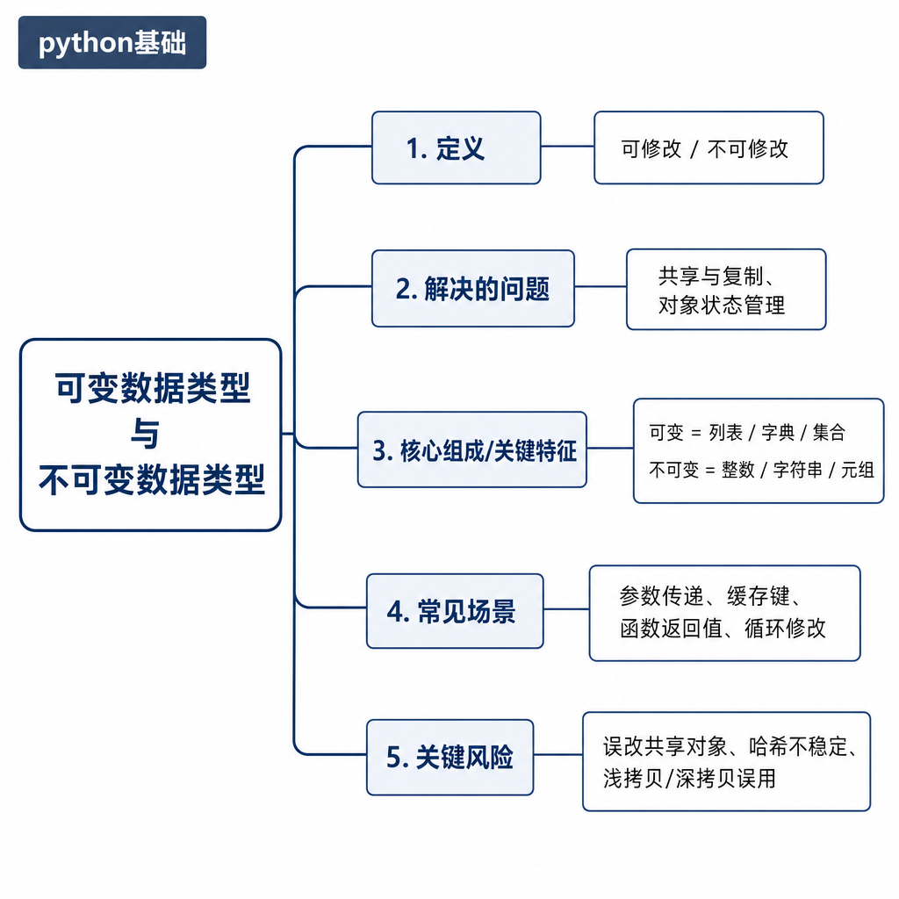
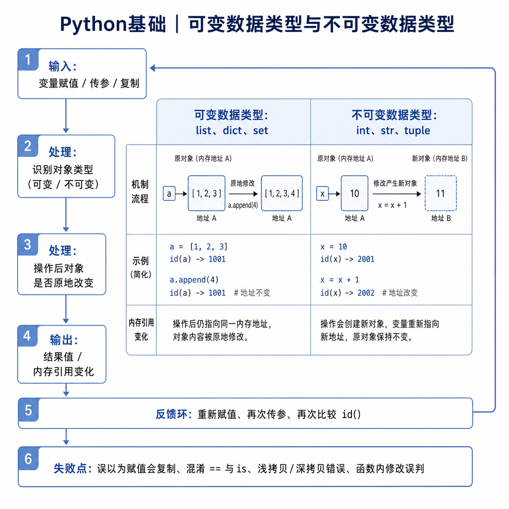
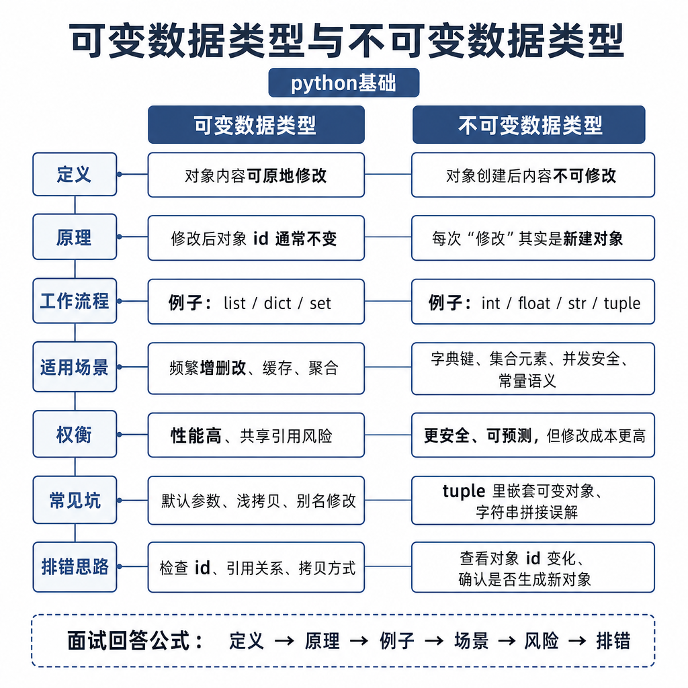

# 可变数据类型与不可变数据类型

你写了一个函数，本来只是想临时往列表里加一个元素，结果调用方手里的列表也变了；你又把一个整数传进函数里加一，外面的整数却完全没动。很多初学者会把这类现象解释成“Python 有时传值，有时传引用”，但这个说法会把问题讲乱。

真正的矛盾在于：Python 变量绑定的是对象引用，而对象又分为可变和不可变。函数参数、默认参数、字典 key、浅拷贝、并发共享状态，都会被这个机制影响。

## 从默认参数陷阱开始

先看一段面试常考代码：

```python
def add_item(item, box=[]):
    box.append(item)
    return box

print(add_item("a"))
print(add_item("b"))
```

很多人以为第二次输出是 `["b"]`，实际输出是：

```python
['a']
['a', 'b']
```

原因不是函数“记住了上一次调用”，而是默认参数在函数定义时只创建一次。`box=[]` 创建出来的列表对象会被后续调用反复使用。列表是可变对象，`append` 修改的是这个列表本身，所以第二次调用能看到第一次留下的内容。

正确写法是用 `None` 表示“没有传入”：

```python
def add_item(item, box=None):
    if box is None:
        box = []
    box.append(item)
    return box
```

这段代码每次没有传 `box` 时都会创建新列表，调用之间就不会互相污染。

## 核心矛盾：变量能变，不等于对象能变

Python 里的变量更像“名字”，对象才是真正存数据的实体。赋值语句不是复制对象，而是让名字绑定到对象。



不可变对象创建后，内容不能原地修改。常见不可变类型有 `int`、`float`、`bool`、`str`、`tuple`、`frozenset`。可变对象可以在原对象上修改内容，常见类型有 `list`、`dict`、`set`。

看这个对比：

```python
x = 10
y = x
x += 1
print(y)  # 10

items = []
other = items
items.append("a")
print(other)  # ['a']
```

`x += 1` 不会把整数对象 `10` 改成 `11`，而是让 `x` 绑定到另一个整数对象。`items.append("a")` 修改的是原列表对象，所以 `other` 也能看到变化，因为它们指向同一个列表。

## 底层机制：id、is、== 和哈希

理解可变性，必须区分三个概念：`id()` 看对象身份，`is` 判断两个变量是否指向同一个对象，`==` 判断值是否相等。不可变对象“修改”时通常会产生新对象；可变对象原地修改时，身份不变。

```python
name = "py"
print(id(name))
name += "thon"
print(id(name))

nums = [1, 2]
print(id(nums))
nums.append(3)
print(id(nums))
```

字符串拼接后，`name` 多半绑定到了新对象；列表追加后，`nums` 还是原来的列表。



哈希也和可变性强相关。字典 key 必须可哈希，因为哈希表要根据 key 的哈希值定位位置。如果一个对象作为 key 后还能改变内容，哈希值可能变化，字典就可能找不到原来的位置。所以 `list` 不能作为 key，`tuple` 通常可以作为 key。但如果 tuple 里包含 list，这个 tuple 也不可哈希：

```python
valid_key = (1, "a")
invalid_key = ([1, 2], "a")

print(hash(valid_key))
# print(hash(invalid_key))  # TypeError: unhashable type: 'list'
```

## 工程例子：配置被意外污染

Web 服务里经常有基础配置，然后每个请求再补充一些字段：

```python
base_config = {"timeout": 3, "headers": []}
client_config = base_config.copy()
client_config["headers"].append("trace-id")
```

你可能以为 `copy()` 后两份配置已经分开了，结果 `base_config["headers"]` 也多了 `trace-id`。原因是 `dict.copy()` 只复制外层字典，内部的列表仍然是同一个对象。这个问题本质上还是可变对象共享引用。

更稳的写法是只复制需要隔离的可变字段：

```python
client_config = {
    **base_config,
    "headers": list(base_config["headers"]),
}
```

这比盲目深拷贝更容易控制，因为你清楚哪些字段允许共享，哪些字段必须隔离。

## 边界和风险

第一，不要把“变量重新赋值”和“对象原地修改”混在一起。变量永远可以重新绑定，不可变说的是对象内容不能被原地修改。

第二，函数传参不要简单说成传值或传引用。更准确的说法是：Python 传递的是对象引用的值，形参会绑定到实参指向的对象。如果在函数里重新赋值，只是让局部变量指向新对象；如果在函数里原地修改可变对象，外部引用会看到变化。

```python
def rebind(data):
    data = []


def mutate(data):
    data.clear()

items = [1, 2]
rebind(items)
print(items)  # [1, 2]
mutate(items)
print(items)  # []
```

第三，`tuple` 的不可变不是“深层不可变”。tuple 里如果保存了列表，列表本身仍然能变。这个点经常被追问，因为它能看出你是否理解“容器保存的是引用”。

## 追问拆解：为什么这个题总和函数传参一起考

面试官经常会继续问：“那 Python 到底是传值还是传引用？”如果你回答“传引用”，会解释不了函数里 `data = []` 为什么不影响外部；如果你回答“传值”，又解释不了 `data.append()` 为什么会影响外部。更准确的回答是：函数调用时，实参指向的对象引用会被复制一份给形参，形参这个名字和外部变量最初指向同一个对象。

因此，重新赋值和原地修改的结果不同。重新赋值只是让形参改绑到新对象；原地修改会改变那个共享对象。这个区别在代码审查里很有用：看到 `data = ...`，你知道它通常只影响局部名字；看到 `data.append()`、`data.update()`、`data["x"] = ...`，就要警惕它会改变调用方能看到的对象。

## 高频面试追问

- Python 中哪些类型可变，哪些类型不可变？
- 为什么列表传进函数后被修改，外部也会变化？
- 默认参数为什么不要写成空列表或空字典？
- `tuple` 一定能作为 `dict` key 吗？
- 可变对象和哈希有什么关系？
- Python 函数传参到底是传值还是传引用？

## 可复述答案

可变和不可变描述的是对象内容能否原地修改，不是变量能否重新赋值。Python 变量保存对象引用，赋值只是让变量绑定到对象。对不可变对象的修改通常会创建新对象并重新绑定变量；对可变对象的修改会作用在原对象上，所以所有指向这个对象的引用都能看到变化。函数传参时，形参拿到的是对象引用的值，重新绑定形参不会影响外部变量，但原地修改可变对象会影响外部。工程中要避免把可变对象作为默认参数，也要小心浅拷贝和共享配置里的嵌套可变对象。



## 排查和实践建议

遇到“变量被莫名其妙改了”，先用 `id()` 看外层和内层对象是不是同一个，再找 `append`、`extend`、`clear`、`update`、字段赋值这类原地修改操作。函数默认参数用 `None` 占位，配置对象跨模块传递时尽量让可变字段有明确所有者。面试回答按“变量绑定 → 对象可变性 → 函数传参 → 默认参数 → 哈希边界”展开，基本能覆盖追问。

---

[返回 python基础 模块目录](README.md)
