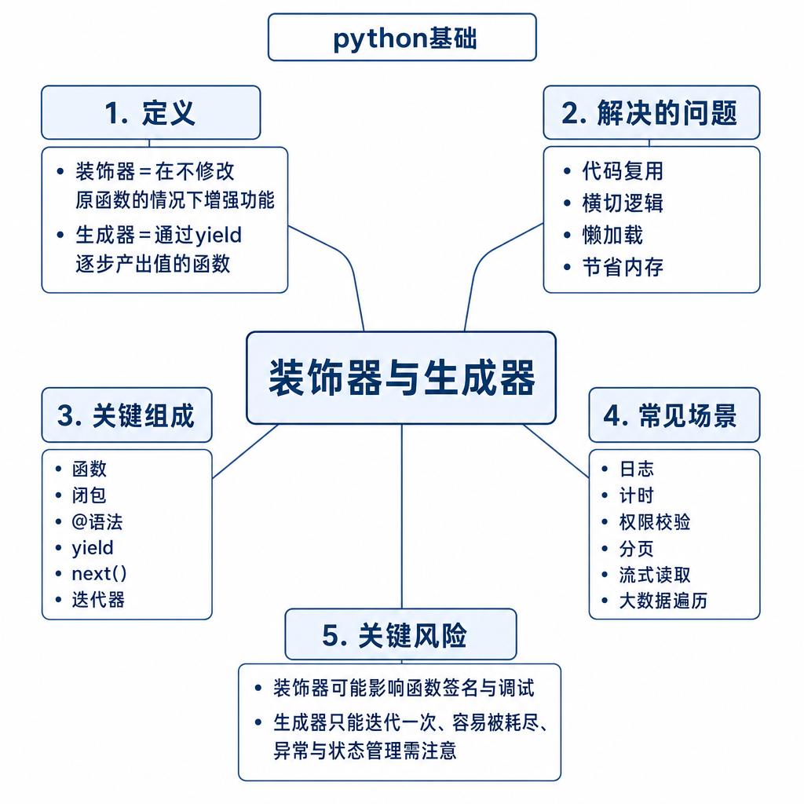
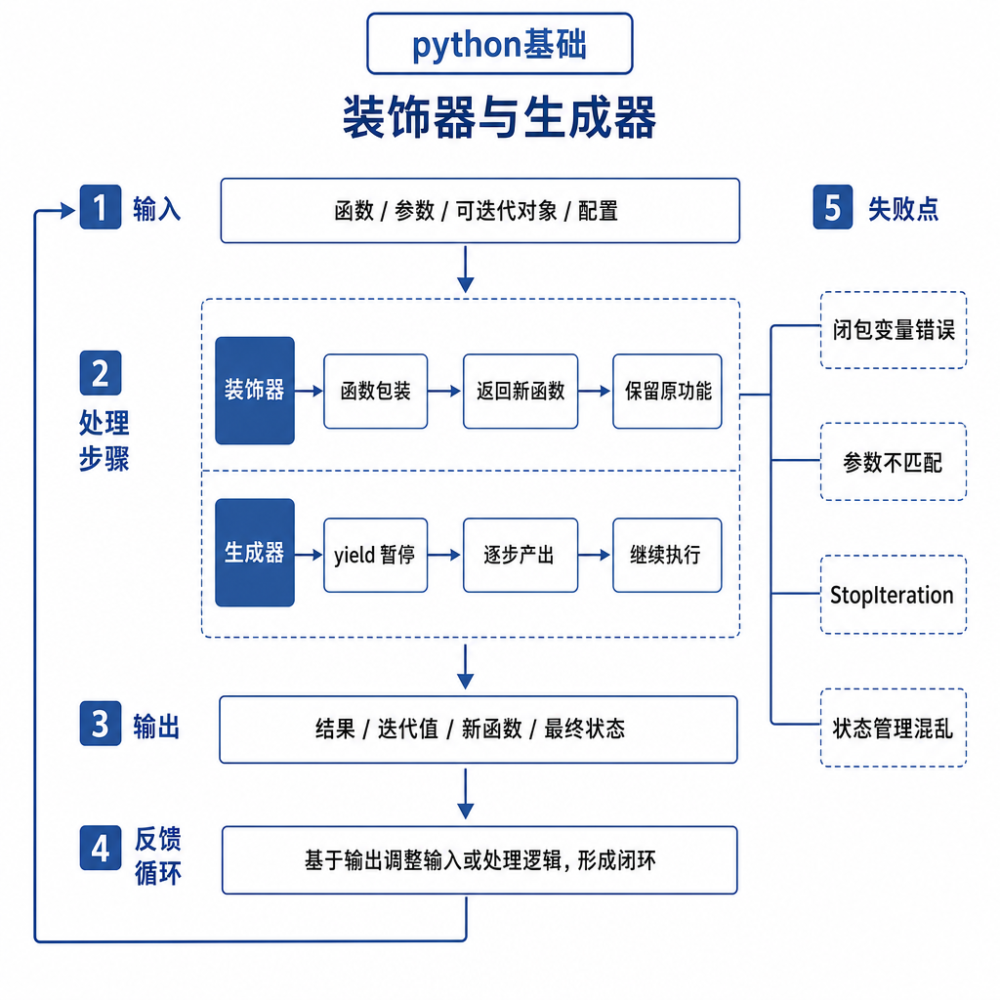
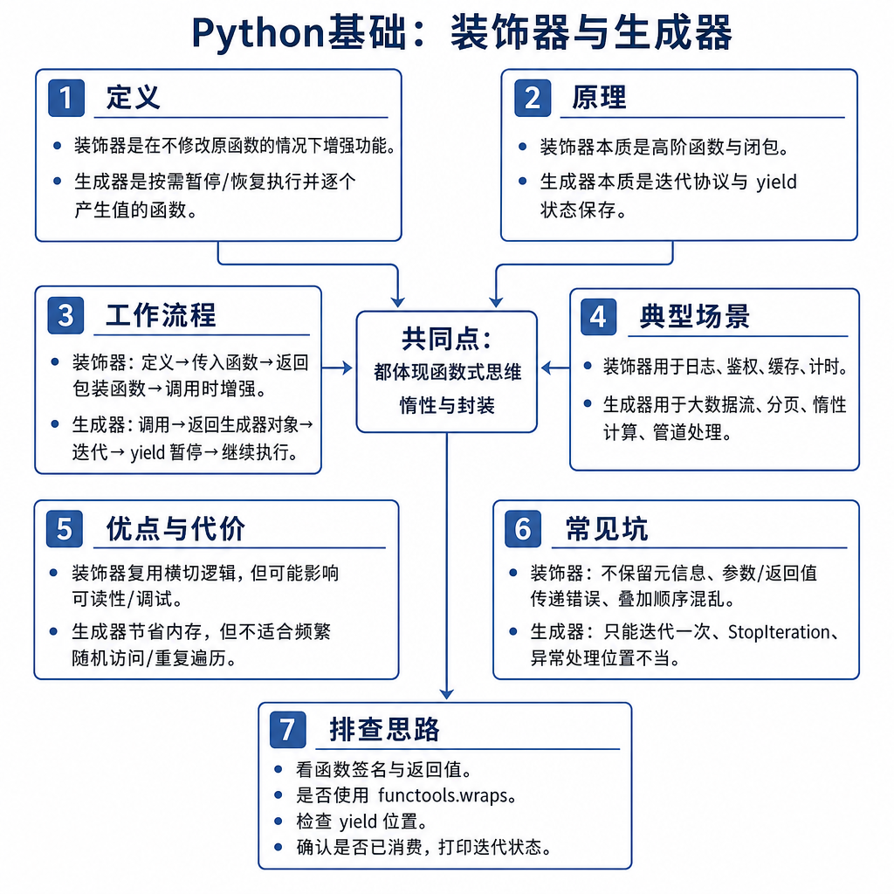

# 装饰器与生成器

项目做到一定规模后，你会反复遇到两类问题。第一类是很多函数都要加同样的逻辑：记录耗时、校验登录、捕获异常、重试、打点。直接复制代码当然能跑，但业务函数很快会被这些“外层逻辑”淹没。第二类是数据太大：百万行日志、分页接口、持续到来的消息流，如果一次性放进列表，内存马上顶不住。

装饰器和生成器分别解决这两个问题。装饰器关注“如何在不改业务函数主体的情况下增强行为”，生成器关注“如何按需产生数据，而不是一次性保存全部结果”。

## 从重复的耗时代码开始

假设每个接口都要记录耗时，最直接的写法是：

```python
import time


def query_user(user_id):
    start = time.time()
    result = {"id": user_id}
    print("cost", time.time() - start)
    return result
```

如果十几个函数都这么写，问题会很快出现：业务逻辑和监控逻辑混在一起；有人忘记加日志；有人异常时没有打印耗时；之后想把 `print` 换成统一日志，还要到处改。

装饰器可以把这段横切逻辑抽出去：

```python
import functools
import time


def log_cost(func):
    @functools.wraps(func)
    def wrapper(*args, **kwargs):
        start = time.time()
        try:
            return func(*args, **kwargs)
        finally:
            print(func.__name__, time.time() - start)
    return wrapper


@log_cost
def query_user(user_id):
    return {"id": user_id}
```

`@log_cost` 等价于 `query_user = log_cost(query_user)`。这个替换发生在函数定义阶段，不是调用阶段才临时加上去。



## 装饰器的底层机制

Python 中函数是一等对象，可以赋值给变量，可以作为参数传入，也可以作为返回值返回。装饰器本质上就是一个高阶函数：接收一个函数，返回另一个函数。

`wrapper` 是真正被调用的新函数，它通过闭包记住原函数 `func`。调用 `query_user()` 时，实际先进入 `wrapper`，再由 `wrapper` 决定是否调用原函数、调用前后做什么、异常如何处理、返回值是否改变。

带参数的装饰器会多一层，因为你要先接收装饰器自己的参数，再接收被装饰函数：

```python
def retry(times):
    def decorator(func):
        @functools.wraps(func)
        def wrapper(*args, **kwargs):
            last_error = None
            for _ in range(times):
                try:
                    return func(*args, **kwargs)
                except Exception as exc:
                    last_error = exc
            raise last_error
        return wrapper
    return decorator


@retry(3)
def call_remote_api():
    return request_data()
```

执行顺序是：`retry(3)` 先返回 `decorator`，再由 `decorator` 装饰 `call_remote_api`。这就是为什么带参数装饰器常见三层函数。

## 从内存爆掉理解生成器

现在换一个场景：你要扫描一个 5GB 日志文件，只处理包含 `ERROR` 的行。错误写法是：

```python
lines = file.readlines()
```

这会尝试把所有行一次性读进内存。文件越大，列表越大，程序越容易被内存拖垮。生成器用 `yield` 按需产出数据：

```python
def read_error_lines(path):
    with open(path, encoding="utf-8") as file:
        for line in file:
            if "ERROR" in line:
                yield line.strip()


for line in read_error_lines("app.log"):
    handle(line)
```

生成器函数被调用时，不会立刻执行函数体，而是返回一个生成器对象。每次 `next()` 或 `for` 迭代时，它执行到 `yield`，返回一个值并暂停，同时保存局部变量和执行位置。下一次迭代会从暂停的位置继续。



## 工程例子：统一治理和流式处理

装饰器适合放在业务边界。比如接口鉴权、参数校验、日志埋点、异常转换、缓存、限流、重试，这些逻辑都不属于某个具体业务函数，但很多函数都需要。

生成器适合处理数据流。比如日志行、数据库游标、分页 API、爬虫结果、消息队列消费、模型流式输出。它的价值不是让代码看起来高级，而是避免把全部数据先攒进内存。

分页接口可以这样封装：

```python
def paginate(fetch_page):
    page = 1
    while True:
        items = fetch_page(page)
        if not items:
            break
        for item in items:
            yield item
        page += 1
```

调用方只需要逐条处理：

```python
for item in paginate(fetch_user_page):
    save(item)
```

翻页细节被生成器隐藏起来，调用方不用关心第几页、什么时候停止。

## 边界和风险

装饰器最常见的问题是忘记 `functools.wraps`。不加它，函数名、文档字符串、注解等元信息会变成 `wrapper` 的信息，可能影响调试、路由注册、自动文档和测试报告。

装饰器还可能改变异常和返回值。比如重试装饰器如果吞掉异常，调用方以为成功了，数据却没有写入；缓存装饰器如果 key 设计错了，不同用户可能拿到同一份结果。所以装饰器必须尽量透明，除非你明确要改变行为。

生成器的边界也很清楚：它只能顺序消费，不能像列表一样随机访问；被消费后不会自动重置。

```python
g = (x * 2 for x in range(3))
print(list(g))  # [0, 2, 4]
print(list(g))  # []
```

如果你需要多次遍历，就要重新创建生成器，或者转成列表。但转成列表后就失去了节省内存的优势。

## 追问拆解：装饰器和生成器为什么容易写出隐性 bug

装饰器最危险的地方，是调用方看到的函数名没变，但实际执行路径已经变了。比如鉴权装饰器放在缓存装饰器外面，表示先鉴权再查缓存；反过来放，就可能未鉴权先命中缓存。多个装饰器叠加时，执行顺序是从下往上装饰，调用时再从外往内执行，这个顺序必须讲清楚。

生成器的隐性问题在资源生命周期。`with open()` 写在生成器函数里时，文件会在生成器迭代期间保持打开；如果生成器没有被完整消费，资源释放时机就依赖生成器关闭。工程中处理文件、数据库游标、网络流时，要确保调用方会消费完，或者使用上下文管理器把资源边界写清楚。

## 高频面试追问

- 装饰器的本质是什么？`@decorator` 等价于什么？
- 为什么装饰器里常写 `*args`、`**kwargs`？
- 为什么要使用 `functools.wraps`？
- 带参数装饰器为什么需要三层函数？
- 生成器函数和普通函数有什么区别？
- `yield` 的执行流程是什么？生成器有什么局限？

## 可复述答案

装饰器本质是高阶函数，接收一个函数并返回增强后的函数，`@decorator` 等价于在函数定义后执行一次重新赋值。它适合把日志、鉴权、重试、缓存这类横切逻辑从业务函数中抽离出来。生成器函数包含 `yield`，调用时返回生成器对象，迭代时才执行函数体；遇到 `yield` 会返回一个值并暂停，下一次继续执行。生成器适合处理大文件、分页数据和流式结果，优点是节省内存，边界是只能顺序消费，消费后不会自动回到开头。



## 排查和实践建议

装饰器出问题时，先确认被调用的是不是包装后的函数，检查是否漏了 `return func(*args, **kwargs)`，是否吞了异常，是否改变了返回值，再看有没有加 `functools.wraps`。生成器出问题时，先确认它是否已经被消费，是否被提前转成列表，资源是否在迭代结束前关闭。面试回答按“场景 → 本质 → 执行时机 → 代码例子 → 边界”展开，就不会停留在定义层面。

---

[返回 python基础 模块目录](README.md)
