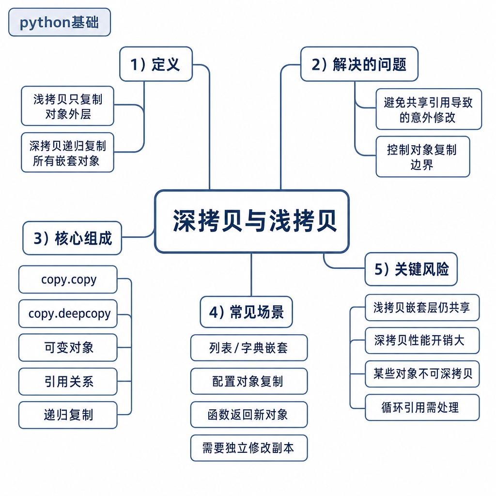
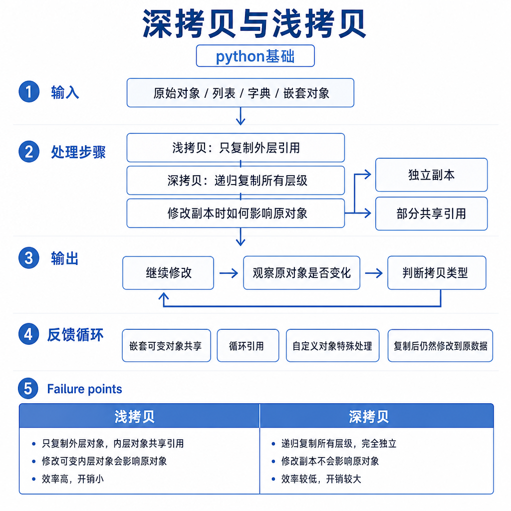
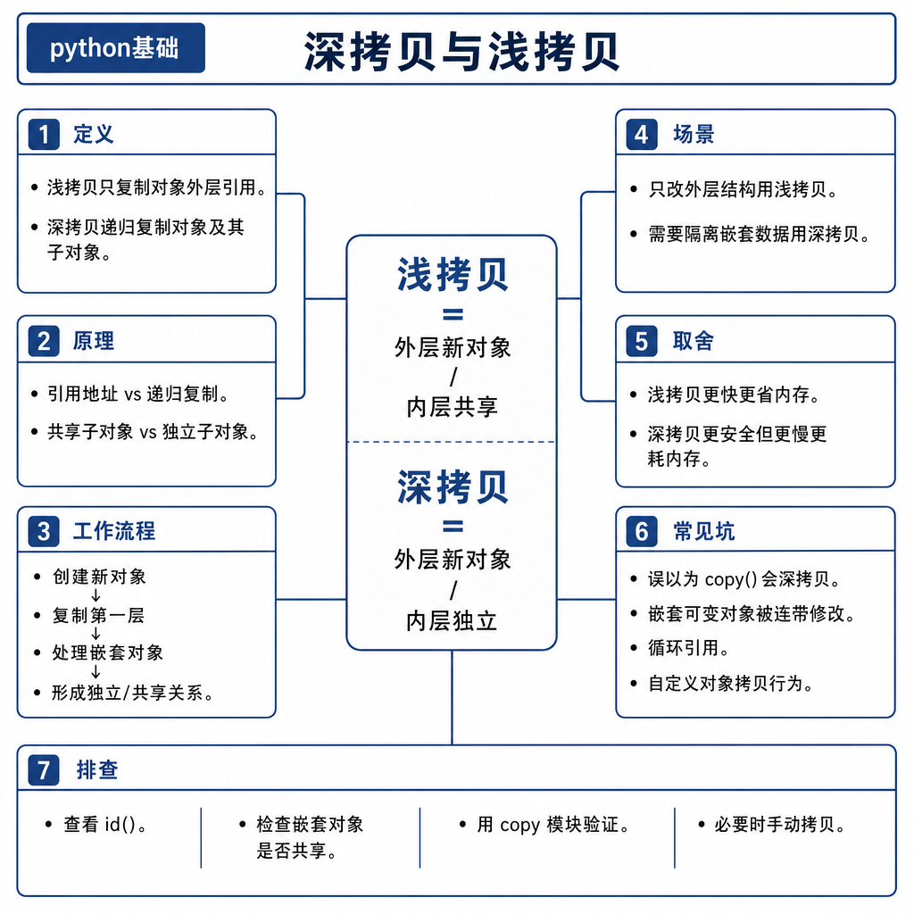

# 深拷贝与浅拷贝

线上最难排查的一类问题，是“我明明复制了一份，为什么原来的也变了”。比如测试环境想在基础配置上加一个请求头，结果生产配置也多了这个头；任务 A 给上下文加了一个步骤，任务 B 读到的上下文里也出现了这一步。表面看是 copy 没生效，本质是对象引用还在共享。

深拷贝和浅拷贝不是背 `copy.copy`、`copy.deepcopy` 两个函数，而是理解对象图、嵌套可变对象和状态隔离。

## 从配置污染开始

看这段代码：

```python
base = {"timeout": 3, "headers": ["token"]}
request_config = base.copy()
request_config["headers"].append("trace-id")

print(base)
```

你可能以为 `base.copy()` 已经复制了一份字典，所以修改 `request_config` 不会影响 `base`。实际输出中，`base["headers"]` 也会多出 `trace-id`。

原因是 `dict.copy()` 只复制外层字典。外层确实是两个不同对象，但里面的 `headers` 列表仍然是同一个对象。你修改的不是字典的外层结构，而是共享的内部列表。

## 核心矛盾：复制外壳，还是复制整张对象图

Python 对象之间通过引用连接起来，形成一张对象图。赋值、浅拷贝、深拷贝的差别，就在于它们复制到哪一层。



赋值不复制对象，只是让新变量指向同一个对象。浅拷贝会创建新的外层容器，但容器里的元素引用仍然指向原来的内部对象。深拷贝会递归复制内部对象，尽量让新对象和旧对象隔离。

```python
import copy

a = [[1], [2]]
b = a                 # 赋值：外层和内层都共享
c = copy.copy(a)      # 浅拷贝：外层不同，内层共享
d = copy.deepcopy(a)  # 深拷贝：外层和内层都尽量复制

c[0].append(99)
print(a)  # [[1, 99], [2]]

d[0].append(88)
print(a)  # [[1, 99], [2]]
```

`c` 的外层列表和 `a` 不同，但 `c[0]` 和 `a[0]` 是同一个内部列表。`d` 则把内部列表也复制了，所以修改 `d[0]` 不影响 `a[0]`。

## 底层机制：浅拷贝和深拷贝分别做了什么

浅拷贝的过程可以理解为：创建一个新的外层容器，然后把原容器里的元素引用逐个放进去。它能隔离外层增删，但不能隔离内部可变对象。

```python
users = [{"name": "Ada"}]
shadow = users.copy()

shadow.append({"name": "Bob"})
print(len(users))  # 1

shadow[0]["name"] = "Changed"
print(users[0]["name"])  # Changed
```

`shadow.append()` 不影响 `users` 的长度，因为外层列表不同；`shadow[0]["name"] = ...` 会影响 `users[0]`，因为第一个字典仍然共享。

深拷贝会递归复制对象，并用一个 `memo` 字典记录已经复制过的对象。这个记录有两个作用：第一，遇到循环引用时不会无限递归；第二，如果原对象图里两个地方共享同一个对象，深拷贝后也能保持这种共享关系，而不是无脑复制成两份完全无关的对象。



## 工程例子：请求上下文如何隔离

任务编排、爬虫、Web 请求里，经常有一个基础上下文，每个任务在上面补充自己的字段：

```python
base_context = {
    "user": "u1",
    "steps": [],
    "meta": {"retry": 0},
}

ctx = base_context.copy()
ctx["steps"].append("fetch_profile")
```

如果 `base_context` 会被复用，后续请求可能读到前一次请求的步骤。这类 bug 很隐蔽，因为每个请求单独跑都正常，并发或批量执行时才出现串数据。

更稳的做法是明确隔离哪些字段：

```python
ctx = {
    **base_context,
    "steps": list(base_context["steps"]),
    "meta": dict(base_context["meta"]),
}
```

这比直接 `copy.deepcopy(base_context)` 更可控。因为有些字段可能本来就应该共享，比如只读配置、连接池、缓存对象；有些字段必须独立，比如请求步骤、重试次数、临时结果。工程上最重要的是所有权清楚，而不是一看到嵌套结构就深拷贝。

## 边界和风险

深拷贝不是万能按钮。文件句柄、线程锁、数据库连接、网络 socket、生成器等对象，通常不能按业务语义复制。就算技术上能复制，也不代表复制后的对象能安全使用。

大型对象深拷贝还会带来明显的 CPU 和内存成本。比如一个任务上下文里挂着几万条记录，深拷贝一次就可能让延迟和内存都翻倍。如果这个操作在请求链路中频繁发生，问题会很快放大。

自定义类还能通过 `__copy__` 和 `__deepcopy__` 控制复制行为。所以面试时不要说“深拷贝一定更安全”，准确说法是：深拷贝能隔离嵌套可变对象，但要考虑对象是否可复制、复制成本和业务语义。

## 追问拆解：什么时候该浅拷贝，什么时候该深拷贝

判断复制方式，不要从函数名出发，要从“修改会不会串数据”出发。如果对象只有一层，比如简单列表 `[1, 2, 3]` 或字段值都是不可变对象的字典，浅拷贝通常足够。因为新容器和旧容器分开后，外层增删不会互相影响，内部不可变对象也不会被原地改坏。

如果对象里有嵌套列表、字典、集合，并且新旧对象会分别修改这些内部结构，就需要深拷贝或手动复制关键字段。但手动复制常常比深拷贝更适合工程代码，因为它能表达意图：`steps` 每次请求独立，`config` 只读共享，`client` 连接池不能复制。面试时能说出这个判断过程，比单纯说“嵌套用深拷贝”更稳。

## 高频面试追问

- 赋值、浅拷贝、深拷贝有什么区别？
- 为什么浅拷贝后修改嵌套列表会影响原对象？
- `copy.deepcopy` 如何处理循环引用？
- 深拷贝一定安全吗？哪些对象不适合深拷贝？
- 工程中如何避免共享状态污染？
- 为什么不建议到处无脑使用 `deepcopy`？

## 可复述答案

赋值不会复制对象，只是让新变量指向同一个对象。浅拷贝会创建新的外层容器，但内部元素仍然是原对象引用，所以嵌套可变对象可能共享。深拷贝会递归复制内部对象，并用 `memo` 记录已复制对象来处理循环引用和共享引用。工程上，浅拷贝适合只隔离外层结构，深拷贝适合隔离复杂嵌套状态，但它有性能成本，也不适合文件句柄、连接、锁、生成器这类外部资源对象。更好的做法是明确哪些字段要共享，哪些字段要复制。



## 排查和实践建议

遇到对象被意外修改，先用 `id()` 检查外层对象和内层对象是否共享，再定位 `append`、`update`、字段赋值等原地修改点。设计数据结构时，尽量让只读配置和请求临时状态分开；跨请求、跨任务复用的对象不要塞可变临时字段。不要为了省事到处 `deepcopy`，优先复制必要层级。面试回答按“赋值 → 浅拷贝 → 深拷贝 → 循环引用 → 工程风险”展开，逻辑会很清楚。

---

[返回 python基础 模块目录](README.md)
