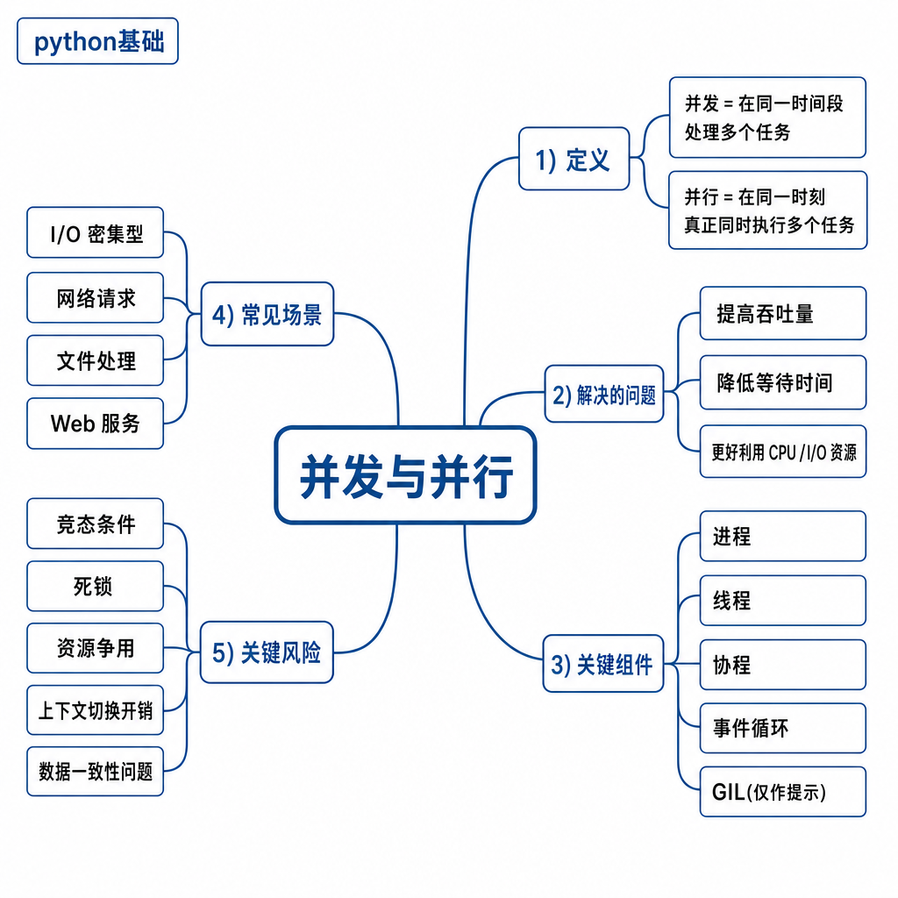
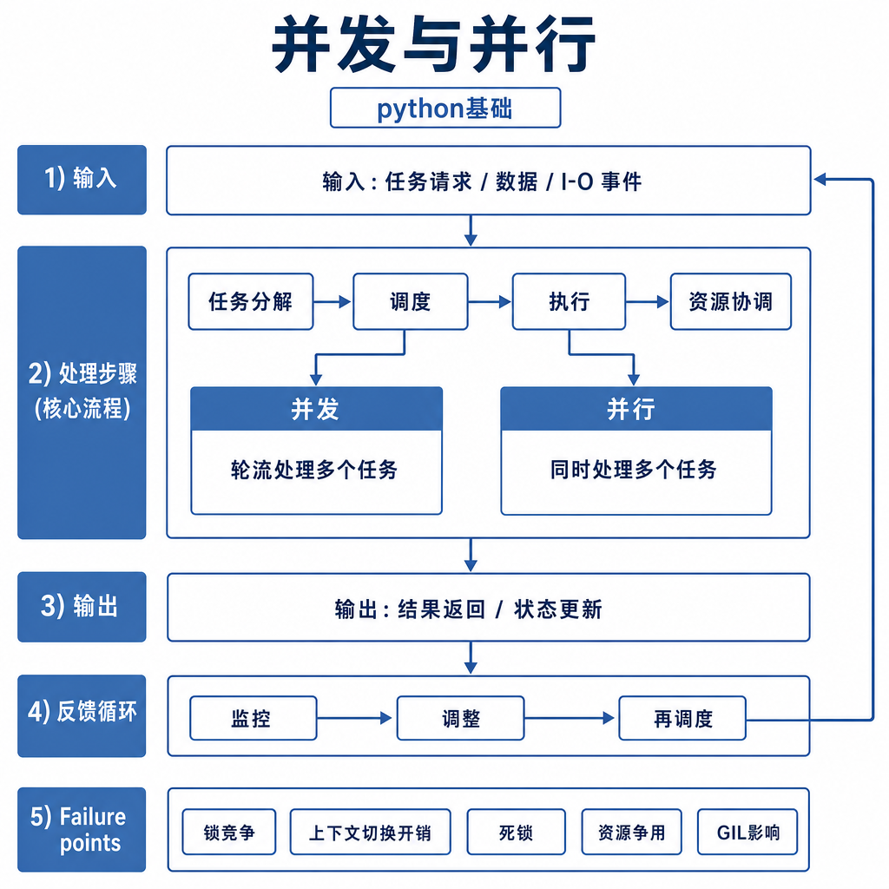
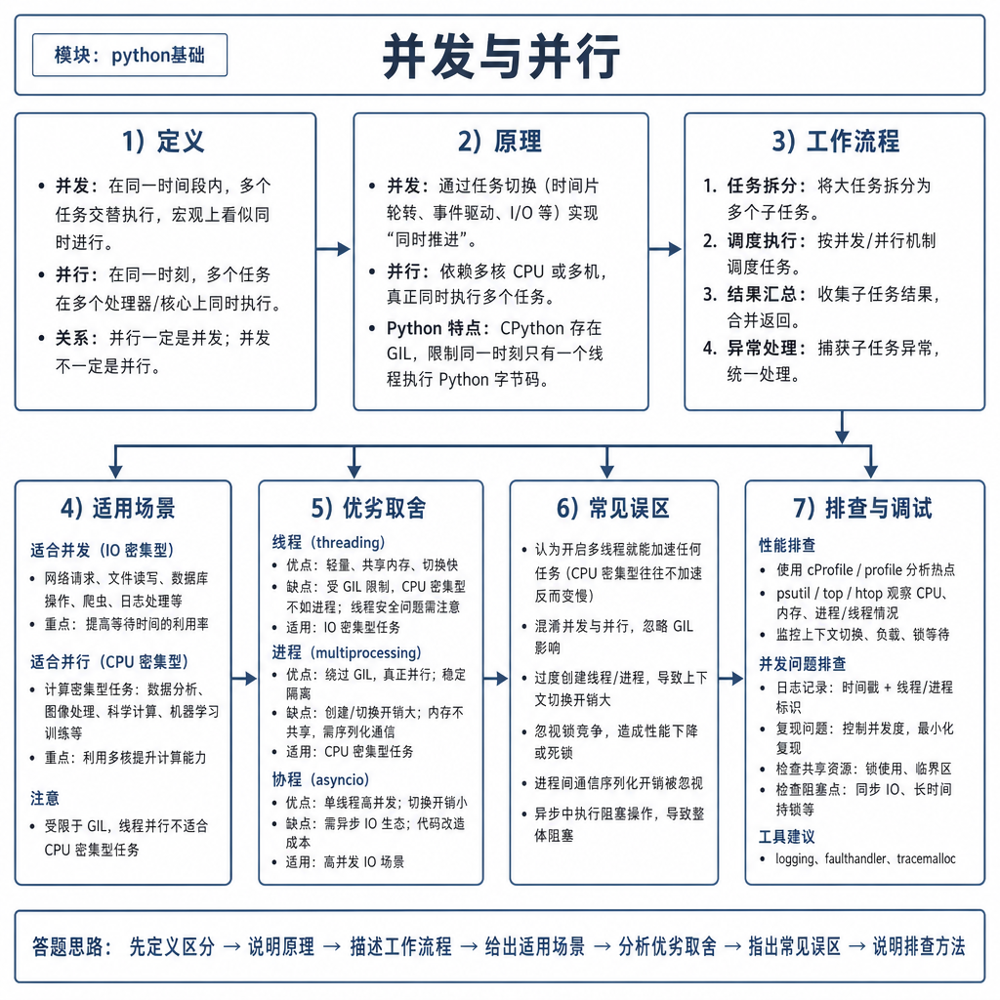

# 并发与并行

同一个“加速任务”的需求，可能会得到完全不同的结果。你把爬虫从单线程改成线程池，速度从 100 秒降到 15 秒；你又把一个纯 Python 大循环也改成线程池，结果几乎没变，甚至更慢。很多人这时会说“Python 多线程没用”，但这个结论太粗糙。

真正要分清的是：你的程序是在等网络、磁盘、数据库，还是在抢 CPU 做计算。并发解决的是等待时间利用问题，并行解决的是多个执行资源同时干活的问题。

## 从两个失败现象开始

第一个场景，请求 100 个网页。单线程写法会把等待时间串起来：请求第一个网页时，CPU 大部分时间在等网络；等它返回后才请求第二个。线程池或异步 I/O 能在等待第一个请求时推进第二个请求，所以总耗时明显下降。

第二个场景，计算 1 亿次哈希。瓶颈不是等待，而是 CPU 计算。你把它拆成多个线程，如果运行环境不能让这些线程同时执行 Python 字节码，速度就很难线性提升，还会多出上下文切换成本。

所以面试官问并发和并行，不只是要一句“并发是交替执行，并行是同时执行”，而是看你能不能根据瓶颈选方案。

## 核心矛盾：调度任务，还是增加执行资源

并发指多个任务在一段时间内都向前推进，重点是调度。单核 CPU 也能并发，因为操作系统可以在不同任务之间快速切换，让用户感觉多个任务都在运行。

并行指多个任务在同一时刻真正执行，重点是执行资源。多核 CPU、多进程、GPU、多台机器，都可以提供并行能力。



可以用餐厅类比，但不要停在类比上：并发像一个服务员在多个桌子之间切换，哪桌客人在看菜单，他就去服务另一桌；并行像多个服务员同时服务多桌。前者提升等待时间利用率，后者增加同时工作的资源。

## Python 中的常见方案

Python 里常见方案有多线程、协程和多进程。多线程适合 I/O 密集型任务，比如网络请求、数据库访问、文件读写。线程在等待 I/O 时可以让出执行机会，其他线程继续推进。

```python
from concurrent.futures import ThreadPoolExecutor
import requests

urls = ["https://example.com"] * 20


def fetch(url):
    return requests.get(url, timeout=3).status_code


with ThreadPoolExecutor(max_workers=10) as pool:
    results = list(pool.map(fetch, urls))
```

协程通过事件循环在单线程内管理大量 I/O 任务。它适合高并发连接，但要求调用链使用非阻塞库。如果协程里调用了阻塞函数，事件循环会被卡住，其他协程也无法推进。



多进程更适合 CPU 密集型任务。每个进程有独立解释器和内存空间，可以利用多核执行计算：

```python
from concurrent.futures import ProcessPoolExecutor


def calculate(n):
    return sum(i * i for i in range(n))


with ProcessPoolExecutor() as pool:
    results = list(pool.map(calculate, [1_000_000] * 4))
```

多进程能提升 CPU 任务的上限，但也要付出进程创建、参数序列化、结果传输和内存占用的成本。

## 工程例子：批量调用外部 API

假设你要批量调用外部模型 API。这个任务大部分时间在等网络和对方服务返回，本质是 I/O 密集型。你可以用线程池或 `asyncio` 降低总耗时，但不能无限提高并发数。

```python
from concurrent.futures import ThreadPoolExecutor, as_completed


def call_api(payload):
    return request_model(payload)


with ThreadPoolExecutor(max_workers=5) as pool:
    futures = [pool.submit(call_api, item) for item in payloads]
    for future in as_completed(futures):
        try:
            print(future.result(timeout=10))
        except Exception as exc:
            print("failed", exc)
```

这里 `max_workers=5` 不是随手写的数字，而是系统保护边界。并发太低，吞吐上不去；并发太高，可能触发对方限流，也可能把本服务的连接池、内存、队列打满。工程里要用压测找收益拐点，而不是把并发数拉到最大。

## 边界和风险

第一，并发不等于一定更快。任务太轻时，调度成本可能超过收益；共享状态太多时，锁竞争会让任务排队；下游服务慢时，提高并发可能只是把更多请求堆在路上。

第二，协程不是魔法。如果你在协程里调用 `time.sleep()`、同步数据库驱动、同步 HTTP 客户端，事件循环会被阻塞。协程要发挥作用，关键是整条调用链尽量非阻塞。

第三，并行也不是免费。多进程之间不能直接共享普通对象，参数和结果需要序列化。如果每个任务都携带一个巨大对象，复制和传输成本可能吃掉并行收益。

## 追问拆解：如何从现象判断瓶颈

如果任务改成并发后没有变快，不要马上换框架。先看 CPU 利用率：CPU 长时间接近满载，说明计算可能是瓶颈；CPU 很低但耗时很长，通常在等 I/O、锁、连接池或下游服务。再看任务耗时分布：如果大部分时间卡在请求外部接口，就应该控制并发、超时和重试；如果卡在本地计算，就应该拆进程、用向量化库，或把热点代码下沉到原生扩展。

还要看任务之间是否共享状态。很多并发程序慢，不是因为并发模型错，而是所有任务都在抢同一把锁、同一个数据库连接池、同一个限流器。并发的收益来自等待时间被利用，一旦所有任务在同一个点排队，增加并发数只会增加排队长度。

## 高频面试追问

- 并发和并行的区别是什么？单核 CPU 能并发吗？
- I/O 密集型和 CPU 密集型分别适合什么方案？
- 多线程、协程、多进程各自适合什么场景？
- 为什么并发数过高可能让系统更慢？
- 协程里调用阻塞函数会发生什么？
- 线上并发任务超时或堆积怎么排查？

## 可复述答案

并发是多个任务在一段时间内交替推进，核心是调度和等待时间利用；并行是多个任务在同一时刻真正执行，核心是多个执行资源。I/O 密集型任务大部分时间在等待网络、磁盘或数据库，适合多线程或异步 I/O；CPU 密集型任务瓶颈在计算，适合多进程、原生扩展、向量化、GPU 或分布式。工程选型时，我会先判断瓶颈，再看第三方库是否支持异步、任务之间是否共享状态、是否需要限流、超时、重试和结果合并。



## 排查和实践建议

线上并发问题按四类查：任务是否被阻塞，线程或协程是否堆积，外部依赖是否变慢，资源是否达到上限。监控要看队列长度、任务耗时分布、超时率、CPU、内存、连接数和文件描述符。实践中先用小并发压测，找到吞吐提升开始变慢的拐点，再设置并发上限、超时和降级策略。面试回答按“现象 → 瓶颈类型 → 方案选择 → 工程边界 → 排查指标”组织，会显得很落地。

---

[返回 python基础 模块目录](README.md)
