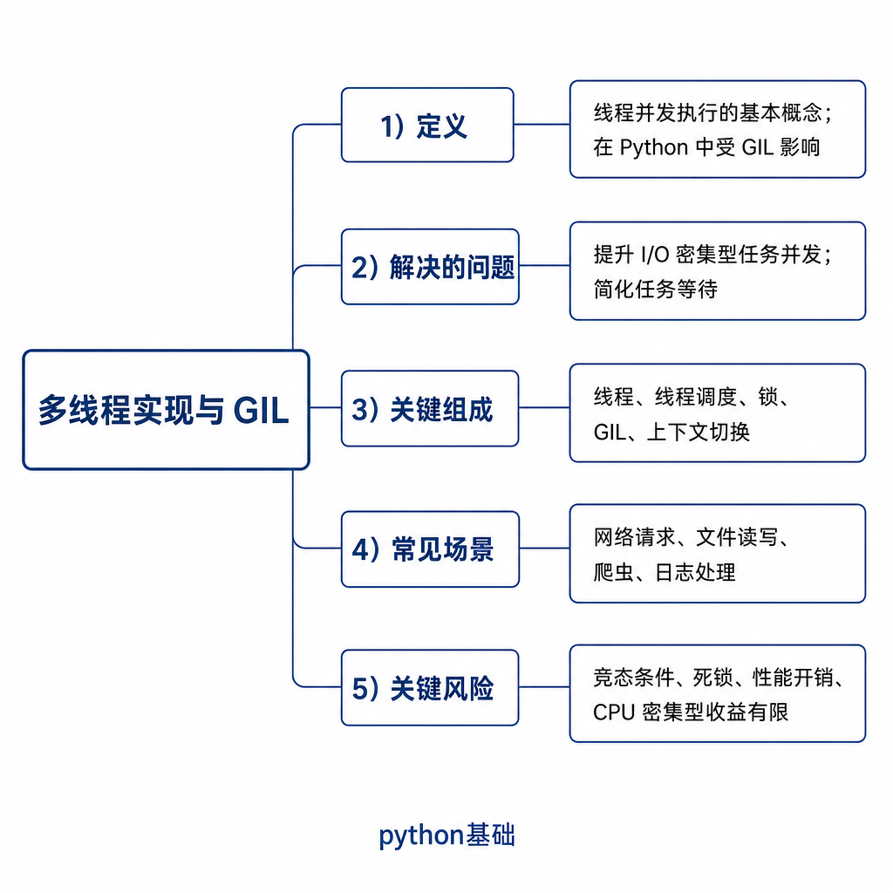
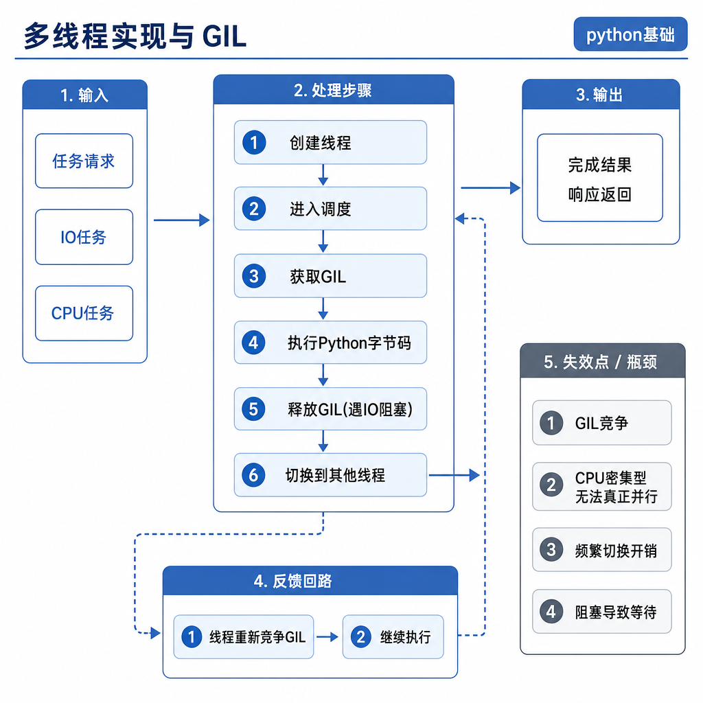
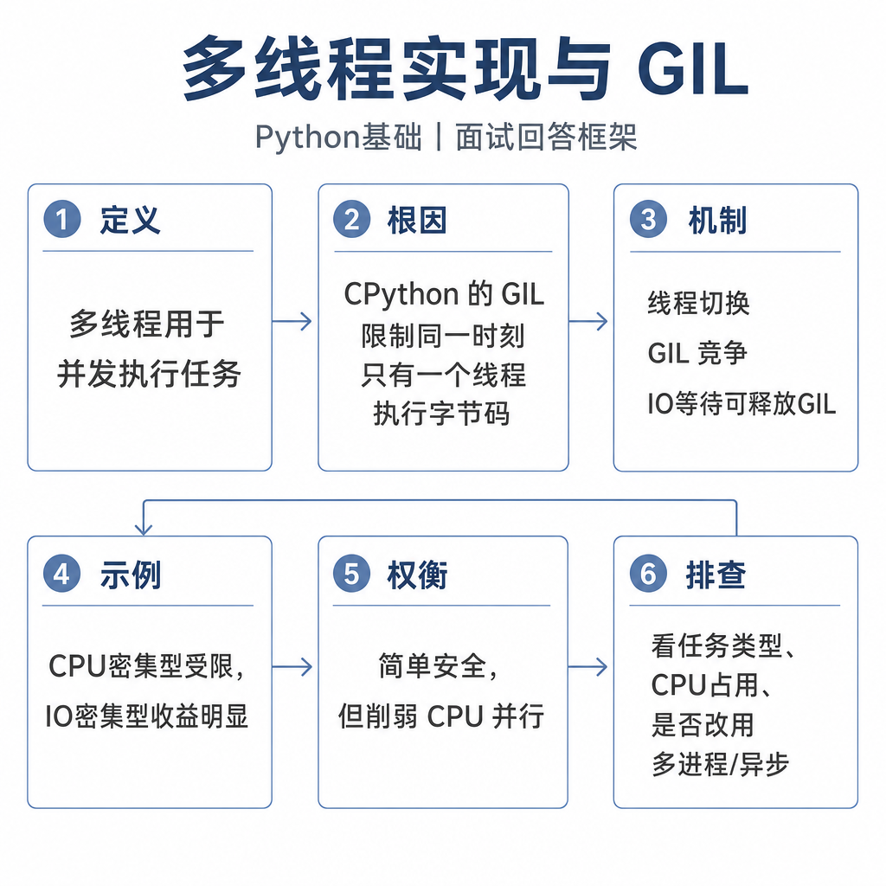

# 多线程实现与 GIL

面试里经常有人一句话答完：“Python 有 GIL，所以多线程没用。”这句话听起来像懂，实际很容易被追问击穿。你用多线程下载图片、请求接口，速度通常会提升；你用多线程跑纯 Python 计算循环，速度可能没提升；你以为有 GIL 就不用加锁，计数器结果又可能不对。

GIL 的关键不是“多线程有没有用”，而是它限制了什么、不限制什么，以及业务共享数据还需不需要同步。

## 从一个性能实验开始

先看一个 CPU 计算场景：

```python
import threading

counter = 0


def work():
    global counter
    for _ in range(1_000_000):
        counter += 1


threads = [threading.Thread(target=work) for _ in range(2)]
for thread in threads:
    thread.start()
for thread in threads:
    thread.join()

print(counter)
```

你可能期待两个线程把计算速度翻倍，但在 CPython 中，纯 Python 字节码同一时刻通常只有一个线程在执行。更麻烦的是，`counter += 1` 也不是一个不可分割的业务操作，结果还可能不是你以为的值。

再看 I/O 场景：多个线程同时请求多个网页时，速度往往会变快。因为线程等待网络时，不需要一直占着 Python 字节码执行权，其他线程可以继续推进。

## 核心矛盾：解释器安全和 CPU 并行

GIL 是 Global Interpreter Lock，全局解释器锁。以 CPython 为例，它保证同一时刻只有一个线程执行 Python 字节码。注意两点：第一，GIL 是 CPython 的实现细节，不是 Python 语言规范；第二，它保护的是解释器内部状态，不是你的业务数据。



CPython 使用引用计数管理对象生命周期。对象被多引用一次，计数加一；少一个引用，计数减一。多个线程如果同时修改引用计数和解释器内部结构，需要大量细粒度锁来保证一致性。GIL 用一把全局锁简化了这件事，也让很多 C 扩展更容易和解释器协作。

代价也很明显：CPU 密集型 Python 代码很难通过多线程在多核上并行执行。

## 底层机制：线程什么时候会让出 GIL

Python 线程由操作系统线程承载。线程要执行 Python 字节码，必须先拿到 GIL。运行过程中，解释器会周期性切换线程；遇到 I/O 阻塞、等待锁、某些 C 扩展长时间计算时，线程也可能释放 GIL，让其他线程执行。



所以多线程适合这类 I/O 密集代码：

```python
from concurrent.futures import ThreadPoolExecutor
import requests


def fetch(url):
    response = requests.get(url, timeout=3)
    return response.status_code


with ThreadPoolExecutor(max_workers=8) as pool:
    print(list(pool.map(fetch, urls)))
```

网络等待期间，线程不需要持续执行 Python 字节码，其他线程就能利用这段等待时间。对于 CPU 密集型任务，更常见的方案是 `multiprocessing`、`ProcessPoolExecutor`、NumPy 这类可能释放 GIL 的 C 扩展、GPU、独立计算服务或分布式任务系统。

## 工程例子：有 GIL 为什么还要加锁

GIL 保护解释器内部一致性，不保护你的业务不变量。`counter += 1` 从业务上看是一句，但底层可能包含读取、计算、写回等多个步骤。线程切换发生在中间，就可能出现竞态条件。

共享状态需要你自己保护：

```python
import threading

lock = threading.Lock()
counter = 0


def safe_add():
    global counter
    for _ in range(1000):
        with lock:
            counter += 1
```

如果是生产者消费者模型，优先用 `queue.Queue`，不要手写共享列表加一堆判断。队列已经处理了必要同步，还能表达任务排队、阻塞获取、超时等待这些语义。

```python
from queue import Queue

queue = Queue()
queue.put("task")
item = queue.get(timeout=1)
```

## 边界和风险

第一，不要说“GIL 导致 Python 不能并发”。I/O 密集型任务仍然能从多线程受益。真正受限的是多个线程同时执行 CPU 密集型 Python 字节码。

第二，不要说“有 GIL 就不用锁”。GIL 不保证你的多步业务操作原子，也不保证一组数据结构始终满足业务一致性。

第三，不要把 GIL 和 `threading.Lock` 混为一谈。GIL 是解释器内部的锁，你不能用它保护某个订单状态；`threading.Lock` 是你在业务代码里保护共享资源的工具。

第四，线程数量不是越多越好。线程过多会增加上下文切换、栈内存占用和调度成本，也可能把数据库连接池、HTTP 连接池或下游 API 打满。

## 追问拆解：怎样回答“Python 多线程到底有没有用”

最稳的回答不是肯定或否定，而是先分任务类型。下载文件、请求接口、访问数据库时，线程大部分时间在等待 I/O，等待期间可以让出 GIL，所以线程池能提高吞吐。图像处理、加密计算、纯 Python 循环求和这类任务主要消耗 CPU，多线程会被 GIL 限制，很难利用多核。

还要补充一个例外：有些 C 扩展在执行耗时计算时会释放 GIL，比如部分 NumPy 操作。此时虽然 Python 层用了线程，但真正并行的是扩展库里的原生代码。面试官追问性能优化时，你可以把方案分成三层：I/O 用线程或协程，CPU 用进程或释放 GIL 的库，业务共享状态用锁、队列或消息传递控制。

## 高频面试追问

- GIL 是什么？它属于 Python 语言规范吗？
- CPython 为什么需要 GIL？它解决了什么问题？
- GIL 对 CPU 密集型和 I/O 密集型任务分别有什么影响？
- 有 GIL 为什么还需要线程锁？
- `counter += 1` 是否线程安全？
- 如果要提升 CPU 密集型任务性能，有哪些替代方案？

## 可复述答案

GIL 是 CPython 的全局解释器锁，保证同一时刻只有一个线程执行 Python 字节码。它简化了引用计数和解释器内部状态的线程安全问题，但限制了 CPU 密集型 Python 多线程的并行能力。I/O 操作等待期间线程可以释放 GIL，所以多线程对网络、磁盘、数据库这类 I/O 密集型任务仍然有效。有 GIL 不代表业务数据线程安全，共享状态仍需要锁、队列或其他同步机制。CPU 密集型任务可以考虑多进程、C 扩展、NumPy、GPU 或分布式执行。



## 排查和实践建议

如果多线程没有提速，先判断任务是不是 CPU 密集型，再看线程是否大量阻塞在锁、连接池或下游服务上。可以用日志记录任务开始和结束时间，用监控看 CPU 利用率、线程数、队列长度、连接池占用和下游延迟。实践中，I/O 任务用线程池并限制并发，共享状态用锁或队列，CPU 任务不要强行堆线程。面试回答按“GIL 定义 → 出现原因 → 对任务类型的影响 → 线程安全边界 → 替代方案”展开，基本不会跑偏。

---

[返回 python基础 模块目录](README.md)
