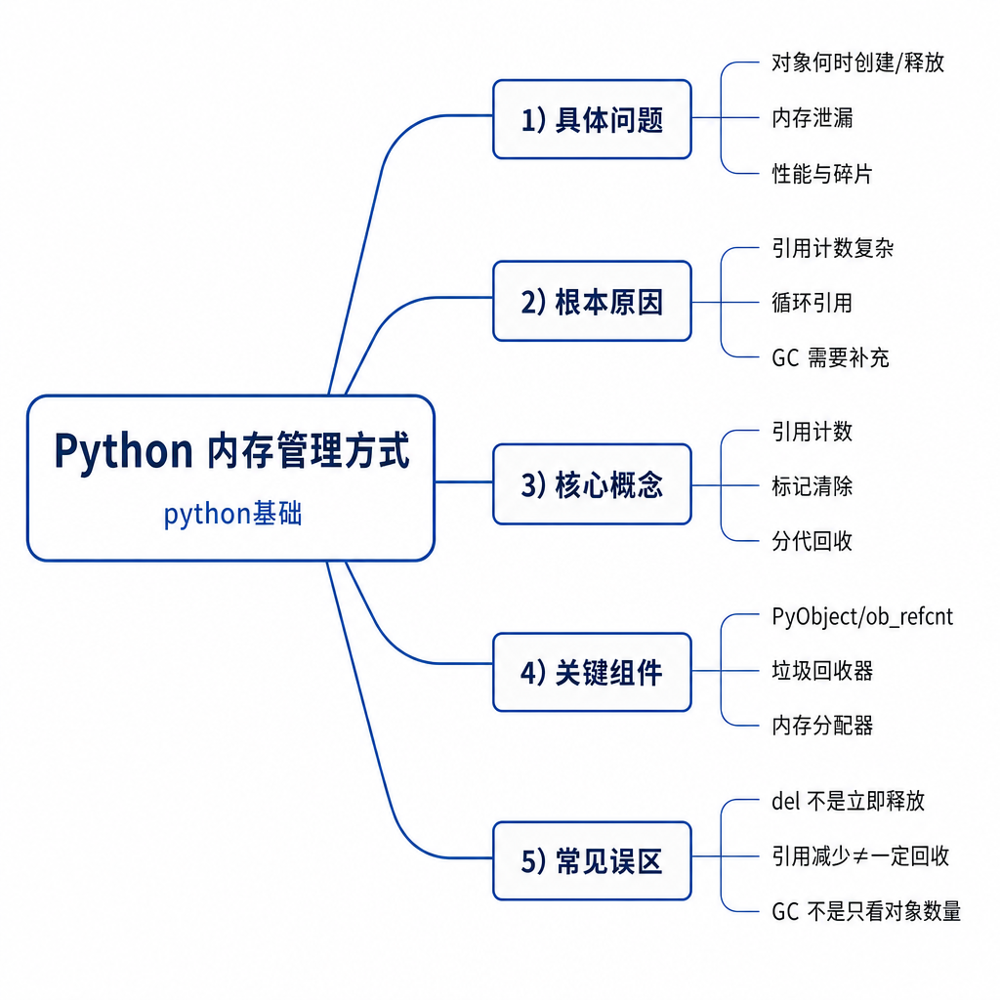
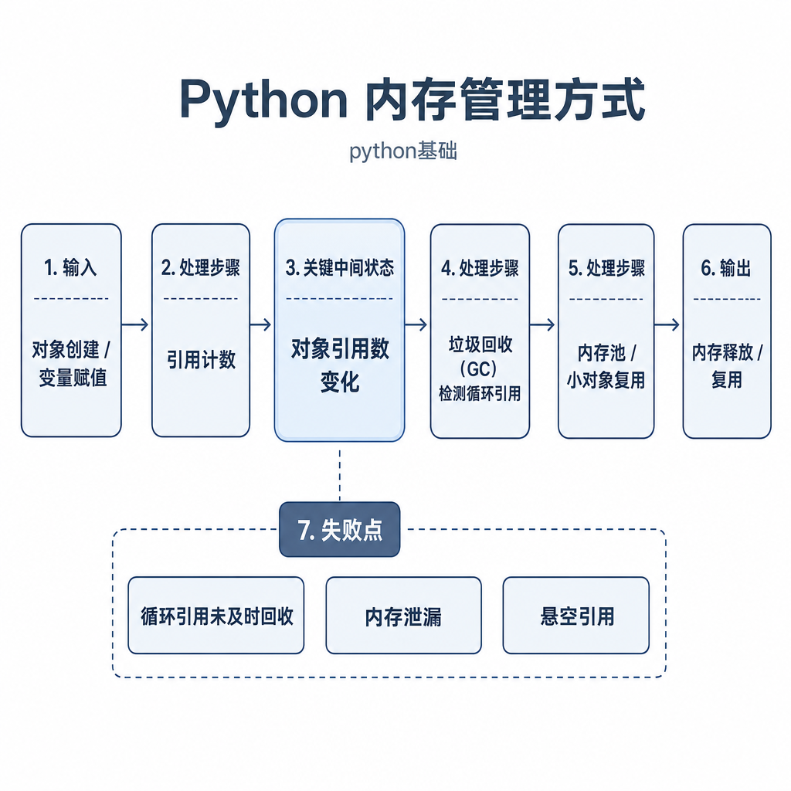
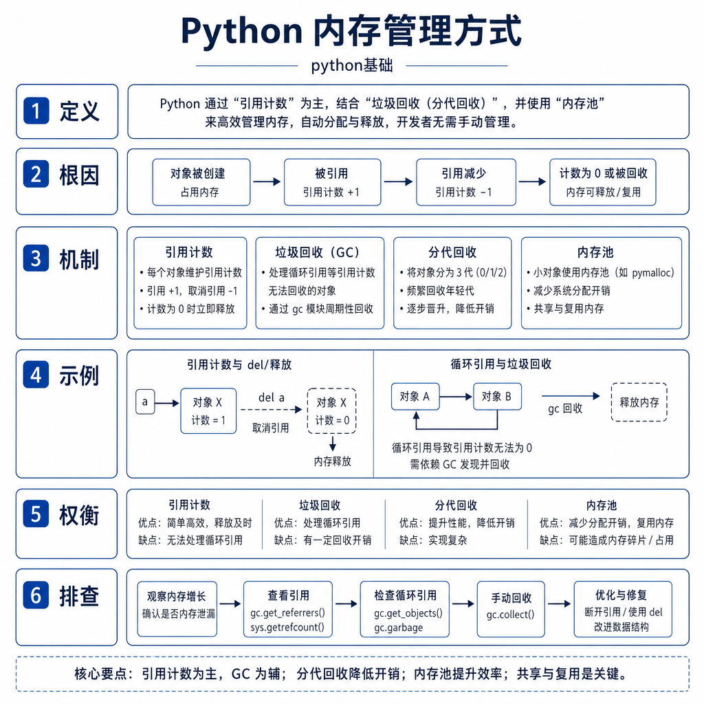

# Python 内存管理方式

线上服务跑了几天，内存曲线一直往上走。新人第一反应常是：“Python 不是有垃圾回收吗，为什么还会泄漏？”这个问题的关键在于，垃圾回收只能回收不可达对象。如果你的全局缓存、闭包、队列、上下文对象还握着引用，对象对解释器来说就仍然“活着”。

Python 内存管理面试不只考概念，还会追问 `del` 到底删了什么、循环引用怎么处理、为什么对象释放了 RSS 不一定下降，以及线上内存上涨怎么排查。

## 从内存持续上涨开始

看这段服务代码：

```python
cache = []


def handle_request(payload):
    result = {"payload": payload, "items": list(range(10000))}
    cache.append(result)
    return "ok"
```

每次请求都会创建一个大对象，然后放进全局 `cache`。函数返回后，局部变量 `result` 确实消失了，但对象仍然被 `cache` 引用，引用计数不会归零。请求越多，`cache` 越大，内存就持续上涨。

这不是垃圾回收失效，而是业务代码还持有引用。解释器不会猜测“这个缓存是不是该清理”，它只能根据可达性判断对象是否还能被访问。

## 核心机制：引用计数是主线

以 CPython 为例，内存管理的主线是引用计数。每个对象都记录有多少引用指向自己。变量绑定、容器持有、函数参数、闭包捕获，都会增加引用计数；变量离开作用域、`del` 名字、容器删除元素，会减少引用计数。当引用计数变成 0，对象就可以被销毁。



`del` 删除的是引用，不是强制销毁对象：

```python
items = [1, 2, 3]
other = items

del items
print(other)  # [1, 2, 3]
```

`items` 这个名字被删除了，但 `other` 仍然指向列表，所以列表还活着。只有最后一个引用也消失，对象才可能被销毁。

引用计数的优点是及时：很多对象一旦没人引用就能马上释放。缺点是处理不了循环引用。

## 循环引用：引用计数解决不了的环

两个对象互相引用，即使外部变量都删除了，它们的引用计数也不为 0：

```python
a = []
b = []
a.append(b)
b.append(a)

del a
del b
```

这两个列表已经无法从业务代码访问，但它们彼此引用，引用计数不会自然归零。为了解决这类问题，CPython 还有循环垃圾回收器，主要处理容器对象之间的循环引用。

循环 GC 会找出从程序根对象不可达的引用环，并回收它们。它还采用分代思想：大部分对象生命周期很短，刚创建的对象更频繁检查；存活越久的对象越不频繁检查，从而降低扫描成本。



如果循环引用里涉及复杂析构逻辑，回收行为可能更难理解。实际开发中，比起依赖手动 `gc.collect()`，更重要的是避免长期对象互相持有，或者在不用时主动断开引用。

## 内存池：为什么释放后 RSS 不一定下降

很多人排查内存时会困惑：对象明明删除了，进程内存为什么没降？这里要分清三层：对象是否销毁、解释器是否复用内存、操作系统是否看到内存归还。

Python 会频繁创建小对象。如果每个小对象都直接向操作系统申请和释放内存，成本会很高。CPython 使用小对象分配器和内存池复用内存块。对象销毁后，内存可能回到 Python 的内存池，留给后续对象复用，但不一定立刻还给操作系统，所以 RSS 可能不下降。

整数、小字符串等对象还可能有缓存或驻留机制。你不需要把这些机制背成源码细节，但面试中要能说清楚：`del` 不是强制把内存还给系统，对象释放和进程 RSS 下降不是一回事。

## 工程例子：定位内存泄漏

排查内存问题，第一步不是立刻加 `gc.collect()`，而是判断内存是持续增长，还是正常峰值后被复用。持续增长更像引用没有释放；峰值不降可能是内存池或碎片。

可以用 `tracemalloc` 对比两次快照，找出哪类对象增长最多：

```python
import tracemalloc

tracemalloc.start()
snapshot1 = tracemalloc.take_snapshot()

run_some_requests()

snapshot2 = tracemalloc.take_snapshot()
for stat in snapshot2.compare_to(snapshot1, "lineno")[:10]:
    print(stat)
```

如果增长集中在某个全局列表、缓存字典、请求上下文或队列，就要继续追引用链：是谁把对象放进去的，什么时候应该删除，是否缺少过期策略，消费者是否异常退出。

## 边界和风险

不要把所有内存上涨都叫内存泄漏。批量任务的正常峰值、解释器内存池、对象缓存、内存碎片，都可能让 RSS 看起来不下降。真正危险的是对象数量和业务请求数一起持续增长，并且没有回落趋势。

也不要以为 `gc.collect()` 能解决所有问题。如果对象仍然被全局变量、缓存、闭包、队列或线程局部变量引用，手动触发 GC 也回收不了。GC 回收的是不可达对象，不是“不想要的对象”。

长期运行服务常见风险包括：无限增长的全局缓存、日志上下文保存大对象、闭包捕获请求对象、队列消费者异常退出导致任务堆积、ORM 会话未关闭、大文件一次性读入列表、循环引用里挂着资源对象。

## 追问拆解：线上内存问题怎么说得像做过

面试官问线上内存上涨，想听的不是“用 GC 回收”，而是一条排查链路。先看监控曲线：是每次流量高峰上涨后稳定，还是无论流量如何都阶梯式上升。前者可能是内存池复用或峰值缓存，后者更像引用持续积累。再看对象维度：用 `tracemalloc`、对象统计或业务计数确认增长的是字符串、字典、列表，还是某类自定义对象。

定位到对象后继续追“谁持有它”。常见持有者包括全局缓存、LRU 没有限制、请求上下文列表、闭包、线程局部变量、未消费队列、ORM session、日志 buffer。最后才是修复：加容量上限、过期时间、消费失败告警、上下文清理、流式读取和资源关闭。这样的回答能把内存管理机制和工程排查连起来。

## 高频面试追问

- Python 内存管理的核心机制是什么？
- 引用计数有什么优点和缺点？
- 循环引用为什么需要垃圾回收器？
- `del` 变量后对象一定释放吗？内存一定还给系统吗？
- 为什么 Python 进程 RSS 不下降？
- 线上 Python 进程内存持续增长怎么排查？

## 可复述答案

以 CPython 为例，Python 内存管理主要由引用计数、循环垃圾回收和内存池组成。引用计数是主机制，对象没有引用时可以被销毁；循环引用会让引用计数无法归零，所以需要分代 GC 检测不可达的容器环；内存池负责复用小对象内存，减少频繁向操作系统申请和释放。`del` 删除的是名字或容器里的引用，不是强制释放对象，更不保证 RSS 立刻下降。工程排查内存问题时，要先找出谁还持有引用，再检查缓存、队列、闭包、全局变量、上下文和第三方资源是否没有释放。



## 排查和实践建议

实践中给缓存设置容量和过期时间，处理大文件用迭代器或生成器，不要把完整内容一次性读入列表。请求结束后清理上下文，数据库连接、文件句柄用上下文管理器，队列要监控长度和消费异常。排查时结合 RSS 曲线、对象数量、`tracemalloc` 快照和业务日志，先定位增长对象，再定位引用链。面试回答按“引用计数 → 循环 GC → 内存池 → del 边界 → 线上排查”组织，层次会很清楚。

---

[返回 python基础 模块目录](README.md)
