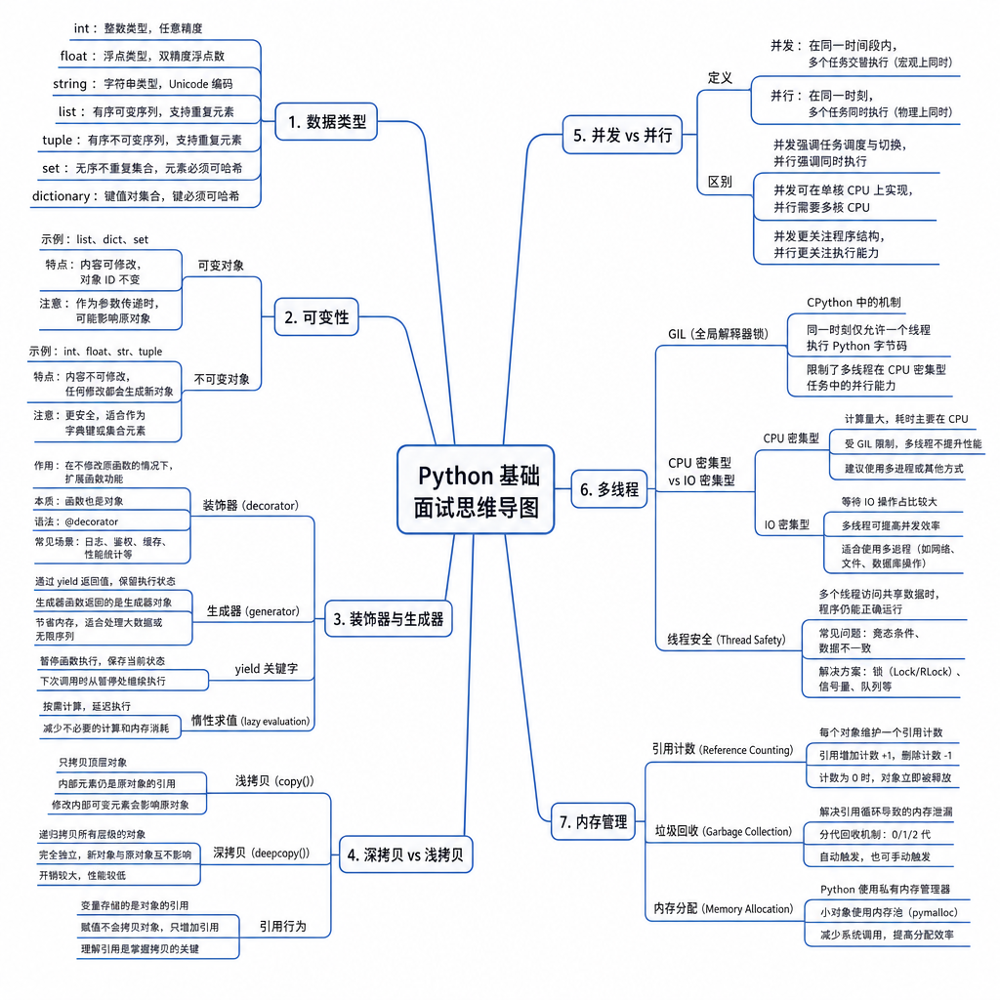

# Python 基础

Python 基础是 Agent 开发的底层编程能力，重点不是背语法，而是理解对象模型、运行时机制、并发模型和内存管理。

## 考点目录

- [基础数据类型：int、float、string、list、tuple、set、dictionary](01-基础数据类型.md)
- [可变数据类型与不可变数据类型](02-可变与不可变数据类型.md)
- [装饰器与生成器](03-装饰器与生成器.md)
- [深拷贝与浅拷贝](04-深拷贝与浅拷贝.md)
- [并发与并行](05-并发与并行.md)
- [多线程实现与 GIL](06-多线程实现与GIL.md)
- [Python 内存管理方式](07-Python内存管理方式.md)

---

[返回总目录](../README.md)
