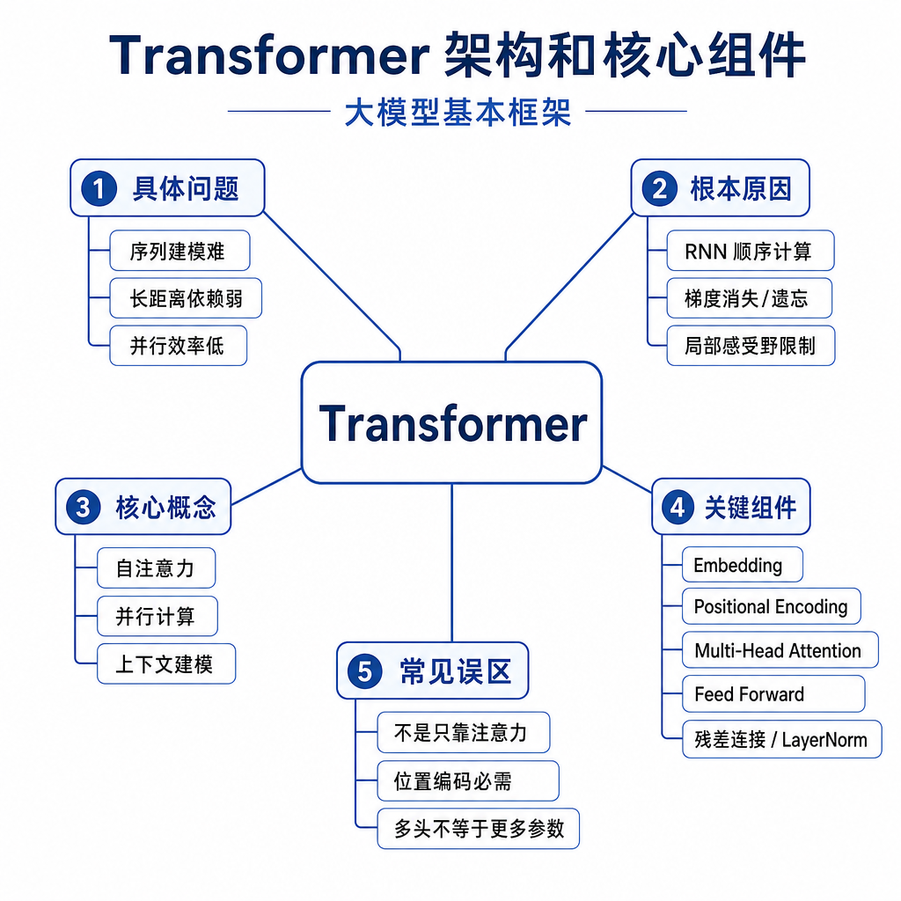
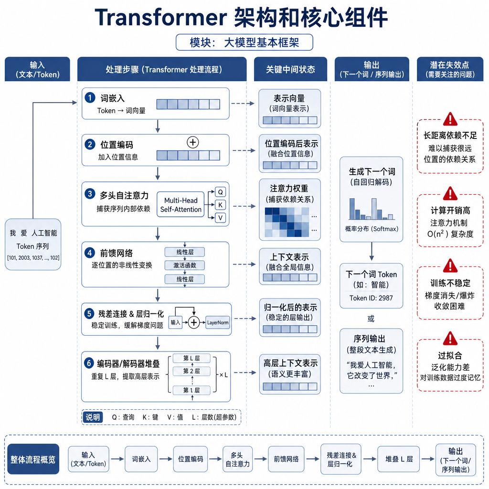
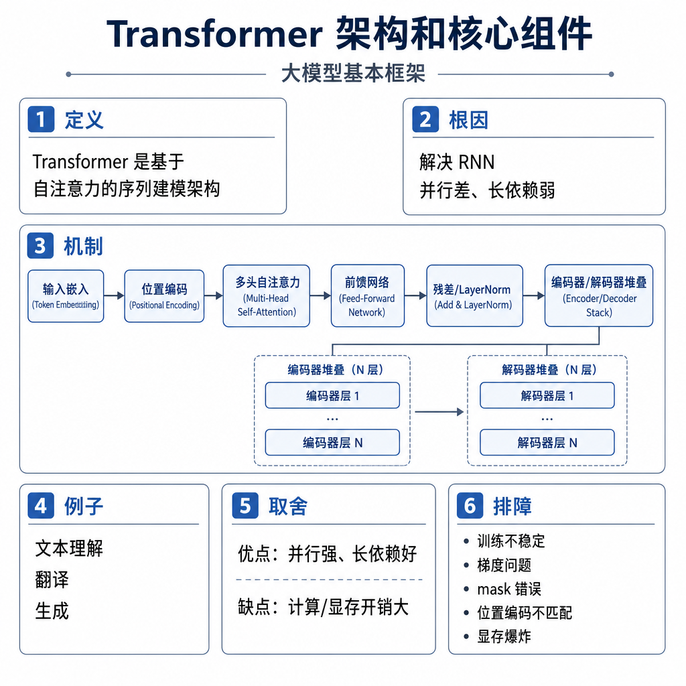

# Transformer 架构和核心组件

线上接入大模型时，最常见的失败不是“模型完全不会”，而是它在长问题里漏条件、在多轮对话里抓错指代、在高并发下首 token 很慢。面试官问 Transformer，也不是想听你背“Attention、FFN、LayerNorm”，而是看你能不能解释：为什么这个结构能处理上下文，为什么能并行训练，为什么又会在长文本上变贵。

## 从真实失败现象切入

假设客服机器人收到一句话：“我上周买的耳机，包装还在，但发票丢了，还能退吗？”如果模型只抓到“包装还在”和“能退”，忽略“发票丢了”，答案就会过度乐观。这个失败背后不是简单的 prompt 问题，而是序列建模的核心矛盾：模型既要让每个 token 看到足够多的上下文，又要在有限计算成本内完成训练和推理。

RNN 时代的思路是按时间步一个个读，天然有顺序，但长距离信息容易衰减，训练也难并行。Transformer 换了一种办法：把一段序列里的 token 同时拿出来，让它们通过自注意力直接交互。这样“耳机”“发票”“能退”可以在同一层里建立联系，不必等信息沿着时间步慢慢传过去。

## 核心矛盾：全局交互和可训练性

Transformer 要解决两个矛盾。第一，文本理解需要全局关系，比如主语和谓语、条件和结论、指代和实体，距离可能很远。第二，模型又要能大规模训练，不能像传统循环结构那样强依赖串行步骤。

自注意力解决“信息怎么互相看”的问题，FFN 解决“每个位置怎么加工”的问题，残差连接和 LayerNorm 解决“深层网络怎么训得稳”的问题，位置编码解决“顺序信息从哪里来”的问题。这些组件不是堆名词，而是在同一条链路上各司其职。



可以把一层 Transformer Block 看成两次增量更新。第一次，当前位置通过注意力从上下文取信息；第二次，当前位置通过 FFN 做非线性变换。残差路径让原始信息保留下来，LayerNorm 控制数值分布，避免层数加深后训练不稳定。

## 底层机制：一层 Block 到底做什么

输入文本会先被 tokenizer 切成 token id，再查 embedding 表变成向量。因为自注意力本身不关心顺序，模型还要加入位置相关信息，常见做法包括绝对位置编码、相对位置编码和 RoPE。之后向量进入多层 Transformer Block。

一层典型的 Decoder-Only Block 可以这样理解：

```text
x = token_embedding + position_info
for block in transformer_blocks:
    x = x + self_attention(norm(x))
    x = x + feed_forward(norm(x))
logits = lm_head(norm(x))
```

这里的 `self_attention` 负责让 token 互相读取信息。比如“苹果发布了新手机”里，“苹果”经过上下文交互后更像公司，而不是水果。`feed_forward` 则在每个位置上独立加工表示，相当于对注意力收集到的信息再做一轮非线性提炼。



残差连接看起来只是 `x + f(x)`，但它很关键。深层网络里，如果每层都完全覆盖旧表示，梯度和信息都容易不稳定；残差让模型学“增量修改”，某一层没学好时，旧信息还能继续往后传。LayerNorm 则让每层输入的数值尺度更稳定，减少训练时激活分布剧烈变化。

## 工程例子：为什么同一个词会有不同含义

看两句话：“苹果很好吃”和“苹果发布了财报”。初始 embedding 里，“苹果”这个 token 的向量可能相同或非常接近，但经过 Transformer 后，它的上下文表示会变得不同。

在第一句话里，“好吃”会让“苹果”偏向水果；在第二句话里，“发布”“财报”会让它偏向公司。这个变化不是词典查出来的，而是每层注意力不断聚合上下文后形成的动态表示。面试里讲到这里，就能解释为什么 Transformer 不是把词义写死在 embedding 里。

再看 RAG 场景。用户问题、检索片段、系统指令会被拼成一个长 prompt。Transformer 需要在生成答案时同时考虑“用户真正问什么”“资料里写了什么”“系统要求不能编造”。如果上下文过长或噪声太多，注意力虽然理论上能看全局，但模型未必总能把关键片段放在最高优先级，这就是长上下文 RAG 仍会答错的原因之一。

## 边界和风险：不要把结构神化

第一，自注意力的计算复杂度通常随序列长度平方增长。序列从 4K 增到 32K，注意力矩阵规模不是线性小问题，显存、延迟、调度都会明显变重。长上下文模型能接更长输入，不代表无成本。

第二，Transformer 能建模顺序，但顺序不是自注意力天然带来的。如果位置编码错了，模型就很难区分“猫追狗”和“狗追猫”。在推理服务里，RoPE 的 position id、KV Cache 的位置连续性、截断策略都会影响输出。

第三，训练和推理不一样。训练时可以并行计算整段序列的 next token loss；自回归推理时必须一个 token 一个 token 生成。KV Cache 可以减少历史 K/V 重算，但不能改变生成步骤本身的串行性。

第四，注意力权重不等于完整解释。模型输出还受 FFN、残差、多层组合和采样策略影响，不能看到某个 head 关注了某个词，就断言模型“因为这个词才回答”。

## 高频面试追问

- Transformer 相比 RNN 的核心优势是什么？
- 自注意力为什么能捕捉长距离依赖？
- 位置编码为什么必需？没有位置编码会怎样？
- FFN 在每层里起什么作用？
- 残差连接和 LayerNorm 分别解决什么问题？
- 为什么长上下文会让训练和推理成本上升？
- 训练阶段和自回归推理阶段有什么差异？

## 可复述答案

Transformer 是一种基于自注意力的序列建模架构。它先把 token 转成向量并加入位置信息，再通过多层 Block 反复更新表示。每个 Block 里，自注意力负责让当前位置从上下文中选择性取信息，FFN 负责对每个位置做非线性加工，残差连接让信息和梯度更容易穿过深层网络，LayerNorm 让训练更稳定。相比 RNN，Transformer 能并行处理序列里的 token，也更容易建立长距离关系。它的代价是注意力计算和 KV Cache 会随上下文长度增长，长文本推理需要重点关注显存和延迟。



## 排查和实践建议

如果模型输出质量差，先不要直接说“Transformer 不行”。第一步看输入：tokenizer 是否把特殊符号、代码、中文空格切得异常，prompt 是否被截断。第二步看模型配置：层数、hidden size、注意力头数、位置编码类型是否和权重匹配。第三步看推理参数：temperature、top-p、max tokens、stop sequence 是否合适。第四步看性能：首 token 延迟、decode tokens/s、显存峰值、上下文长度分布是否异常。

准备面试时，建议你能手画一层 Block：输入向量先进 attention，再进 FFN，中间有残差和归一化，最后通过 lm head 得到 logits。只要这条链路讲清楚，再补上位置编码、训练推理差异和长上下文成本，大多数 Transformer 架构题都能接住。

---

[返回 大模型基本框架 模块目录](README.md)
