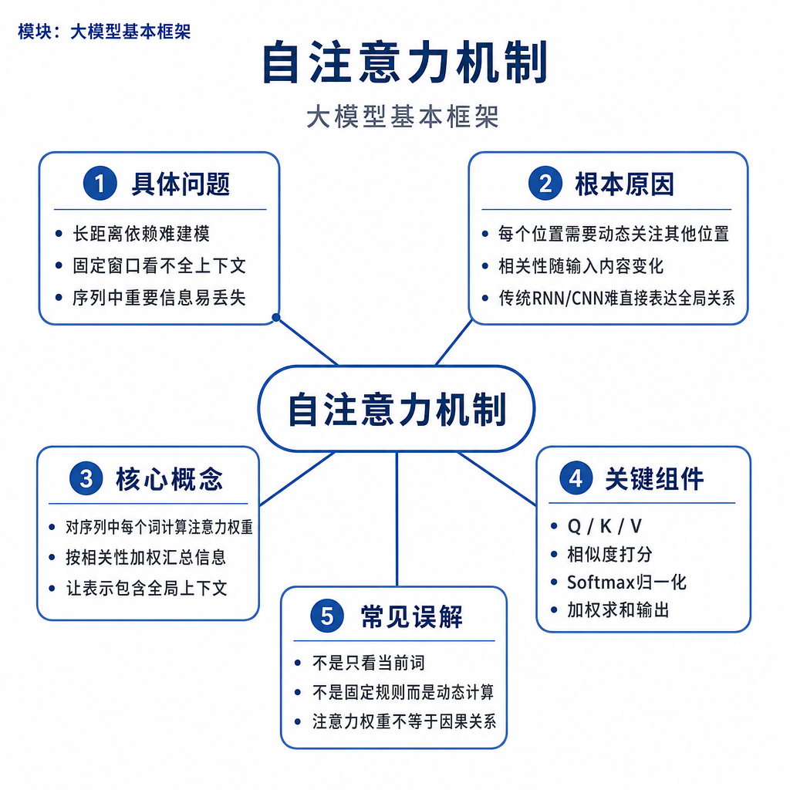
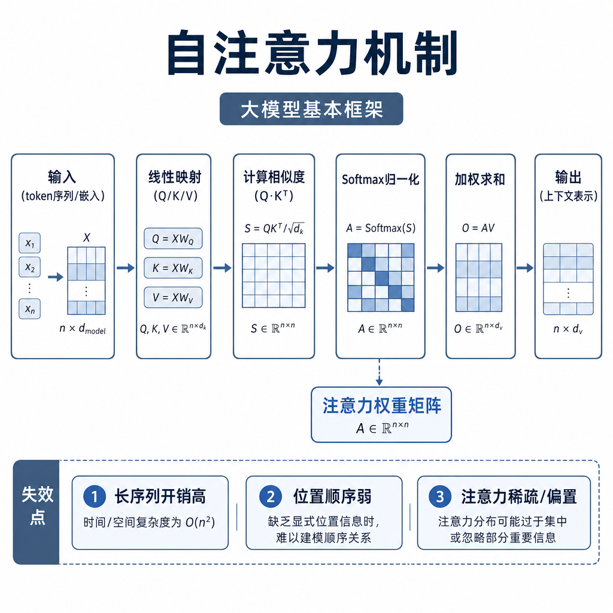
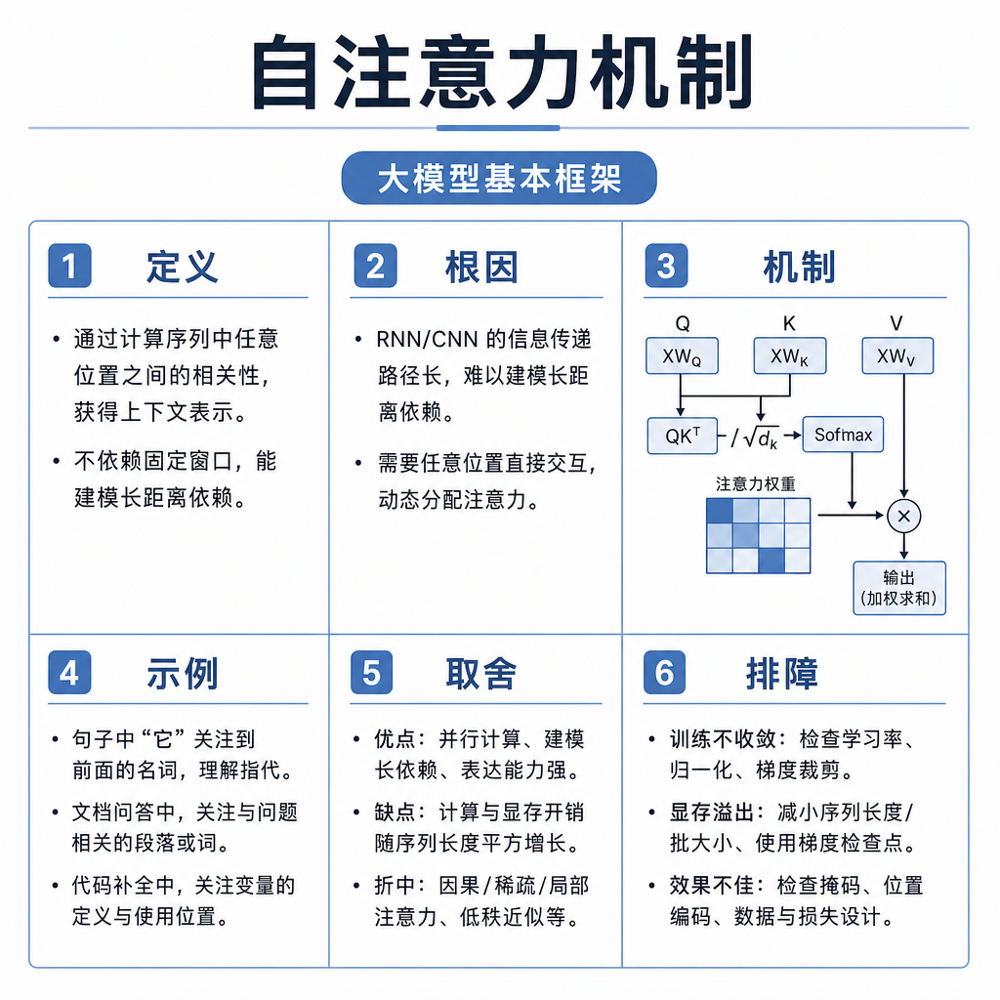

# 自注意力机制

线上问答系统有一种很典型的错误：用户问“耳机买了 10 天，包装还在但发票丢了，能退吗？”，模型只抓住“10 天”和“能退”，忽略“发票丢了”这个限制条件。面试官问自注意力，本质就在问：模型为什么能让一个 token 从其他 token 里取信息？又为什么会取错、漏取或成本很高？

## 从失败现象看问题本质

很多回答会停在一句话：“自注意力就是 Q 和 K 相乘得到权重，再乘 V。”这只是公式顺序，不是机制理解。真正要回答的是：当前位置在更新自己的表示时，怎么判断哪些上下文更相关，怎么把相关信息聚合进来，怎么保证生成时不偷看未来。

比如句子“银行旁边的苹果店开业了”里，“苹果”更可能指门店或公司；“这个苹果很甜”里，“苹果”更可能指水果。模型不能给“苹果”写死一个含义，而要根据上下文动态更新它的表示。自注意力做的就是这件事。



## 核心矛盾：相关性判断和信息聚合

一个 token 要更新自己，至少要解决两个问题。第一，它要知道“我该关注谁”；第二，它要知道“从对方那里拿什么”。如果只用一个向量同时做匹配和传递信息，表达能力会受限，所以 Transformer 把输入投影成 Query、Key、Value 三类向量。

Query 可以理解为“我现在想找什么信息”，Key 是“我能被别人用什么特征匹配到”，Value 是“如果别人关注我，我实际提供什么内容”。注意力不是直接比较原始词，而是在模型学习出的表示空间里比较 Q 和 K，再用结果加权 V。

核心公式是：

```text
Attention(Q, K, V) = softmax(QK^T / sqrt(d_k))V
```

`QK^T` 得到每个位置对其他位置的匹配分数；除以 `sqrt(d_k)` 是为了避免点积数值随维度变大而过大，导致 softmax 过早接近 one-hot；softmax 把分数变成权重；最后乘以 V，得到聚合后的上下文表示。

## 底层机制：一层注意力如何跑完

假设输入序列长度是 `seq_len`，每个 token 的隐藏维度是 `hidden_size`。多头注意力会把 hidden size 拆成多个 head，每个 head 在自己的子空间里计算注意力。

流程可以这样记：

```text
Q = X @ Wq
K = X @ Wk
V = X @ Wv
scores = Q @ K.T / sqrt(head_dim)
scores = scores + mask
weights = softmax(scores)
context = weights @ V
output = concat(head_outputs) @ Wo
```

这里最容易被问的是 mask。Encoder-Only 模型通常允许 token 看左右上下文；Decoder-Only 模型生成第 5 个 token 时，只能看第 1 到第 5 个位置，不能看第 6 个位置之后的答案。所以 causal mask 会把未来位置的分数设成极小值，让 softmax 后权重接近 0。



padding mask 和 causal mask 也要分清。padding mask 是为了不关注补齐出来的空位置；causal mask 是为了不偷看未来。批量推理里两种 mask 经常同时出现，任何一个处理错，都可能导致困惑度异常、输出不稳定，甚至同一个样本在不同 batch size 下答案不同。

## 工程例子：为什么多头注意力有用

单头注意力只能在一个投影空间里判断关系。多头注意力把 hidden size 拆开，让多个 head 并行学习不同关系模式。一个 head 可能更容易捕捉局部搭配，另一个 head 可能更关注实体指代，还有的 head 可能对标点、格式、段落边界敏感。

但面试时不要说“第 3 个 head 负责语法，第 7 个 head 负责指代”这种绝对话。更稳的说法是：多头注意力提供多个子空间，使模型能同时表达多种相关性模式，某些可视化结果可能呈现出人类可解释的关系，但这不是固定分工。

看一个具体 RAG 例子。上下文里有两段资料：一段讲“15 天无理由退货”，另一段讲“发票丢失不能开具纸质发票但不影响退货”。用户问“发票丢了还能退吗？”好的注意力模式要把“发票丢了”和第二段限制联系起来，也要把“退货期限”与第一段联系起来。如果 chunk 太乱或 prompt 太长，相关信息被噪声稀释，模型就可能只取到一半信息。

## 边界和风险：注意力不是万能解释器

第一，注意力复杂度通常是 `O(n^2)`。序列长度翻倍，注意力分数矩阵大约变成 4 倍。长上下文推理慢，不只是因为输入字多，还因为注意力和 KV Cache 都在增长。

第二，注意力权重不等于完整因果解释。它表示某层某个 head 的信息聚合比例，但最终输出还经过多层叠加、FFN、残差路径和采样策略。把注意力图当作模型“思考过程”的完整证据，是常见误区。

第三，向量相似不等于业务相关。自注意力在 prompt 内做信息聚合，向量检索在知识库里做相似度匹配，两者都可能把“语义相近但不能回答问题”的内容当成候选。因此 RAG 里常需要 rerank 和生成约束。

第四，mask 错误很隐蔽。训练时标签右移错、padding token 没从 loss 里忽略、position id 不连续、KV Cache 拼接错，都可能表现为“模型质量差”，但根因其实是注意力输入被污染。

## 高频面试追问

- 为什么需要 Q、K、V 三个向量？
- `QK^T` 为什么要除以 `sqrt(d_k)`？
- softmax 是沿哪个维度做的？
- causal mask 和 padding mask 有什么区别？
- 多头注意力为什么比单头更强？
- 注意力权重能不能解释模型答案？
- 自注意力在长文本场景下的瓶颈是什么？

## 可复述答案

自注意力的作用是让每个 token 在更新表示时，从同一序列的其他 token 中选择性聚合信息。模型先把输入投影成 Q、K、V：Q 表示当前位置要查什么，K 表示每个位置可被匹配的特征，V 表示真正传递的内容。计算时用 Q 和 K 得到相关性分数，除以 `sqrt(d_k)` 稳定 softmax，再用权重加权 V。多头注意力是在多个子空间里并行做这件事，提升模型表达不同关系的能力。它的边界是长序列成本高，mask 容易出错，注意力权重也不能等同于完整解释。



## 排查和实践建议

如果训练 loss 异常，先查标签是否正确右移，padding 位置是否被忽略，causal mask 是否遮住未来 token。若推理输出在 batch size 改变后不一致，重点查 padding mask、position id 和 KV Cache 对齐。若长上下文性能差，看上下文长度分布、attention kernel、显存峰值、KV Cache 占用和首 token 延迟。

学习时建议用 4 个 token 手算一次形状：`Q` 是 `[seq, head_dim]`，`K.T` 是 `[head_dim, seq]`，分数矩阵是 `[seq, seq]`，softmax 后再乘 `V` 回到 `[seq, head_dim]`。能把形状、mask、缩放和多头拼接讲清楚，自注意力就不再只是背公式。

---

[返回 大模型基本框架 模块目录](README.md)
