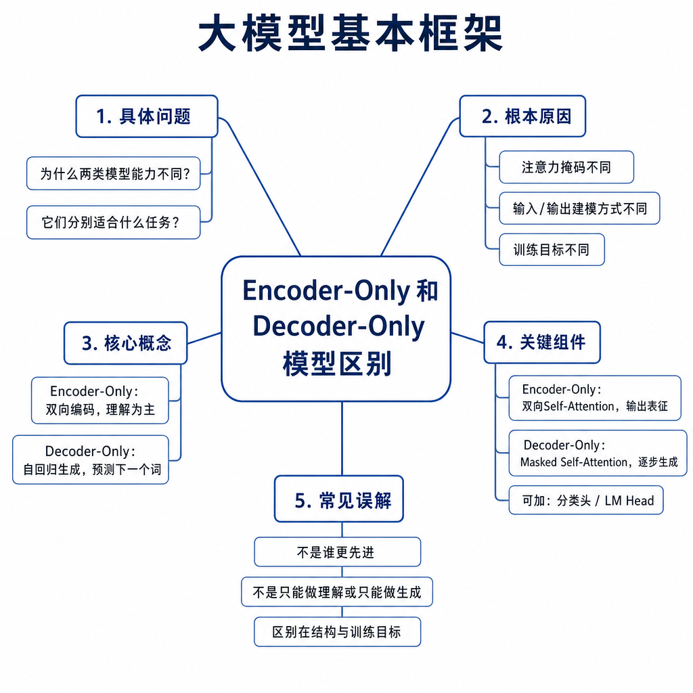
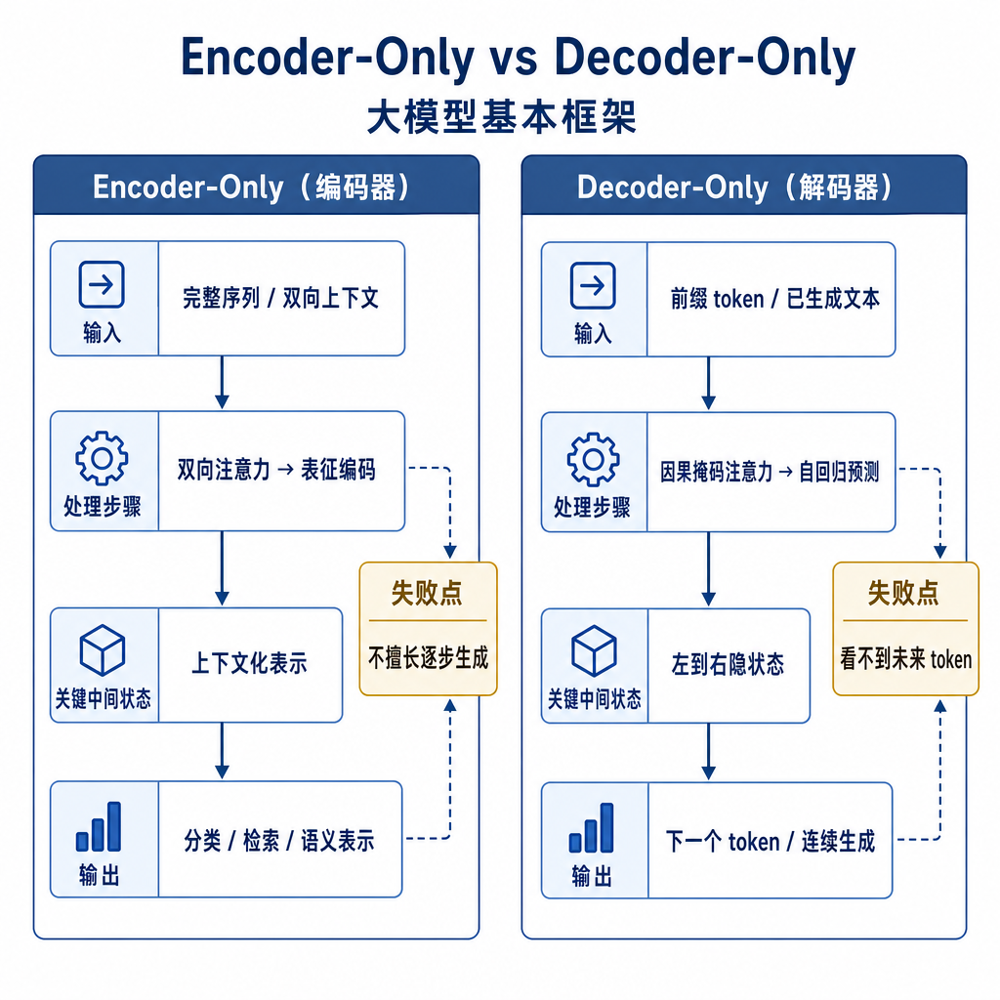
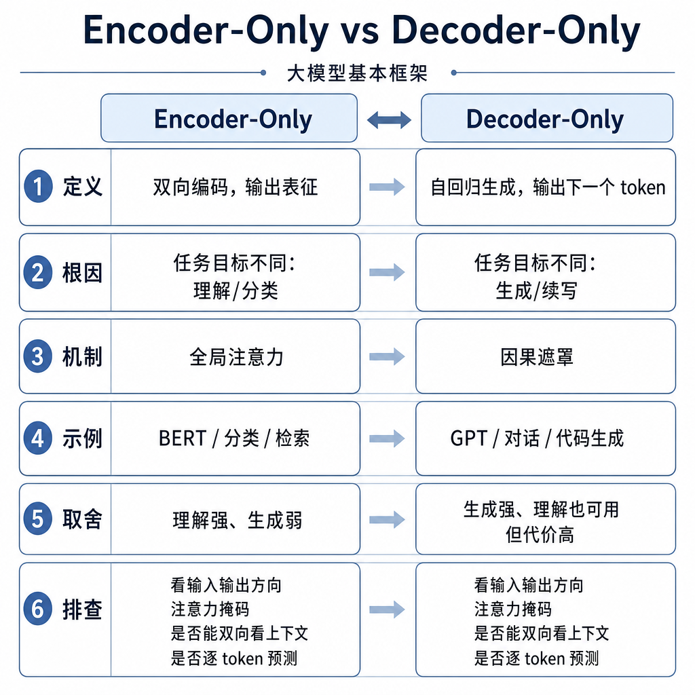

# Encoder-Only 和 Decoder-Only 模型区别

真实项目里，经常有人把所有模型都叫“大模型”，然后拿 GPT 去做向量召回，拿 BERT 去做开放式对话，最后效果很怪。面试官问 Encoder-Only 和 Decoder-Only 的区别，表面是问 BERT 和 GPT，实际是在问你能不能把结构、注意力可见范围、训练目标和任务形态串起来。

## 从失败现象切入

假设你要做一个企业知识库。第一类需求是判断“用户问题和某个文档片段是否相关”，输出一个分数；第二类需求是根据检索到的资料生成一段自然语言答案。如果你用同一个模型硬做所有事，可能会出现两种失败：生成模型做召回时又慢又贵，向量质量未必好；理解模型做对话时，只能给分类或抽取结果，很难自然续写。

常见错误说法是：“BERT 只能理解，GPT 只能生成。”这句话不准确。BERT 可以通过特殊设计做 token 预测，GPT 也能做分类、抽取和判断。差异不是绝对能不能，而是天然适合什么。核心要看注意力可见范围和训练目标。

## 核心矛盾：完整理解和自回归生成

理解类任务通常希望模型一次性看到完整输入。比如情感分类、语义匹配、实体识别，模型需要同时利用左右上下文。“这家店服务不好吗？”和“这家店服务不好”只差一个问号和语气，左右信息都很重要。

生成类任务则必须保证因果性。模型生成第 t 个 token 时，只能基于已经出现的 token 预测下一个，不能看到未来答案。否则训练时偷看未来，推理时又看不到，目标就不一致。

Encoder-Only 通常使用双向注意力，每个 token 可以看左右两侧上下文；Decoder-Only 使用 causal mask，每个 token 只能看自己和之前的位置。这个差异直接决定了它们的任务优势。

## 底层机制：三类结构怎么工作

Encoder-Only 的代表是 BERT、RoBERTa。它们的每一层通常是双向自注意力，适合把整段输入压成一个用于判断或表示的向量。BERT 的典型预训练目标是 Masked Language Modeling，也就是遮住一部分 token，让模型根据双向上下文预测被遮住的内容。

Decoder-Only 的代表是 GPT、LLaMA、Qwen。它们使用因果注意力，训练目标通常是 next token prediction：给定前文，预测下一个 token。这个目标和推理阶段完全一致，所以非常适合对话、续写、代码补全、工具调用参数生成。

Encoder-Decoder 的代表是 T5、BART。Encoder 先双向编码输入，Decoder 再基于 Encoder 输出和已生成前缀逐 token 生成。它适合翻译、摘要、改写这类输入到输出转换任务。

可以用一个表记住核心区别：

| 维度 | Encoder-Only | Decoder-Only | Encoder-Decoder |
|---|---|---|---|
| 注意力范围 | 双向上下文 | 只看历史 token | Encoder 双向，Decoder 因果 |
| 典型目标 | MLM、分类微调 | next token prediction | seq2seq 生成 |
| 代表模型 | BERT、RoBERTa | GPT、LLaMA、Qwen | T5、BART |
| 擅长任务 | 分类、匹配、抽取、向量表示 | 对话、续写、代码、工具调用 | 翻译、摘要、改写 |
| 推理特点 | 多数任务一次前向 | 逐 token 自回归 | 先编码再逐 token 解码 |

## 工程例子：为什么 RAG 常把两类模型组合用

RAG 系统里常见组合是：用 embedding 模型或 reranker 做检索和排序，用 Decoder-Only 大模型生成答案。原因很实际。

检索阶段需要快速判断“用户问题和哪些 chunk 相似”。这类任务更像理解和匹配，通常适合 Encoder 类 embedding 模型，把 query 和文档片段编码成向量，再算相似度。Reranker 也常用双塔或交叉编码结构，重点是判断相关性。

生成阶段需要把检索资料组织成自然语言答案，还要处理引用、条件、拒答和多轮上下文。这更适合 Decoder-Only，因为它的训练目标就是根据前文生成后续文本。

举个例子，用户问“耳机买了 10 天还能退吗？”检索模型负责找到“耳机 15 天无理由退货”的政策片段；生成模型负责回答“仍在期限内，但要满足包装、配件、外观条件”。如果直接让生成模型扫完整知识库，成本高且召回不可控；如果只让 Encoder 输出标签，答案又不够自然。

## 边界和风险：别把结构说成能力上限

第一，Decoder-Only 不是不能理解。现代通用大模型经过大规模预训练、指令微调和偏好对齐后，分类、抽取、推理都能做得很好，只是它的底层生成方式仍是自回归。

第二，Encoder-Only 不是完全不能生成。它可以通过 MLM 预测被遮住的 token，也可以接特定任务头，但它不是为开放式从左到右生成长文本设计的。

第三，模型选型不能只看架构。训练数据、参数规模、指令微调、领域适配、推理框架都会影响效果。一个强 Decoder-Only 模型可能在很多理解任务上超过小型 Encoder，但在低延迟、大规模召回上仍不一定划算。

第四，注意力 mask 不能混用。如果把因果 mask 用在本该双向理解的任务上，模型可能看不到后文；如果生成训练时漏掉 causal mask，模型会偷看答案，推理时性能崩掉。

## 高频面试追问

- BERT 和 GPT 的核心区别是什么？
- 双向注意力和因果注意力分别适合什么任务？
- 为什么 GPT 适合开放式生成？
- Encoder-Only 能不能生成？Decoder-Only 能不能分类？
- Encoder-Decoder 适合哪些场景？
- 为什么现在通用大模型多采用 Decoder-Only？
- RAG 为什么常用 embedding 模型检索，再用生成模型回答？

## 可复述答案

Encoder-Only 和 Decoder-Only 的核心区别是注意力可见范围和训练目标。Encoder-Only 通常使用双向注意力，每个 token 能同时看左右上下文，配合 MLM 或分类微调，适合理解、匹配、抽取和向量表示。Decoder-Only 使用因果 mask，只能看历史 token，并通过 next token prediction 训练，训练形式和推理形式一致，所以适合对话、续写和开放式生成。它们不是绝对不能做对方任务，而是天然优势和工程成本不同。生产 RAG 里常用 Encoder 类模型做检索和排序，用 Decoder 类模型基于资料生成答案。

## 排查和实践建议

模型选型先看输出形态。如果输出是标签、分数、向量、实体边界，优先考虑 Encoder-Only、embedding 或 reranker；如果输出是自然语言、代码、JSON 参数、多轮对话，优先考虑 Decoder-Only；如果是强输入输出转换，比如翻译和摘要，可以考虑 Encoder-Decoder 或能力足够强的生成模型。

线上排查时，把“结构不匹配”和“数据问题”分开。分类差，检查标注、类别定义、阈值和样本分布；生成差，检查 prompt、上下文截断、采样参数和停止条件；RAG 差，拆成召回、重排、上下文和生成四层看。面试里能把架构差异落到工程决策，比只背 BERT 和 GPT 的名字更有说服力。

---

[返回 大模型基本框架 模块目录](README.md)
