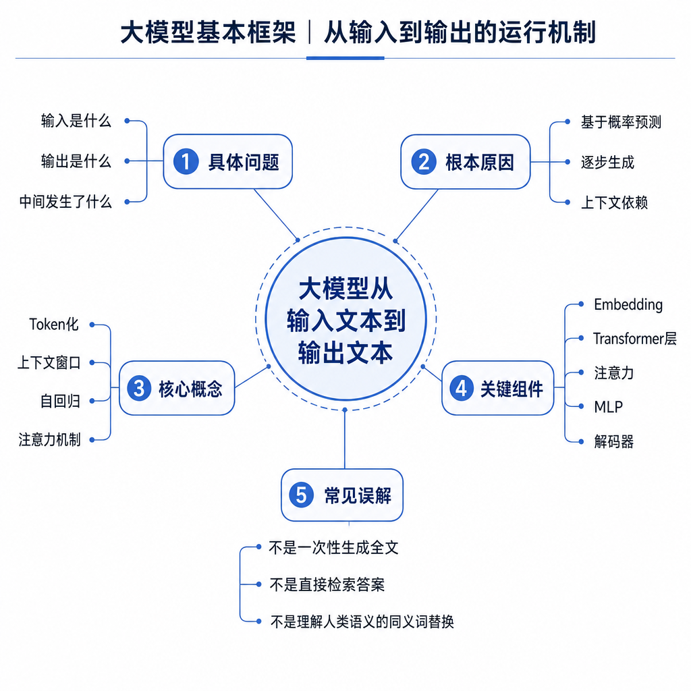
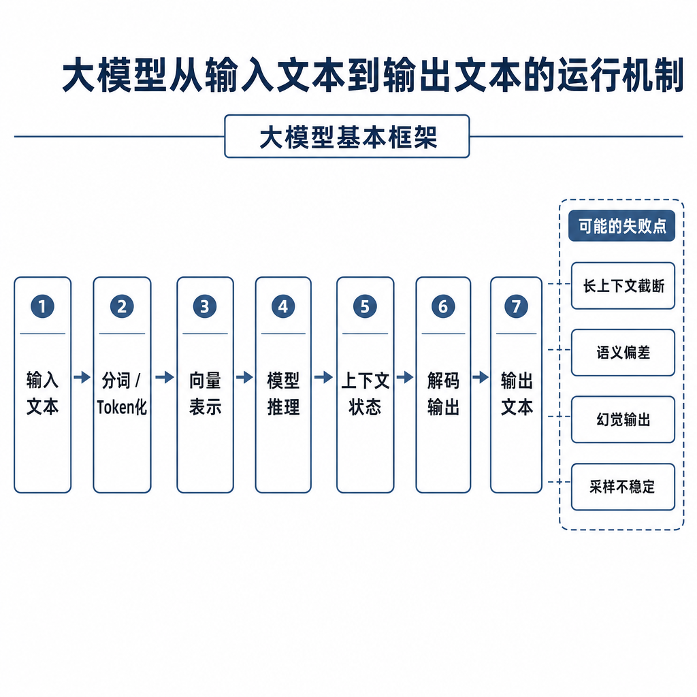
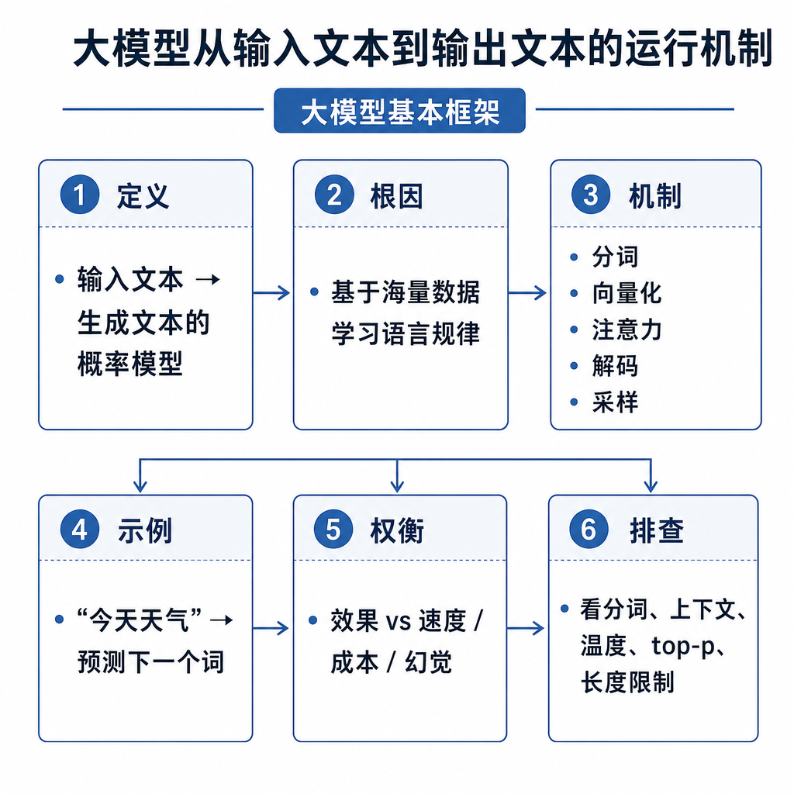

# 大模型从输入文本到输出文本的运行机制

很多线上问题，只有理解“大模型是怎么生成文本的”才能解释。为什么同一个问题多问几次答案不同？为什么流式输出先卡一会儿再开始冒字？为什么 prompt 很长时首 token 特别慢？为什么设置了 max tokens 后答案被截断？这些都不是玄学，而是 token 化、自回归生成、解码采样和停止条件共同造成的现象。

## 从真实失败现象切入

假设你做了一个简历问答助手。用户问：“帮我总结这个候选人的项目亮点，控制在 3 点。”模型有时输出 3 点，有时输出 5 点；有时第一句话等很久才出现；有时总结到一半突然停了。初学者容易把这些都归因于“模型不稳定”，但面试里要拆清楚：慢可能来自 prefill，随机可能来自采样，停得早可能来自 stop sequence 或 max tokens，答偏可能来自上下文缺失或被截断。

大模型不是读完问题后一次性写出完整答案。更准确地说，它把文本转成 token，在每一步预测下一个 token，再把新 token 拼回上下文，继续预测下一个。



## 核心矛盾：语言是字符串，模型处理的是 token

模型不能直接处理自然语言字符串。输入先经过 tokenizer，变成词表里的 token id。token 不等于中文词，也不等于英文单词，它可能是一个汉字、一个词片段、一个空格加单词、一个标点，甚至是一段常见字符串。

这会带来几个工程现象。中文、英文、代码的 token 密度不同，同样 1000 个字符，token 数可能差很多。特殊符号、表格、JSON、代码缩进也可能被切得很碎。上下文窗口限制的是 token 数，不是字符数，所以“看起来不长”的输入也可能占满窗口。

token id 会查 embedding 表得到向量，向量进入多层 Transformer。最后一层输出 hidden state，语言模型头把最后一个位置的 hidden state 映射到词表大小的 logits。logits 是“下一个 token 候选”的未归一化分数，还不是最终答案。

## 底层机制：从 prompt 到第一个 token

一次推理通常分成两个阶段。第一阶段是 prefill，也就是处理完整 prompt。系统提示词、历史对话、用户问题、RAG 检索片段、工具返回结果都会被拼成一段上下文，然后 tokenize。模型对整段 prompt 做前向计算，得到最后位置预测下一个 token 的 logits。

这个阶段决定首 token 延迟的一大部分。prompt 越长，模型要处理的 token 越多，KV Cache 初始化越大，首 token 就越容易慢。流式输出也不能绕过 prefill，因为模型必须先读完当前上下文，才能知道第一个输出 token 该是什么。

第二阶段是 decode，也就是循环生成。模型根据 logits 选出一个 token，把它追加到上下文，再预测下一个 token。使用 KV Cache 时，历史 token 的 Key 和 Value 会被缓存，后续每步主要处理新 token，但生成步骤仍然是串行的。



伪流程如下：

```text
prompt_ids = tokenize(prompt)
cache = prefill(prompt_ids)
while not stop:
    logits = model.forward(last_token, cache)
    logits = apply_temperature(logits)
    candidates = apply_top_p_or_top_k(logits)
    next_token = sample(candidates)
    append(next_token)
    update_cache(next_token)
return detokenize(generated_ids)
```

最后，生成出的 token id 会经过 detokenize 还原成字符串。流式输出通常是在生成一个 token 或一小段 token 后就返回给前端，所以用户看到的是逐步出现的文本。

## 解码策略：为什么答案稳定或发散

logits 需要经过解码策略才能变成具体 token。贪心解码每次选分数最高的 token，结果稳定，但可能死板或陷入重复。temperature 会调整概率分布的尖锐程度：温度低时更偏向高概率 token，温度高时随机性更大。top-k 只在概率最高的 k 个候选里采样，top-p 选择累计概率达到 p 的候选集合。

如果你做代码生成、结构化 JSON、知识库问答，通常希望答案更稳定，可以降低 temperature，收紧 top-p，并设置明确格式约束。如果你做创意文案，适当提高随机性可能更好。注意，temperature 不会改变模型知道什么，它只改变从候选分布里怎么选。

幻觉也和这个机制有关。模型每一步都在根据上下文和参数分布选择下一个 token，它没有天然事实校验器。当 prompt 缺少证据、问题本身有歧义、采样过于发散，或训练分布中存在强模板时，模型可能生成流畅但不真实的内容。RAG 的作用就是把证据放进上下文，但最终仍要靠生成约束和评测降低风险。

## 工程例子：首 token 慢和输出截断怎么定位

用户反馈“机器人反应慢”，你要先看慢在哪里。如果请求发出后很久才出现第一个字，重点查 prompt token 数、RAG 是否塞了太多片段、排队时间、prefill 时间和模型冷启动。如果第一个字很快出现，但后面一个字一个字很慢，重点查 decode tokens/s、并发 batch、KV Cache、显存带宽和最大输出长度。

用户反馈“答案说到一半停了”，常见原因有三类。第一，`max_tokens` 太小，输出预算用完。第二，stop sequence 命中了正文里的某个字符串。第三，上下文窗口被输入占满，留给输出的空间不足。面试时把 context window 和 max tokens 分清楚很重要：前者限制输入加输出总 token 数，后者通常限制本次最多生成多少 token。

## 边界和风险：几个高频误区

第一，不要把 token 当字符数。中文、英文、代码、表格的 token 占用差异很大，成本和截断都按 token 算。

第二，流式输出不等于总计算量减少。它改善的是用户感知延迟，通常不能减少模型需要生成的 token 数。

第三，采样参数不是质量开关。温度低不一定更正确，温度高不一定更聪明。知识不足、检索错误、上下文污染，靠调采样只能部分缓解。

第四，大模型生成是局部逐 token 决策，不是先规划完整答案再打印。虽然模型可以在上下文中表现出规划能力，但底层接口仍是在每一步预测下一个 token。

## 高频面试追问

- 大模型为什么是逐 token 生成？
- tokenizer 在输入输出流程里起什么作用？
- logits、softmax、概率分布是什么关系？
- temperature、top-k、top-p 分别控制什么？
- 首 token 延迟和后续 token 延迟分别受什么影响？
- 流式输出是否减少计算量？
- max tokens 和 context window 有什么区别？
- 幻觉和生成机制有什么关系？

## 可复述答案

大模型从输入到输出可以概括为 tokenize、前向计算、解码采样和循环生成。文本先被 tokenizer 转成 token id，再映射成 embedding，经过多层 Transformer 得到 hidden state，语言模型头输出词表维度的 logits。logits 经过 temperature、top-k、top-p 等策略处理后，模型选择下一个 token，并把它追加到上下文继续生成，直到遇到停止条件。因为它是逐 token 自回归生成，所以会有首 token 延迟、流式输出、采样随机性、上下文窗口和 KV Cache 成本等工程现象。



## 排查和实践建议

线上输出不稳定时，记录完整 prompt、模型版本、采样参数、随机种子、max tokens、stop sequence、输入 token 数和输出 token 数。质量问题按三层查：输入层看 prompt 是否缺信息、RAG 片段是否相关、历史对话是否污染；解码层看 temperature 是否过高、top-p 是否过宽、停止条件是否误触发；服务层看是否发生截断、超时、降级或模型版本切换。

性能问题也要拆开。首 token 慢，重点查 prompt token 数、prefill、排队、冷启动和网络；后续生成慢，重点查 decode 吞吐、batch 策略、KV Cache、显存带宽和并发。面试里能把质量、延迟、成本分别归因，比只背“输入到输出流程”更像真正做过大模型应用的人。

---

[返回 大模型基本框架 模块目录](README.md)
