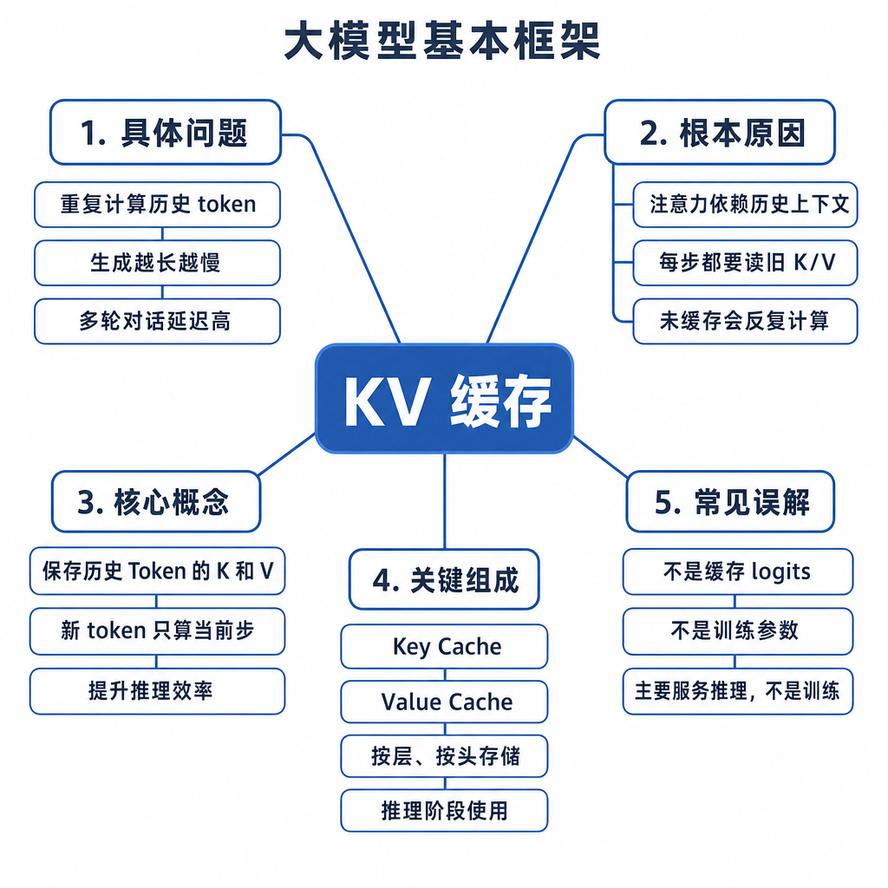
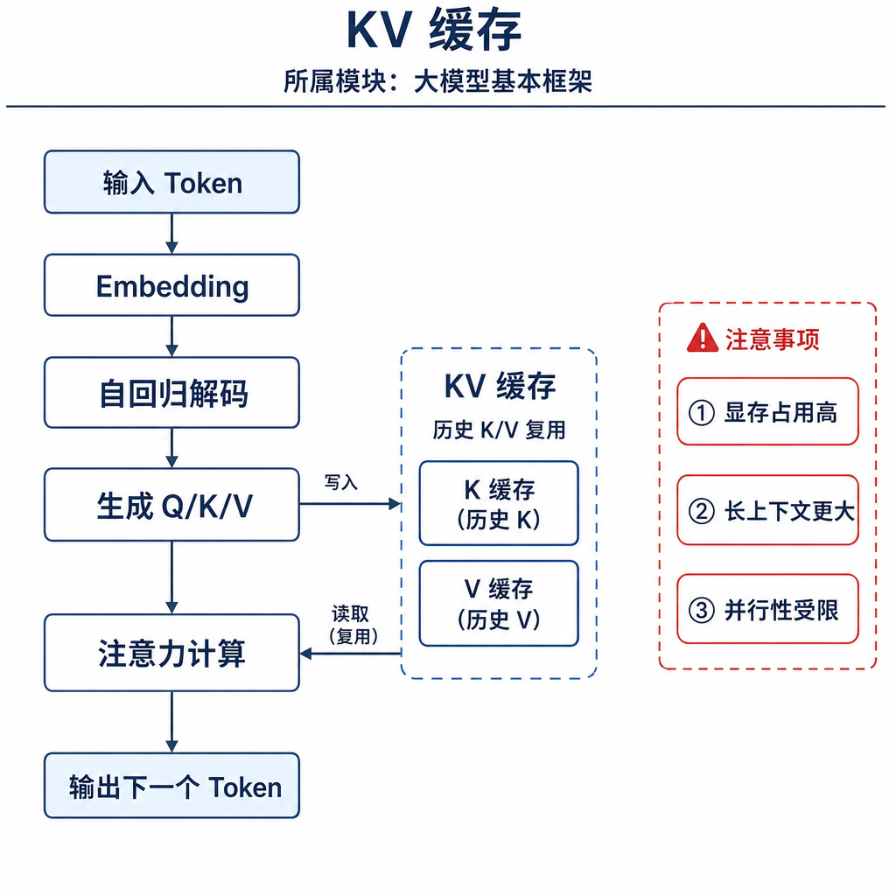
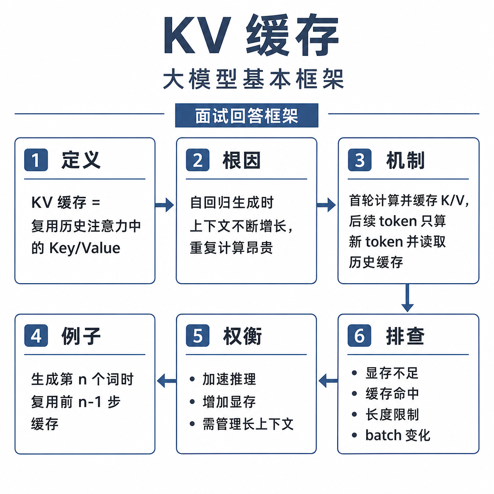

# KV 缓存

大模型服务上线后，经常出现一个现象：短问题回答很快，长对话越聊越慢；并发一高，显存突然被吃满；首 token 等很久，但开始输出后速度还可以。面试官问 KV Cache，不是只想听“缓存 K 和 V，加速推理”，而是要看你能不能解释 prefill、decode、显存成本和多轮对话为什么会变贵。

## 从真实失败现象切入

假设用户给模型塞了 8000 个 token 的合同，让它总结风险点，再追问 5 轮。如果没有缓存，每生成一个新 token，都要把前面所有 token 重新跑一遍注意力投影，历史计算会被反复浪费。使用 KV Cache 后，prompt 在 prefill 阶段建立缓存，decode 阶段每次只处理新 token，并让新 token 去查询历史 K/V。

但另一个问题马上出现：缓存不是免费的。上下文越长、并发越高、模型层数越多，KV Cache 占用的显存越大。很多线上 OOM 不是模型权重本身放不下，而是活跃请求的缓存把显存吃满。



## 核心矛盾：用显存换重复计算

自回归生成有一个固定特点：第 t 个 token 生成后，才能生成第 t+1 个 token。每一步都要让新 token 关注前面的历史 token。如果每一步都重新计算所有历史 token 的 K/V，成本会随着生成长度不断累积。

KV Cache 的思路很直接：历史 token 的 Key 和 Value 已经算过，只要历史内容和位置不变，它们在每一层里的 K/V 就不会变。于是把它们保存起来，后续新 token 只需要计算自己的 Q/K/V，再用自己的 Q 去和历史 K 计算注意力，最后加权历史 V。

为什么不缓存 Q？因为历史 token 的 Q 是历史位置“当时要查什么”，对生成新 token 没有直接用途。新 token 需要新的 Q，表示当前位置现在要从历史里查什么。历史 K/V 可以复用，新 token 的 Q 必须现算，新 token 的 K/V 也要追加进缓存，供后面的 token 使用。

## 底层机制：prefill 和 decode 的区别

KV Cache 推理通常分为两个阶段。

prefill 阶段处理完整 prompt。模型一次性读取系统提示词、历史对话、用户问题、RAG 片段等所有输入 token，为每一层生成这些 token 的 K/V 缓存，并输出最后位置的 logits。这个阶段计算量大，但并行度高，通常决定首 token 延迟。

decode 阶段逐 token 生成。每一步输入上一步生成的新 token，计算它在每层的 Q/K/V，把新的 K/V 追加到缓存，再用 Q 查询历史缓存，得到下一个 token 的 logits。这个阶段单步计算量小于重算全上下文，但步骤必须串行。



伪流程如下：

```text
# prefill
prompt_ids = tokenize(prompt)
logits, kv_cache = model.forward(prompt_ids, cache=None)
next_token = decode(logits[-1])

# decode
while not stop:
    logits, kv_cache = model.forward(next_token, cache=kv_cache)
    next_token = decode(logits[-1])
```

所以 KV Cache 能明显降低后续 token 的重复计算，但不能让长 prompt 的第一次读取免费。长输入的首 token 仍然慢，因为 prefill 必须先完成。

## 显存代价：为什么长上下文和并发很贵

KV Cache 的近似显存公式可以这样记：

```text
KV_cache_bytes ≈ batch_size * seq_len * num_layers * 2 * num_kv_heads * head_dim * bytes_per_element
```

其中 `2` 代表 K 和 V 两份缓存。`seq_len` 包括 prompt token 和已经生成的 token。层数越多、上下文越长、并发 batch 越大、数据类型越占空间，缓存显存就越高。

MHA、MQA、GQA 的差异也和这里有关。普通多头注意力里，KV head 数可能等于 query head 数；MQA 让多个 query head 共享一组 KV；GQA 让一组 query head 共享若干组 KV。它们的共同目标之一，就是减少 KV Cache 占用和访存压力。

举个直觉例子：同一个模型下，上下文从 4K 增加到 32K，KV Cache 近似增加 8 倍。并发 16 个请求时，不是只存一份缓存，而是每个活跃请求都有自己的缓存。多轮对话如果每轮都带上完整历史，缓存和 prefill 成本都会越滚越大。

## 工程例子：多轮对话为什么越聊越慢

用户看到的是“接着聊”，服务端看到的是不断变长的上下文。第 1 轮可能只有 500 token，第 5 轮把历史全拼上后可能变成 6000 token。每次请求如果重新提交完整历史，服务端都要重新 prefill，除非有会话级 prefix cache 能复用共同前缀。

prefix cache 也不是万能的。它要求前缀完全一致，模型版本、位置编码、tokenizer、系统提示词和缓存管理都要匹配。只要中间插入、删除或改写历史，旧缓存就不能简单复用。对话摘要也要谨慎：你可以压缩文本历史来减少后续输入，但不能保留旧 KV Cache 后随意删掉对应文本，因为缓存和 token 前缀是一一对应的。

服务端还会遇到调度问题。长请求和短请求混在一起，可能让短请求排队变慢；KV Cache 占满后，系统可能降低 batch、驱逐缓存、做分页换入换出，甚至拒绝请求。PagedAttention、KV quantization、prefix caching、滑动窗口注意力，本质都在管理 KV Cache 的内存和带宽成本。

## 边界和风险：几个必须说清的点

第一，KV Cache 主要优化推理 decode，不是常规训练的反向传播缓存。训练要保存激活用于梯度计算，这是另一类内存问题。

第二，KV Cache 不会减少 prompt 本身需要被读取的长度。首次处理长 prompt 仍要 prefill，所以首 token 延迟可能仍然很高。

第三，KV Cache 不是跨用户共享的长期记忆。不同用户、不同上下文、不同模型版本之间不能随便共用缓存，否则会串上下文或输出异常。

第四，位置必须连续。使用 RoPE 等位置编码时，decode 阶段的 position id 要和历史长度对齐。截断、padding、拼接、batch 合并、缓存复用任何一步位置错了，都可能导致模型突然胡言乱语。

## 高频面试追问

- KV Cache 缓存的到底是什么？
- prefill 和 decode 有什么区别？
- 为什么历史 K/V 能复用，Q 不能像 K/V 一样复用？
- KV Cache 如何影响首 token 延迟和后续 token 延迟？
- KV Cache 的显存占用和哪些因素有关？
- 长上下文、多轮对话和高并发为什么会让成本上升？
- MQA、GQA、PagedAttention 分别缓解什么问题？
- prefix cache 为什么要求前缀一致？

## 可复述答案

KV Cache 是自回归推理中的缓存机制，它保存每一层注意力里历史 token 的 Key 和 Value。推理分为 prefill 和 decode：prefill 阶段处理完整 prompt，并为输入 token 建立 K/V 缓存；decode 阶段逐 token 生成，每步只计算新 token 的 Q/K/V，把新的 K/V 追加到缓存，再用新 token 的 Q 查询历史 K/V。这样避免每生成一个 token 都重算全部历史上下文，能显著提升后续 token 速度。代价是显存随层数、上下文长度、batch size 和 KV head 数增长，长上下文、多轮对话和高并发场景必须管理缓存成本。



## 排查和实践建议

首 token 延迟高，先查 prompt token 数、prefill 时间、prefix cache 命中率、排队时间和冷启动。后续生成慢，重点看 decode tokens/s、batch 调度、KV Cache 读写、显存带宽和 attention kernel。OOM 时不要只看模型权重，还要看并发请求数、最大上下文、最大输出长度、KV 数据类型、是否启用 GQA/MQA、是否有分页缓存。

实践上，可以限制最大上下文和最大输出；对多轮历史做摘要或检索式记忆，而不是无限拼接；对固定系统提示词和公共知识前缀做 prefix caching；为长短请求分池调度；监控每个请求的 prompt tokens、completion tokens、KV Cache 占用和缓存命中率。面试回答到这里，就能体现你理解的是推理服务的成本结构，而不只是概念。

---

[返回 大模型基本框架 模块目录](README.md)
