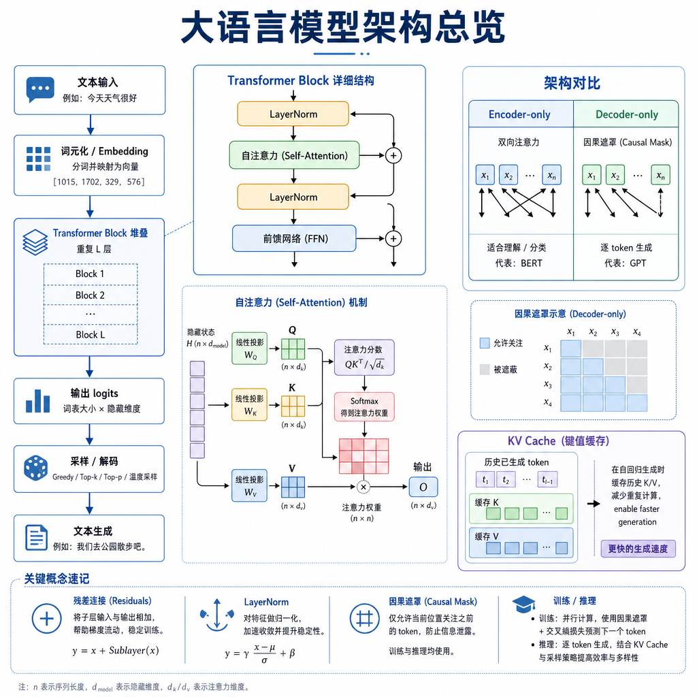

# 大模型基本框架

大模型基本框架是 Agent 开发的认知底座。理解 Transformer、注意力、模型结构和 KV 缓存，才能解释大模型为什么能理解、生成和推理。

## 考点目录

- [Transformer 架构和核心组件](01-Transformer架构和核心组件.md)
- [自注意力机制](02-自注意力机制.md)
- [Encoder-Only 和 Decoder-Only 代表模型及区别](03-Encoder-Only和Decoder-Only模型区别.md)
- [大模型从输入文本到输出文本的运行机制](04-大模型输入到输出运行机制.md)
- [KV 缓存](05-KV缓存.md)

---

[返回总目录](../README.md)
