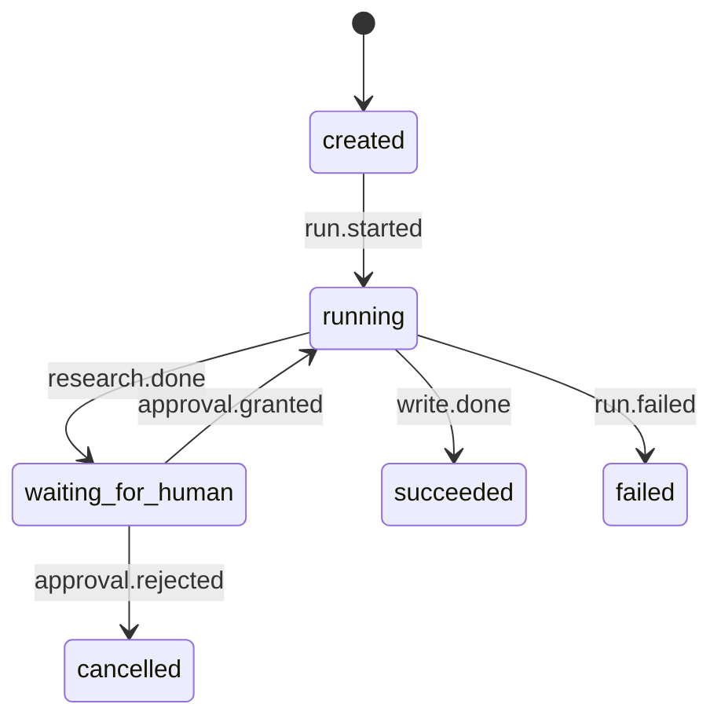
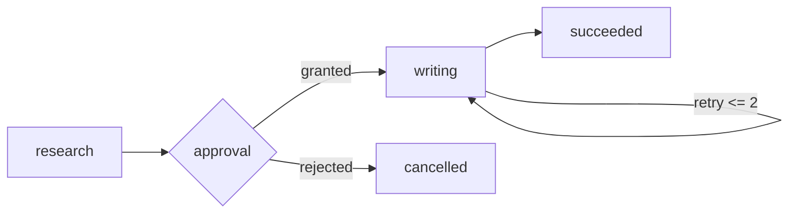

# 第五课：状态机与 Workflow

> 目标：把“下一步做什么”从散落的 `if/else` 提炼为可检查、可恢复的状态机。

> 语言说明：代码只用于表达 State/Event 关系；先理解转移规则，再看 Python 语法。

本课先不引入复杂框架。你会用 Python 的不可变 `State`、明确的 `Event` 和一张转移表，完成一个可以拒绝非法操作、能够重放审计的最小 Workflow。

## 前置依赖

先阅读 [01 Runtime 的地基](01-runtime-foundation.md)，理解 `Task`、`Run` 和任务生命周期；同时熟悉 Python 的 `dataclass`、枚举和异常处理。

课程目录在 [README](README.md)。上一课是 [04 Queue、Scheduler 与 Worker](04-queue-scheduler-worker.md)，本课下一站是 [06 Agent Runtime](06-agent-runtime.md)。

## 1. 为什么需要这个抽象

研究助理收到问题后，可能要检索资料、整理草稿、请求审批，再生成答案。最初的实现往往只有几个布尔变量：`is_running`、`is_approved`、`is_done`。

问题不是变量少，而是组合没有被约束。下面任何组合都可能被程序意外构造：

```text
is_running=True, is_done=True
is_approved=False, 但已发送最终答案
tool_failed=True, 但下一节点仍然写库
```

如果把流程写成许多互相调用的 `if/else`，恢复时还要猜“上次到底走到哪里”。状态机的因果链是：

```text
非法组合难以观察
  -> 把可见事实收敛成有限 State
  -> 把发生过的事情命名为 Event
  -> 用 (State, Event) 查转移表
  -> 非法边在执行前被拒绝
  -> Event + Checkpoint 可以审计和恢复
```

这里的“状态”不是一个随意的字符串，而是当前事实；“事件”不是命令，而是已经发生的事实。`approval.granted` 表示审批已授予，`please_approve` 才是请求，不应混用。

## 2. 统一术语与责任边界

全课程的 Run 生命周期状态名固定为：`created`、`queued`、`running`、`waiting_for_tool`、`waiting_for_human`、`succeeded`、`failed`、`cancelled`。

`research`、`writing` 是 Workflow 子步骤，不是 Run 生命周期状态；`resumed` 只出现在 `run.resumed` Event 中。

| 层 | 核心对象 | 它回答的问题 |
| --- | --- | --- |
| 数据层 | `State` | 当前已经确定的事实是什么？ |
| 事实层 | `Event` | 哪个事实刚刚发生？ |
| 转移层 | 转移表/纯函数 | 这个事实在当前状态下合法吗？ |
| 执行层 | `Run` | 哪一次 Task 正在经历这些变化？ |
| 编排层 | `Workflow` | 节点、分支、重试和终止条件如何连接？ |
| 持久化层 | `Checkpoint` | 崩溃后从哪个 State 和位置继续？ |

统一对象仍然遵循 [README](README.md) 的定义：`Task` 是逻辑任务，`Run` 是一次执行，`State` 是当前结构化事实，`Event` 是已发生事实，`Tool` 是受约束的外部能力，`Checkpoint` 是可恢复快照。

## 3. State、Event 和转移表

### 3.1 State 应该保存什么

一个最小 State 至少要能决定控制流，并能解释为什么做出下一步。常见字段有：

```text
run_id       关联哪一次 Run
status       当前生命周期状态
workflow_step 当前业务节点
events       或事件序列号/版本
answer       已产生的业务结果
```

不要把所有日志都塞进 State。大日志放 Event Store，State 只保留恢复和决策需要的摘要或引用。

### 3.2 Event 是事实，不是意图

事件应该使用过去时或完成时语义：`run.started`、`research.done`、`tool.call.finished`、`approval.granted`。

事件最少应带 `run_id`、事件名、发生时间、幂等键和版本。生产系统还会带 `event_id`、操作者、输入摘要和结果状态。

### 3.3 转移表就是可读的规则

用 `(当前状态, Event)` 作为键，值为 `(下一状态, 下一节点)`。查不到键就拒绝，而不是“尽量继续”。这条拒绝边是安全边界，也是测试入口。



## 4. 纯函数和副作用为什么要分离

如果 `transition(state, event)` 同时发送邮件、扣款或写数据库，重放事件就会重复执行这些不可逆操作。更稳的因果链是：

```text
收到 Event
  -> 纯函数计算 next_state
  -> 校验版本并写入 Event/Checkpoint
  -> Runtime 根据 next_state 安排副作用
  -> 副作用使用 run_id + step + event_id 幂等
```

纯函数的核心不变量是：相同 State 加相同 Event，结果相同；不会偷偷读取当前时间、随机数或网络。

副作用节点可以失败，但失败必须通过明确的 `run.failed`、`tool.call.failed` 等 Event 回到状态机，不能半途修改一半字段。

## 5. 最小可运行示例

下面代码与实验 [labs/05_state_machine_workflow.py](labs/05_state_machine_workflow.py) 使用同一组 `Status`、`State`、`RULES` 和 `transition`。

```python
from dataclasses import dataclass, replace
from enum import Enum

class Status(str, Enum):
    CREATED = "created"
    RUNNING = "running"
    WAITING_HUMAN = "waiting_for_human"
    SUCCEEDED = "succeeded"
    FAILED = "failed"

@dataclass(frozen=True)
class State:
    run_id: str = "run-05"
    status: Status = Status.CREATED
    workflow_step: str = "research"
    events: tuple[str, ...] = ()
    answer: str = ""

RULES = {
    (Status.CREATED, "run.started"): (Status.RUNNING, "research"),
    (Status.RUNNING, "research.done"): (Status.WAITING_HUMAN, "research"),
    (Status.WAITING_HUMAN, "approval.granted"): (Status.RUNNING, "writing"),
    (Status.RUNNING, "write.done"): (Status.SUCCEEDED, "writing"),
}

def transition(state: State, event: str) -> State:
    key = (state.status, event)
    if key not in RULES:
        raise ValueError(f"illegal transition {state.status.value} + {event}")
    next_status, workflow_step = RULES[key]
    return replace(state, status=next_status,
                   workflow_step=workflow_step,
                   events=state.events + (event,))

state = State()
for event in ("run.started", "research.done",
              "approval.granted", "write.done"):
    state = transition(state, event)
print(state.status.value, state.events)
```

注意 `@dataclass(frozen=True)` 只保证这个对象不能原地改字段；它不负责数据库事务，也不自动保证并发安全。`replace` 产生新 State，便于比较前后版本。

## 6. 一轮执行的逐步时序

以“研究后等待人工审批”为例，Runtime 可以按下面顺序执行：

1. API 创建 `Task`，Runtime 分配 `run_id`，初始 State 为 `created`。
2. Scheduler 投递 `run.started`，纯函数把状态变为 `running/research`。
3. 研究节点调用只读 Tool；Tool 结果先写 `tool.call.finished` Event。
4. Workflow 读取结果并产生 `research.done`，状态变为 `waiting_for_human`。
5. Runtime 写 Checkpoint，保存 State、`workflow_step=research` 和版本号，然后释放 Worker。
6. 人工系统稍后发送 `approval.granted`，Runtime 从 Checkpoint 恢复并转为 `running/writing`。
7. 写作节点成功后产生 `write.done`，状态变为 `succeeded`，Run 结束。

如果第 3 步失败，不能伪造 `research.done`；应该记录失败 Event，再根据重试策略进入 `running` 重试或 `failed` 终止。

## 7. Workflow、DAG 与循环

Workflow 是节点和边的业务编排。没有分支时，它近似一条线；有并行时通常表示为 DAG（有向无环图）。DAG 的“不成环”让拓扑顺序可计算，但重试、人工等待和 Agent 循环会引入回边，因此必须显式标记可重复节点和最大次数。



并行分支还要定义 join 不变量：必须全部完成、任一失败即失败，或允许部分结果。没有 join 规则，恢复时无法判断 Workflow 是否完整。

## 8. 失败窗口与如何观测

### 窗口 A：副作用已完成，Checkpoint 未写入

研究 Tool 已经扣了配额，但进程在保存 Checkpoint 前崩溃。恢复后重复执行会双扣。解决办法是让副作用带幂等键，并记录“已提交”的事实；不能只依赖内存变量。

### 窗口 B：Event 到达两次

网络重试可能重复投递 `approval.granted`。状态机应使用 `event_id` 去重，或把状态版本作为条件更新；已应用的事件重放必须返回同一结果而不是再次触发副作用。

### 窗口 C：并发 Worker 使用旧 State

两个 Worker 都看到 `running`，一个写入 `succeeded`，另一个又写入 `failed`。使用单调递增 `state_version` 做 compare-and-set，拒绝旧版本提交，并把冲突记为 Event。

### 窗口 D：人工拒绝没有边

如果转移表只有 `approval.granted`，收到 `approval.rejected` 时必须明确进入 `cancelled` 或 `failed`；“忽略”会让 Run 永远停在 `waiting_for_human`。

## 9. 常见误区

- 把 `State` 当日志：状态只保留当前事实，完整轨迹由 Event 记录。
- 把 Event 当命令：`approval.granted` 是事实，不是“请批准”的请求。
- 用异常代替所有状态：异常是控制流信号，仍需要可审计的 `run.failed` Event。
- 认为框架自动恢复：Step Functions、Temporal 等框架提供映射和持久化机制，但不能替你决定业务不变量、幂等边界和审批语义。
- 把 DAG 当成必须无重试的图：重试边应有次数、退避和最终失败出口。

## 10. 实验映射与练习

运行实验：

```powershell
python 03-Agent-Runtime/labs/05_state_machine_workflow.py
```

实验中的 `RULES` 对应本文的转移表，`transition` 对应纯函数，`events` 对应最小审计轨迹；实验没有真实数据库和副作用，因此只是教学模型。

练习 1：给实验增加 `approval.rejected -> cancelled`。答案思路：先扩展 `Status`，再增加唯一转移边，最后为非法重复审批写断言。

练习 2：让 `write.done` 带答案文本，但不改变 `transition` 的纯函数性质。答案思路：把文本作为事件 payload，并让新 State 保存结果；不要在函数内部调用网络或打印邮件。

练习 3：设计两个并行研究分支的 join。答案思路：增加分支标识和完成集合，只有满足预先声明的 join 条件才产生 `research.done`。

练习 4：模拟同一个事件重放。答案思路：加入 `event_id` 或事件序列号，重复输入返回已保存 State，不再次运行副作用。

## 11. 四个复述问题

1. 谁决定下一步执行什么？转移表和 Workflow 规则决定，模型或外部输入只能提出 Event。
2. 当前状态保存在哪里？内存中的 State 只是运行副本，可靠版本应写入 Checkpoint。
3. 任务失败后怎么办？记录失败 Event，根据幂等性选择重试、等待人工或进入 `failed`。
4. 外部能力通过什么边界被调用？通过 Tool 接口；状态转移本身不直接触碰外部系统。

## 官方资料

- [Python dataclasses](https://docs.python.org/3/library/dataclasses.html)
- [AWS Step Functions：State machine concepts](https://docs.aws.amazon.com/step-functions/latest/dg/concepts-states.html)
- [Temporal Workflows 官方文档](https://docs.temporal.io/workflows)

下一课 [06 Agent Runtime](06-agent-runtime.md) 会把“代码决定下一步”扩展成“模型提出 Decision，Runtime 决定是否接受”。
