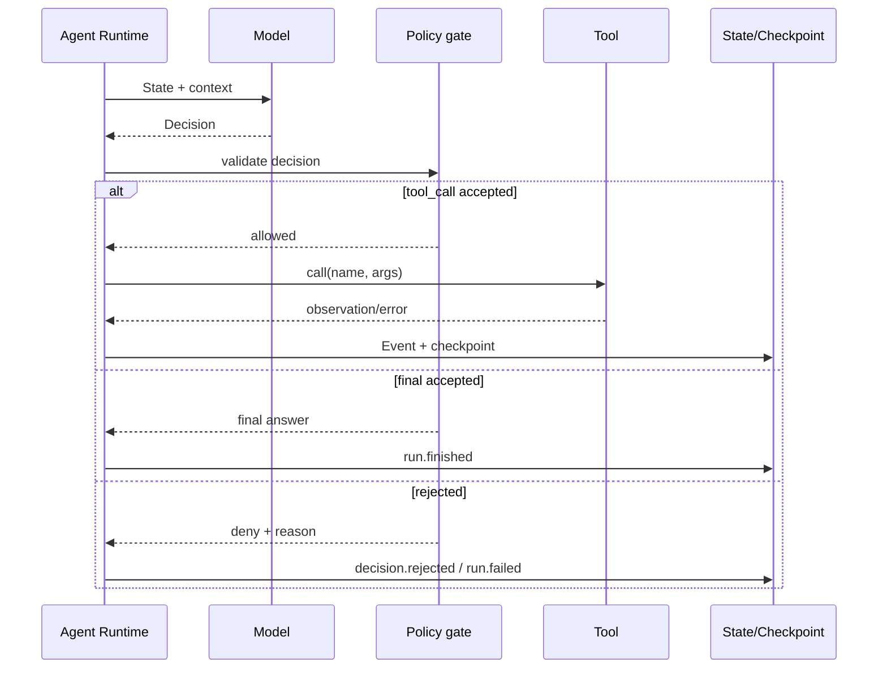
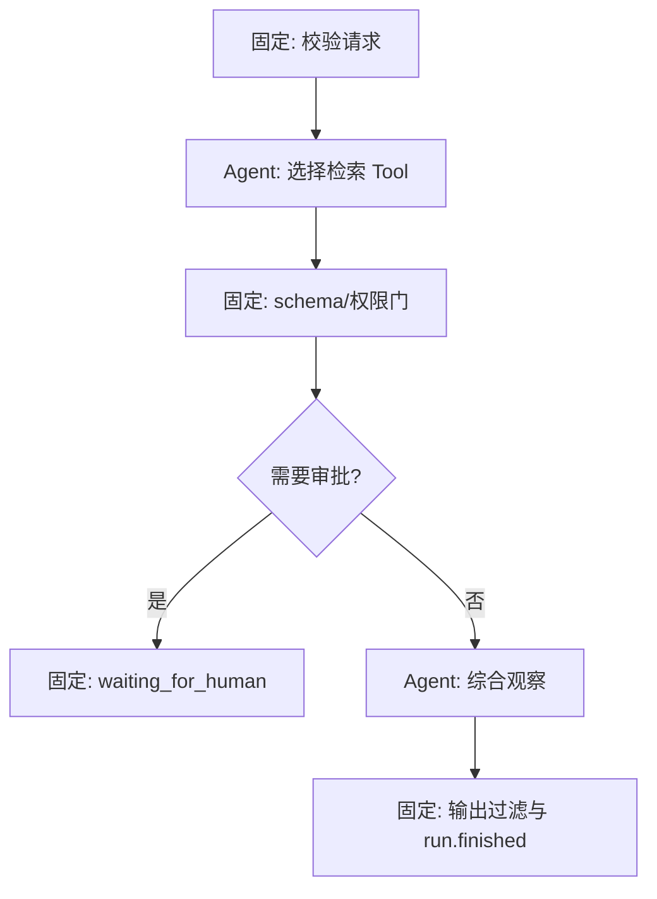

# 第六课：Agent Runtime

> 目标：理解模型决策循环如何被 `Run`、`State`、`Tool` 和停止条件约束。

> 语言说明：这里的 mock 模型可以用任何语言实现；关键是“模型提议，Runtime 校验和执行”。

本课把上一课的固定 Workflow 向前推进一步：下一节点不再完全写死，而由模型根据上下文提出一个候选 `Decision`。关键仍然是边界：模型提出建议，Runtime 验证、授权、执行、记录并决定是否继续。

## 前置依赖

阅读 [05 状态机与 Workflow](05-state-machine-workflow.md)，掌握合法状态转换；阅读 [01 Runtime 的地基](01-runtime-foundation.md)，理解一次 `Run` 的生命周期。

课程目录在 [README](README.md)。上一课是状态机，本课下一站是 [07 MCP 与 Tool Runtime](07-mcp-tool-runtime.md)。

## 1. 为什么需要 Agent Runtime

普通 Workflow 的下一步由代码写死，例如“研究完成后写作”。开放式问题常常需要根据资料质量、用户目标和工具结果动态选择：再搜索一次、直接回答、请求人工确认，还是结束。

把模型直接放进 `while` 循环会产生新的风险：模型可能输出不存在的工具、错误参数、无限调用或把“建议结束”当成“已经成功”。因此需要一层 Agent Runtime。

因果链如下：

```text
任务路径不确定
  -> 模型根据 State 提出候选 Decision
  -> Runtime 解析结构化输出
  -> 策略门检查工具、参数、权限、预算和当前状态
  -> 执行 Tool 或写入最终答案
  -> 记录 Event/Checkpoint
  -> 满足停止条件才结束，否则进入下一轮
```

模型不是 Runtime，也不是权限系统。把系统提示词写得再长，也不能替代代码检查。

## 2. 概念分层

| 对象 | 说明 | 必须由谁验证 |
| --- | --- | --- |
| `Task` | 用户提交的逻辑任务定义，可被多次执行 | API 层 |
| `Run` | 某个 Task 的一次执行实例，带唯一 `run_id` | Runtime |
| `State` | 消息、工具观察、计划和计数器 | Runtime |
| `Decision` | 模型提出的下一步候选 | Runtime + 策略 |
| `Tool` | 有边界的外部能力 | Tool Gateway |
| `Event` | 决策、调用、结果和错误的事实 | Event Store |
| `Checkpoint` | State、下一位置和版本的恢复快照 | 持久化层 |

统一术语仍以 [README](README.md) 为准。`waiting_for_tool` 表示 Runtime 正在等待外部能力，不是模型已经完成；`waiting_for_human` 表示需要审批或补充信息。

## 3. Decision 的最小数据结构

不要把模型返回的任意 JSON 直接交给执行器。先解析为有限的判别联合（discriminated union），例如：

```text
Decision(type="tool_call", name, args)
Decision(type="final", content)
Decision(type="ask_human", question)
Decision(type="stop", reason)
```

每个变体都有不同不变量：

- `tool_call` 必须有允许的 `name`，`args` 必须通过该 Tool 的 schema。
- `final` 必须有非空内容，且当前 Run 没有未处理的强制审批。
- `ask_human` 必须说明等待原因，并进入 `waiting_for_human`。
- `stop` 只能结束安全的终止路径；预算耗尽应由 Runtime 产生 `run.failed` 或 `cancelled`，不能伪装成成功。

## 4. Model loop 的时序



逐步看一轮：

1. Runtime 从 Checkpoint 取得当前 State，裁剪上下文并附加预算信息。
2. 模型只读到输入，返回结构化 Decision；这一步没有权限改变 State。
3. Runtime 校验 JSON 形状、类型和最大长度，解析失败就记录 `decision.invalid`。
4. 策略门检查 Tool allow-list、租户权限、参数 schema、循环次数和超时上限。
5. 通过后把 Run 置为 `waiting_for_tool`，调用 Tool；结果写成观察并恢复为 `running`。
6. 每轮保存 Checkpoint，再把新 State 送回模型。
7. `final`、预算耗尽、取消信号、不可恢复错误或人工等待会结束当前循环。

## 5. 停止条件与资源预算

至少同时设置以下边界：

| 边界 | 保护对象 | 超限结果 |
| --- | --- | --- |
| `max_steps` | CPU、费用、工具次数 | `run.failed` 或请求人工 |
| 单次 Tool timeout | Worker 占用 | 记录超时，按策略重试/失败 |
| token/context budget | 模型上下文和费用 | 压缩、等待人工或失败 |
| wall-clock deadline | 端到端延迟 | 取消 Run |
| output size limit | State、日志和下游解析 | 截断并记录，或拒绝 |

停止条件必须由 Runtime 计数，不能让模型自己声明“我已经循环够了”。成功结束的必要条件应是：有合法最终答案、状态转移到 `succeeded`，并写下 `run.finished`。

## 6. 策略门：模型输出不可信

策略门至少检查四层：

1. **结构层**：`type` 是否是允许枚举，字段是否齐全，字符串是否超长。
2. **能力层**：Tool 名称是否在本 Run 的 allow-list，参数是否符合 schema。
3. **资源层**：步骤、token、超时和并发预算是否足够。
4. **业务层**：当前 State 是否允许这个动作，例如未审批不能发消息。

失败的 Decision 也应成为事实。建议记录 `decision.created`、`decision.rejected`，而不是只打印异常；这样才能区分模型质量问题、权限问题和 Tool 故障。

## 7. 可运行 mock 示例

下面代码与实验 [labs/06_agent_runtime_mock.py](labs/06_agent_runtime_mock.py) 使用同一行为：第一次调用 `search.mock`，得到观察后返回 final。它不需要模型或网络。

```python
from dataclasses import dataclass, field

@dataclass(frozen=True)
class Task:
    question: str

@dataclass
class State:
    question: str
    observations: list[str] = field(default_factory=list)
    answer: str = ""
    steps: int = 0
    status: str = "created"

@dataclass
class Run:
    run_id: str
    task: Task
    state: State

def mock_model(state: State) -> dict:
    if not state.observations:
        return {"type": "tool_call", "name": "search.mock",
                "args": {"q": state.question}}
    return {"type": "final", "content": "答案来自本地 mock 观察。"}

def call_tool(name: str, args: dict) -> str:
    if name != "search.mock" or not isinstance(args.get("q"), str):
        raise ValueError("tool denied or invalid arguments")
    return f"mock observation for: {args['q']}"

def run(question: str, max_steps: int = 3) -> Run:
    task = Task(question)
    state = State(task.question)
    run = Run("run-06", task, state)
    state.status = "running"
    while not state.answer and state.steps < max_steps:
        state.steps += 1
        decision = mock_model(state)
        if decision["type"] == "tool_call":
            if decision["name"] != "search.mock":
                raise ValueError("tool not allowed")
            state.status = "waiting_for_tool"
            state.observations.append(call_tool(decision["name"], decision["args"]))
            state.status = "running"
        elif decision["type"] == "final":
            state.answer = decision["content"]
            state.status = "succeeded"
        else:
            raise ValueError("unknown decision")
    if not state.answer:
        raise TimeoutError("step budget exhausted")
    run.state = state
    return run
```

实验脚本额外打印 `run.created`、`tool.call.started`、`tool.call.finished` 和 `checkpoint.saved`，帮助你把内存变量映射回事件轨迹。教学代码没有真正的 Checkpoint，因此崩溃后不能恢复，这是刻意保留的下一课问题。

## 8. Agent 与固定 Workflow 的混合

不要把所有事情都交给 Agent。稳定、合规的步骤应由 Workflow 固定；需要开放式选择的节点才交给模型：



这种混合方式保留 Workflow 的可预测边界，又利用 Agent 处理开放问题。框架（Agents SDK、LangGraph 等）只是这些数据结构、循环和策略门的映射，不会自动替你设计业务停止条件。

## 9. 具体失败窗口

### 窗口 A：Tool 已成功，Checkpoint 保存失败

模型下一轮看不到观察，可能再次调用会收费的 Tool。必须为 Tool 调用设置幂等键（如 `run_id + step + decision_hash`），并在恢复时先查调用结果。

### 窗口 B：模型返回未知 Tool

如果执行器把 `name` 拼接成函数名或 shell 命令，就形成任意代码执行风险。策略门应在网络调用前拒绝，并记录 `decision.rejected`。

### 窗口 C：模型永远返回 tool_call

没有 `max_steps` 或 wall-clock deadline 时，循环会耗尽费用并阻塞 Worker。超限要进入可观测的失败状态，而不是静默退出。

### 窗口 D：观察结果无限变长

网页或 Tool 返回超大文本会撑爆上下文。入口限制字节数，保存原文引用，把摘要或截断内容放入 State，并记录被截断的原因。

## 10. 常见误区

- 以为模型的 JSON 天然可靠：仍需解析、schema 和业务验证。
- 把系统提示词当权限边界：真正的 allow-list 和审批必须在 Runtime。
- 只有成功/失败两个状态：等待 Tool、人工和取消都是可恢复事实。
- 只记录最终答案：没有 Decision、Tool 结果和 Checkpoint，就无法复盘。
- 让每个节点都 Agent 化：固定规则越多越应该由 Workflow 控制，Agent 只处理不确定性。
- 把框架 API 当原理：先画 `State -> Decision -> Policy -> Tool -> Event`，再学习框架如何映射它。

## 11. 实验映射与练习

运行实验：

```powershell
python 03-Agent-Runtime/labs/06_agent_runtime_mock.py
```

`mock_model` 对应模型，`call_tool` 对应 Tool Gateway，`state.steps` 对应步数预算，打印的事件对应本文时序。它没有真实模型、网络、并发和持久化，不能证明生产安全性。

练习 1：让 mock 每次都返回 `tool_call`。答案思路：不要改循环出口，只改变模型策略，观察 `max_steps` 如何触发 `TimeoutError`。

练习 2：增加 `ask_human` Decision。答案思路：先定义等待状态和问题字段，再让 Runtime 保存 Checkpoint；恢复时由外部 Event 重新进入循环。

练习 3：限制观察结果为 100 个字符。答案思路：在 `call_tool` 返回后统一做大小检查并记录截断 Event，不要让模型自行决定限制。

练习 4：加入 `decision_id` 和重复检测。答案思路：把 Decision 作为事实写入 Event Store，恢复时同一 `decision_id` 只产生一次 Tool 调用。

## 12. 四个复述问题
1. 谁决定下一步执行什么？模型提出 Decision，Runtime 的策略门决定是否接受。
2. 当前状态保存在哪里？State 是运行态，Checkpoint 保存可恢复版本，Event 保存决策和结果轨迹。
3. 任务失败后怎么办？区分 Decision 拒绝、Tool 失败、预算耗尽和不可恢复错误，再分别重试、等待或失败。
4. 外部能力通过什么边界被调用？经过 Tool allow-list、参数 schema、超时和审计的 Tool Gateway。

## 官方资料
- [OpenAI Responses API 参考](https://platform.openai.com/docs/api-reference/responses)
- [OpenAI Agents SDK 官方文档](https://openai.github.io/openai-agents-python/)
- [OWASP Top 10 for LLM Applications](https://owasp.org/www-project-top-10-for-large-language-model-applications/)
下一课 [07 MCP 与 Tool Runtime](07-mcp-tool-runtime.md) 会把本课的 Tool Gateway 放到 Host、Client、Server 和 JSON-RPC 协议边界中。
