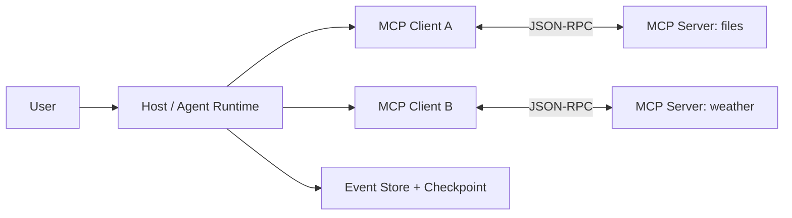
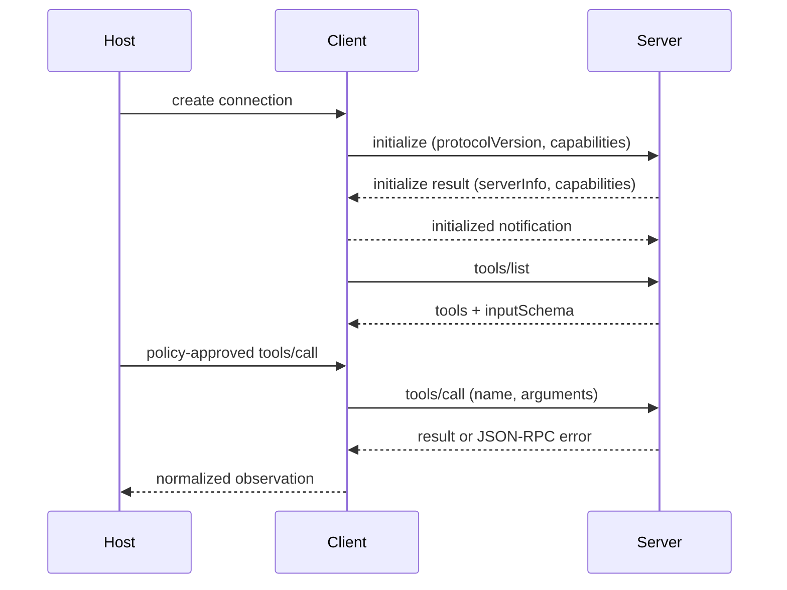

# 第七课：MCP 与 Tool Runtime

> 目标：把“模型能调用什么”变成可发现、可校验、可授权的 Tool 边界。

> 语言说明：Python mock 只帮助观察协议消息；MCP 本身与编程语言无关。

本课把 [06 Agent Runtime](06-agent-runtime.md) 的 Tool Gateway 放到一个协议里观察。你会看到 Host、Client、Server 如何分工，`initialize` 和能力发现为什么先于 `tools/call`，以及 stdio、Streamable HTTP、JSON-RPC 各自解决什么问题。

## 前置依赖

阅读 [06 Agent Runtime](06-agent-runtime.md)，理解模型决策必须经过 Runtime 验证；熟悉 JSON、JSON Schema 和进程标准输入输出。

课程目录在 [README](README.md)。上一课是 Agent 决策循环，本课下一站是 [08 Checkpoint 与 Durable Execution](08-durable-execution.md)。

## 1. 为什么需要 MCP

如果每个 Agent 都硬编码搜索、文件、数据库和企业系统，参数格式、能力发现、超时和错误处理会各自不同。换一个模型或客户端，就要重新写一套适配器。

MCP（Model Context Protocol）把“如何发现和调用上下文能力”标准化。它解决的是协议边界，不是完整的安全或调度系统。因果链是：

```text
工具各自定义接口
  -> 客户端无法预先知道能力
  -> 用 initialize 协商协议和能力
  -> tools/list 发现名称与 inputSchema
  -> Runtime 做权限、参数、预算检查
  -> tools/call 发送 JSON-RPC 请求
  -> result 回填为 State 观察并记录 Event
```

因此“能发现”不等于“能调用”。描述是给模型和客户端看的，授权仍然由 Host/Runtime 决定。

## 2. Host、Client、Server 三个角色

| 角色 | 责任 | 不应该假设 |
| --- | --- | --- |
| Host | 面向用户的应用和策略边界，管理多个 Client、用户同意和审计 | 不应把 Server 当成可信沙箱 |
| Client | 代表 Host 与一个 Server 建立连接，发送 JSON-RPC、匹配 `id`、处理传输 | 不应绕过 Host 的权限决定 |
| Server | 暴露工具、资源或提示，并执行自己的参数和业务校验 | 不应相信调用方已完成所有校验 |

一个 Host 可以连接多个 Server；一个 Client 通常对应一个 Server 会话。`Task`、`Run`、`State`、`Event`、`Tool`、`Checkpoint` 的课程定义仍保持不变。



## 3. 一次会话的逐步时序

下面是教学上最重要的顺序；真实版本还会有通知、取消和分页。



### 3.1 `initialize`

连接建立后，Client 发送 `initialize`，通常带协议版本、Client 信息和 Client 能力；Server 返回选定版本、Server 信息和 Server 能力。双方再用 `notifications/initialized` 表示初始化完成。

如果版本不兼容，Client 应停止会话并记录协议错误，而不是试着猜字段。能力声明只说明“支持哪些方法或通知”，不表示业务授权。

### 3.2 `tools/list`

Client 请求可用工具。每个 Tool 至少有 `name`、`description` 和 `inputSchema`。列表要缓存版本，但不能永久信任：Server 能力变化或租户切换时需要重新发现。

### 3.3 `tools/call`

Runtime 先在本地检查 allow-list、用户授权、参数类型、输入大小、超时和预算，再由 Client 发送 `tools/call`。不要因为 Server 自称安全就跳过 Host 策略门。

### 3.4 结果回填

Server 成功结果通常是 content envelope，例如 text、image 或 resource。Client 把它关联到请求 `id`，Host 再转换成 `tool.call.finished` Event 和 State observation。只有回填成功并保存 Checkpoint，Agent 才应进入下一轮。

## 4. JSON-RPC 的最小规则

JSON-RPC 2.0 请求包含 `jsonrpc`、客户端生成的 `id`、`method` 和可选 `params`；响应携带同一个 `id`，且二选一：`result` 或 `error`。通知没有 `id`，因此不期待响应。

```json
{"jsonrpc":"2.0","id":7,"method":"tools/list","params":{}}
```

```json
{"jsonrpc":"2.0","id":7,"result":{"tools":[{"name":"weather.mock","inputSchema":{"type":"object"}}]}}
```

不要按响应到达顺序配对；必须按 `id` 配对，因为 HTTP 或异步传输可以并发请求。

## 5. stdio 与 Streamable HTTP

### stdio

本地 Host 启动 Server 子进程，通过 stdin 写 JSON-RPC、从 stdout 读消息。stdout 只能输出协议消息；调试日志必须写 stderr，否则会污染解析流。

优点是部署简单、进程隔离边界清楚；缺点是生命周期由 Host 管理，本地权限和环境变量仍可能很宽。

### Streamable HTTP

远程或长生命周期 Server 可以通过 HTTP 提供 MCP 传输。客户端需要处理连接超时、身份认证、TLS、响应流、重试和服务器不可用。HTTP 可达不代表用户已授权，认证和 Tool allow-list 仍属于 Host/Runtime。

两种传输都是承载 JSON-RPC 的方式，不改变 `initialize`、`tools/list`、`tools/call` 的语义。不要把“换成 HTTP”误认为自动获得沙箱或审计。

## 6. 权限和错误层次

把错误分成至少四层，才能决定是否重试：

| 层次 | 例子 | 责任方 | 默认动作 |
| --- | --- | --- | --- |
| 协议 | JSON 无法解析、`id` 丢失 | Client/Server | 不重试同一坏请求，记录并断开或修复 |
| RPC | method 不存在、invalid params | Server/Client | 修正请求或拒绝 |
| 策略 | 用户未授权、Tool 不在 allow-list | Host/Runtime | 不发送调用，等待授权或失败 |
| 业务 | 天气服务限流、文件不存在 | Server/Tool | 按幂等性退避重试或返回业务错误 |

高风险 Tool（写文件、发消息、付款）需要人工审批或双重授权。Tool 输入限制类型、大小和路径；输出也要限制大小，防止上下文和日志被撑爆。

## 7. 协议启发的本地 mock

下面 mock 只模拟 MCP 的数据形状，不实现完整握手、传输、分页、认证或取消。它的目的是让初学者看见“发现 -> 授权 -> 调用 -> 回填”的数据流。

```python
import json

TOOLS = {
    "weather.mock": {
        "description": "返回固定天气",
        "inputSchema": {"type": "object", "required": ["city"]},
    }
}

TOOL_LIST = [{"name": name, **descriptor}
             for name, descriptor in TOOLS.items()]

def list_tools() -> dict:
    return {"jsonrpc": "2.0", "id": 1,
            "result": {"tools": TOOL_LIST}}

def call_tool(name: str, arguments: dict, allowed: set[str]) -> dict:
    if name not in allowed or name not in TOOLS:
        return {"jsonrpc": "2.0", "id": 2,
                "error": {"code": -32001,
                           "message": "tool_not_allowed"}}
    city = arguments.get("city")
    if not isinstance(city, str) or not city:
        return {"jsonrpc": "2.0", "id": 2,
                "error": {"code": -32602,
                           "message": "invalid_arguments"}}
    return {"jsonrpc": "2.0", "id": 2,
            "result": {"content": [{"type": "text",
                                      "text": f"{city}: 25C (mock)"}],
                       "isError": False}}

discovered = list_tools()
request = {"name": "weather.mock", "arguments": {"city": "Shanghai"}}
result = call_tool(request["name"], request["arguments"], {"weather.mock"})
print(json.dumps({"discovered": discovered, "result": result},
                 ensure_ascii=False))
```

实验 [labs/07_mcp_like_tool_runtime.py](labs/07_mcp_like_tool_runtime.py) 还打印 `tool.discovered`、`tool.call.started`、`tool.call.finished` 和拒绝未知 Tool 的事件。它没有真实 Server 进程、stdio/HTTP 传输或协议版本协商，所以不能称为完整 MCP 实现。

## 8. 从模型提议到结果回填的完整时序

1. Agent Runtime 从 `tools/list` 缓存建立可用能力表。
2. 模型提出 `Decision(type="tool_call", name="weather.mock", args=...)`。
3. Host 根据用户、租户和 Run 策略检查 name；失败则写 `tool.denied`，不发网络请求。
4. Client 校验 `args` 的 JSON 类型和大小，生成唯一 JSON-RPC `id`。
5. Client 发送 `tools/call`，Run 进入 `waiting_for_tool`，并写 `tool.call.started`。
6. Server 校验业务参数并执行；成功返回 content，失败返回 RPC 或业务错误。
7. Client 按 `id` 配对响应，把结果规范化为 observation；敏感字段先脱敏。
8. Host 写 `tool.call.finished` 或 `tool.call.failed`，保存 Checkpoint，再把 observation 交给下一轮模型。

## 9. 具体失败窗口

### 窗口 A：stdout 被日志污染

stdio Server 把调试文本打印到 stdout，Client 解析到半行 JSON 就失败。日志必须写 stderr，协议帧和日志要分流。

### 窗口 B：响应 `id` 错配

并发请求中 Client 按到达顺序而不是 `id` 回填，天气结果可能被写入文件 Tool 的 State。必须维护 pending map，并在超时/取消时清理对应 `id`。

### 窗口 C：发现后权限变化

`tools/list` 时用户有权限，实际调用时租户策略已经撤销。每次 call 仍需 Host 侧授权检查，不能只信缓存。

### 窗口 D：Server 执行完成，客户端断线

Tool 已经发送消息，但 Client 没收到结果。重试前先判断 Tool 是否幂等，或用调用幂等键查询状态，避免重复发信。

### 窗口 E：业务错误被当协议错误

天气上游限流不代表 JSON-RPC 失效。保留错误层次，才能选择退避重试而不是重建整个会话。

## 10. 常见误区

- 认为 MCP 是沙箱：协议不限制 Server 能读写的操作，仍要隔离进程、凭据和路径。
- 认为 `tools/list` 就是授权：列表是能力发现，授权来自 Host/Runtime。
- 把 mock 当完整 MCP：本地字典没有握手、传输、版本、取消、认证和真实错误语义。
- 把 description 当 schema：自然语言帮助模型，程序必须校验 `inputSchema` 和业务不变量。
- 把 Server 在本机当作可信：本机进程仍可能读到环境变量和文件，需最小权限。
- 只记录“调用成功”：至少记录 Tool 名、请求 id、耗时、错误层次和脱敏后的结果摘要。

## 11. 实验映射与练习

运行实验：

```powershell
python 03-Agent-Runtime/labs/07_mcp_like_tool_runtime.py
```

`list_tools` 对应 `tools/list`，`call_tool` 对应策略门之后的 `tools/call`，`TOOL_LIST` 对应能力发现结果；实验使用固定天气，避免真实网络和隐私泄露。

练习 1：给 mock 增加 `initialize` 返回版本和 capabilities。答案思路：先定义握手消息，再在 `list_tools` 前检查初始化完成标志。

练习 2：让两个请求并发返回，验证按 `id` 配对。答案思路：用 `pending[id]` 保存请求上下文，故意让响应顺序反转。

练习 3：区分“未授权”和“参数错误”。答案思路：权限拒绝在发送前产生 `tool.denied`，参数错误可由 Client 或 Server 产生不同错误码。

练习 4：加入输出长度限制和脱敏。答案思路：在结果回填到 State 前统一处理，并记录原始结果的引用而非敏感正文。

练习 5：把 mock 改为 subprocess stdio。答案思路：保证 stdout 只有 JSON-RPC，stderr 承载日志，并实现按行读取与超时。

## 12. 四个复述问题

1. 谁决定下一步执行什么？模型提出 Tool Decision，Host/Runtime 决定是否授权，Client 负责协议发送。
2. 当前状态保存在哪里？Run 的 State 和 Tool observation 最终进入 Checkpoint，Event 保存发现、调用和结果事实。
3. 任务失败后怎么办？按协议、策略、RPC、业务四层错误分别修复、拒绝、重试或失败。
4. 外部能力通过什么边界被调用？通过 Host 策略门、MCP Client、JSON-RPC 和 Server 的双重参数校验。

## 官方资料

- [Model Context Protocol Specification](https://modelcontextprotocol.io/specification)
- [MCP Tools 概念文档](https://modelcontextprotocol.io/docs/concepts/tools)
- [JSON-RPC 2.0 Specification](https://www.jsonrpc.org/specification)

下一课 [08 Checkpoint 与 Durable Execution](08-durable-execution.md) 会处理本课留下的关键问题：Tool 已执行但进程崩溃时，怎样从可靠进度继续而不重复副作用。
