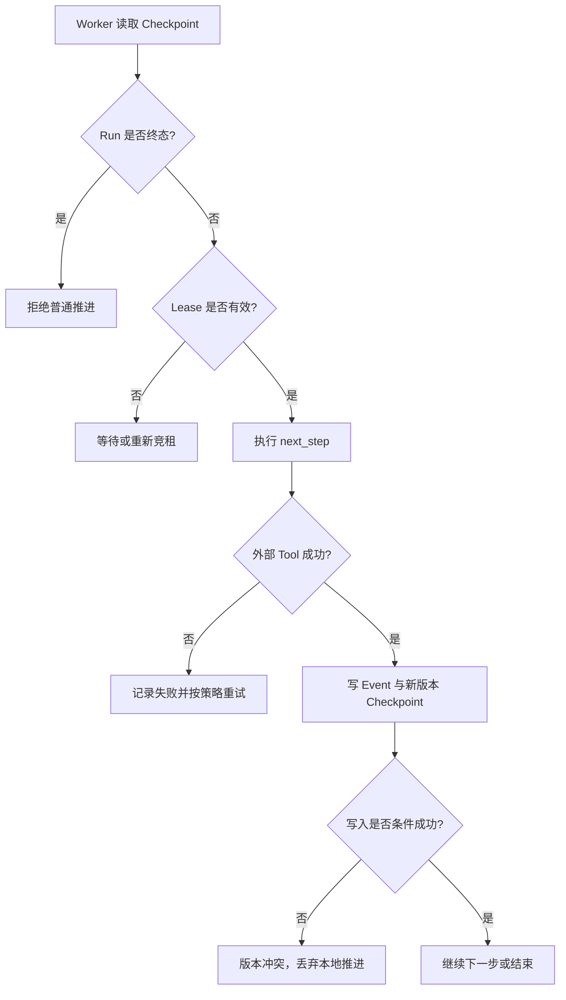

# 第八课：Checkpoint 与 Durable Execution

> 目标：区分“再次运行”与“从已知进度恢复”，理解 crash window、至少一次执行、幂等和并发租约。

> 语言说明：本课用本地 Python 文件演示快照；生产实现可以使用 SQL、对象存储或专用执行引擎。

## 目录

1. [前置依赖与统一术语](#前置依赖与统一术语)
2. [问题场景：为什么普通重试会重复副作用](#问题场景为什么普通重试会重复副作用)
3. [Checkpoint、Event Log 与 State 的边界](#checkpointevent-log-与-state-的边界)
4. [逐步时序与因果链](#逐步时序与因果链)
5. [核心数据结构与不变量](#核心数据结构与不变量)
6. [可运行代码与 lab 映射](#可运行代码与-lab-映射)
7. [故障窗口实验](#故障窗口实验)
8. [事务、outbox、lease 与 version](#事务outboxlease-与-version)
9. [Temporal、LangGraph 与边界](#temporallanggraph-与边界)
10. [边界、反例、练习与导航](#边界反例练习与导航)

## 前置依赖与统一术语

阅读 [05 状态机与 Workflow](05-state-machine-workflow.md) 的状态转换，以及 [06 Agent Runtime](06-agent-runtime.md) 的循环。

本课沿用课程统一术语：`Task` 是用户提交的逻辑任务定义；`Run` 是一次执行实例；`State` 是当前结构化事实；`Event` 是已经发生的事实；`Tool` 是受注册、校验和授权约束的外部能力；`Checkpoint` 是含 State、下一步位置和版本的可恢复快照。

这里的“持久化”只表示数据按约定成功写入了一个仍可用的存储，不表示磁盘、电源、数据库集群或第三方服务永不丢失。

## 问题场景：为什么普通重试会重复副作用

假设一个研究 Run 依次执行检索、发审批通知、写最终文档。进程在通知已经发出但快照还没有保存时崩溃。简单重试只能选择两种坏结果：从头执行并再次通知，或跳过通知却不知道它是否真的成功。

### 因果链

```text
进程开始
  -> Tool 产生外部副作用
  -> 副作用确认返回
  -> Checkpoint 尚未成功写入
  -> 进程崩溃
  -> Scheduler 只能按旧 State 重试
  -> 同一业务动作可能再次发生
```

因此 Durable Execution 的承诺不是“每个动作只执行一次”，而是：

1. Runtime 在定义好的边界保存可恢复事实。
2. 崩溃后从最后一个已确认边界继续。
3. 对可能重复的 Tool 调用使用幂等键、去重表或可补偿事务。
4. 对并发 Worker 使用租约和版本条件，避免两个恢复者同时推进同一个 Run。

## Checkpoint、Event Log 与 State 的边界

### Checkpoint 是快照，不是完整历史
Checkpoint 适合快速加载“现在是什么状态、下一步是什么”。它通常包含：`run_id`、`state`、`next_step`、业务数据、`schema_version`、`checkpoint_version` 和更新时间。

### Event Log 是事实序列
Event Log 记录 `tool.call.finished`、`approval.granted`、`run.failed` 等不可随意改写的事实。它适合审计、重放和查明“先发生了什么”。Event 不等于当前 State：同一事件序列可以被投影成不同查询视图。

### 两者如何配合
```text
Event 1 -> Event 2 -> Event 3 -> Event 4
                |                 |
                +--> Checkpoint A +--> Checkpoint B
```

Checkpoint 是从 Event 或事务结果得到的加速索引；Event Log 是证据。只保存快照会丢失审计细节，只保存事件则恢复可能很慢。教学 Runtime 可只保存快照，但生产系统要明确是否需要事件重放、保留期限和脱敏规则。

## 逐步时序与因果链
以下时序使用“检索后等待人工批准”的 Run：

1. API 创建 `Task` 和 `Run(run_id=r1)`，写入 `run.created`。
2. Worker 获取 `r1` 的 lease，读取 `checkpoint_version=3`。
3. Worker 将 State 从 `created` 推进到 `running`，产生 `run.started`。
4. Worker 调用只读 `search.mock`，收到结果并写入 State。
5. Worker 在边界写 `checkpoint_version=4,next_step=approval`。
6. Worker 发出 `approval.requested`，将 Run 标为 `waiting_for_human`。
7. 若此时崩溃，恢复者加载版本 4，不重复检索；它等待外部 `approval.granted`。
8. 审批服务使用 `approval_id` 去重，只接受一次有效决定。
9. Worker 重新获取 lease，条件读取版本 4，并消费审批事件。
10. Worker 写版本 5，执行写作 Tool；写作 Tool 使用 `idempotency_key=r1:write`。
11. Tool 成功后写 `checkpoint_version=6` 和 `run.finished`。

关键是第 5、6、10、11 步之间都存在 crash window。Runtime 只能缩小窗口，不能把任意网络系统自动变成跨系统原子事务。

## 核心数据结构与不变量

```python
from dataclasses import dataclass, field
from typing import Any

@dataclass
class Checkpoint:
    run_id: str
    state: str
    next_step: str
    data: dict[str, Any] = field(default_factory=dict)
    schema_version: int = 1
    checkpoint_version: int = 0

@dataclass
class Event:
    event_id: str
    run_id: str
    event_type: str
    sequence: int
    payload: dict[str, Any]
    idempotency_key: str
```

建议的不变量如下：

- `run_id` 在所有 Event、Checkpoint、Tool 请求中保持不变。
- `checkpoint_version` 只增不减；保存必须带“期望旧版本”。
- 同一 `run_id + sequence` 只能有一个已确认 Event。
- 已进入终态的 Run（`succeeded`、`failed`、`cancelled`）不再接受普通推进事件。
- `next_step` 必须属于已注册 Workflow，不能由用户输入直接拼接函数名。
- 每个外部写操作都有明确的幂等键或补偿策略。
- schema 迁移可读旧版本，写入新版本；不能依赖不安全且不可移植的 Python pickle。

## 可运行代码与 lab 映射

下面的片段展示教学级文件快照。`tmp.replace` 只在同一文件系统内减少半截 JSON 的概率，不保证电源故障后的持久性，也没有并发条件写。

```python
import json
import tempfile
from dataclasses import asdict, dataclass
from pathlib import Path

@dataclass
class Checkpoint:
    run_id: str
    next_step: str
    state: str
    data: dict
    version: int = 1

def save(cp: Checkpoint, path: Path) -> None:
    temporary = path.with_suffix(".tmp")
    temporary.write_text(
        json.dumps(asdict(cp), ensure_ascii=False), encoding="utf-8"
    )
    temporary.replace(path)

def load(path: Path) -> Checkpoint:
    return Checkpoint(**json.loads(path.read_text(encoding="utf-8")))

with tempfile.TemporaryDirectory(prefix="runtime-course-08-") as directory:
    path = Path(directory) / "checkpoint.json"
    original = Checkpoint(
        "run-08", "approval", "waiting_for_human", {"notes": ["mock result"]}
    )
    save(original, path)
    restored = load(path)
    print(restored.run_id, restored.next_step, restored.state)
```

这段代码对应 [labs/08_durable_checkpoint.py](labs/08_durable_checkpoint.py) 的 `Checkpoint`、`save`、`load` 和 `checkpoint.saved` 输出。运行方式：

```powershell
python 03-Agent-Runtime/labs/08_durable_checkpoint.py
```

lab 的范围是“保存并恢复一个快照”，不是完整 Durable Runtime。读者应把它和本课的版本条件、lease、幂等实验分开理解。

## Mermaid：恢复路径



## 故障窗口实验

### 窗口 A：保存前崩溃

在 `save` 调用前终止进程。期望：旧文件仍可读取；恢复后从旧 `next_step` 开始。若直接 `write_text` 覆盖，可能留下截断 JSON。

### 窗口 B：Tool 成功，快照失败

让 mock Tool 打印“已发送”，随后故意抛出保存异常。重试会再次打印“已发送”。修复方式是使用 `run_id:step` 作为幂等键，并由接收方或 outbox 去重。

### 窗口 C：两个 Worker 竞争

Worker A、B 都读取版本 4。A 条件更新为 5 成功；B 使用 `WHERE version=4` 更新失败。B 必须重新加载，而不是覆盖 A 的结果。

### 窗口 D：审批重复投递

同一 `approval_id` 投递两次。消费表以 `approval_id` 唯一约束，第二次只返回“已处理”，不能再次推进 Workflow。

## 事务、outbox、lease 与 version

### 数据库事务能保证什么

在同一数据库内，事务可以把“更新 State + 写 Event + 写 outbox 记录”绑定起来。它不能同时保证远端邮件、支付或第三方 API 已经成功。

### Outbox 的因果链

```text
事务内更新业务状态
  -> 插入 outbox(idempotency_key, payload, status=pending)
  -> 提交成功
  -> Dispatcher 读取 pending
  -> 调用外部服务
  -> 成功后标记 sent
```

Dispatcher 可能在“外部成功、标记 sent 前”崩溃，因此外部服务仍需接受幂等键。Outbox 不是“恰好一次”的证明，而是把不确定窗口集中到一个可重试边界。

### Lease 与 version 的分工

`lease` 解决“谁现在有资格运行”；`version` 解决“这个写入是否基于最新快照”。只有 lease 没有 version，旧 Worker 可能在 lease 过期后覆盖新结果；只有 version 没有 lease，两个 Worker 仍可能同时执行高风险副作用。

## Temporal、LangGraph 与边界

Temporal 的 durable execution 将 Workflow 历史、重试、定时器和 Activity 边界交给平台；Activity 的外部副作用仍要设计幂等。LangGraph 的 durable execution 更贴近图节点、线程状态和 interrupt/resume；节点副作用应放在可重试边界内，并配置合适的 checkpointer。两者都不能把任意第三方 API 组合成跨系统原子替换。

选型时问三个问题：

1. 需要的是事件历史重放，还是简单的可恢复快照？
2. 是否有长等待、定时器、人工审批和多 Worker 竞租？
3. 外部写操作能否接受幂等键，或者是否存在可执行补偿？

## 边界、反例、练习与导航

### 反例

- 把 `tmp.replace` 宣称成“断电不丢数据”。文件系统和存储设备仍可能重排写入。
- 把 checkpoint 当成锁。快照本身不阻止两个 Worker 同时执行。
- 只在客户端生成幂等键。恶意或错误客户端可复用别人的键，服务端必须绑定租户、Run 和动作。
- 发现快照缺失就从头运行高风险动作。正确做法是进入 `recovery_blocked`，要求人工或审计决定。

### 练习与答案思路

1. 为什么 checkpoint 与 event log 不能互相完全替代？答案应提到恢复速度、审计历史和投影。
2. “至少一次”如何变成可接受结果？答案应包含稳定幂等键、接收方去重、事务 outbox 和重复结果可安全返回。
3. lease 已过期但 Tool 仍在网络中执行怎么办？答案应承认无法自动撤销远端动作，依赖幂等、超时、补偿和结果核对。
4. 为什么 schema_version 和 checkpoint_version 都需要？前者描述数据格式迁移，后者描述并发写入顺序。

### 导航

- 上一课：[07 MCP 与 Tool Runtime](07-mcp-tool-runtime.md)
- 课程目录：[Runtime 学习路线](README.md)
- 下一课：[09 Context、Memory 与 Human-in-the-Loop](09-context-memory-human-loop.md)

## 官方资料

- [Temporal：Understanding the platform and durable execution](https://docs.temporal.io/evaluate/understanding-temporal)
- [Temporal：Retry policies](https://docs.temporal.io/encyclopedia/retry-policies)
- [LangGraph：Durable execution](https://docs.langchain.com/oss/python/langgraph/durable-execution)
- [SQLite transactions](https://sqlite.org/lang_transaction.html)
- [AWS Builders' Library：Making retries safe with idempotent APIs](https://aws.amazon.com/builders-library/making-retries-safe-with-idempotent-APIs/)
