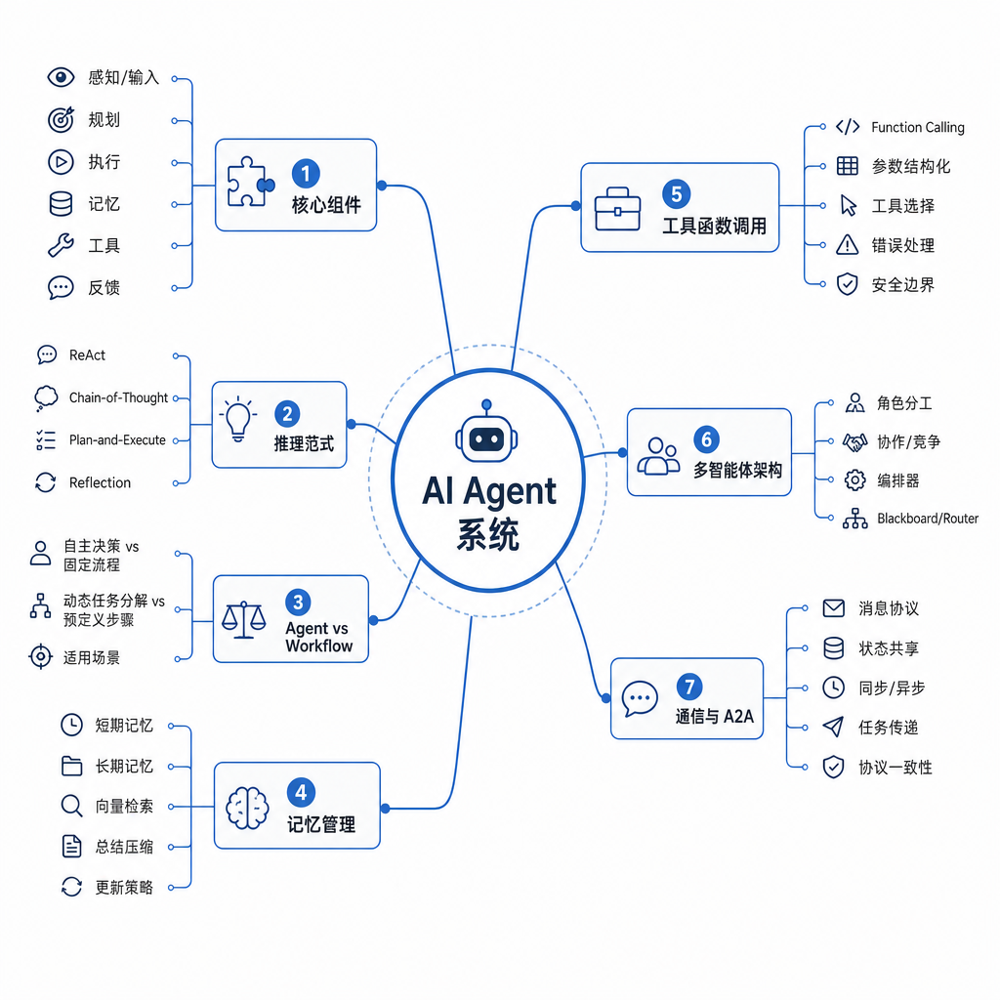
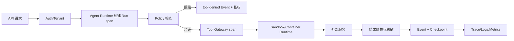

# 第十课：可观测性、安全与生产化

> 目标：让一次 `Run` 可定位、可解释、可限制，并把架构图中的 Agent 组件落到日志、指标、Trace、Tool 安全和部署边界。

> 语言说明：本课的少量 Python 代码只模拟 Event 和 Policy；Trace、Sandbox、租户隔离属于系统设计问题。

## 前置依赖与统一术语

阅读 [07 MCP 与 Tool Runtime](07-mcp-tool-runtime.md) 的权限边界、[08 Durable Execution](08-durable-execution.md) 的恢复语义；了解 HTTP 超时、日志和基本网络概念。

本课沿用统一术语：`Task` 是逻辑任务，`Run` 是执行实例，`State` 是当前事实，`Event` 是已发生事实，`Tool` 是注册并受授权的外部能力，`Checkpoint` 是恢复快照。`trace_id`、`span_id` 是可观测性关联字段，不是新的业务状态。

## 从用户症状到证据链

“回答很慢”“工具偶尔失败”“同一消息发了两次”都不是足够的根因。诊断需要把用户请求映射到 Run，再映射到模型调用、Tool、Event、Checkpoint、策略决定和基础设施指标。

### 因果链

```text
入口请求
  -> 鉴权/租户解析
  -> 创建 Task/Run 与 trace_id
  -> Agent Runtime 产生 span
  -> Model/Tool 子调用传播 context
  -> Event、Checkpoint 和指标关联 run_id
  -> 告警按 SLI 窗口聚合
  -> 通过 trace + 日志 + 指标定位故障
```

日志回答“发生了什么”，Trace 回答“在哪一步耗时”，Metrics 回答“是否正在大面积变坏”。三者缺一不可，也不应把完整 prompt、秘密和个人数据原样写进任何一个系统。

## 逐个解释截图中的七类组件

架构图（[images/agent-system-map.png](../images/agent-system-map.png)）把 AI Agent 系统拆成七块。下面逐块说明它在 Runtime 中的位置、可观测性证据和安全边界。



### 1. 核心组件

感知/输入、规划、执行、记忆、工具、反馈组成主循环。Runtime 应为每轮生成稳定 `run_id` 和 `step_index`，记录输入分类而不是完整敏感文本。核心组件负责编排，不应直接绕过 Policy 调用任意网络或文件。

### 2. 推理范式

图中的 ReAct、Chain-of-Thought、Plan-and-Execute、Reflection 是决策策略，不是安全边界。生产日志只记录策略名、决策摘要和 Tool 选择，不记录未经脱敏的隐藏推理内容。步数、预算和循环检测由 Runtime 强制执行。

### 3. Agent vs Workflow

自主决策适合开放式问题，固定流程适合可审计业务。两者可组合：Workflow 决定允许的节点，Agent 在节点内选择候选 Tool。SLO 应区分两类 Run，因为自主探索的延迟和重试分布不同。

### 4. 记忆管理

短期记忆对应 Working State/Context，长期记忆对应带来源、租户和 TTL 的 Memory。记忆检索要产生 `memory.lookup` span 和命中数量指标；写入需要策略、删除和审计，不能把模型猜测直接当永久事实。

### 5. 工具函数调用

Function calling、参数结构化、工具选择、错误处理和安全边界都必须经过 Tool Gateway。Gateway 在网络调用前校验 schema、租户授权、超时、预算和幂等键；客户端传来的 `allowed_tools` 只能表示意图，不能授予权限。

### 6. 多智能体架构

角色分工、协作/竞争、编排器和 Blackboard/Router 会增加 span 数、消息数和权限面。每个子 Agent 继承父 `trace_id`，获得独立 `agent_id` 和最小 Tool 集；跨租户消息必须经过显式路由策略。

### 7. 通信与 A2A

消息协议、状态共享、同步/异步、任务传递和协议一致性要定义超时、重放和版本。异步消息必须有 `message_id`、`causation_id` 和去重策略；不要把“消息送达”误认为“业务动作已经完成”。

## Logs、Metrics、Traces 与上下文传播

### 核心数据结构与不变量

```python
from dataclasses import dataclass, field
from typing import Any

@dataclass
class TraceContext:
    trace_id: str
    span_id: str
    parent_span_id: str | None = None
    baggage: dict[str, str] = field(default_factory=dict)

@dataclass
class RunRecord:
    run_id: str
    tenant_id: str
    trace_id: str
    state: str
    outcome: str | None = None
    attributes: dict[str, Any] = field(default_factory=dict)
```

不变量：`trace_id` 在一次 Run 内稳定；每个子 span 的 `parent_span_id` 必须指向已存在的父 span；`tenant_id` 只能由服务端身份上下文设置；高基字段进入日志/Trace 而非指标标签；终态 Run 的 outcome 只能写一次。

### 结构化日志

每条日志至少包含：`timestamp`、`level`、`service`、`task_id`、`run_id`、`trace_id`、`event`、`state`、`outcome`。敏感值使用字段级脱敏、哈希或分类标签；错误要保留稳定错误码和可操作的原因。

### Span 结构

推荐层级：

```text
run span
  -> model.call span
  -> tool.call span
      -> network/client span
  -> checkpoint.save span
```

每个子 span 传播 `trace_id`，并新增 `span_id`、`parent_span_id`、`tenant_hash`、`tool_name`。不要把完整 prompt 放作 span attribute；应记录大小、版本和内容分类。

### 指标

计数器适合 `run_finished_total{status}`、`tool_errors_total{tool,error_code}`；直方图适合 Run 和 Tool 延迟、token 数；Gauge 适合队列深度和当前 lease 数。指标标签必须有限且稳定。

## 高基数字段与 SLI/SLO

`run_id`、`trace_id`、用户 ID、完整 URL、异常堆栈都可能是高基字段。它们适合日志和 Trace，不适合直接作为 Prometheus 标签，否则时间序列数量会失控。指标中可使用 `service`、`tool_name`、`status`、有限的 `tenant_tier`；需要单个 Run 时去 Trace 查询。

### 示例 SLI/SLO

| SLI | 计算 | 示例 SLO |
| --- | --- | --- |
| 可用性 | 成功终态 Run / 进入执行的 Run | 30 天 >= 99.5% |
| 延迟 | `run.finished - run.started` 的 P95 | 30 天 P95 <= 20 秒 |
| Tool 成功率 | 非超时成功调用 / 总调用 | 7 天 >= 99% |
| 恢复成功率 | crash 后恢复并完成的 Run / crash Run | 30 天 >= 95% |
| 审批时效 | `approval.requested` 到决定的 P95 | 工作时段 <= 15 分钟 |

预算和错误预算要与产品风险对应：高风险写操作可以牺牲吞吐换取审批和核验，不能只追求更快。

## Tool 安全与生产边界

Tool Gateway 的顺序应是：身份认证 -> 租户解析 -> 服务器端授权 -> 参数 schema 校验 -> 资源和路径限制 -> 超时/取消 -> 执行 -> 输出大小限制 -> 脱敏审计。

高风险 Tool（发消息、写文件、付款、删除）至少需要幂等键、审计 Event、明确超时和人工批准。Tool 返回的文本是不可信数据；它不能修改 Policy、注入新的 Tool 权限或覆盖系统规则。

密钥只从服务端密钥管理或短期凭证注入，不能写进 prompt、Checkpoint、日志或容器镜像。轮换密钥时要验证旧 Run 的重试行为，避免把认证失败无限重试成告警风暴。

## Sandbox、least privilege、租户隔离

Sandbox 限制代码执行的文件系统、网络、CPU、内存、进程和时长；least privilege 限制身份能够访问的资源集合。两者不同：一个被隔离的容器如果挂载了全量云凭证，仍然不是最小权限。

租户隔离至少覆盖：数据库查询条件、对象存储前缀、缓存键、队列主题、日志访问和 Trace 查询。默认拒绝跨租户访问；后台运维查看也需要审计和最小范围。

## Kubernetes、Container Runtime 与 Agent Runtime

三层边界：

1. **Agent Runtime**：解释 Workflow/Agent 状态、调用 Model/Tool、生成 Event、Checkpoint、Policy 和人工审批。
2. **Container Runtime**：负责镜像、进程、namespace、cgroup、文件系统和容器网络，例如 containerd/runc。它不理解 `Run` 的业务状态，也不知道 `approval.granted` 的语义。
3. **Kubernetes**：负责 Pod 调度、Service、探针、滚动更新、Secret/ConfigMap 引用和资源声明。它可以重启 Pod，但不能替 Agent 判断是否能安全重试一个付款 Tool。

Pod 重启是基础设施事件，Run 恢复是应用事件；两者通过持久化 State、Event 和 lease 连接。生产部署要设置资源上限、网络出口策略、非 root 用户、只读根文件系统、探针和优雅终止时间，并在升级期间验证旧 schema 仍可读。

## 可运行代码与 lab 映射

下面是教学级结构化 Event 和最小脱敏；生产代码应使用字段 schema、集中密钥管理和经过审计的日志管线。

```python
import json
import time

def redact(value: object) -> str:
    text = str(value)
    if "sk-" in text or "token=" in text:
        return "[REDACTED]"
    return text[:200]

def emit(run_id: str, event: str, **fields: object) -> None:
    clean = {key: redact(value) for key, value in fields.items()}
    record = {
        "ts": time.time(),
        "run_id": run_id,
        "event": event,
        **clean,
    }
    print(json.dumps(record, ensure_ascii=False))

emit("run-10", "tool.call.finished", tool_name="search.mock", result="mock notes")
emit("run-10", "error", message="token=sk-demo-secret")
```

这段代码对应 [labs/10_observability_policy.py](labs/10_observability_policy.py) 的 `emit`、`policy.checked`、Tool 调用 Event 和脱敏演示。运行：

```powershell
python 03-Agent-Runtime/labs/10_observability_policy.py
```

lab 没有真正的 OpenTelemetry exporter、Kubernetes、身份提供商或沙箱；它只演示字段形状和策略拒绝点。

## Mermaid：一次受控 Tool 调用



## 故障窗口、边界与反例

### 窗口 A：Tool 超时

Tool 连接 2 秒，Runtime 超时 500ms。必须记录 `tool.timeout`、耗时、重试次数和 Run 状态；不能因为客户端超时就断言远端没有执行，写操作仍需幂等和结果核对。

### 窗口 B：日志脱敏漏掉新字段

开发者新增 `request_headers` 字段，旧脱敏规则只检查 `message`。字段 schema 和敏感分类测试应在 CI 阻止秘密进入持久化日志。

### 窗口 C：高基指标爆炸

把每个 `run_id` 作为指标标签，几小时后时间序列和存储成本急增。移除高基标签，保留日志/Trace 关联，并设置基数预算。

### 窗口 D：Pod 重启重复付款

Kubernetes 重启 Worker，旧 lease 未及时过期。恢复 Worker 不能直接重做付款；先检查版本、幂等键和第三方查询结果，必要时转人工。

### 反例

- 只看最终回答，不记录 Tool 和策略决定：无法解释中间失败。
- 让模型决定 `allowed_tools`：权限必须在服务端强制。
- 把完整 prompt 和 token 写进 Trace：可观测性本身变成泄露面。
- 认为容器隔离等于租户隔离：数据库、缓存和日志仍需显式过滤。
- 把 Kubernetes liveness probe 当业务健康检查：进程活着不代表 Run 能安全推进。

## 练习与答案思路

1. `run_id` 为什么适合日志而不适合指标标签？答案应谈可关联性与高基数成本。
2. Trace 如何串起模型、Tool 和 Checkpoint？答案应画 parent/child span，并说明传播 `trace_id`。
3. Tool 超时后能否立即重试写操作？答案应先判断副作用、幂等键、远端状态和重试预算。
4. Agent Runtime 与 Kubernetes 的故障责任如何划分？答案应区分 Pod/进程重启和 Run/Workflow 状态恢复。
5. 截图中的多智能体为什么需要独立 agent_id？答案应说明权限、成本、延迟和责任归属不能只靠一个 trace_id。

### 导航

- 上一课：[09 Context、Memory 与 Human-in-the-Loop](09-context-memory-human-loop.md)
- 课程目录：[Runtime 学习路线](README.md)
- 下一课：[11 Capstone：研究助理 Runtime](11-capstone.md)

## 官方资料

- [OpenTelemetry：Observability primer](https://opentelemetry.io/docs/concepts/observability-primer/)
- [OpenTelemetry：Context propagation](https://opentelemetry.io/docs/concepts/context-propagation/)
- [Kubernetes：Pod security standards](https://kubernetes.io/docs/concepts/security/pod-security-standards/)
- [Kubernetes：Resource management](https://kubernetes.io/docs/concepts/configuration/manage-resources-containers/)
- [OWASP Application Security Verification Standard](https://owasp.org/www-project-application-security-verification-standard/)
- [The Twelve-Factor App：Logs](https://12factor.net/logs)
