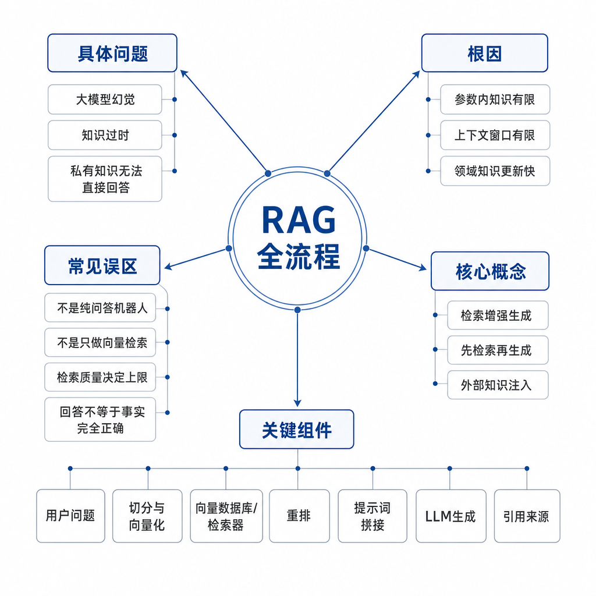
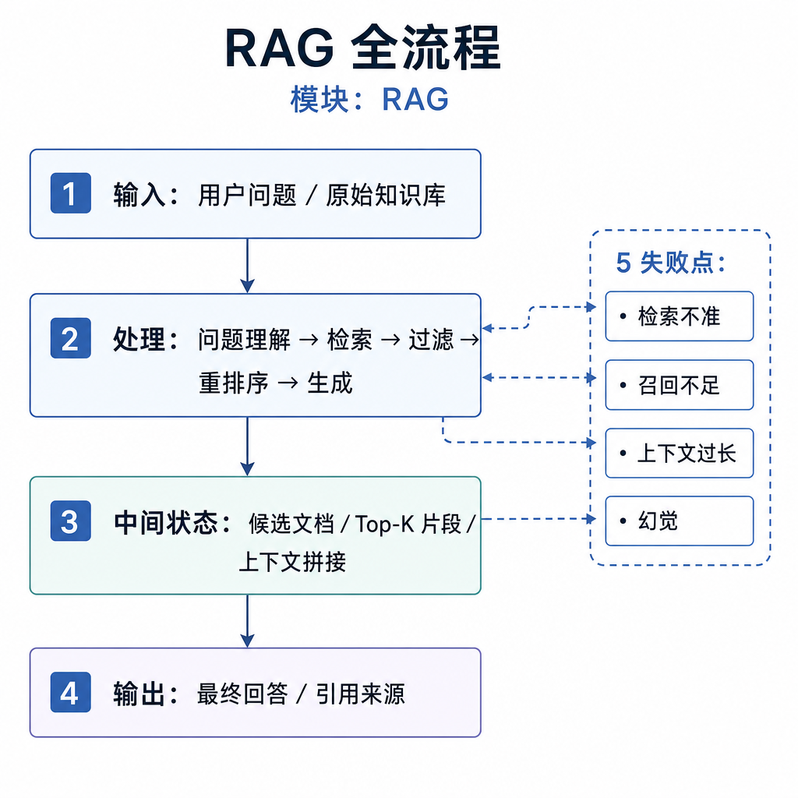
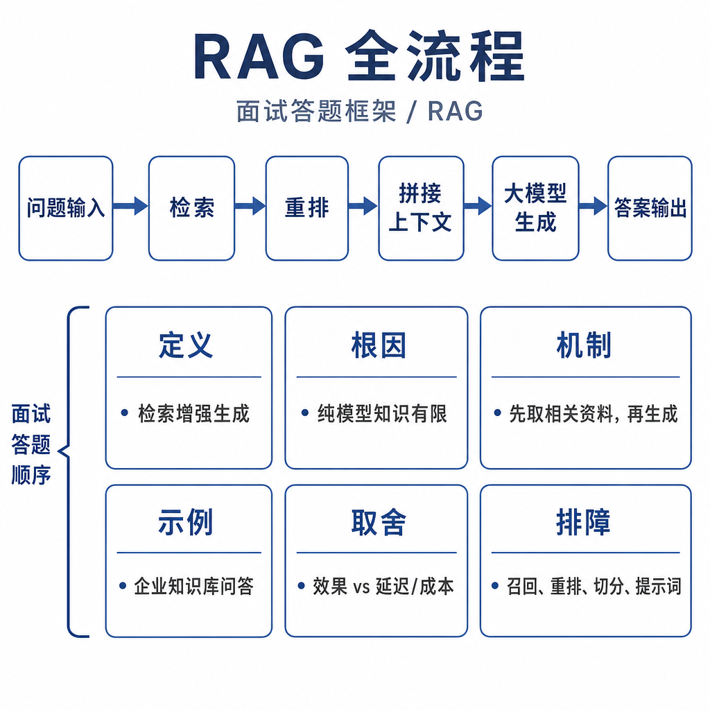

# RAG 全流程

RAG 面试最怕一句话讲完：“先检索，再生成，可以减少幻觉。”这句话没错，但不够用。真实系统里，RAG 仍会答错、漏资料、引用旧政策，甚至把检索到的正确内容说反。要把这题讲好，必须从失败现象出发，沿着数据、检索、重排、上下文和生成链路逐层拆。

## 从真实失败现象切入

公司把耳机售后政策从“7 天无理由退货”改成“15 天无理由退货”，新政策已经写进内部知识库。用户问客服机器人：“我买的耳机第 10 天了，还能退吗？”机器人却回答：“电子产品超过 7 天一般不支持无理由退货，建议联系客服确认。”

这就是典型的 RAG 失败。它不是单纯的“大模型幻觉”，因为系统明明接了知识库；也不一定是模型能力差，因为正确资料可能根本没被召回，或者召回了但排在后面，又或者放进 prompt 后被旧政策干扰。

RAG 的核心不是让模型突然变聪明，而是把模型回答时缺失的外部证据补进上下文。它解决的是知识边界问题：模型参数里的知识有时间边界、来源边界和事实校验边界。



## 核心矛盾：参数记忆和外部知识

普通大模型的知识主要来自训练阶段。训练完成后，新政策、新产品、内部制度、客户工单、数据库记录不会自动进入模型参数。即使模型知道一些通用规则，也不一定知道你公司的最新规则。

这带来三个问题。第一，新知识不知道，比如今天刚发布的政策。第二，私有知识没覆盖，比如企业内部文档。第三，缺少证据时仍会生成流畅答案，因为语言模型的目标是预测下一个 token，不是天然查证事实。

RAG 的思路是把“闭卷回答”改成“开卷回答”：知识不全部塞进模型参数，而是放在可更新的外部知识库里；用户提问时先找相关资料，再让模型基于资料组织答案。

更适合面试的定义是：RAG 是一种把外部知识检索和大模型生成结合起来的方法。它先根据用户问题从知识库检索相关片段，再把片段作为上下文交给模型生成答案，用来缓解知识过期、私有知识缺失和回答缺少依据的问题。

## 底层机制：离线阶段和在线阶段

RAG 全流程最好拆成两段：离线阶段准备知识库，在线阶段实时回答问题。

离线阶段发生在用户提问之前，目标是把原始资料加工成可检索的知识单元：

```text
原始文档
  → 文档加载
  → 文本清洗
  → 文档分块
  → 向量化
  → 写入向量库 / 搜索索引
```

文档加载要处理 PDF、Word、网页、Markdown、数据库记录、客服工单等来源。文本清洗要去掉页眉页脚、目录、广告、乱码，同时保留标题、版本、生效时间、权限范围等元数据。分块决定检索粒度，块太大噪声多，块太小缺上下文。向量化用 embedding 模型把 chunk 变成向量，最后连同文本和元数据写入索引。

在线阶段发生在用户提问时：

```text
用户问题
  → Query 处理
  → 多路召回
  → Rerank 精排
  → 上下文组装
  → LLM 生成答案
  → 返回答案和引用
```

Query 处理负责补全省略和消歧，比如把“这个还能退吗”改写成“耳机购买 10 天是否支持无理由退货”。召回阶段可以用向量检索、关键词检索、元数据过滤等多路方式。Rerank 把候选片段重新排序。上下文组装决定哪些资料进入 prompt、按什么顺序进入、是否带引用。最后模型基于这些资料生成答案。



## 工程例子：售后政策问答怎么跑通

离线阶段，系统读取《耳机售后政策 2026 版》，清洗掉目录和页脚，把“15 天无理由退货”这一节切成 chunk，同时保留上级标题“售后政策 / 退货条件”。向量化后写入向量库，并保存元数据：产品线=耳机，版本=2026，生效时间=2026-05-01，权限=客服可见。

在线阶段，用户问“我买了 10 天的耳机还能退吗？”系统先识别实体“耳机”和时间“10 天”，把问题改写成“耳机购买 10 天是否支持无理由退货，需要满足哪些条件”。向量检索召回语义相近片段，关键词检索命中“耳机”“退货”，元数据过滤排除旧版本政策。Rerank 后把“15 天无理由退货”和“配件包装要求”排到前面。

上下文组装时，系统只放入最相关的 3 到 5 个片段，并带上来源和版本。模型最终回答：“根据 2026 版耳机售后政策，购买第 10 天仍在 15 天无理由退货期限内，但需要商品外观完好、配件齐全、包装完整。若属于特殊促销商品，还要以活动页面规则为准。”

这个答案可靠，不是因为模型记住了政策，而是因为系统把正确证据送到了模型面前，并约束它基于证据回答。

## 边界和风险：RAG 不能完全消除幻觉

RAG 能降低幻觉，但不能保证完全没有幻觉，因为它只是把资料放进上下文，最终仍由模型生成。常见失败点有六类。

第一，资料没入库。知识库缺资料，检索不可能召回。第二，清洗失败。PDF 页脚、旧目录、乱码混进 chunk，或关键表格被丢掉。第三，分块不合理。主规则和限制条件被切开，模型只看到一半。第四，召回错误。语义相似但业务不相关的片段进入候选。第五，排序错误。正确片段存在但排在 top_k 之外。第六，生成不受约束。模型拿到资料后仍自由发挥，或在资料冲突时选了旧政策。

RAG 和微调也要分清。RAG 适合频繁变化、需要可追溯依据的知识，比如政策、库存、价格、产品文档。微调更适合改变模型行为习惯，比如固定输出格式、领域表达风格、工具调用模式。高可靠问答通常不是二选一，而是 RAG、生成约束、评测和必要微调组合使用。

## 高频面试追问

- RAG 是什么，它解决了 LLM 的哪些问题？
- RAG 的离线阶段和在线阶段分别做什么？
- 为什么 RAG 能减少幻觉，但不能完全消除幻觉？
- 向量检索、关键词检索和 rerank 在流程里分别负责什么？
- RAG 和微调有什么区别，什么时候选哪个？
- 如果 RAG 回答不准，你会怎么定位问题？
- 为什么不能把所有文档直接塞进长上下文模型？

## 可复述答案

RAG 是检索增强生成，主要解决大模型的知识边界问题。因为模型训练完成后，知识主要固定在参数里，所以会遇到新知识不知道、企业私有知识不知道，以及缺少依据时容易编造的问题。RAG 的做法是把外部文档整理成知识库，用户提问时先检索相关资料，再把资料和问题一起交给模型生成答案。它通常分成离线和在线两个阶段：离线做文档加载、清洗、分块、向量化和入库；在线做 query 处理、召回、rerank、上下文组装和生成。RAG 能降低幻觉，是因为模型回答时有资料依据，但它不能完全消除幻觉，因为数据、分块、检索、排序、上下文和生成约束任何一步出错，都会影响最终答案。



## 排查和实践建议

线上 RAG 答错，不要第一反应调 prompt。按链路查更稳：先确认正确资料是否存在、是否入库、版本和权限是否正确；再看清洗结果有没有丢表格、丢标题、混入页脚；接着看 chunk 是否包含完整规则；然后看相关 chunk 是否进入召回候选，是否被 rerank 排到前面；最后看上下文是否太长、资料是否冲突、模型是否被要求基于资料回答并在资料不足时拒答。

实践上要建立评测集。每条样本至少包含用户问题、标准答案、应召回文档、问题类型和失败原因。评测要分层看：检索层看 Recall@K，排序层看 MRR 或 NDCG，生成层看答案是否正确、完整、有引用，安全层看资料不足时是否拒答。没有评测集，RAG 优化很容易变成凭感觉调参数。

---

[返回 RAG 模块目录](README.md)
