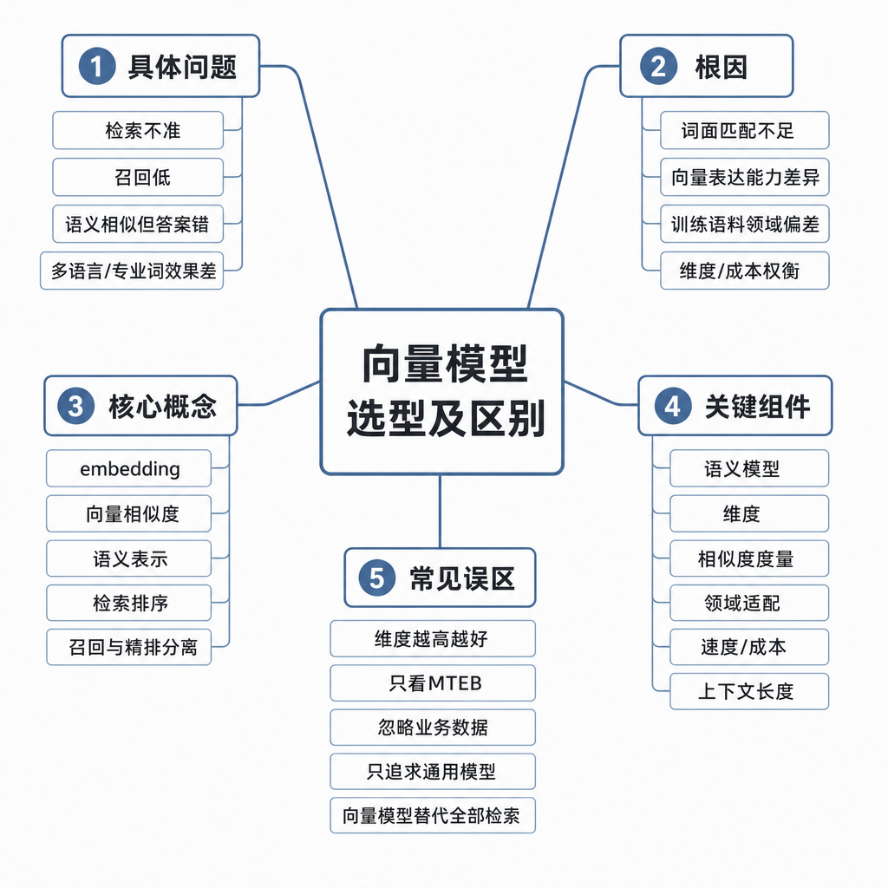
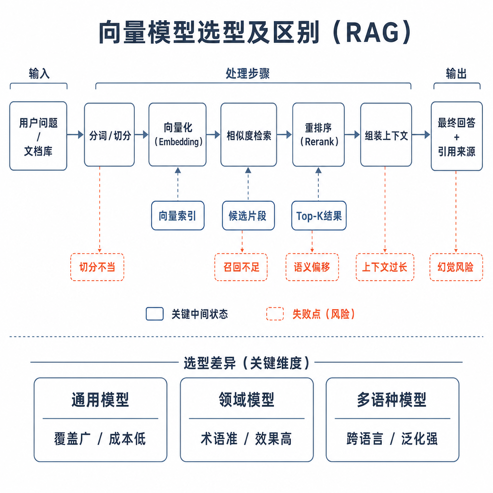
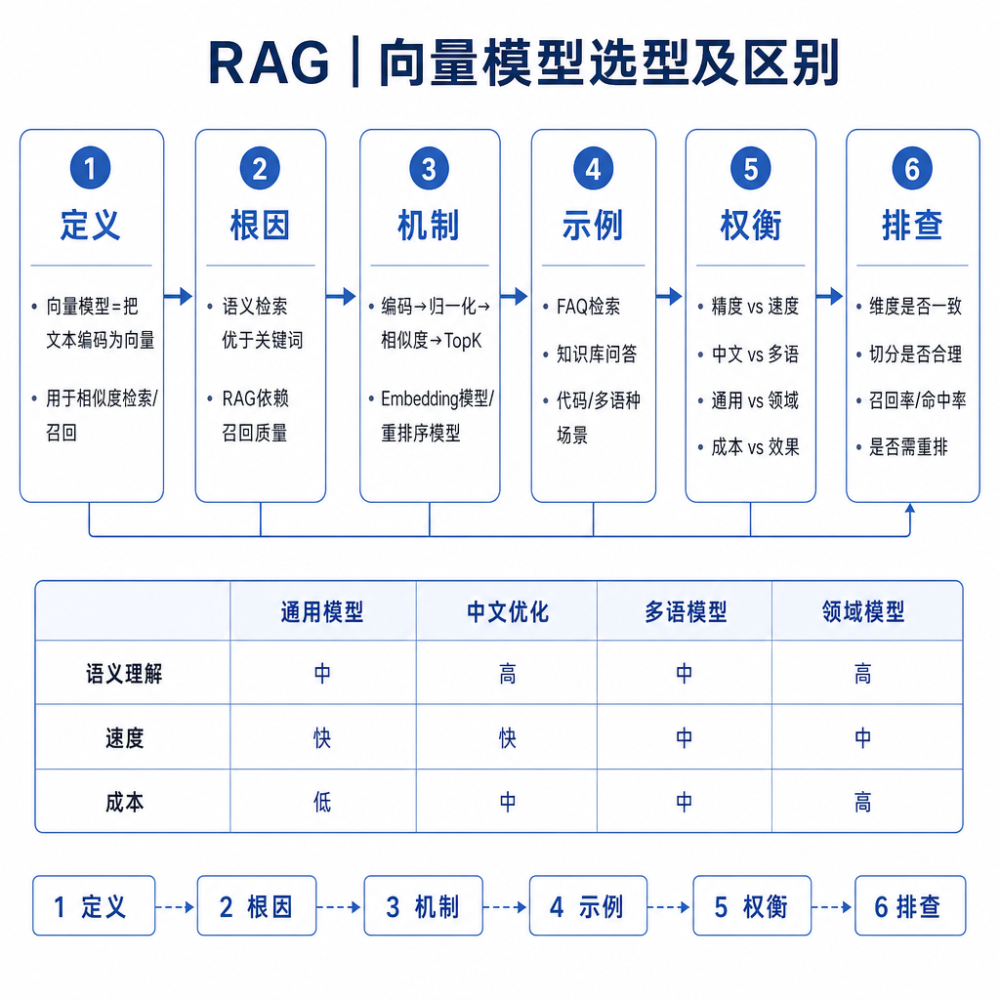

# 向量模型选型及区别

RAG 系统答不准时，很多人第一反应是“换个更强的 embedding 模型”。但真实项目里，向量模型不是越大越好，也不是排行榜第一就适合业务。选错模型会带来三类问题：相关文档召不回、精确编号被漏掉、索引重建成本爆炸。面试问向量模型选型，本质是在考你能不能把语义效果和工程成本一起看。

## 从真实失败现象切入

用户问：“我耳机买了 10 天，包装还在，可以退吗？”知识库里写的是：“耳机类商品自签收之日起 15 天内，若外观、配件、包装完整，可申请无理由退货。”如果系统只靠关键词，“买了 10 天”和“签收 15 天内”字面不一致，可能召回不稳定。

这时向量模型很有用。它把用户问题和文档片段映射到同一个语义空间，让字面不同但意思接近的文本距离更近。

但另一个失败也很常见：用户问“E1024 报错怎么处理？”向量模型召回了一堆“蓝牙连接失败常见问题”，却漏掉标题精确包含“E1024”的文档。原因是向量模型擅长语义相似，不一定对错误码、SKU、函数名这种精确符号足够敏感。



## 核心矛盾：语义召回和工程约束

向量模型的作用，是把文本变成固定维度的数字向量，比如 768 维、1024 维或 1536 维。检索时，系统把 query 向量和文档 chunk 向量做相似度计算，找出距离最近的候选。

这个机制解决了同义表达问题，比如“多久到账”和“退款款项返还时间”可能被拉近。但它也带来压缩损失：一个 chunk 里如果同时包含退款、维修、发票、物流，最终只有一个向量，很难精确表达每个主题。向量维度越高，表达能力可能更强，但存储、索引、内存和延迟也会更高。

所以选型不是问“哪个模型最好”，而是问：在我的语言、领域、数据规模、延迟和成本约束下，哪个模型能稳定把正确片段召回到前面。

## 底层机制：embedding 不只是转数字

embedding 模型通常通过对比学习、匹配学习等方式训练，让相关文本在向量空间更近，不相关文本更远。用户问题和文档片段经过同一个或相近的编码器后，得到向量表示。系统再用 cosine similarity、dot product 或 L2 distance 计算相似度。

这里有一个容易忽略的点：相似度指标要和模型训练方式匹配。有些模型推荐 cosine，有些推荐 dot product。如果向量库里配置错距离度量，召回效果可能明显下降。向量是否归一化也会影响 dot product 和 cosine 的关系。

另一个关键点是输入长度。embedding 模型也有最大输入限制。chunk 超过限制时，后半段可能被截断，导致关键信息根本没有进入向量。于是你以为是模型不懂业务，其实是分块太长。



## 工程选型：至少看这七个维度

第一，看语言能力。中文知识库要测中文语义、口语表达、同义改写。中英混合场景还要测跨语言检索，比如中文问英文 API 文档。

第二，看领域适配。医疗、法律、金融、代码场景的术语边界很严格。“阴性”“禁忌症”“授信额度”“幂等键”这类词理解错，召回就会错。通用模型能做 baseline，但不一定足够。

第三，看向量维度和存储成本。1000 万个 chunk，如果每个 1536 维 float32，向量本体就很大，还没算索引开销。维度越高不一定越好，要用召回提升抵消成本增加。

第四，看输入长度。chunk size 必须和 embedding 模型能力一起设计。长文档分块不合理，会让向量变成多个主题的平均值。

第五，看相似度指标和向量库支持。cosine、dot product、L2 不能随便换，索引类型、召回精度和延迟也要一起评估。

第六，看延迟、吞吐和价格。在线 RAG 每次用户提问都要做 query embedding。如果 embedding API 慢，整体响应就慢；如果 QPS 高，成本会持续放大。

第七，看索引重建成本。换 embedding 模型通常意味着所有历史文档要重新向量化、重建索引、回归测试。大规模知识库不能频繁拍脑袋换模型。

## 工程例子：怎么评估候选模型

不要只看公开榜单。最小可用评测集可以从真实日志里抽样，覆盖不同问题类型：

```text
问题：耳机买了 10 天还能退吗？
标准相关文档：耳机售后政策 2026 版 - 15 天无理由退货

问题：E1024 报错怎么解决？
标准相关文档：E1024：蓝牙模块初始化失败处理指南

问题：退款多久到账？
标准相关文档：退款款项返还时间说明
```

对每个候选模型，用同一套分块、同一套向量库参数、同一批 query 做检索。看标准文档是否进入 top1、top3、top5，同时记录 query embedding 延迟、索引大小和检索耗时。

常见指标包括 Recall@K、MRR、NDCG、Latency 和 Cost。Recall@K 看正确文档有没有被召回；MRR 看第一个正确结果排多靠前；NDCG 适合多个相关结果的排序评估。上线前还要看失败样本，而不只是平均分。

## 边界和风险：向量召回不是答案相关

第一，语义相似不等于业务相关。用户问“退款多久到账”，向量模型可能召回“如何申请退款”。它们都和退款有关，但一个问到账时间，一个问流程。

第二，精确符号容易被语义稀释。错误码、订单号、函数名、产品型号通常更适合关键词检索或混合检索。

第三，embedding 效果和分块强相关。一个 chunk 混入多个主题，模型再强也要把多件事压成一个向量，召回自然不稳。

第四，模型升级有迁移风险。新模型可能整体指标更高，但某些老业务问题变差。上线要做灰度、双索引或离线回放，不要直接覆盖旧索引。

## 高频面试追问

- 向量模型在 RAG 中的作用是什么？
- embedding 如何支持语义相似检索？
- 选择 embedding 模型要看哪些指标？
- 向量维度越高越好吗？
- 为什么换 embedding 模型通常要重建索引？
- 向量检索效果不好时，怎么判断是模型问题还是分块问题？
- 为什么生产系统常把向量检索和关键词检索结合？

## 可复述答案

向量模型在 RAG 中负责把用户问题和文档片段映射到同一个语义空间，使字面不同但语义相近的内容可以通过相似度检索匹配起来。选型不能只看排行榜，要结合业务数据评测，重点看语言能力、领域适配、向量维度、输入长度、相似度指标、延迟成本和索引重建成本。工程上我会先构造真实 query 和标准相关文档，用 Recall@K、MRR、NDCG、延迟和成本比较候选模型。如果效果不好，不会立刻换模型，而会同时检查分块、相似度配置、混合检索、rerank 和 query 改写。



## 排查和实践建议

向量召回差，可以按顺序查。先看 query 是否太短、缺主语或依赖历史；再看 chunk 是否主题混杂或关键条件被切断；接着看 embedding 是否适配语言和领域；然后看相似度指标、归一化和向量库参数是否匹配；再看 top_k 是否过小，正确片段是否排在较后位置；最后判断是否需要关键词检索和 rerank。

实践上，先用成熟通用 embedding 建 baseline，再用业务评测集决定是否需要领域模型、微调模型或混合检索。对大规模知识库，换模型前要估算重建索引时间、存储增长、回滚方案和灰度策略。这样回答，能体现你既懂语义表示，也懂生产成本。

---

[返回 RAG 模块目录](README.md)
