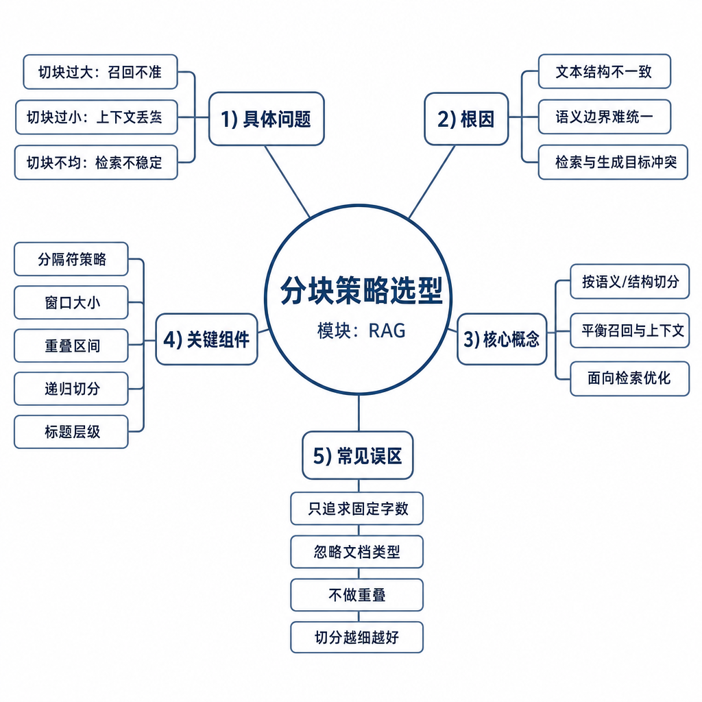
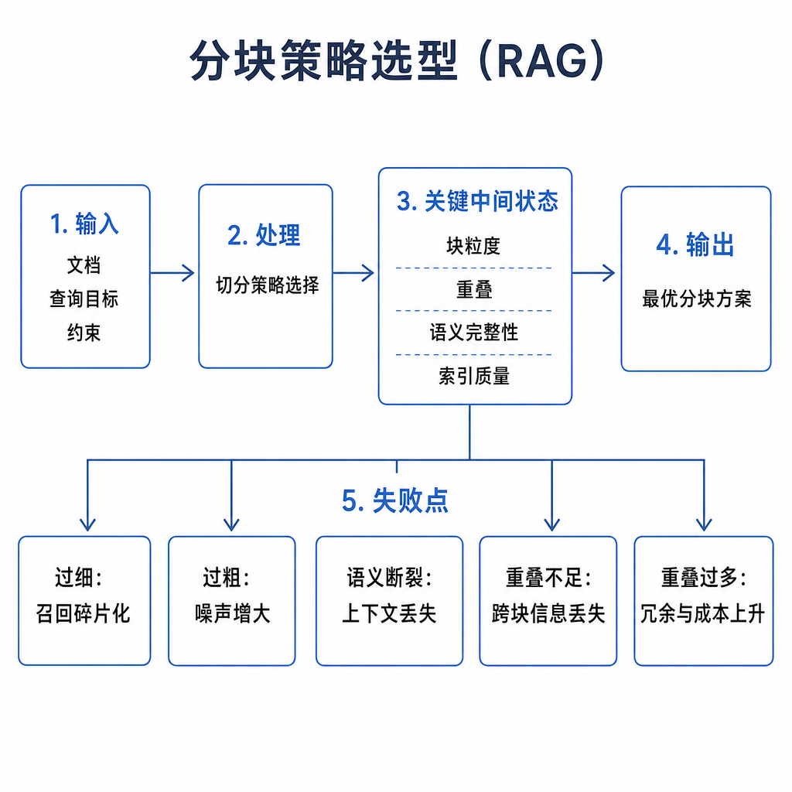
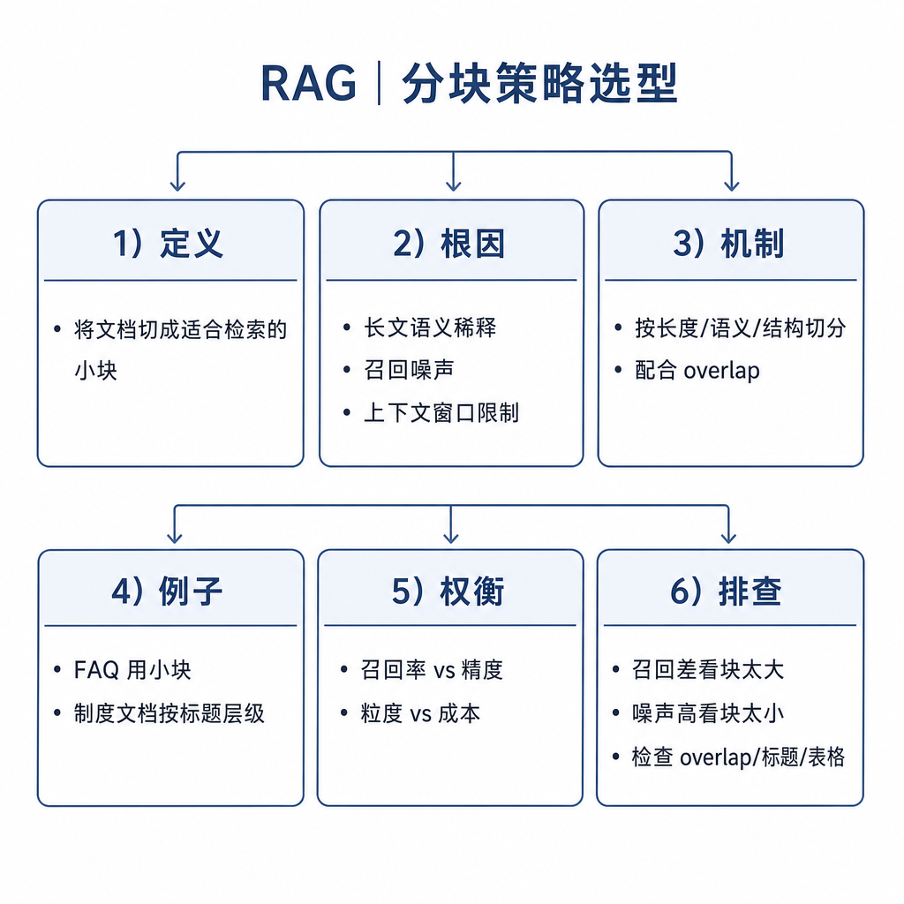

# 分块策略选型

RAG 答错时，很多人会先换 embedding、调 top_k、改 prompt，但真正的根因常常在分块。文档切得太碎，模型拿不到完整条件；切得太大，召回片段全是噪声。面试问分块策略，不是问你会不会说 chunk size 和 overlap，而是看你能不能围绕“知识粒度”讲清检索和生成的矛盾。

## 从真实失败现象切入

用户问：“耳机买了 10 天，包装还在，可以退吗？”知识库里有一段售后政策：耳机 15 天内可退，但要求外观完好、配件齐全、包装完整，特殊促销商品按活动规则执行。

如果你按句子切，可能只召回“耳机类商品自签收之日起 15 天内可申请无理由退货”。模型看到这句，就可能回答“可以退”，却漏掉配件、外观、促销例外。

如果你把整章《售后政策》作为一个 chunk，里面又有退款、换货、维修、发票、地区规则。用户问耳机退货，系统召回一大段，模型可能被无关内容干扰，甚至把维修规则混进退货答案。



## 核心矛盾：召回精准和上下文完整

分块不是简单“把长文档切短”，而是找到适合检索和回答的知识粒度。chunk 太小，主题集中，召回精准，但容易缺少限制条件和背景。chunk 太大，信息完整，但向量表示混杂，召回后噪声多，也占用生成模型上下文。

可以这样记：

```text
chunk 太小 → 精准但缺上下文
chunk 太大 → 完整但噪声多
好的 chunk → 主题集中 + 足够回答问题
```

这个矛盾决定了分块策略必须和文档类型、问题粒度、embedding 输入长度、生成模型上下文窗口一起设计。单独讨论“500 token 还是 1000 token”没有意义。

## 底层机制：分块影响两次压缩

RAG 里分块至少影响两次压缩。第一次是 embedding 压缩：一个 chunk 会被压成一个向量。如果 chunk 里有多个主题，向量会变成混合表示，用户问某个具体问题时，很难精准匹配。

第二次是上下文压缩：召回结果会被放进 prompt。生成模型虽然能读长上下文，但注意力和输出质量都会受噪声影响。无关 chunk 放得越多，模型越可能忽略关键条件，或者把多个片段混在一起回答。

所以分块的目标不是让每块长度平均，而是让每块内部语义尽量单一，同时保留回答所需的条件、例外和来源。

## 常见策略：不同文档用不同切法

固定长度分块最简单，比如每 500 token 切一块，重叠 50 token。优点是稳定、容易实现，适合早期 baseline 或结构混乱的纯文本；缺点是可能切断标题、表格、代码块和规则条件。

按标题层级分块适合技术文档、产品手册、制度文档。比如把“售后政策 / 退货条件 / 特殊促销规则”作为层级保留，每个小节单独成块，并把上级标题写入 chunk 前缀或元数据。这样片段离开原文后仍有上下文。

按段落分块适合自然段规范的文章，但要配合长度控制。很多业务文档段落长短不一，有的段落只有一句，有的段落包含多个主题，不能机械按空行切。

语义分块会根据主题变化切分，比如从“退款”转到“维修”时切开。它更贴近内容边界，但实现成本高，依赖模型或算法质量，也需要评测验证。

滑动窗口 overlap 用来缓解关键句被切断的问题。上一块结尾的一部分会出现在下一块开头。但 overlap 不是越大越好，过大会增加索引体积、重复召回和上下文噪声。

父子块检索是生产里很常见的折中：小块用于检索，大块用于生成。比如检索时用段落级小块提高精准度，命中后把它所在的小节或父章节一起带给模型，补足上下文。



## 工程例子：售后政策应该怎么切

原文如下：

```text
耳机类商品自签收之日起 15 天内，若商品外观完好、配件齐全、包装完整，可申请无理由退货。若商品存在人为损坏、缺少配件或超过 15 天，则不支持无理由退货。特殊促销商品以活动页面规则为准。
```

不好的切法是只切出“15 天内可申请无理由退货”。这个 chunk 能回答时间，但不能回答条件和例外。另一个不好的切法是把退款、维修、发票整章都塞进一个 chunk，召回时主题混杂。

更好的 chunk 应该包含完整规则：适用商品、时间范围、必要条件、不支持情况、特殊例外。标题可以保留为“售后政策 / 耳机 / 无理由退货”。这样用户问“买了 10 天能退吗”，模型能回答“在期限内，但还要满足外观、配件、包装条件”。

代码文档则不能按普通段落切。函数、类、接口说明、参数表和异常说明要尽量保持在同一个语义单元里。法律合同也不能随便切断条款，因为一个“除外情形”可能在下一款里。

## chunk size 怎么选

选 chunk size 先看文档类型。FAQ 可以一问一答成块；技术文档按标题、函数、接口切；制度文档按条款切；客服工单可以按问题、原因、解决方案切；代码仓库按函数、类和文件结构切。

再看用户问题粒度。问题越具体，比如“E1024 报错怎么处理”，chunk 可以更小；问题越综合，比如“退换修规则是什么”，chunk 需要带更多上下文。

还要看模型限制。embedding 模型输入长度决定 chunk 过长是否会被截断；生成模型上下文窗口决定最终能放多少候选片段。长上下文模型不代表可以无脑大 chunk，因为噪声仍会影响生成。

最后看评测结果。准备一批真实问题和标准相关片段，比较不同分块策略下正确片段是否进入 top_k、是否排在前面、模型最终是否答完整。分块策略必须用失败样本迭代，而不是靠经验值一次定死。

## 边界和风险：分块不是越精细越好

第一，小 chunk 容易丢条件。政策、法律、医疗、金融场景里，限制条件比主规则更重要，切丢了会造成过度承诺。

第二，大 chunk 容易污染向量。多个主题压成一个向量后，检索会变模糊，生成上下文也更吵。

第三，overlap 会带来重复。重复片段可能让 rerank 排序偏置，也会浪费上下文窗口。

第四，元数据不能丢。标题、版本、时间、权限、产品线常常决定片段是否适用。没有元数据，召回到旧政策时模型很难判断新旧。

## 高频面试追问

- RAG 为什么必须分块？
- chunk size 怎么选？
- overlap 的作用和副作用是什么？
- 固定长度分块和语义分块有什么区别？
- 什么是父子块检索？
- 分块不合理会导致哪些线上问题？
- 如何评估一种分块策略好不好？

## 可复述答案

RAG 分块的核心目的，是把长文档切成适合检索和生成的知识单元。它要平衡两个目标：chunk 小一点召回更精准，但可能丢上下文；chunk 大一点信息更完整，但噪声更多，也更占上下文窗口。常见策略包括固定长度分块、按标题分块、按段落分块、语义分块、overlap 和父子块检索。实际选型要看文档结构、用户问题粒度、embedding 模型输入长度和生成模型上下文窗口。工程上我会用真实问题集评估：相关片段能否召回、排序是否靠前、最终答案是否完整。如果模型漏条件，可能是 chunk 太小；如果召回噪声多，可能是 chunk 太大或主题混杂。



## 排查和实践建议

怀疑分块影响效果时，先随机抽样看 chunk 内容是否主题集中；再看关键条件、限制、例外是否被切到不同块；接着看标题和元数据是否保留；然后用真实 query 看正确 chunk 是否进入 top_k；最后看放进 prompt 的上下文是否有大量重复和噪声。

实践上，先用按标题或段落的结构化分块建立 baseline，再根据失败样本调 chunk size 和 overlap。对于“召回要准、回答要完整”的场景，优先尝试父子块：小块检索，大块生成。分块是 RAG 的地基，地基不稳，后面换 embedding、加 rerank、改 prompt 都只能部分补救。

---

[返回 RAG 模块目录](README.md)
