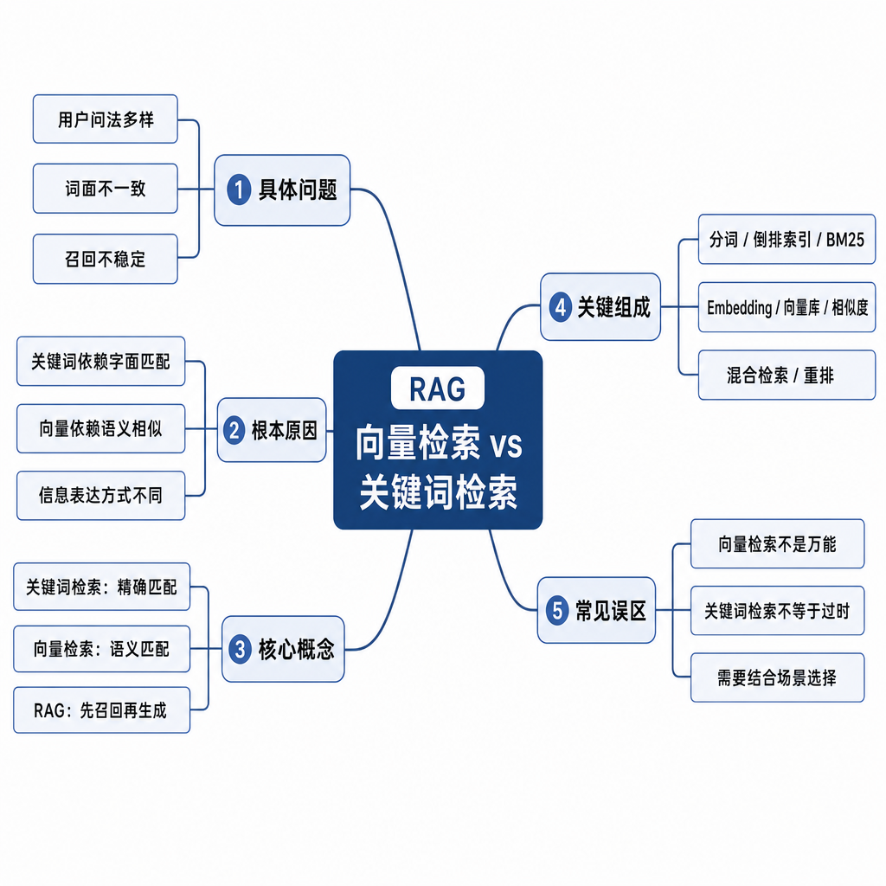
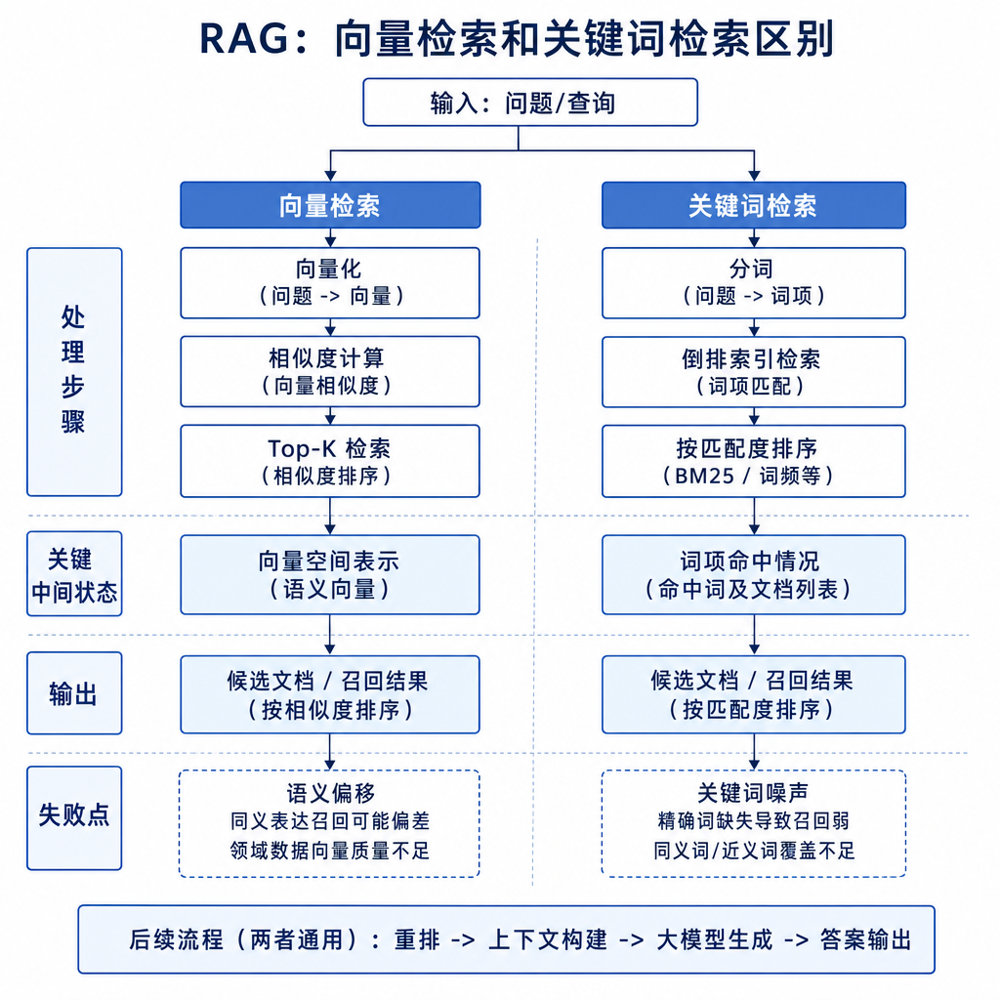
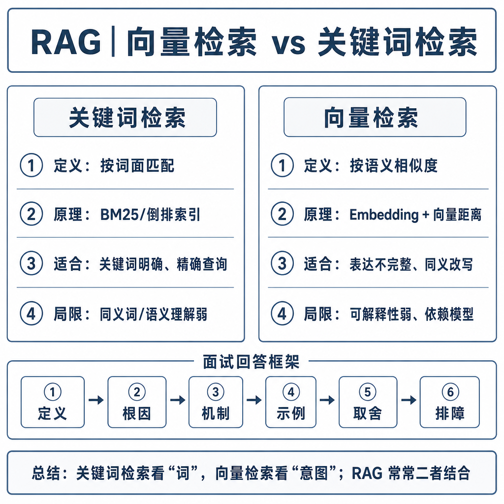

# 向量检索和关键词检索区别

RAG 面试里，很多人会把向量检索说成“更智能”，把关键词检索说成“老技术”。这会暴露一个问题：你没有做过真实检索失败分析。生产系统里，两者不是替代关系，而是互补关系。向量检索擅长语义相似，关键词检索擅长精确匹配，混合检索才是很多 RAG 系统的常态。

## 从真实失败现象切入

先看两个问题。

用户问：“我买了 10 天的耳机还能退吗？”文档写的是：“耳机类商品自签收之日起 15 天内可申请无理由退货。”这里用户没说“签收”“无理由退货”，但语义上明显相关。关键词重合少，向量检索更容易命中。

再看另一个问题：“E1024 报错怎么解决？”知识库有一篇文档叫《E1024：蓝牙模块初始化失败处理指南》。这里最关键的信息就是错误码 E1024。如果向量模型只抓到“蓝牙失败”这个大意，可能召回一堆常见蓝牙问题，却漏掉精确错误码文档。这个场景关键词检索更可靠。



## 核心矛盾：语义相似和精确命中

关键词检索看的是词项是否匹配。用户问题里出现了哪些词，文档里是否出现这些词，词频如何，这个词在整个语料库里是否稀有，都会影响排序。典型算法是 BM25。

向量检索看的是语义是否接近。它先用 embedding 模型把 query 和文档 chunk 转成向量，再计算向量距离。即使字面不一样，只要语义接近，也可能被召回。

两者各自解决不同问题。关键词检索对错误码、产品型号、函数名、法规条款、人名地名很强，因为这些信息必须精确出现。向量检索对口语化问题、同义改写、概念问答更友好，因为用户未必知道文档里的标准说法。

## 底层机制：BM25 和向量相似度各看什么

BM25 不需要你在面试里推公式，但要知道它大概考虑三件事：查询词是否出现在文档中；出现次数是否足够；这个词在全库里是否稀有。比如“退款”可能很多文档都有，区分度一般；“E1024”很稀有，一旦出现，相关性往往很高。

关键词检索的优点是速度快、成本低、可解释性强。你能看到命中了哪些词，也方便给错误码、型号、标题设置权重。缺点是不擅长同义表达和口语化问题。用户说“买了多久还能退”，文档说“签收后 15 天内可申请无理由退货”，关键词重合少，召回可能不稳。

向量检索的优点是能跨表达方式找语义相近内容。例如“退款多久到账”和“款项返还时间”字面不同，但语义接近。缺点是相似不等于相关，可能把“如何申请退款”召回给“退款多久到账”的问题；也可能对 E1024、SKU-8821、getUserById 这种符号不敏感。

## 工程例子：为什么生产常用混合检索

单独用关键词检索，会漏掉用户口语化表达。单独用向量检索，会漏掉精确符号，或召回语义接近但不能回答问题的片段。混合检索的思路是：两条路都走，召回阶段追求覆盖，排序阶段追求准确。

典型流程如下：

```text
用户问题
  → 向量检索召回 top_k
  → 关键词检索召回 top_k
  → 元数据过滤
  → 合并去重
  → Rerank 统一排序
  → 取最终上下文
```

用户问“E1024 报错，蓝牙连不上怎么办？”关键词检索能精确命中 E1024，向量检索能召回“蓝牙连接失败”相关片段。两路结果合并后，reranker 再判断哪个片段真正能回答当前问题。



## 结果融合：不要直接把分数相加

混合检索难点在融合。向量相似度和 BM25 分数不是同一个量纲，不能直接相加。常见方式有三类。

第一，简单合并去重。分别取两路 top_k，合并后交给下游。这容易实现，但排序质量一般。

第二，分数归一化后加权。比如把两路分数归一到相近范围，再按业务权重融合。权重不能拍脑袋，要用评测集调。

第三，Rerank 统一重排。召回阶段让 BM25 和向量检索尽量多给候选，精排阶段用 reranker 同时看 query 和文档内容，判断哪个片段更能回答问题。这是生产系统里很常见的做法。

还可以按问题类型动态调权重。检测到错误码、订单号、函数名、型号时，提高关键词权重；检测到口语化、概念解释、同义表达时，提高向量召回权重。

## 边界和风险：两种检索都会犯错

关键词检索的风险是“字面没对上就找不到”。文档写“款项返还”，用户问“多久到账”，如果没有同义词、改写或向量召回，就可能漏掉。

向量检索的风险是“看起来像但答不上”。用户问“退款多久到账”，召回“如何申请退款”，语义都和退款有关，但答案不相关。

混合检索也不是 top_k 越大越好。候选越多，rerank 成本越高；最终上下文越多，噪声越大。召回要保证覆盖，但上下文要控制质量。

还有元数据问题。旧政策和新政策都包含“退款”，关键词和向量都可能召回，必须依赖版本、生效时间、权限、产品线等元数据过滤或排序。

## 高频面试追问

- 向量检索和关键词检索有什么区别？
- BM25 大概根据什么排序？
- 为什么向量检索会召回语义相似但不相关的内容？
- 错误码、函数名、产品型号更适合哪种检索？
- 为什么生产 RAG 常用混合检索？
- 混合检索后如何融合和排序？
- top_k 调大一定能提升效果吗？

## 可复述答案

向量检索和关键词检索不是替代关系，而是互补关系。关键词检索基于词项匹配，适合错误码、编号、函数名、产品型号这类精确匹配场景，优点是快、便宜、可解释；向量检索基于语义相似度，适合用户问题和文档字面不同但语义接近的场景，优点是能处理同义表达和口语化问题。生产 RAG 常用混合检索，因为只用关键词会漏掉同义表达，只用向量会漏掉精确符号，也可能召回语义接近但不能回答问题的内容。常见做法是 BM25 和向量检索分别召回候选，合并去重后用 reranker 统一排序。



## 排查和实践建议

如果错误码问题总召回泛文档，说明关键词权重不足，或没有对错误码建字段索引。如果口语化问题召回不到，说明向量召回、query 改写或同义词扩展不足。如果召回结果主题相近但答不上问题，说明需要 rerank 或更细粒度分块。如果新旧政策混在一起，说明元数据过滤没有生效。

实践上，先给失败样本分类：精确符号类、同义表达类、版本权限类、排序错误类、上下文噪声类。再决定是加强 BM25、优化 embedding、增加 query 改写、引入 rerank，还是调整元数据过滤。好的检索系统不是选择“向量或关键词”，而是按问题类型动态组合多种召回方式。

---

[返回 RAG 模块目录](README.md)
