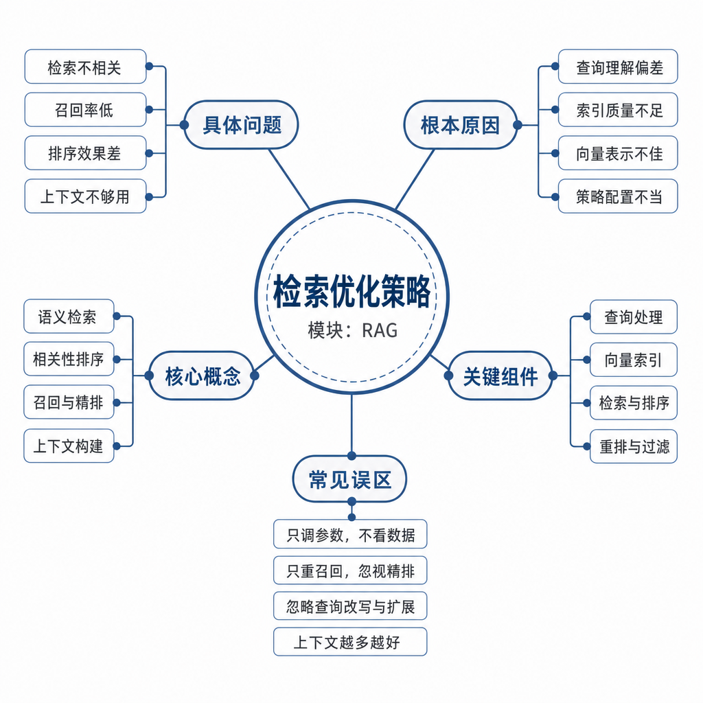
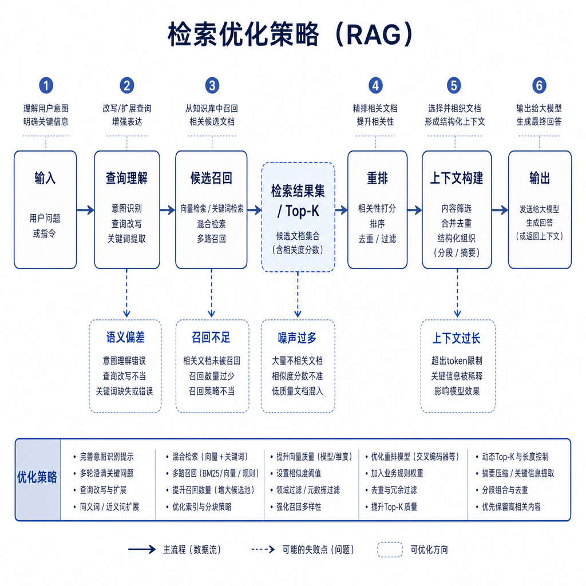
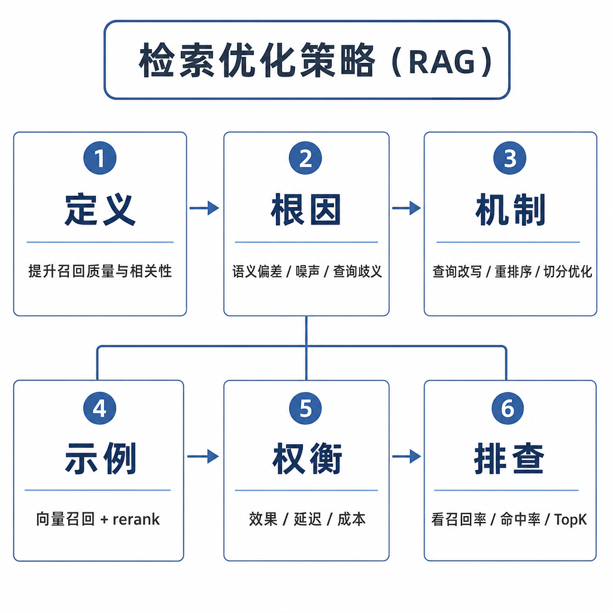

# 检索优化策略

RAG 从 demo 到生产，最大的分水岭不是能不能接向量库，而是答错时能不能定位原因。很多系统刚上线时看起来能跑：文档入库、向量检索、模型回答。但真实用户一来，就会出现答非所问、漏掉关键资料、引用旧政策、答案前后矛盾。面试问“RAG 效果不好怎么优化”，重点不是列工具，而是按链路排查。

## 从真实失败现象切入

用户问：“我买了 10 天的耳机还能退吗？”系统回答：“电子产品超过 7 天可能不支持无理由退款，建议联系客服确认。”但公司最新政策明明写着“耳机 15 天内可申请无理由退款”。

这个失败可能发生在很多层。最新政策可能没入库；入库时 PDF 表格被解析丢了；分块时“15 天”和“配件齐全”被切散了；向量检索没召回正确片段；正确片段召回了但排在 top_k 之外；rerank 把旧政策排到前面；上下文塞了太多资料，模型忽略关键片段；prompt 没约束模型基于资料回答。

所以检索优化不是一句“调大 top_k”或“换 embedding”。RAG 是链路系统，任何一环错，最终答案都可能错。



## 核心矛盾：召回、排序和上下文可用性

检索优化要同时平衡三个目标。

第一，召回率。正确资料必须进入候选集。如果答案 chunk 根本没被召回，后面的 rerank 和生成救不了。

第二，相关性。召回内容不能只是主题相近，而要真正回答问题。“如何申请退款”和“退款多久到账”都和退款有关，但不是同一个答案。

第三，上下文可用性。最终放进 prompt 的资料要完整、少噪声、有来源、版本正确。如果上下文里旧政策和新政策混在一起，模型很可能选错。

一句话记：召回阶段别漏答案，排序阶段把答案放前面，上下文阶段让模型看得懂、用得上。

## 第一层优化：数据质量和元数据

很多 RAG 问题不是模型问题，而是数据问题。正确资料没进知识库，系统再强也答不对。

先看文档是否完整。生产系统要有同步机制、增量更新、失败告警和版本记录。政策、价格、库存这类高频变化数据，不能靠人工偶尔上传。

再看清洗是否干净。PDF 页眉页脚、网页导航、版权声明、重复目录、乱码、广告内容都会污染 chunk。表格、代码块、标题层级、脚注也容易在解析时丢失。

还要看元数据是否准确。文档来源、更新时间、版本号、权限范围、产品线、地区、生效时间，都会影响召回和过滤。用户问 2026 年政策却召回 2024 年旧政策，很多时候不是检索不聪明，而是版本元数据没参与排序或过滤。

## 第二层优化：分块策略

分块决定知识库的最小检索单元。chunk 太大，退款、维修、发票、物流混在一起，向量表示会混杂；chunk 太小，主规则和限制条件分离，模型看到的信息不完整。

优化方式包括按标题层级切分、保留上级标题、设置合理 overlap、使用父子块检索、对不同文档类型使用不同切分器。技术文档按接口和参数切，合同按条款切，FAQ 按问答对切，代码按函数和类切。

分块优化一定要结合失败样本。模型总是漏掉例外条件，就看例外是否和主规则分离；召回片段总是很长很杂，就看 chunk 是否包含多个主题；检索命中了小段但生成缺背景，就考虑父子块。

## 第三层优化：Query 改写和问题理解

用户问题常常不适合直接检索。多轮对话里，用户可能先说“我买了个耳机”，下一轮问“这个还能退吗？”如果直接拿“这个还能退吗”去搜，召回质量会很差。

Query 改写要把问题补全成适合检索的形式，比如“耳机购买后是否支持退货，退货期限和条件是什么？”常见操作包括补全省略信息、提取实体和关键词、改写口语表达、扩展同义词、拆分复杂问题、结合历史对话消歧。

但改写也有风险。改写模型可能引入用户没说过的条件，或者把问题范围扩大。生产上最好保留原 query 和改写 query 做多路召回，并记录改写结果，方便回放问题。

## 第四层优化：多路召回和混合检索

单一路径召回容易漏答案。向量检索适合语义相似，但可能漏错误码、型号、函数名。关键词检索适合精确匹配，但不擅长同义表达。元数据过滤能处理版本、权限、地区、产品线。规则召回能覆盖高频固定问题。

生产系统常见做法是多路召回：

```text
向量检索
关键词检索
元数据过滤
规则召回
历史热门问题召回
```

然后合并去重，交给 reranker 排序。召回阶段宁可多拿一些候选，避免漏掉答案；但不能无限扩大 top_k，因为候选越多，精排成本越高，最终上下文噪声也可能越大。



## 第五层优化：Rerank 精排

向量相似度不等于答案相关。用户问“退款多久到账”，向量检索可能召回“如何申请退款”。这两个片段主题相近，但后者不能回答到账时间。

Reranker 会同时看 query 和候选文档，判断候选是否真正能回答问题。常见策略是先召回 50 条候选，再 rerank 选前 5 条放入 prompt。这样能在召回覆盖和上下文质量之间取得平衡。

精排也要看成本。Reranker 通常比单纯向量相似度更慢，高并发场景要控制候选数量、做缓存、分层精排，或只对低置信度请求启用。

## 第六层优化：上下文组装和生成约束

很多系统召回和排序没问题，最后仍答错，原因在上下文组装。常见问题包括放入太多片段、旧政策排在新政策前面、没有引用编号、多个片段冲突、标题和来源被丢掉、prompt 没要求资料不足时拒答。

优化方式包括去重相似 chunk、按相关性和时间排序、保留标题来源版本、控制上下文长度、对长片段压缩、明确要求只基于资料回答、要求输出引用来源。对于冲突资料，要有规则决定信哪一个，比如优先生效时间最新、权限范围匹配、来源权威级别更高的文档。

生成约束不是万能，但很必要。模型必须知道资料不足时可以说“不确定”，否则它会倾向于补全一个流畅答案。

## 第七层优化：评测集和闭环

没有评测集，RAG 优化很容易变成玄学。一个基本评测集至少包含用户问题、标准答案、应召回文档、不应召回文档、问题类型标签和失败原因记录。

评测要分层看。检索层看相关文档是否进入 top_k；排序层看相关文档是否排在前面；生成层看答案是否正确、完整、有引用；安全层看资料不足时是否拒答。每次改分块、embedding、top_k、rerank 或 prompt，都要跑同一套评测集，避免只修好几个样例却伤害整体效果。

## 边界和风险：优化不是越多越好

top_k 不是越大越好。调大可以提高召回覆盖，但会增加 rerank 成本和上下文噪声。overlap 不是越大越好，重复片段会占索引和 prompt。query 改写不是越复杂越好，改写错误会污染检索。rerank 不是无成本，高并发下可能成为延迟瓶颈。

还有一个风险是只看最终答案，不看中间链路。最终答错时，如果没有记录 query、召回结果、rerank 分数、上下文和模型输出，就无法定位问题。生产 RAG 必须保留可回放日志。

## 高频面试追问

- RAG 检索效果不好怎么排查？
- 如何提高召回率？
- Rerank 的作用是什么？
- Query 改写解决什么问题，有什么风险？
- 为什么不能只调大 top_k？
- 上下文组装会导致哪些问题？
- RAG 系统如何做评测和线上闭环？

## 可复述答案

RAG 检索优化要按链路排查，不能一上来就调 prompt 或换 embedding。我会先确认数据是否完整、清洗是否干净、元数据是否正确；再检查分块是否把关键条件切断；然后看 query 是否需要改写，多轮问题是否补全；接着看召回阶段是否命中相关文档，是否需要混合检索；如果召回到了但排序不好，就引入 rerank；最后检查上下文组装和生成约束。优化目标不是召回越多越好，而是让相关资料被召回、排在前面，并以清晰、少噪声、可引用的形式放进 prompt。生产系统还需要评测集，把检索、排序和生成分层评估。



## 排查和实践建议

线上用户反馈 RAG 答错，可以按这个顺序查：正确资料是否存在；资料是否同步入库；清洗是否丢内容或混入噪声；chunk 是否包含完整规则；query 是否需要补全或改写；正确 chunk 是否进入召回候选；正确 chunk 是否排在前面；上下文是否太长、重复或冲突；模型是否严格基于资料回答；这个失败是否代表一类问题。

实践上，给每次请求记录 query、改写 query、召回列表、rerank 分数、最终上下文、模型答案和引用。定期把失败样本回流到评测集，按问题类型统计失败原因。这样优化才不是凭感觉，而是能从“RAG 不准”定位到“哪一层不准”。

---

[返回 RAG 模块目录](README.md)
