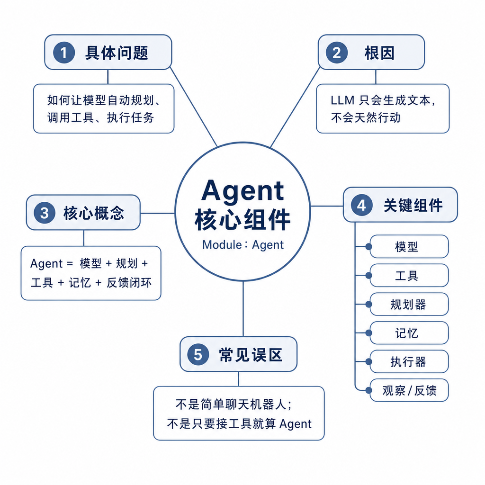
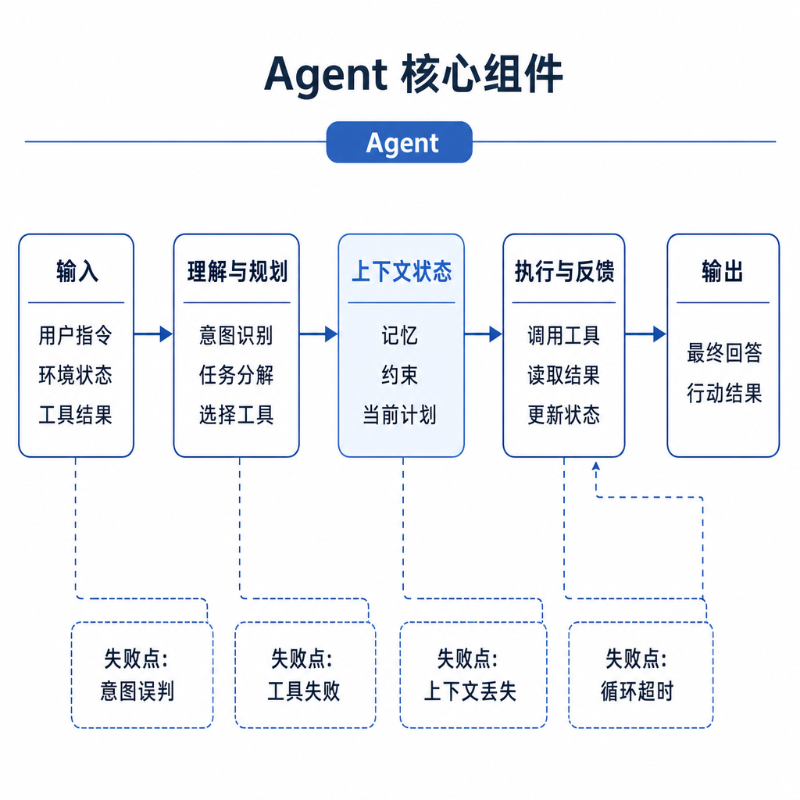
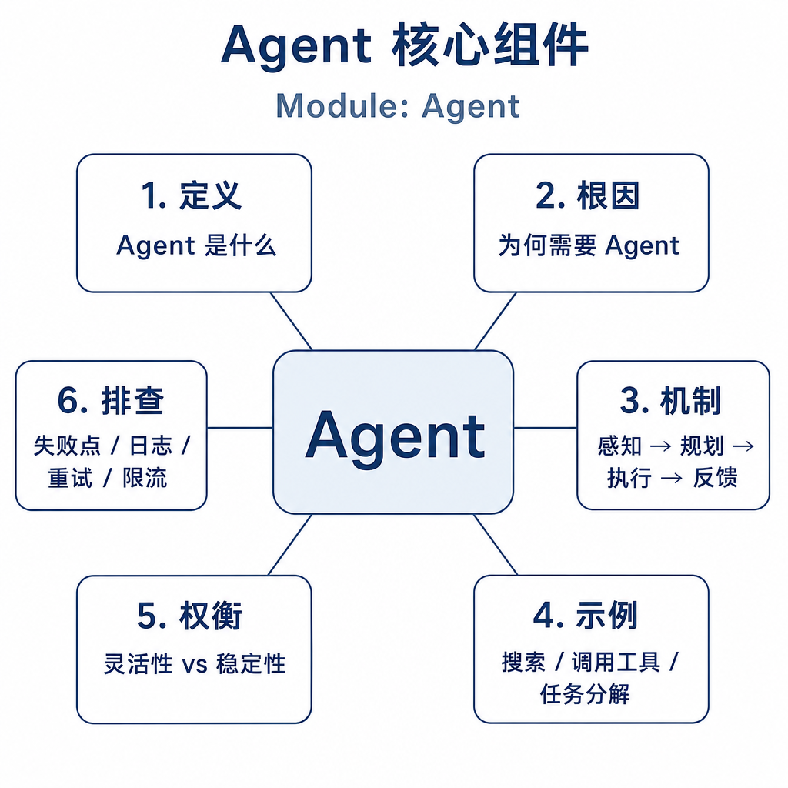

# Agent 核心组件

线上客服机器人最怕一种失败：用户说“查一下我上周退款失败的订单，如果符合规则就重新提交”，机器人先去搜 FAQ，又凭订单号格式猜了一个接口参数，最后回复“已经处理”。客服后台却没有任何退款记录。用户以为系统耍他，研发排查半天才发现：模型只是生成了看似合理的话，工具调用失败后没有重试，也没有把失败暴露出来。

这就是面试问 Agent 核心组件时真正想考的点。Agent 不是“会聊天的大模型加几个接口”，而是一个能围绕目标行动、观察结果、修正路径、控制风险的工程系统。

## 核心矛盾：模型会生成，但系统要负责行动

LLM 的强项是理解语义、生成计划和组织语言，但它不会天然知道任务有没有完成，也不会天然遵守业务权限。把 `LLM + tool` 直接叫 Agent，会漏掉三个关键问题。

第一，目标没有被显式表示。用户说“帮我处理退款”，到底是查询原因、提交申请，还是直接打款？如果没有可验收目标，模型只能沿着上下文续写。

第二，工具没有工程边界。接口调用成功只说明 HTTP 返回了 200，不代表业务成功；参数通过也不代表用户有权限；重复调用也可能导致重复退款。

第三，缺少反馈闭环。工具超时、返回空数据、权限不足时，Agent 必须知道下一步是重试、换工具、追问用户，还是停止，而不是编一个“已完成”。

## 底层机制：一个 Agent 至少要有六层

工程化 Agent 通常可以拆成六个组件。

目标层负责把用户意图变成可执行目标。比如“处理退款”要拆成身份校验、查询订单、判断政策、生成退款申请、等待确认等子目标。目标要能验收，不能只写成“让用户满意”。

规划层决定先做什么、后做什么。简单任务可以一次性生成计划；开放任务更适合边执行边调整。规划不是越长越好，真正有用的是让每一步都有输入、输出和退出条件。

工具层连接外部系统，包括数据库、HTTP API、浏览器、文件系统、代码执行器和企业服务。工具要有名称、描述、参数 schema、权限等级、超时、重试和错误码。

记忆层保存状态。短期记忆记录本轮任务的目标、已读材料、工具结果和待办动作；长期记忆记录稳定偏好和经过验证的事实。记忆不是聊天记录仓库，写入必须谨慎。

执行层把模型的工具请求变成真实调用，并负责鉴权、限流、幂等、沙箱和回滚。模型只提出“想调用什么”，真正能不能调用，由宿主系统决定。

反馈层根据工具返回、规则校验、评审模型或人工确认来修正下一步。没有反馈层，Agent 就会把失败当成功。

## 工程例子：自动周报为什么不能只让模型写

假设你做“自动生成项目周报”。最粗糙的做法是把聊天记录丢给模型，让它总结。问题很快出现：模型会遗漏高优先级工单，引用不存在的需求，甚至把上周的进展当成本周成果。

可靠设计应该是这样：目标层明确周报要包含“进展、风险、下周计划”；规划层决定读取日程、代码仓库、工单系统和会议纪要；工具层分别查询合并请求、需求状态和缺陷列表；短期记忆记录已经读取过哪些项目；反馈层检查工单编号是否真实、风险是否有负责人、下周计划是否能落到任务。

如果某个系统不可用，Agent 要写“工单系统查询失败，缺少缺陷数据”，而不是用通用话术补齐。面试里能讲出这种缺失处理，比背“规划、记忆、工具”更有说服力。

## 边界和风险：什么时候不要让 Agent 自己决定

Agent 最危险的地方是可写工具。发邮件、提交代码、删文件、转账、审批、改数据库都属于高风险动作。模型可以建议，但不能绕过权限系统直接执行。工程上要把工具分成只读、低风险写入和高风险写入。高风险动作必须有用户确认、审计日志和回滚方案。

第二个风险是上下文膨胀。Agent 运行越久，历史消息、工具结果、计划和记忆越多。上下文太长会让模型注意力分散，也会增加成本。要做摘要、状态压缩和证据筛选，只把当前决策需要的信息放进去。

第三个风险是无限循环。模型可能不断搜索、总结、再搜索，看起来很努力，实际上没有推进。系统必须设置最大步数、最大费用、超时、失败次数和停止条件。

还要记住：并不是所有场景都需要 Agent。流程固定、规则明确、风险很高的业务，优先用 Workflow。Agent 更适合信息不完整、路径不确定、需要动态使用工具的任务。

## 面试高频追问

- Agent 和普通 Chatbot 的区别是什么？
- 一个最小可用 Agent 需要哪些组件？
- 工具调用成功但任务失败，你怎么定位？
- 如何防止 Agent 乱调用工具或无限循环？
- 什么时候不用 Agent，而用普通 Workflow？

## 可复述答案

Agent 是围绕目标进行多步决策和行动的大模型系统。它不只是生成文本，而是会理解目标、规划步骤、调用工具、读取状态、观察结果，并根据反馈调整下一步。工程上至少要关注目标、规划、工具、记忆、执行控制和反馈闭环。模型负责推理和生成工具请求，宿主系统负责权限、参数校验、执行、审计和回滚。适合用 Agent 的场景通常路径不确定、信息不完整、需要组合工具；流程固定或高风险动作，应该优先交给 Workflow 和规则系统。

## 排查和实践建议

排查 Agent 线上问题时，不要只看最终回答，要看完整 trace：用户目标是否被正确抽取，计划是否合理，工具是否选对，参数是否通过 schema，工具返回是否被正确理解，失败是否触发回退，终止条件是否生效。

设计时先问四个问题：目标能不能验收，工具能不能控权，状态能不能回放，失败能不能恢复。如果这四个问题答不上来，就算模型效果看起来不错，也只是演示系统，不是可上线 Agent。
