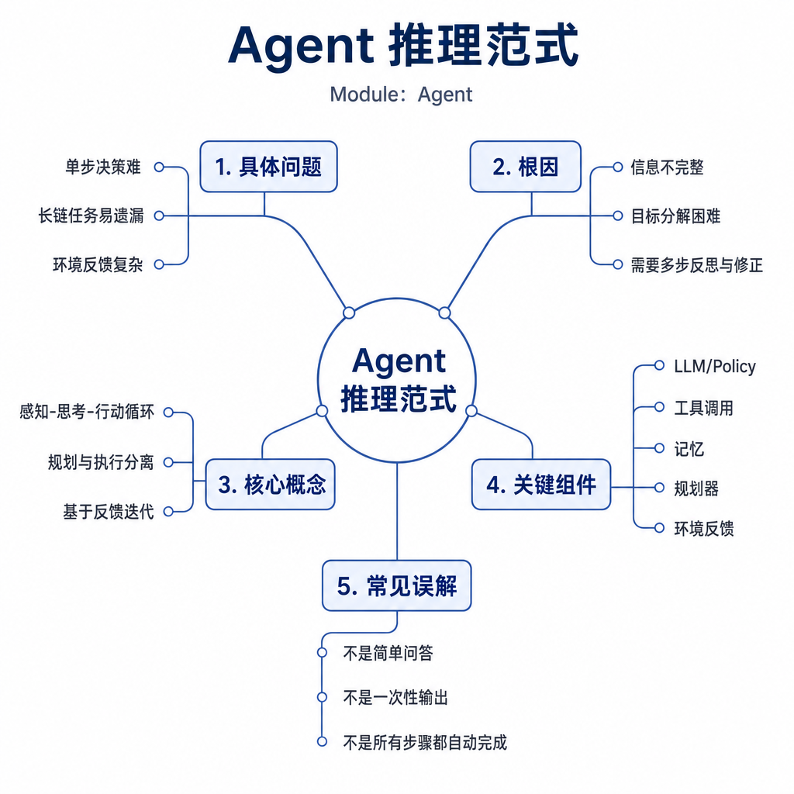
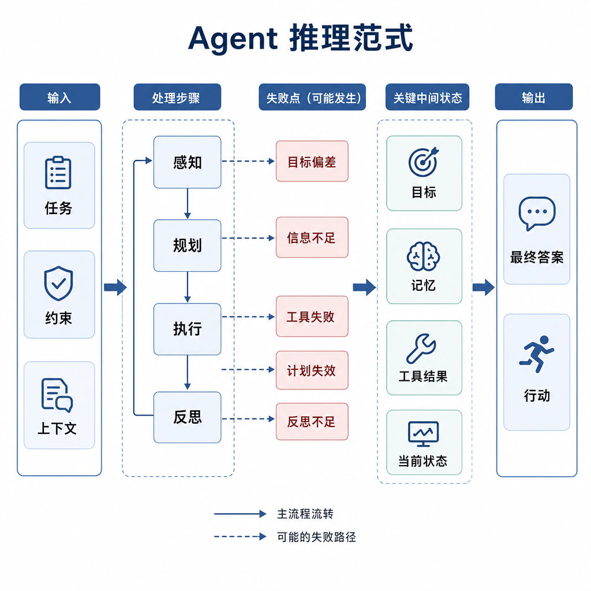
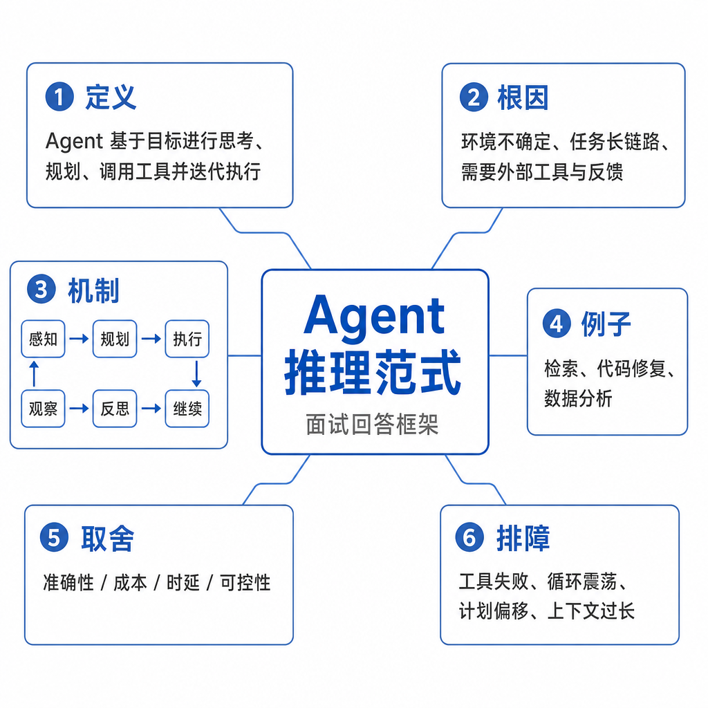

# Agent 推理范式

一个排障 Agent 上线后表现很奇怪：它能查日志、能读配置、能跑命令，但每次都像无头苍蝇。遇到构建失败，它先改依赖，再看报错；遇到慢查询，它反复执行同一个 explain；遇到权限错误，它总结一大段原因，却没有检查 token。工具都在，结果仍不稳定，根因通常是推理范式没设计好。

面试问 Agent 推理范式，不是让你背 ReAct、Reflection 这些名词，而是看你能否说明：模型什么时候想，什么时候做，什么时候看结果，什么时候修正，什么时候停。

## 核心矛盾：LLM 会续写，不天然会控制流程

LLM 本质上根据上下文预测下一个 token。它可以生成“下一步我应该检查日志”，也可以生成“问题已经修复”，但它本身没有稳定的任务状态机。推理范式就是给模型套一层认知脚手架，把开放生成约束成可执行流程。

没有范式时，Agent 常见三类问题。第一是过早行动，还没确认目标和权限就调用工具。第二是反复行动，搜索、总结、再搜索，成本上升但证据没有增加。第三是不可解释，最终结论看似正确，却不知道它依据哪些观察。

常见范式包括 ReAct、Plan-and-Execute、Reflection、Tree of Thoughts，以及多角色评审。它们不是互斥的产品标签，而是不同的控制策略。

## 底层机制：四种范式解决不同问题

ReAct 把 reasoning 和 acting 交替进行。模型先判断下一步需要什么信息，再调用工具，拿到 observation 后继续判断。它适合信息不完整的任务，比如“线上接口 500 是什么原因”。好处是灵活，坏处是容易走一步看一步，需要步数和预算限制。

Plan-and-Execute 先规划再执行。模型先列出“收集错误日志、定位失败模块、读取配置、修改代码、运行测试”，然后按计划推进。它适合目标明确、步骤相对稳定的任务。风险是初始计划错了还继续执行，所以工程上常加入 replanning：观察结果和计划冲突时重新规划。

Reflection 在执行后做自检。比如代码生成后检查是否满足需求、是否引入安全风险、是否需要补测试。它能提升质量，但不是万能保险。模型可能“自信地修错”，也会增加 token 成本。因此 Reflection 更适合结果可验证的任务，不适合替代真实测试。

Tree of Thoughts 或多路径搜索会保留多个候选解，再比较选择。它适合方案设计、数学推理、复杂排障等搜索空间大的问题。代价是成本高、延迟长，必须设置分支数量和剪枝规则。

## 工程例子：慢查询诊断怎么选范式

假设你要做数据库慢查询诊断 Agent。用户给出一条 SQL，说“最近变慢了，帮我看原因”。如果只用 ReAct，Agent 可能先看执行计划，再查索引，再看表大小，每一步根据结果变化，很适合探索。但如果没有全局计划，它可能遗漏“最近数据量变化”和“统计信息是否过期”。

如果只用 Plan-and-Execute，可以先固定流程：收集 SQL、查看执行计划、检查索引、查看数据分布、比较历史耗时、输出建议。流程更稳，但遇到权限不足或 SQL 被改写时，需要重新规划。

更可靠的做法是混合：先生成粗计划，再用 ReAct 执行每一步，最后用 Reflection 检查建议是否包含风险、回滚方式和验证 SQL。比如建议新增索引时，必须说明写入放大、磁盘占用和灰度验证，而不是只给一句“加索引”。

## 边界和风险：范式越复杂，不等于越可靠

ReAct 的风险是循环和工具滥用。系统要记录每次观察是否带来新信息，重复无收益时停止。Plan-and-Execute 的风险是错误计划被机械执行，所以要允许中途打断和重规划。Reflection 的风险是把正确结果改坏，所以要和测试、规则校验、人工评审结合。多路径推理的风险是成本爆炸，所以要限制分支和深度。

安全上，模型的“思考文本”不能直接变成命令。即使模型写出 `rm -rf` 或 SQL 更新语句，也必须经过工具 schema、权限检查、沙箱和人工确认。产品里通常也不展示完整内部思维链，而是展示可审计的计划、工具调用、观察结果和结论依据。

还要知道什么时候不用 Agent 推理范式。如果任务是固定审批流、固定 ETL、固定报表，Workflow 比 Agent 更可控。不要为了显得智能，把确定性流程变成模型自由决策。

## 面试高频追问

- ReAct 和 Plan-and-Execute 的本质区别是什么？
- Reflection 为什么能提升质量，又为什么可能失败？
- 多路径推理适合什么场景？
- 如何防止 ReAct 无限循环？
- 推理范式和 Workflow 是什么关系？

## 可复述答案

Agent 推理范式是组织模型“想、做、看结果、再调整”的控制方式。ReAct 适合信息不完整、需要边查边做的任务；Plan-and-Execute 适合目标明确、步骤相对稳定的任务；Reflection 用自检提高结果质量，但要结合外部验证；Tree of Thoughts 通过多候选路径处理复杂推理，但成本更高。工程选型要看任务不确定性、工具风险、预算和可验证性。可靠系统常常混合多种范式，并用步数、权限、日志和停止条件兜底。

## 排查和实践建议

排查时看每一步四件事：当前目标是什么，模型为什么选择这个工具，工具观察带来了什么新信息，下一步决策是否和观察一致。如果日志里只有最终答案，没有计划、工具参数和观察结果，这个 Agent 很难维护。

设计时先判断任务类型：信息完整且流程固定，用 Workflow；信息不完整但动作低风险，用 ReAct；步骤稳定但可能有异常，用 Plan-and-Execute 加 replanning；结果需要高质量输出，加 Reflection；方案空间很大，再考虑多路径搜索。
