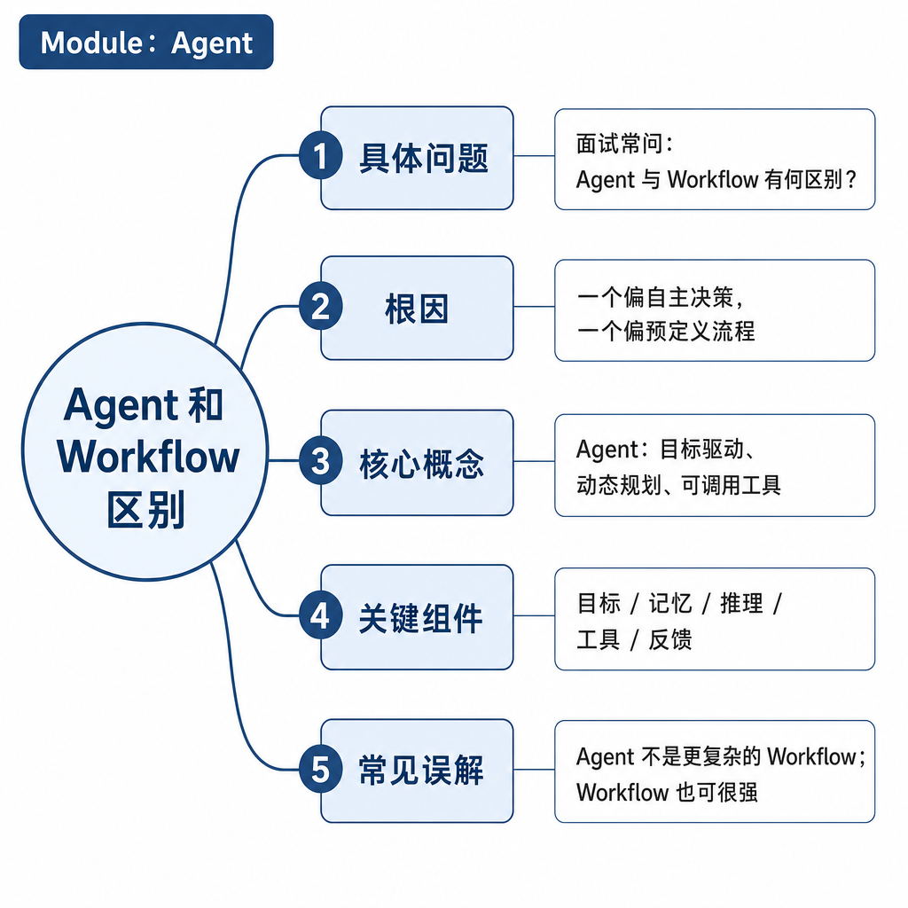
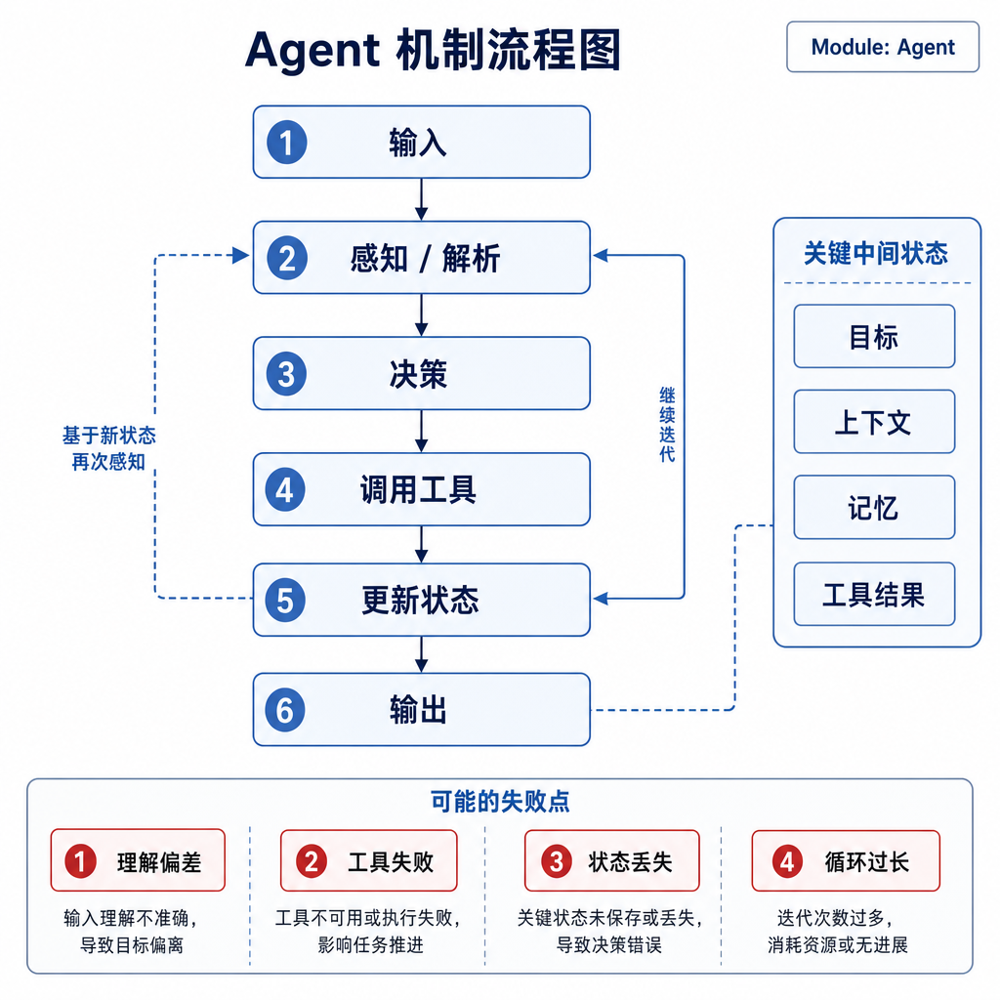
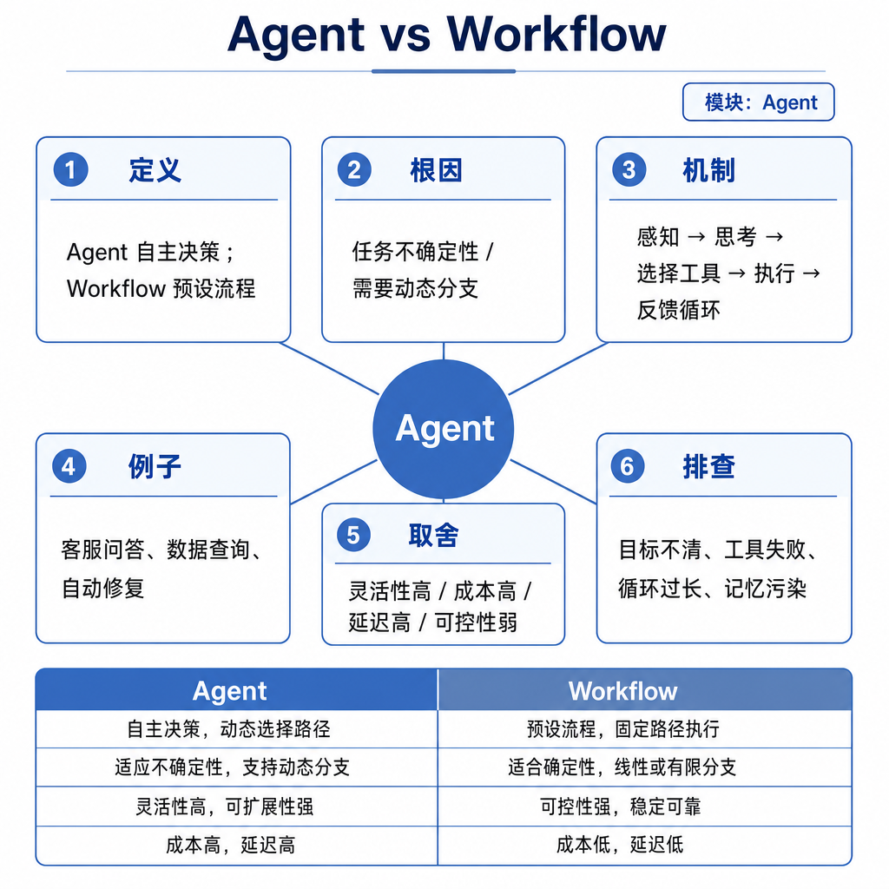

# Agent 和 Workflow 区别

很多企业项目失败在一个误判：明明业务流程固定，却为了“智能化”硬上 Agent；或者任务路径开放，却用一堆 if-else Workflow 覆盖所有分支。前者会出现成本高、结果不稳定、审计困难；后者会出现规则爆炸、没人敢改。面试问 Agent 和 Workflow 的区别，核心不是背定义，而是判断控制权应该交给代码，还是交给模型。

## 核心矛盾：确定性流程和不确定性探索

Workflow 是开发者提前编排好的流程。上传文件、OCR、字段抽取、人工复核、入库，每一步输入输出清楚，异常也能提前设计。Agent 则是模型根据目标和中间反馈动态决定下一步。比如“分析这个仓库为什么构建失败”，它可能先读日志，再查依赖，再改配置，再运行测试。

区别的根因是任务不确定性。流程固定、规则明确、动作风险高，Workflow 更适合；信息不完整、路径不可预期、需要组合工具探索，Agent 更有价值。

## 底层机制：控制流在哪里

Workflow 的控制流在代码里。模型可以作为某个节点的能力，比如在客服质检流程里判断情绪、生成摘要、抽取投诉原因，但是否进入复核、是否处罚坐席，由规则引擎或业务系统决定。

Agent 的控制流更多在运行时产生。模型不仅生成文本，还会决定调用哪个工具、下一步查什么、是否需要追问、什么时候停止。它像一个动态调度器，但这个调度器并不天然可靠，所以要加权限、预算、状态和审计。

测试方式也不同。Workflow 可以为每个节点写单元测试和集成测试：输入什么，输出什么，异常怎么走。Agent 更依赖轨迹评测、工具 mock、端到端样本、回放和人工标注。可观测性也不同：Workflow 看节点耗时、失败率和队列堆积；Agent 还要看计划质量、工具选择准确率、循环次数、人工接管率和 token 成本。

## 工程例子：发票报销助手怎么拆

假设要做“发票报销助手”。发票识别、金额校验、预算科目匹配、审批流转，适合 Workflow。因为财务规则明确、审计要求高，系统必须保证同样输入得到同样处理结果。

用户问“这张发票为什么被拒”，就可以用 Agent。它需要查询发票信息、读取审批意见、匹配报销规则、解释原因，并给出补充材料建议。这个过程路径不固定，用户的问题也多变，Agent 更适合做解释和排查。

所以同一个产品里可以同时存在 Workflow 和 Agent：Workflow 承载主链路，Agent 处理非标准问题。不要把它们看成二选一。

## 边界和风险：什么时候不用 Agent

强流程场景不要让 Agent 自由决策。审批、转账、删库、发公告、改权限、提交生产配置，这些动作不能只凭模型判断执行。模型可以提供建议，但最终动作要由规则、权限和人工确认控制。

开放探索场景也不要硬写 Workflow。比如“帮我定位性能下降原因”，你很难提前枚举所有可能：代码变更、数据库索引、缓存穿透、流量峰值、依赖服务、配置变更都可能相关。如果每遇到一个新情况就加规则，系统会越来越脆。

还有一种混合风险：开发者以为用了 Workflow 就安全，但把关键判断交给模型自由输出。比如模型输出“通过”两个字就触发付款，这仍然不安全。正确方式是让模型输出结构化字段，系统再用规则校验、权限控制和人工确认决定动作。

## 面试高频追问

- Agent 和 Workflow 最本质的区别是什么？
- 什么场景不适合用 Agent？
- Workflow 里能不能使用大模型？
- 为什么很多企业项目采用 Agent + Workflow？
- 如何把 Agent 放进稳定业务流程？

## 可复述答案

Agent 和 Workflow 的核心区别是控制权。Workflow 的步骤由开发者提前编排，适合流程固定、规则明确、风险高、需要审计的场景；Agent 的下一步由模型结合目标和反馈动态决定，适合信息不完整、路径不确定、需要工具组合的探索场景。二者不是对立关系，工程上常用 Workflow 固定主链路，用 Agent 处理解释、排查和非标准问题。高风险动作必须由权限、规则、幂等和人工确认兜底，不能让模型自由执行。

## 排查和实践建议

做方案设计时先画任务状态机。如果能明确枚举状态、输入、输出和异常分支，优先 Workflow。如果无法预知路径，需要动态搜集证据和组合工具，再考虑 Agent。

排查线上问题时也按这个思路分层。Workflow 问题看节点、规则、队列和补偿；Agent 问题看目标抽取、计划、工具选择、观察结果和停止条件。面试中记住一句话：用 Workflow 承载确定性，用 Agent 处理不确定性。
