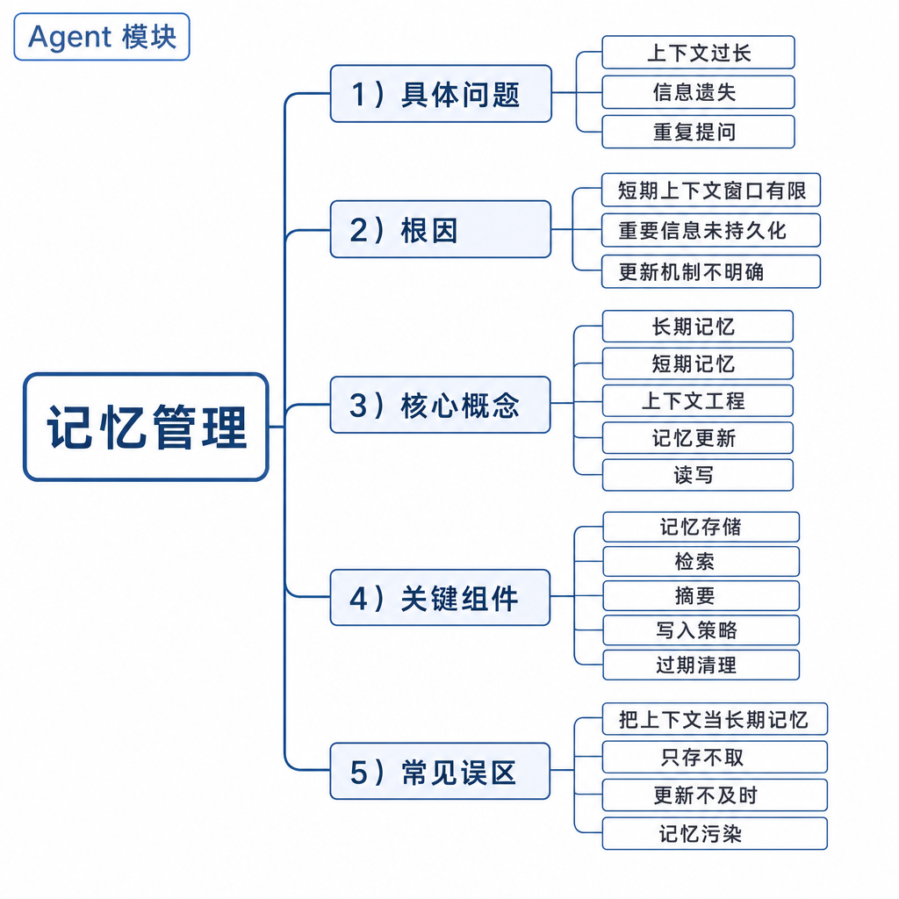
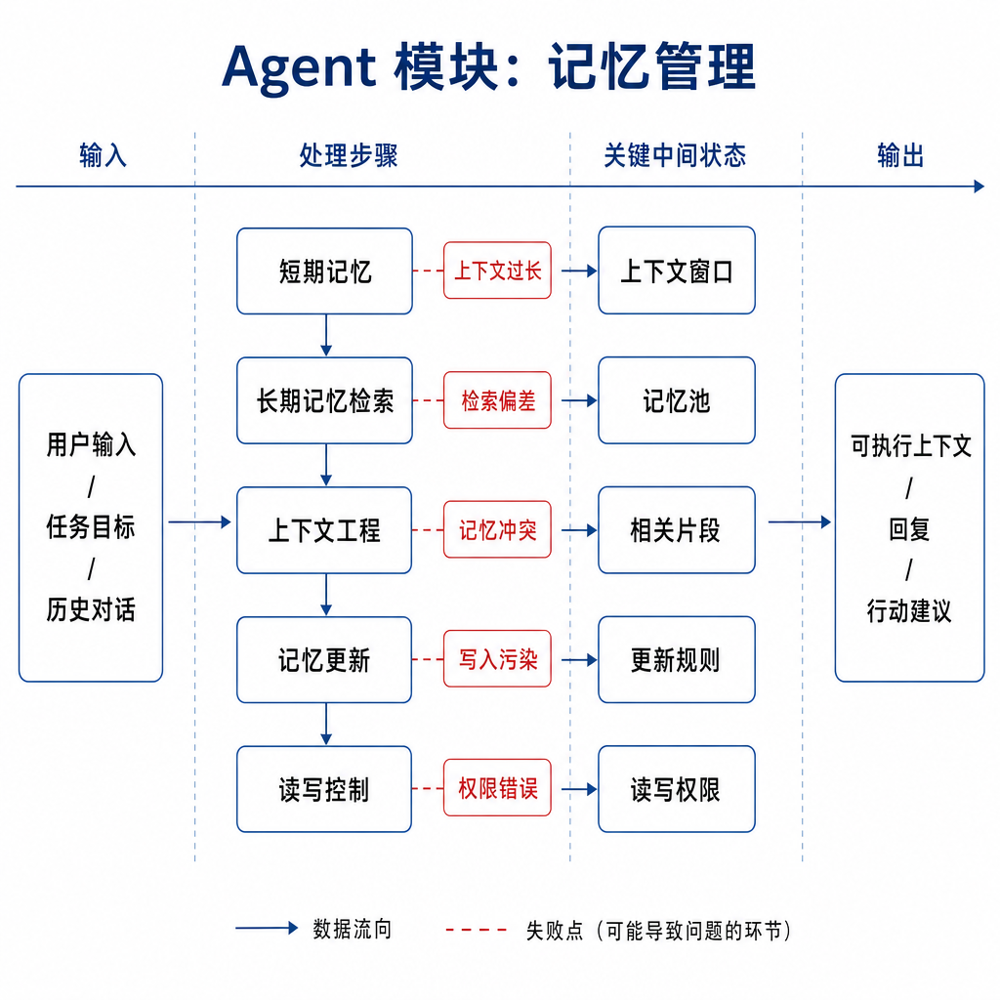
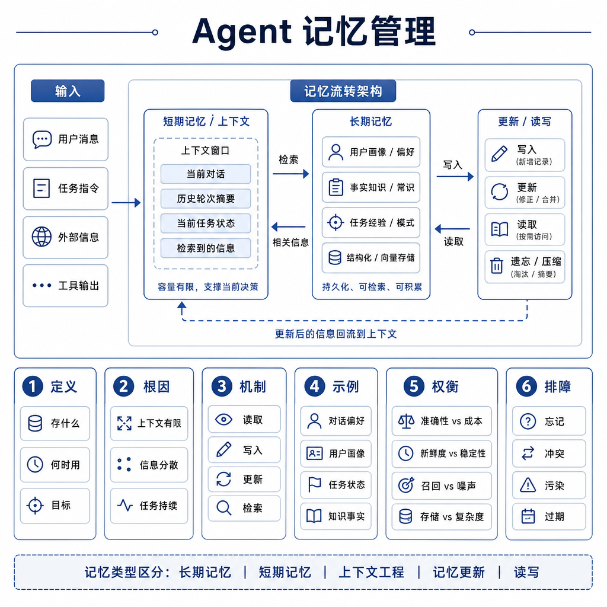

# 记忆管理：长期记忆、短期记忆、上下文工程、记忆更新和读写

一个私人助理 Agent 第一天记住“用户不喜欢周一早会”，第二天却把一句玩笑话“以后都别给我安排会议”写进长期记忆，结果自动拒绝了所有会议邀请。用户以为系统在帮忙，实际已经造成业务事故。这个例子说明，记忆管理不是把聊天记录塞进向量库，而是决定什么该记、什么时候记、怎么用、怎么删。

面试问 Agent 记忆，重点不是存储选型，而是短期记忆、长期记忆、上下文工程和读写策略如何协同。

## 核心矛盾：连续性有价值，错误记忆会长期污染

没有记忆的 Agent 每轮都像第一次见你，无法延续任务。比如代码助手不知道已经读过哪些文件，客服助手不知道用户刚完成身份校验，都会重复提问。

但记忆太随意也危险。错误工具结果、用户情绪化表达、未经验证的推测，一旦写入长期记忆，会在后续任务里反复影响模型判断。上下文越来越长，模型也会抓不住重点。

所以记忆系统要回答四个问题：什么值得记，何时写入，如何检索，何时遗忘或修正。

## 底层机制：短期、长期和上下文工程

短期记忆服务当前任务。它保存用户目标、当前计划、工具返回、中间状态和待确认动作。它可以是消息列表、scratchpad、状态对象或任务 trace。关键是结构化。比如订单 Agent 不能只记“用户要退款”，还要记 `user_id`、`order_id`、`verified`、`policy_checked`、`pending_action`。

长期记忆服务跨任务连续性。它保存稳定偏好、用户资料、项目约定和经过验证的事实。比如“这个仓库提交前必须运行 `npm test`”“用户偏好中文回答”。长期记忆不能写入临时情绪，也不能写入未经确认的推断。

上下文工程负责在每次模型调用前挑选信息。不是把所有记忆都塞进去，而是根据任务相关性、时间、来源、权限和置信度筛选。向量检索适合语义相似内容，关系数据库适合结构化事实，知识图谱适合实体关系，但存储技术不能替代治理策略。

## 工程例子：代码助手如何使用记忆

在代码助手里，短期记忆记录当前需求、已读文件、修改计划、测试结果和用户刚刚补充的限制。比如“不要改生成文件”“只修复登录页错误”。这些状态随着任务结束可以归档或丢弃。

长期记忆记录稳定规则，例如“项目使用 pnpm”“提交前要跑 lint”“团队不接受大范围重构”。当用户说“按我们之前的风格改接口”，Agent 不能只凭模糊记忆下结论，而要检索上次任务摘要，读取当前代码，再把必要约束放进上下文。

如果长期记忆和当前仓库冲突，以当前文件和用户显式指令优先。比如记忆里写“项目用 Jest”，但仓库已经迁移到 Vitest，Agent 必须相信当前代码，而不是旧记忆。

## 边界和风险：记忆不是越多越好

写入风险最大的是“把推测当事实”。用户说“我可能更喜欢简洁一点”，不能写成“用户永远喜欢极简风格”。工具返回错误也不能直接进入长期记忆。写入前要做抽取、去重、来源记录、可信度判断和敏感信息过滤。

安全风险也很现实。记忆可能包含手机号、密钥、客户数据、内部代码和商业策略。多租户系统里必须做隔离，不能让 A 用户检索到 B 用户记忆。用户还需要查看、修改和删除记忆的能力。

还有上下文污染。检索出的旧记忆如果与当前任务无关，却被塞进 prompt，会让模型跑偏。工程上要限制注入数量，给记忆加标签、时间戳、来源和置信度。

## 面试高频追问

- 短期记忆和长期记忆有什么区别？
- 为什么不能把所有历史对话都塞进上下文？
- 长期记忆写入前要做哪些校验？
- 记忆和 RAG 有什么区别？
- 记忆污染后怎么修复？

## 可复述答案

Agent 记忆管理是让系统在当前任务和跨任务中保持连续性的机制。短期记忆保存当前对话、计划、工具观察和临时状态；长期记忆保存稳定偏好、项目约定和经过验证的事实；上下文工程负责按任务选择要注入模型的信息。可靠记忆系统不仅是存储，还包括抽取、去重、权限、来源、置信度、过期和删除。工程上要避免把猜测、敏感信息和错误工具结果写入长期记忆，否则会造成持续污染。

## 排查和实践建议

排查记忆问题时看三段日志：写入时的原始证据，检索时召回了哪些记忆，注入模型前最终上下文是什么。如果答案被旧信息带偏，检查相似度阈值、时间衰减、重排策略和注入上限。如果用户偏好没有生效，检查是否写入失败、权限不匹配或上下文预算不足。

设计时坚持“少写、可解释、可删除、可回放”。长期记忆宁可少一点，也不要把不可靠信息长期放大。
