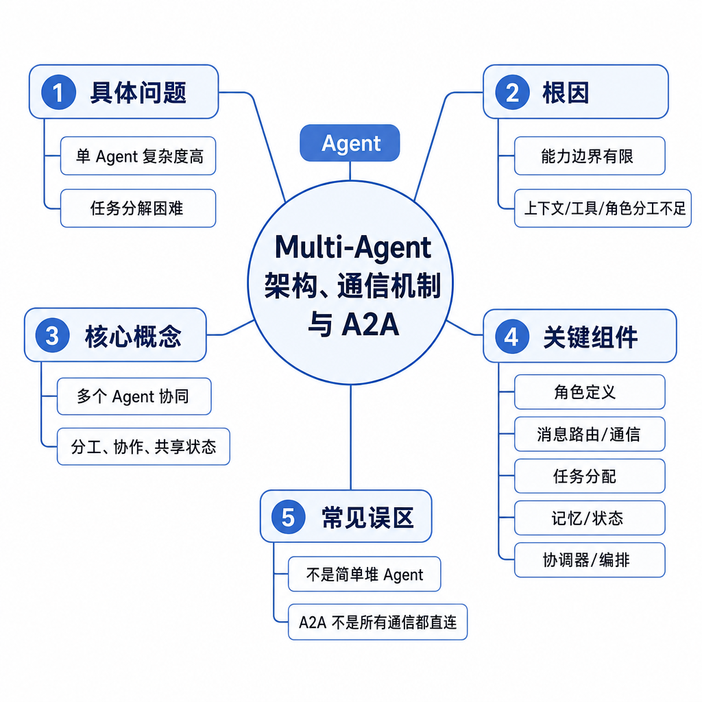
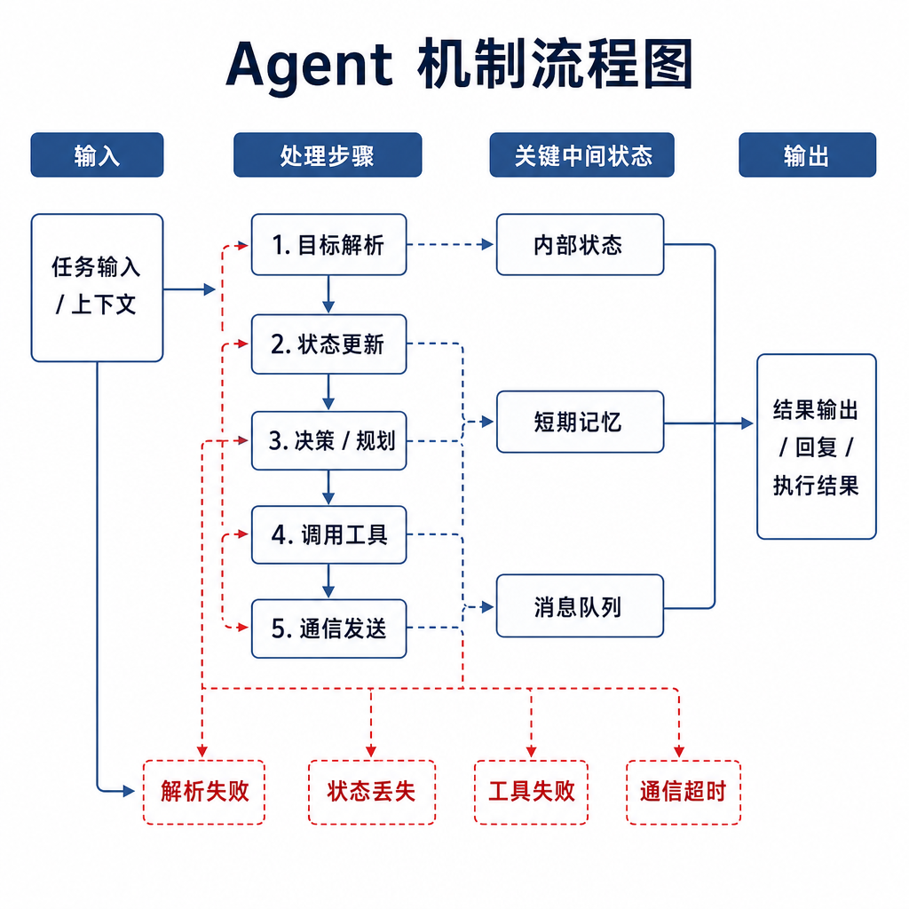
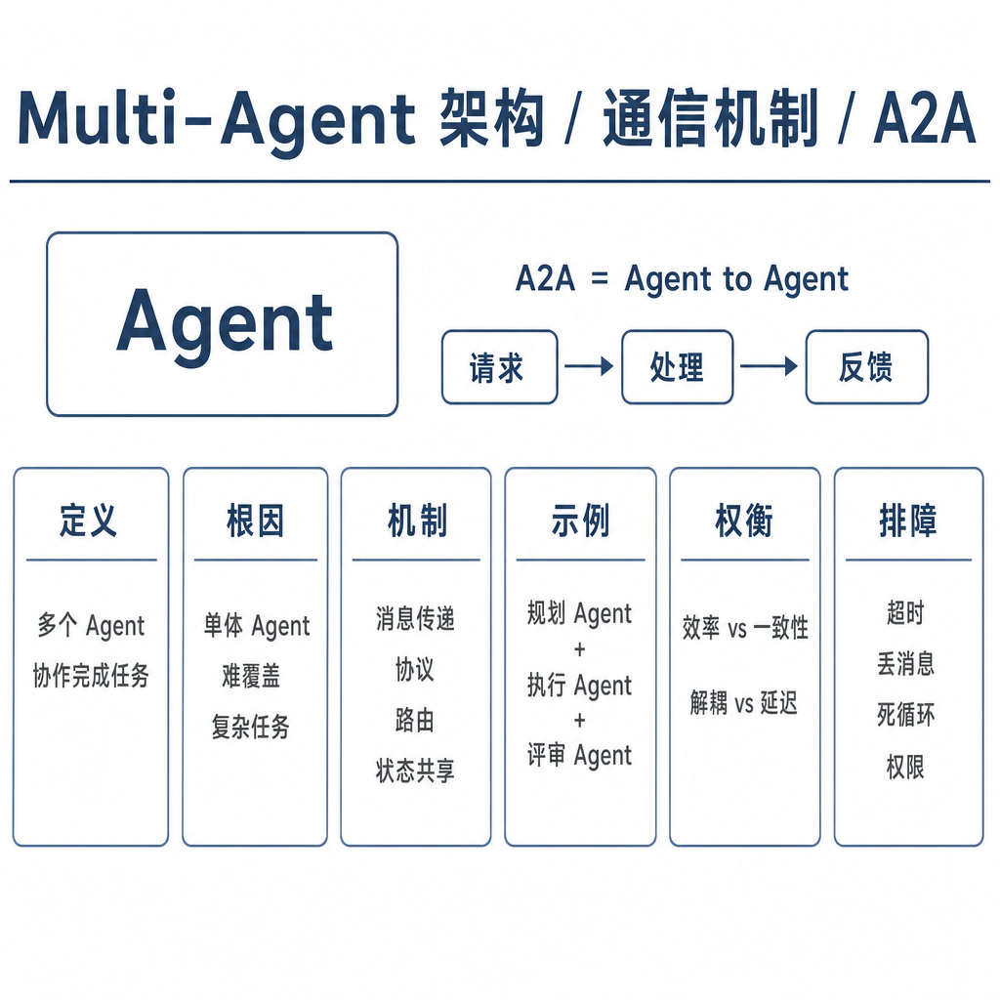

# Multi-Agent 架构、通信机制与 A2A

有些团队做复杂任务时，一上来就拆出“规划 Agent、检索 Agent、编码 Agent、测试 Agent、总结 Agent”。看起来很专业，实际运行后几个 Agent 互相重复提问、结论冲突、成本翻倍，最后还不如一个单 Agent 稳。Multi-Agent 的价值不在数量，而在分工是否必要、通信是否结构化、冲突是否能裁决。

面试问 Multi-Agent 和 A2A，重点是你能否讲清：为什么要拆，拆完怎么协作，协作失败怎么兜底。

## 核心矛盾：分工能降复杂度，通信会带来新复杂度

单 Agent 做长任务时会遇到上下文过长、职责混杂、能力不稳定的问题。让一个模型同时规划、查资料、改代码、跑测试、做安全审查，容易遗漏，也不利于权限隔离。

Multi-Agent 通过角色拆分，让不同 Agent 专注规划、检索、执行、评审或安全检查。但拆分后立刻出现新问题：谁持有最终目标，谁能调用工具，谁能修改共享状态，谁判断任务完成，冲突时听谁的。

A2A 可以理解为 Agent 之间协议化通信的方向。它强调任务、消息、能力描述、状态和结果交接，而不是让多个模型自由聊天。

## 底层机制：常见三种架构

第一种是主管-工人模式。Supervisor 负责任务分解、分派、状态管理和验收，Worker 负责具体执行。它适合企业流程和工具权限差异明显的场景。优点是控制力强，缺点是 Supervisor 容易成为瓶颈。

第二种是黑板模式。多个 Agent 读写共享工作区，里面存放需求、证据、假设、候选方案和决策。它适合复杂分析和研究任务。关键是共享状态要区分 evidence、hypothesis、decision 和 action，不能把猜测写成事实。

第三种是辩论或评审模式。多个 Agent 给出不同方案，Judge 或规则系统选择、合并或打回。它适合方案设计、代码审查和安全评估。缺点是成本高，且 Judge 也可能误判。

通信内容必须结构化。一次消息至少包含任务目标、输入材料、期望输出、约束、当前状态、错误信息和来源。只传自然语言总结，下游 Agent 很难判断哪些是事实，哪些是建议。

## 工程例子：自动修复测试失败

假设要做“自动修复测试失败”的系统。Planner 读取失败日志，判断可能原因并拆任务；Code Agent 根据定位修改代码；Test Agent 运行指定测试；Review Agent 检查改动是否过大、是否引入安全风险。

Supervisor 持有全局状态：失败用例、已尝试方案、当前补丁、最大重试次数和回滚点。如果测试仍失败，Supervisor 决定是回滚、换方案、缩小范围，还是请求人工帮助。不能让 Code Agent 和 Test Agent 自己循环，否则成本和风险都会失控。

工具权限也要分开。Planner 只读日志，Code Agent 能写工作区文件，Test Agent 能执行测试命令，Review Agent 只能读 diff。权限隔离是 Multi-Agent 的核心收益之一。

## 边界和风险：什么时候不需要 Multi-Agent

任务简单时，不要拆 Multi-Agent。一次摘要、一次格式转换、一个固定工具调用，用多个 Agent 只会增加延迟、token 成本和故障点。

最大风险是责任扩散。每个 Agent 都说“我认为可以”，但没有统一验收者，最后没人对结果负责。工程上必须有最终目标持有者和验收规则。

另一个风险是跨角色越权。低权限 Agent 可能通过消息诱导高权限 Agent 执行危险动作，比如“用户已确认删除文件”，但实际上没有确认。高权限角色不能只相信其他 Agent 的自然语言消息，必须检查原始证据和权限状态。

还要防信息污染。一个 Agent 的猜测如果写入共享事实，会影响所有后续角色。共享状态要保留来源、时间、置信度和可撤销机制。

## 面试高频追问

- Multi-Agent 比单 Agent 好在哪里，代价是什么？
- Supervisor 模式和黑板模式有什么区别？
- Agent 之间应该传什么信息？
- A2A 解决的是什么问题？
- 多 Agent 冲突时如何裁决？

## 可复述答案

Multi-Agent 是把复杂任务拆给多个有角色边界的 Agent 协作完成。它能降低单个 Agent 的上下文压力，让规划、检索、执行、评审等职责更清晰，也能做权限隔离；代价是通信成本、状态一致性、冲突裁决和可观测性复杂度上升。A2A 强调 Agent 之间用协议化方式交换任务、能力、状态和结果。工程上要有统一目标持有者、结构化消息、共享状态治理、权限隔离、冲突裁决和成本上限，否则多个 Agent 只是多个模型互相聊天。

## 排查和实践建议

设计前先问是否真的需要多 Agent：角色差异是否明显，工具权限是否需要隔离，是否需要独立评审，单 Agent 是否已经因为上下文或职责过载而失败。如果答案是否定的，不要拆。

排查时看消息链路：任务是否被正确分发，角色是否越权，状态是否被覆盖，冲突是否有裁决，最终验收是否基于证据。日志必须能还原每个 Agent 的输入、输出、工具调用和决策来源。记住一句话：分工带来能力，通信带来成本。
