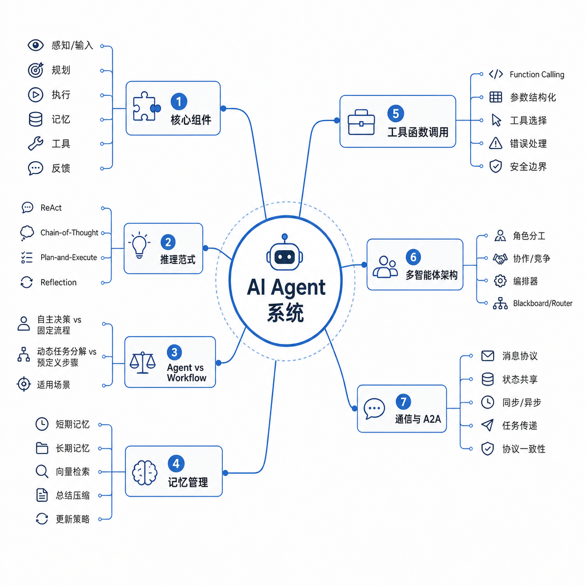

# Agent

Agent 是大模型应用从“问答”走向“执行”的关键形态。它强调目标、规划、工具、记忆和反馈闭环。

## 考点目录

- [Agent 核心组件](01-Agent核心组件.md)
- [Agent 推理范式](02-Agent推理范式.md)
- [Agent 和 Workflow 区别](03-Agent和Workflow区别.md)
- [记忆管理：长期记忆、短期记忆、上下文工程、记忆更新和读写](04-记忆管理.md)
- [工具：Function Calling 方式](05-Function-Calling工具调用.md)
- [Multi-Agent 架构、通信机制与 A2A](06-Multi-Agent架构通信机制与A2A.md)

---

[返回总目录](../README.md)
