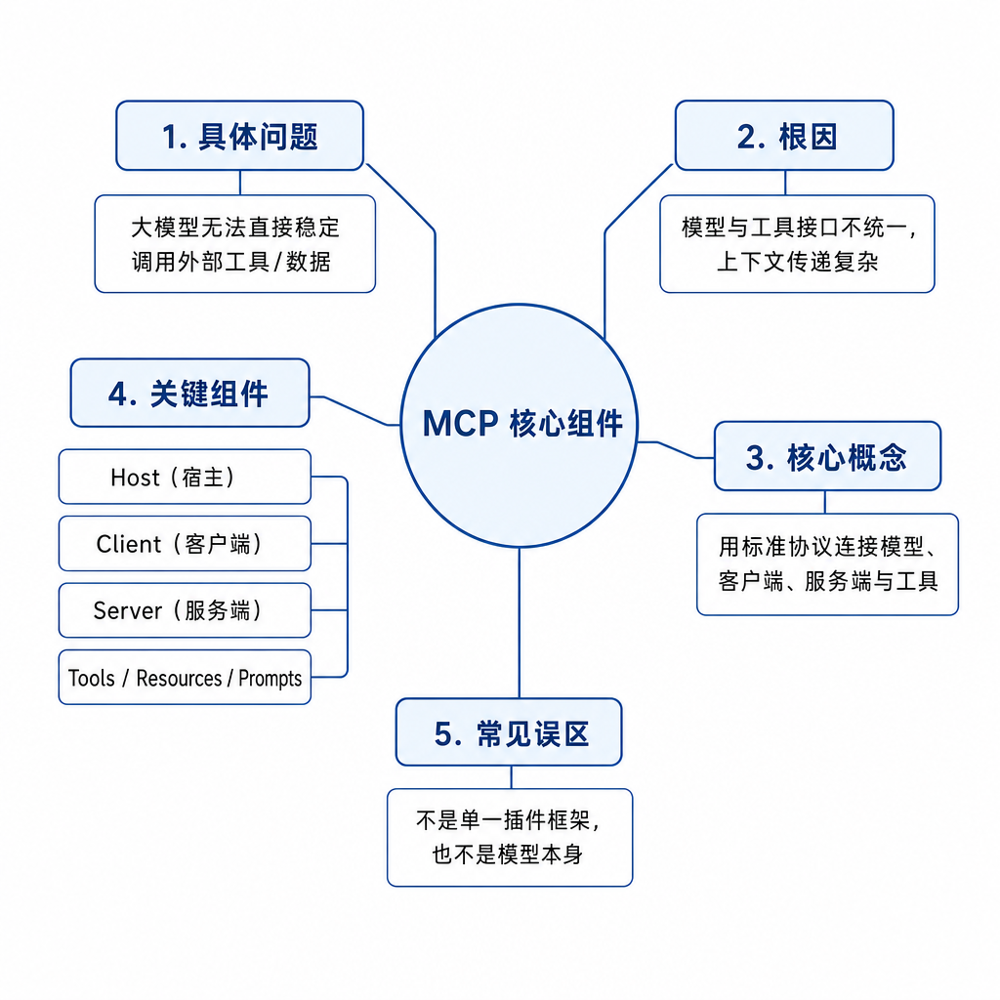
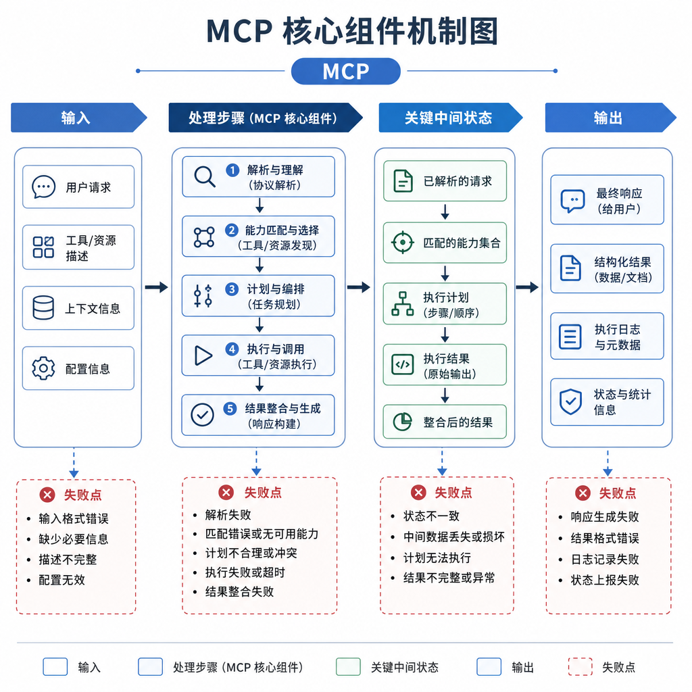
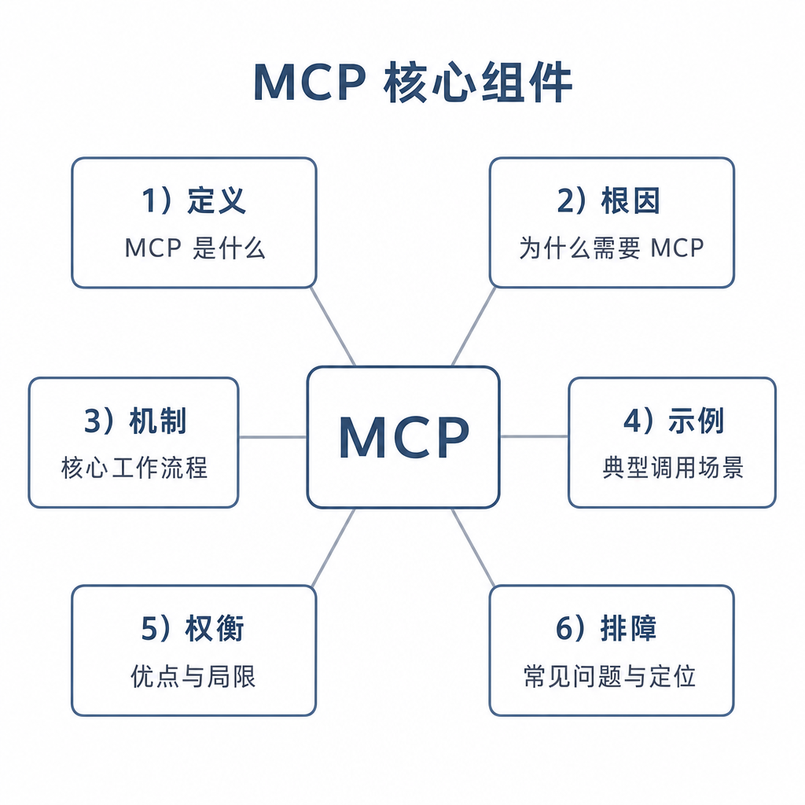

# MCP 核心组件

一个团队把模型接入数据库、文件系统和工单系统后，很快遇到维护灾难：IDE 里写一套工具描述，Web 后台再写一套，桌面客户端又写一套；同一个“查询订单”工具，在不同入口的参数名和权限提示都不一样。后来某个客户端忘了加只读限制，模型生成了一条更新语句，差点改到生产数据。

这类问题说明，MCP 要解决的不是“模型能不能调函数”，而是模型应用和外部能力之间如何标准化连接。面试问 MCP 核心组件，重点是 Host、Client、Server，以及 tools、resources、prompts 的边界。

## 核心矛盾：工具很多，连接方式不能每次重写

Function Calling 解决模型如何用结构化参数请求工具，但没有规定工具从哪里发现、如何连接、如何复用。CLI 能执行命令，但缺少面向模型应用的能力发现、权限描述和上下文协议。

MCP 把这层连接抽象出来。不同 Host 可以通过 Client 接入多个 Server，Server 用统一协议暴露能力。这样文件系统、数据库、Git、知识库等能力不需要为每个模型应用单独适配。

所以 MCP 是协议层，不是某个工具，也不是模型推理能力本身。

## 底层机制：Host、Client、Server 各管一层

Host 是承载用户交互和模型调用的应用，例如 IDE、桌面助手、聊天客户端或 Agent 平台。它负责用户会话、模型上下文、权限提示、能力展示和最终体验。用户看到的是 Host，而不是底层 Server。

Client 是 Host 内部连接某个 MCP Server 的协议客户端。它负责初始化连接、能力发现、请求转发、响应处理和错误上报。一个 Host 可以有多个 Client，分别连接文件系统 Server、数据库 Server、浏览器 Server 和企业知识库 Server。

Server 是能力提供方。它通常不包含大模型，而是把外部系统包装成 MCP 能力。Server 可以暴露三类内容：tools 是可执行动作，比如查询数据库、创建工单、读取文件；resources 是可读取上下文，比如文档、日志、表结构；prompts 是可复用提示模板，比如“生成 SQL 诊断报告”。

## 工程例子：IDE 如何接入本地项目

假设 IDE 想让模型理解一个本地仓库。IDE 是 Host，它负责展示聊天窗口、管理模型上下文和提示用户授权。IDE 内部启动文件系统 MCP Client。文件系统 MCP Server 暴露 resources，例如项目目录、文件内容、配置文件；也暴露 tools，例如按路径读取文件、搜索文件、列出目录。

当模型需要读取某个文件时，Host 不会让模型直接访问磁盘，而是通过 Client 请求 Server。Server 检查路径是否在工作区内，读取后返回结构化结果。Host 再把结果放回模型上下文。

这样同一个文件系统 Server 可以被多个 Host 复用，权限和错误处理也能集中治理。

## 边界和风险：MCP 是协议，不是安全自动完成

MCP 标准化了连接，也放大了权限风险。Server 暴露的工具如果过宽，例如“执行任意 shell 命令”或“运行任意 SQL”，Host 必须做授权、沙箱、审计和用户确认。resources 虽然只读，也可能泄露密钥、客户数据或内部代码。

信任边界也要清楚。Host 不能默认信任所有 Server；Server 也不能默认信任所有 Host。企业环境通常需要 Server 白名单、能力分级、最小权限、用户确认和日志留存。

还要注意能力描述本身会影响模型。如果 tool 描述诱导模型“优先读取全部文件”，就可能造成上下文膨胀和隐私风险。描述要清晰、窄化，并写明副作用。

## 面试高频追问

- MCP 的 Host、Client、Server 分别负责什么？
- tools、resources、prompts 有什么区别？
- MCP 和 Function Calling 的边界在哪里？
- 为什么一个 Host 里会有多个 Client？
- MCP Server 是否一定包含大模型？

## 可复述答案

MCP 是连接模型应用和外部能力的协议。Host 是模型应用本身，负责用户交互、模型上下文和权限体验；Client 是 Host 内部的协议连接器，负责连接某个 Server、完成初始化和转发请求；Server 是能力提供方，通过 tools、resources 和 prompts 暴露可执行动作、可读取上下文和可复用提示模板。MCP 位于连接协议层，Function Calling 位于模型工具选择层，CLI 是底层执行方式之一，三者不能混为一谈。

## 排查和实践建议

排查 MCP 问题时按层定位：Host 是否加载配置，Client 是否初始化成功，Server 是否声明了能力，tools 参数和返回是否符合协议，结果是否回填给模型。设计 Server 时优先暴露窄工具和清晰 resources，给每个能力写明输入、输出、权限、副作用和错误码。面试中把 Host、Client、Server 的责任链讲清楚，就不会把 MCP 说成“高级函数调用”。
