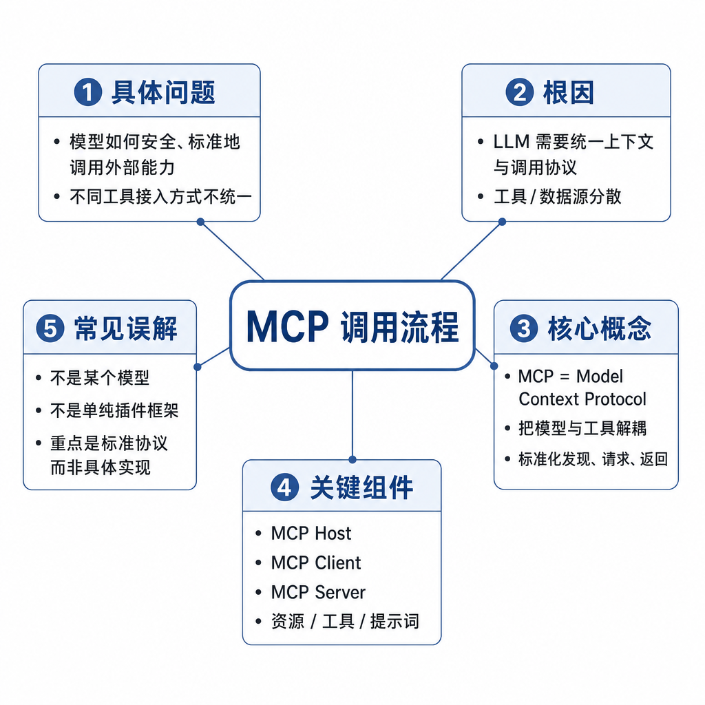
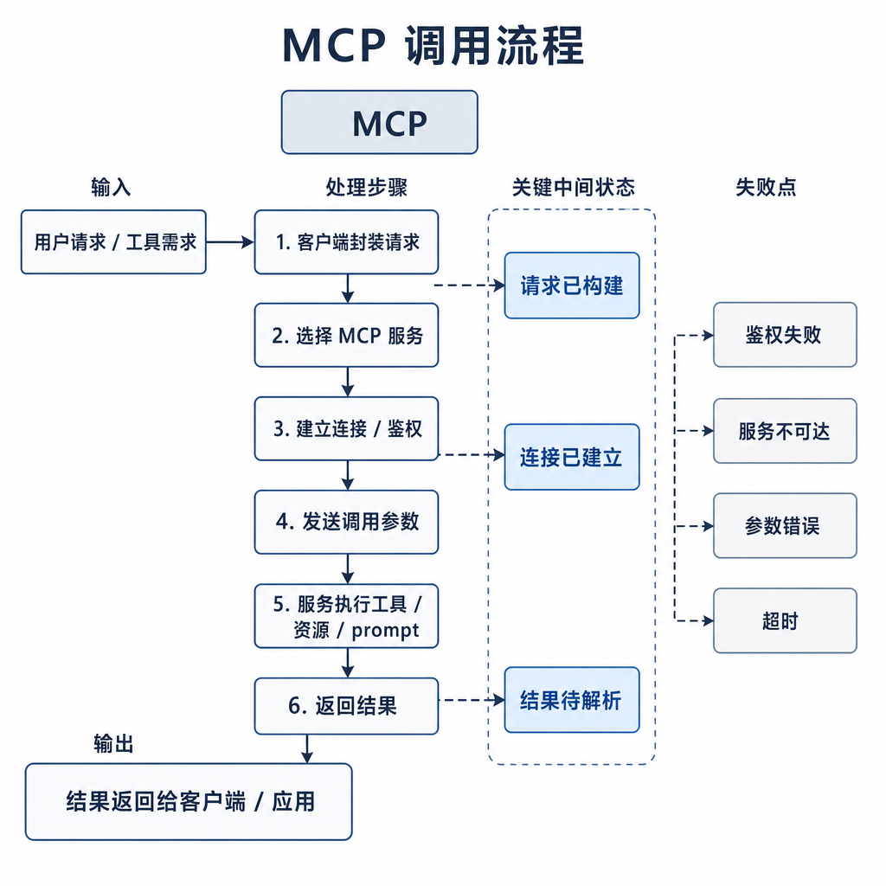
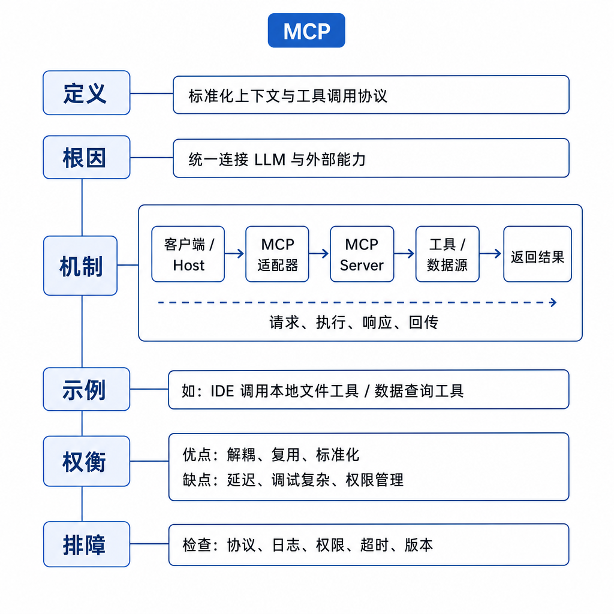

# MCP 调用流程

很多 MCP 接入失败不是因为协议难，而是调用链路没分清。用户在 Host 里问“查一下线上报错日志”，模型选择了日志工具，但 Client 根本没连上 Server；或者 Server 返回了日志，Host 却没有把结果放回模型上下文。最后用户看到的只是“我无法完成”，研发却不知道坏在哪一层。

面试问 MCP 调用流程，要按初始化、能力发现、模型选择、协议请求、结果回填这条链路回答。

## 核心矛盾：模型看到工具，不代表链路可用

MCP 至少经过 Host、Client 和 Server。任何一层职责不清，都会出现“工具显示存在但无法调用”“调用成功但模型看不到结果”“Server 正常但 Host 不提示权限”等问题。

模型通常不知道底层连接细节。它看到的是 Host 整理后的工具说明、资源内容或提示模板。真正的网络连接、进程管理、权限确认和协议请求，都由 Host 与 Client 处理。

## 底层机制：一次调用经历六步

第一步是配置和启动。Host 根据配置启动本地 stdio Server，或连接远程 HTTP Server。这里会涉及工作目录、环境变量、认证信息和启动参数。

第二步是初始化握手。Client 和 Server 协商协议版本、能力和元信息。如果版本不兼容，后面能力发现就可能失败。

第三步是能力发现。Client 获取 Server 暴露的 tools、resources 和 prompts，并交给 Host 管理。Host 决定哪些能力展示给模型，哪些需要用户授权。

第四步是模型选择能力。用户提出任务后，Host 把相关工具描述放入模型上下文。模型通过工具调用接口选择某个 tool，并生成参数。

第五步是协议请求。Client 把工具名和参数发送给 Server，Server 执行真实逻辑，例如查询数据库、读取文件或调用企业 API。

第六步是结果回填。Server 返回结构化结果，Host 把它作为工具观察放回模型，让模型继续推理或生成最终回答。

## 工程例子：数据库 MCP Server 的完整调用

假设有一个只读数据库 MCP Server。启动时，Host 读取配置并连接 Server。初始化成功后，Client 发现它有 `list_tables`、`describe_table`、`run_readonly_query` 等 tools，也有数据库 schema resource。

用户问“最近七天订单量是不是下降了”。模型先请求表结构，确认订单表和时间字段；再生成只读 SQL；Server 执行查询，并限制超时、返回行数和敏感字段；Host 把查询结果回填给模型；模型最后解释趋势，并说明数据口径。

如果 Server 查询成功但 Host 没有回填，模型仍然无法回答。如果模型生成了更新 SQL，Server 应该拒绝，因为它是只读 Server。

## 边界和风险：每一步都可能失败

启动阶段可能失败：命令不存在、环境变量缺失、工作目录错误、远程地址不可达。初始化阶段可能失败：协议版本不匹配、认证失败、Server 返回非法消息。能力发现阶段可能失败：工具描述不完整、schema 不合法、Host 过滤了能力。

工具调用阶段风险更高。模型生成的参数不能直接信任，Server 要做类型校验、权限校验、超时限制和返回裁剪。资源读取也不等于安全，只读 resource 可能包含密钥、用户隐私或内部代码。

还有一个常见边界是未知 Server。Host 自动加载陌生 Server 时，恶意 Server 可以暴露诱导性工具描述，影响模型行为。企业环境必须做白名单和授权。

## 面试高频追问

- MCP 从用户提问到工具返回经历哪些步骤？
- 能力发现发生在什么时候？
- 模型是否直接和 MCP Server 通信？
- tools 调用结果如何影响下一轮模型输出？
- MCP 调用失败应该看哪些日志？

## 可复述答案

MCP 调用流程可以分为六步：Host 启动或连接 Server，Client 完成初始化握手，Client 发现 Server 暴露的 tools、resources、prompts，Host 把可用能力整理给模型，模型选择工具并生成参数，Client 按协议请求 Server，Server 执行后返回结构化结果，Host 再把结果放回模型上下文。模型通常不直接连接 Server，而是通过 Host 和 Client 间接使用能力。排查时要按链路逐层定位。

## 排查和实践建议

排查时按顺序看：Server 是否启动，初始化是否成功，能力列表是否返回，Host 是否把工具暴露给模型，模型生成的参数是否通过校验，Server 是否执行成功，结果是否回填给模型。

设计时给每次调用打 trace id，把用户请求、模型工具选择、Client 请求、Server 返回和最终回答串起来。没有这条 trace，MCP 问题很容易变成互相甩锅。
