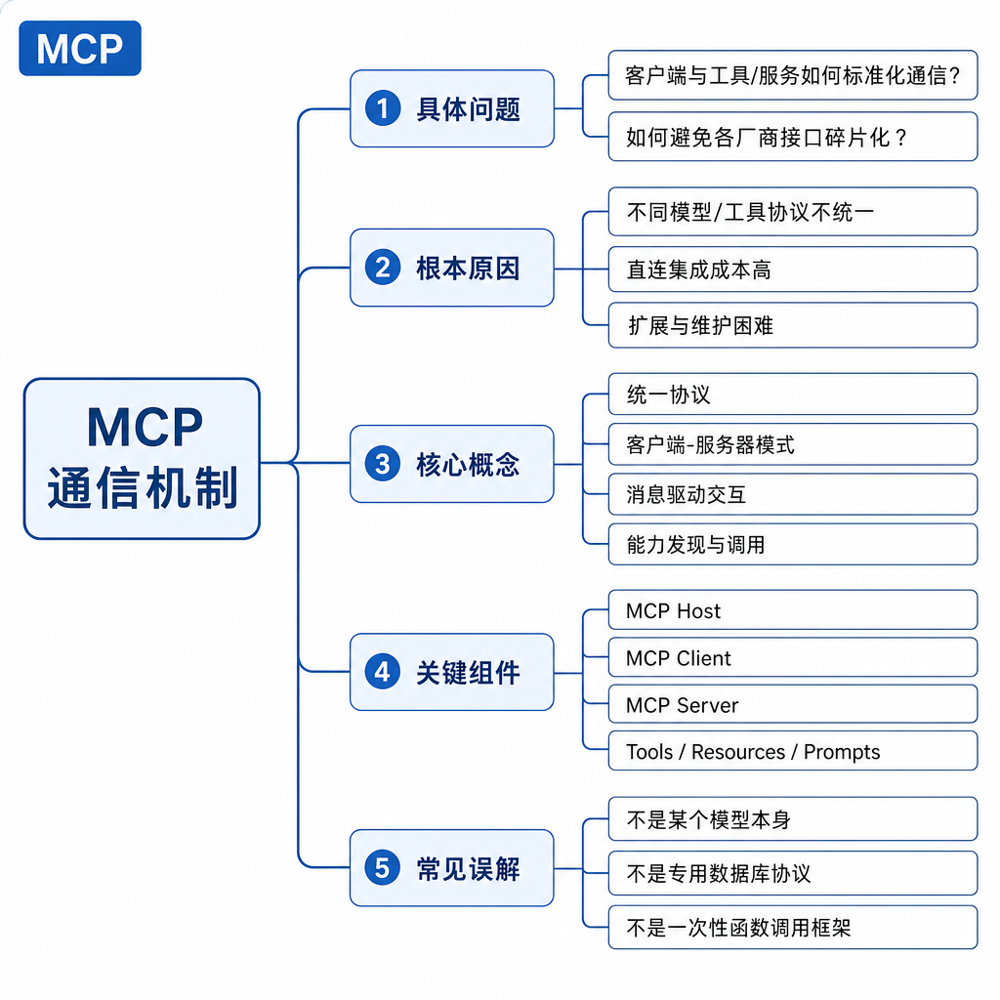
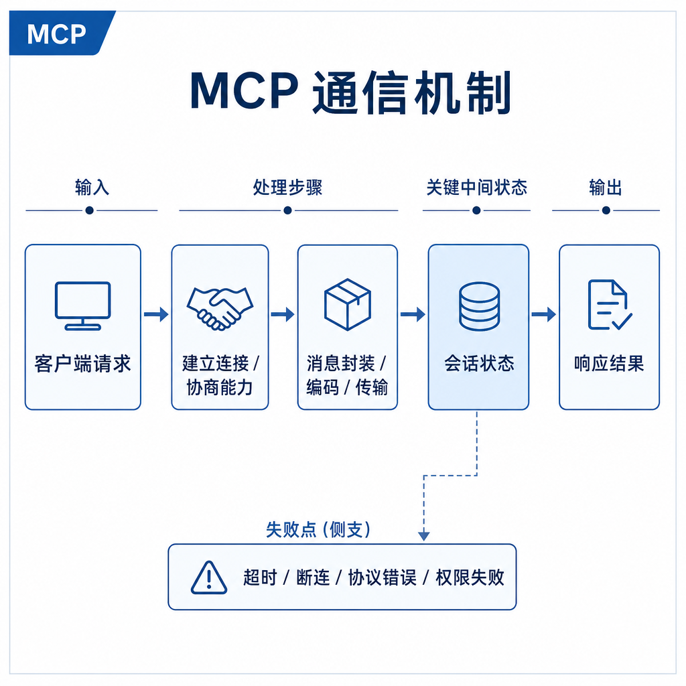
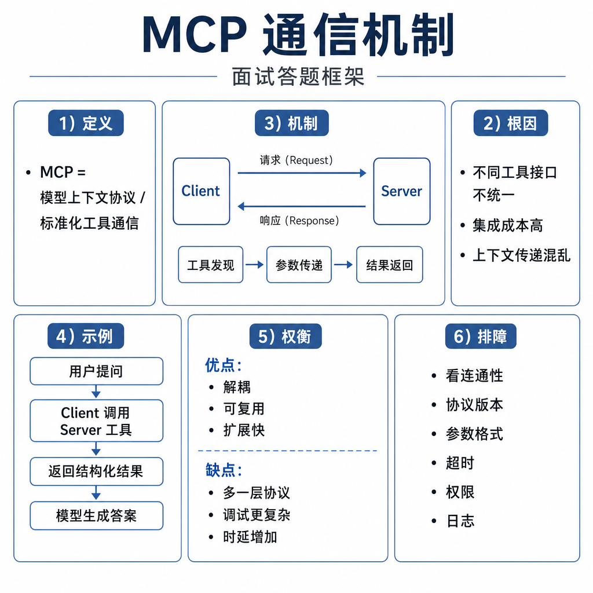

# MCP 通信机制

同一个 MCP Server 在本地 IDE 里运行正常，部署到远程 Agent 平台后却频繁超时。排查后发现，本地用 stdio 很顺，因为 Host 直接启动子进程；远程平台却需要跨机器访问，认证、网络延迟、连接保持和超时都没处理。通信方式选错，协议再标准也会出问题。

面试问 MCP 通信机制，重点不是背某个传输名词，而是说明 stdio 和 HTTP 这类传输如何承载同一套 MCP 消息语义。

## 核心矛盾：协议语义统一，运行环境不同

MCP 的核心是统一消息语义：初始化、能力发现、工具调用、资源读取、错误返回。传输层可以不同。本地工具、桌面应用和命令行场景里，stdio 很常见；远程共享服务里，HTTP 或流式 HTTP 更合适。

通信机制要解决三件事：消息如何编码，连接如何建立，请求和响应如何匹配。不能把 MCP 简化成“一个 HTTP API”，也不能以为 stdio 只是临时方案。

## 底层机制：stdio 和 HTTP 的适用边界

stdio 模式下，Host 启动一个本地 Server 子进程，Client 通过标准输入写请求，通过标准输出读响应。这种方式部署简单、延迟低，适合文件系统、Git、本地数据库代理等本机能力。它的关键边界是进程生命周期、工作目录、环境变量和本地权限。

stdio 的一个坑是 stdout 污染。Server 如果把普通日志打印到 stdout，Client 可能把日志当协议消息解析，直接失败。因此调试日志要走 stderr 或日志文件。

HTTP 或流式 HTTP 适合远程 Server。它可以服务多个 Host，便于集中部署、鉴权和权限治理。代价是要处理认证、TLS、跨租户隔离、限流、重试、网络抖动和连接管理。长任务还要考虑流式返回、取消、心跳和超时。

## 工程例子：文件系统和企业知识库怎么选

文件系统 MCP Server 更适合 stdio。它需要访问用户本机目录，Host 启动子进程后可以限定工作区，只允许读取项目目录，避免越权访问。用户关闭 IDE 时，Server 进程也可以一起结束。

企业知识库 MCP Server 更适合 HTTP。文档索引在服务端，多个客户端共享，权限由企业账号统一控制。Server 可以按用户身份返回不同资源，也可以统一记录审计日志。

两者对模型暴露的 tools 可能很像，例如 `search`、`read_resource`，但通信、运维和安全边界完全不同。

## 边界和风险：通信失败不能让 Agent 卡死

stdio 常见问题是 Server 启动失败、环境变量缺失、工作目录不对、stdout 被日志污染、子进程崩溃。还要避免继承过多敏感环境变量，比如密钥和代理配置。

HTTP 常见风险是认证失败、token 泄露、请求重放、跨租户数据泄露、网络超时和服务端限流。远程 Server 不能只靠“知道地址”来鉴权，必须使用明确的身份认证和权限控制。

通信层还要处理取消和超时。模型不应该因为一个 Server 卡住而阻塞整个 Host。每次工具调用都要有 deadline，Server 要返回结构化错误，而不是让连接无限挂起。

## 面试高频追问

- MCP stdio 和 HTTP 的区别是什么？
- 为什么本地 MCP Server 常用 stdio？
- HTTP MCP Server 要额外考虑哪些安全问题？
- 通信层如何处理超时和取消？
- Server 输出日志为什么可能影响 stdio 协议？

## 可复述答案

MCP 通信机制是 Client 和 Server 交换协议消息的方式。stdio 适合本地子进程场景，部署简单、延迟低，但要管理进程、工作目录、环境变量和标准输出污染；HTTP 适合远程共享服务，便于集中部署和权限治理，但要处理认证、TLS、限流、超时、重试和多租户隔离。无论传输层如何变化，上层语义仍然是初始化、能力发现、tools 调用、resources 读取和错误处理。

## 排查和实践建议

排查 stdio 问题先看 Server 是否能独立启动，stdout 是否只输出协议消息，stderr 是否记录异常，工作目录和环境变量是否正确。排查 HTTP 问题先看认证、网络连通性、状态码、超时、服务端日志和 trace id。

设计时，本地私有能力优先 stdio，跨团队共享能力优先 HTTP。无论哪种方式，都要给请求设置 deadline、取消机制、结构化错误和审计日志。
