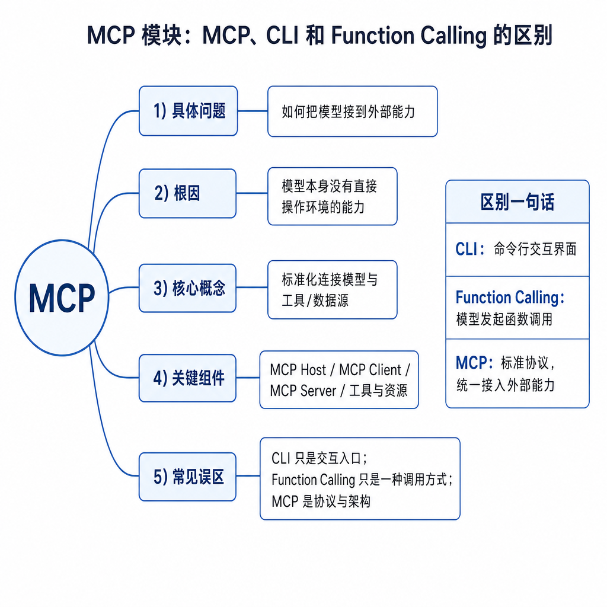
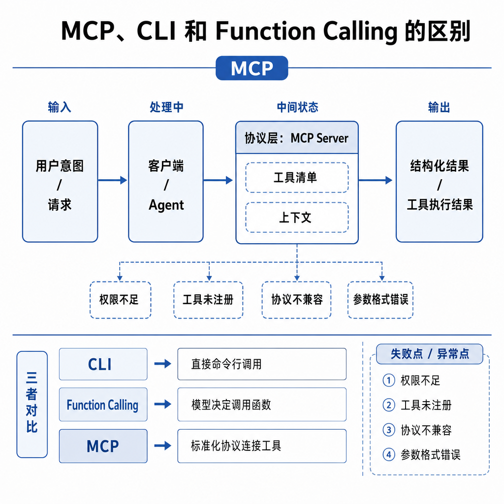
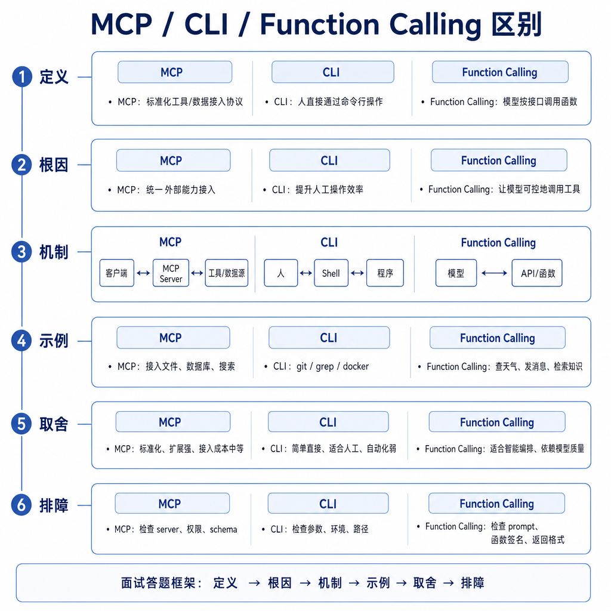

# MCP、CLI 和 Function Calling 的区别

面试中最容易答乱的一题是：MCP、CLI、Function Calling 到底谁调用谁？如果只说“它们都是工具调用”，说明还停留在表面。真实系统里，模型可能通过 Function Calling 选择一个工具；这个工具来自 MCP Server；Server 内部又可能执行某个 CLI 命令。三者在不同层次，不能并列成同一种东西。

## 核心矛盾：都和工具有关，但解决的问题不同

Function Calling 关注模型输出什么：函数名和结构化参数。MCP 关注应用如何连接外部能力：Host、Client、Server 之间如何发现和调用 tools、resources、prompts。CLI 关注能力如何在操作系统里执行：命令、参数、标准输入输出和退出码。

把三者混淆会带来工程问题。直接让模型拼 shell 命令，会绕过 Function Calling 的 schema 校验和 MCP 的权限治理。把每个 CLI 都手写进 Host，又会导致能力无法复用。

## 底层机制：三层分别回答三个问题

Function Calling 位于模型接口层。它把“我要查订单”变成 `get_order({id: "123"})` 这样的结构化请求。它不规定函数怎么实现，也不规定能力如何被发现。

MCP 位于连接协议层。Host 通过 Client 连接 Server，发现可用 tools、resources 和 prompts。MCP Server 可以把数据库、文件系统、HTTP API 或 CLI 包装成统一能力。

CLI 位于执行层。它是本地或远程环境中的具体程序，例如 `git status`、`kubectl get pods`、`python script.py`。CLI 强大但危险，因为参数拼接、环境变量、工作目录、权限和退出码都会影响结果。

## 工程例子：查询 Git 状态的完整链路

用户在 IDE 里问“当前分支有哪些未提交改动”。模型通过 Function Calling 选择 `get_git_status` 工具，并生成结构化参数，比如工作区路径。这个工具来自 Git MCP Server。Server 内部可能执行受限的 `git status --short`，解析输出后返回结构化结果。Host 再把结果交给模型，让它解释哪些文件被修改。

这里模型没有直接执行 CLI。MCP 也不是 CLI 本身。Function Calling 也不是 Server。三者串起来后，才形成一条可控工具链。

## 边界和风险：不要把任意命令暴露给模型

直接暴露 CLI 给模型是高风险设计。命令注入、路径越界、删除文件、泄露环境变量、读取敏感目录，都可能发生。更安全的做法是把 CLI 封装成窄工具：固定命令集合、限制参数、限定工作目录、设置超时、解析结构化输出，并把错误码返回给模型。

MCP Server 也不能暴露万能工具。`run_command(command: string)` 看起来省事，但权限边界过大。Function Calling 的 schema 要尽量窄，MCP tool 描述要写明副作用，CLI 执行要放进沙箱。

还有一个常见错误：以为用了 MCP 就不需要 Function Calling。实际上 MCP 负责能力接入，模型仍需要某种工具选择和参数生成机制。两者是协同关系，不是替代关系。

## 面试高频追问

- MCP、CLI、Function Calling 分别处在哪一层？
- Function Calling 能不能直接替代 MCP？
- MCP Server 内部能不能调用 CLI？
- 为什么不建议把任意 shell 暴露给模型？
- 三者如何组合成安全工具链？

## 可复述答案

Function Calling 是模型接口层，解决模型如何以结构化方式选择工具和生成参数；MCP 是连接协议层，解决 Host 如何发现、连接和调用外部 Server 暴露的 tools、resources、prompts；CLI 是执行层，是具体命令行程序与操作系统交互的方式。三者可以协同：模型用 Function Calling 选择 MCP tool，MCP Server 内部调用受限 CLI 完成任务。安全关键是不要让模型直接拼任意命令，而要通过 schema、权限、沙箱、超时和审计逐层收口。

## 排查和实践建议

排查时按层定位：模型没选工具，看 Function Calling 描述和 schema；工具不存在，看 MCP 能力发现；工具连接失败，看 Client 和 Server；执行报错，看 Server 内部 API 或 CLI；结果异常，看解析和回填。

设计时把高风险 CLI 包成低风险 MCP tools，再让模型通过 Function Calling 使用。面试中用“模型接口层、连接协议层、系统执行层”这三个层次回答，最不容易混。
