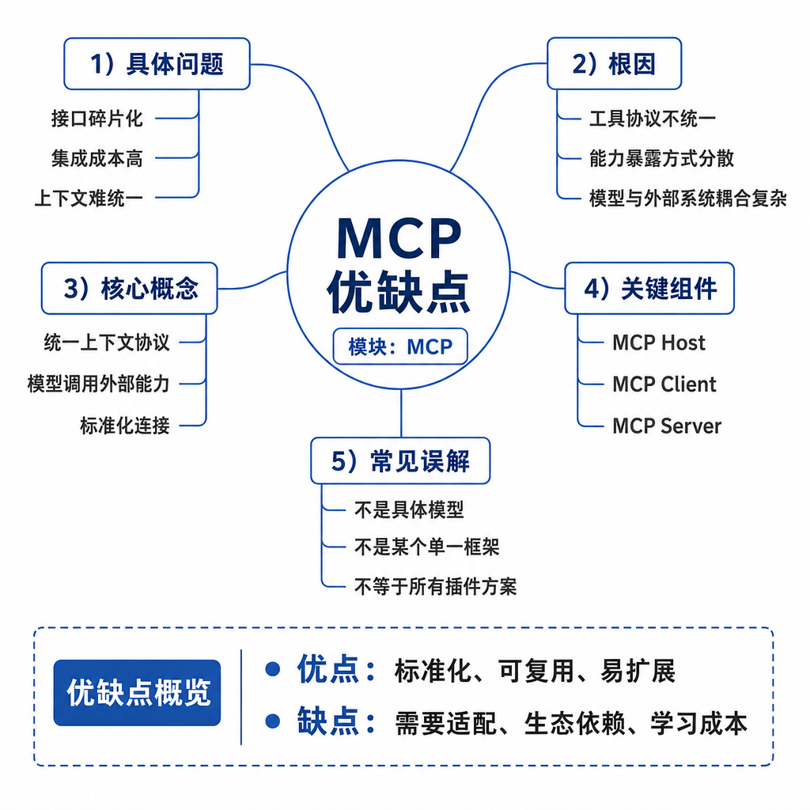
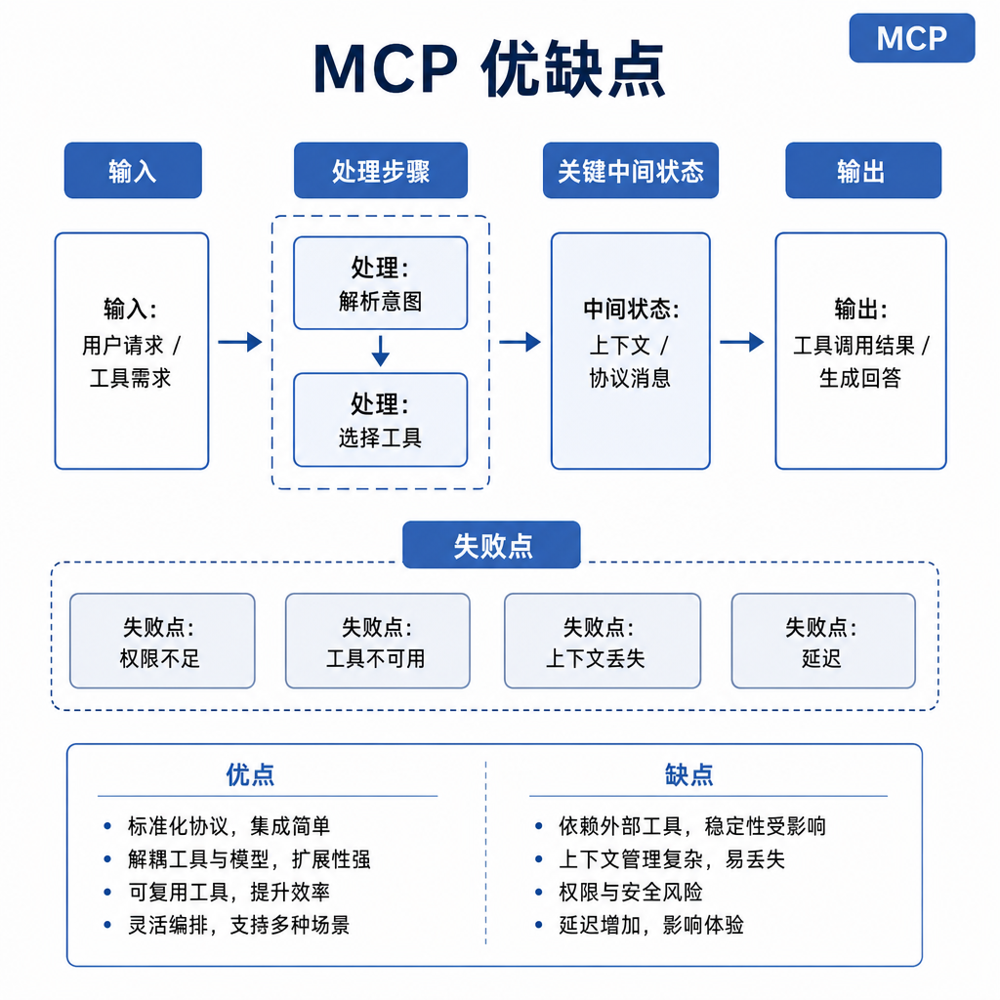
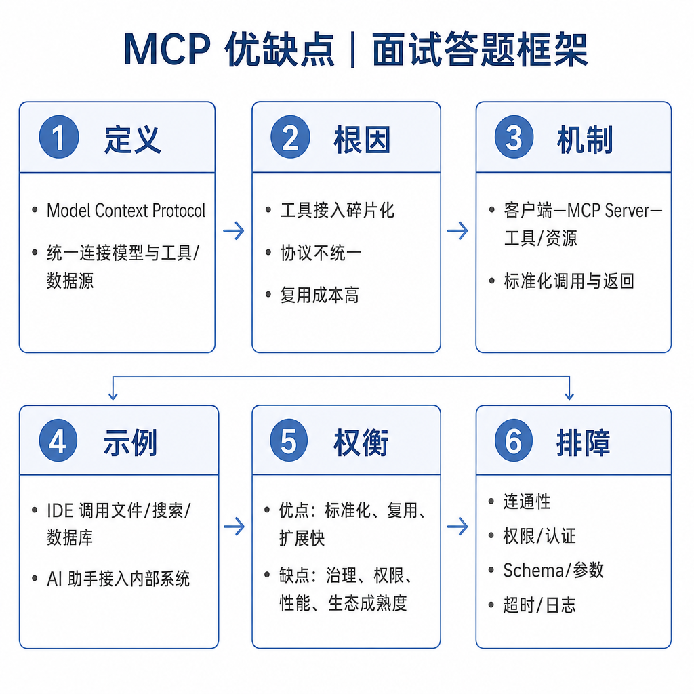

# MCP 优缺点

MCP 的吸引力很明显：文件系统 Server 写好后，IDE、桌面助手和自动化 Agent 都能用；企业知识库 Server 接入后，客服、研发和运营都能读取同一套能力。但很多团队低估了代价：协议、权限、部署、监控、版本兼容和能力治理都会增加复杂度。

面试问 MCP 优缺点，不能只说“标准化好、复杂度高”，要能落到工程边界：什么时候值得引入，什么时候不值得。

## 核心矛盾：解耦带来复用，也拉长链路

MCP 的价值来自解耦。Host 不需要知道每个外部系统的细节，Server 也不需要为每个 Host 单独适配。通过 tools、resources 和 prompts，能力可以被发现、复用和组合。

问题也来自解耦。链路变长后，错误来源更多；能力复用后，权限影响面更大；Server 数量增加后，治理成本上升。一个简单 API 调用，本来十行代码能解决，引入 MCP 后可能多出配置、握手、能力发现和监控。

所以 MCP 适合多客户端、多工具、多团队复用的场景，不一定适合一个简单脚本或单一应用。

## 优点：标准化、复用和治理

第一个优点是标准化。Host、Client、Server 按统一协议交互，工具描述、资源读取和提示模板都有固定语义。不同能力不需要在每个应用里重新约定。

第二个优点是复用。一个 Git、数据库、浏览器或知识库 Server 可以服务多个模型应用。团队新增一个 Host 时，不必重新写所有工具适配。

第三个优点是隔离。外部系统细节封装在 Server 内，Host 只看到能力接口。权限、参数校验和错误处理可以集中在 Server 层治理。

第四个优点是生态扩展。新工具可以以 Server 形式加入，不必改 Host 主体代码。对 Agent 工程来说，这也提升了可观测性，因为外部能力都通过 Client-Server 链路调用，更容易记录 trace、权限和错误。

## 缺点：复杂度、延迟和安全成本

第一个缺点是复杂度。直接 API 调用能解决的问题，引入 MCP 后多了 Server 配置、协议握手、能力发现、生命周期管理和故障排查。

第二个缺点是延迟。远程 Server 会增加网络开销，本地 stdio 也有进程启动、序列化和上下文回填成本。

第三个缺点是安全。Server 暴露能力越多，Host 越需要做权限提示、用户确认、沙箱和审计。只读 resource 也可能泄露敏感信息。

第四个缺点是治理。工具描述、版本兼容、返回格式、错误码和权限策略都要长期维护。Server 升级后字段变化，Host 或模型提示没同步，就可能出现隐蔽错误。

## 工程例子：什么时候用，什么时候不用

如果你只做一个内部报表机器人，且只调用一个固定 HTTP API，直接用 Function Calling 可能更简单。模型生成查询参数，宿主调用 API，返回结果即可。引入 MCP 反而增加部署和排查成本。

如果你要让多个 IDE、桌面助手和自动化 Agent 共享数据库、文档、Git、浏览器等能力，MCP 的收益就明显。Server 能复用，权限能统一，审计能集中，能力描述也能标准化维护。

选择标准不是“新不新”，而是复用规模、权限复杂度、团队协作和长期维护成本。

## 边界和风险：可接入不等于可安全使用

MCP 最大风险是把“能接入”误当成“能放心用”。Server 列表失控后，模型会看到大量能力描述，既增加上下文噪声，也增加误调用概率。恶意或低质量 Server 还可能通过工具描述诱导模型泄露信息。

企业环境必须做 Server 白名单、能力分级、用户授权和日志审计。高风险工具要有确认点和回滚方案。返回内容也要裁剪，不能把大段无关数据塞回模型，造成上下文膨胀。

版本兼容也要认真处理。Server 返回字段改变、错误码变化、权限策略调整，都需要契约测试和灰度发布。

## 面试高频追问

- MCP 的主要优点是什么？
- MCP 会带来哪些工程代价？
- 什么场景不适合引入 MCP？
- MCP 如何影响安全和权限治理？
- 如何评估一个 MCP Server 是否设计得好？

## 可复述答案

MCP 的优点是标准化、复用、隔离和生态扩展。它让模型应用通过 Host、Client、Server 的协议连接外部 tools、resources 和 prompts，减少重复适配，并方便统一权限和可观测性。缺点是链路更长，会带来协议复杂度、延迟、部署维护、权限治理和版本兼容成本。是否使用 MCP 要看复用规模和能力复杂度：多客户端、多工具、多团队共享时收益大；单一应用、单一 API、低风险场景下直接 Function Calling 更简单。

## 排查和实践建议

设计 MCP Server 时坚持最小能力、清晰 schema、结构化错误和可审计日志。排查时不要只看模型回答，要看 Host 配置、Client 初始化、Server 能力列表、工具参数、执行结果和回填上下文。

评估是否引入 MCP 时问三句话：是否有多个 Host 复用，是否需要统一权限治理，是否值得承担额外运维成本。答案都是否定时，不必为了概念而引入 MCP。
