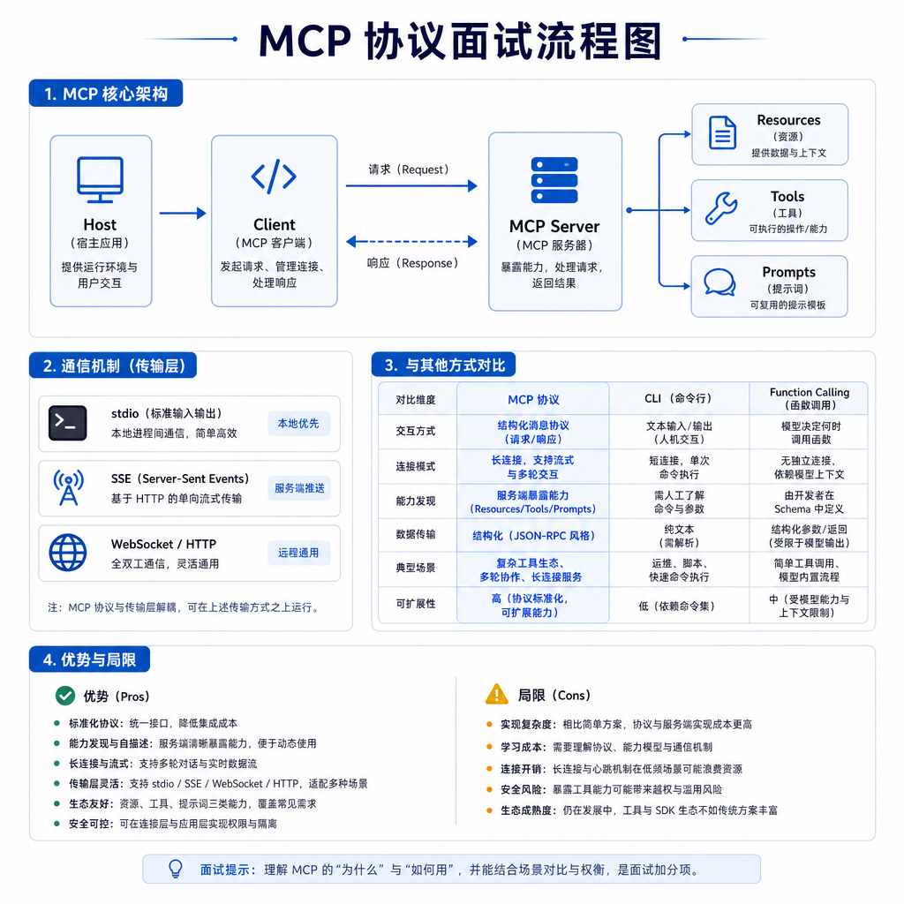

# MCP

MCP 是模型应用连接外部工具和数据源的协议化方案。它重点解决工具能力如何被发现、描述、连接和复用。

## 考点目录

- [MCP 核心组件](01-MCP核心组件.md)
- [MCP 调用流程](02-MCP调用流程.md)
- [MCP 通信机制](03-MCP通信机制.md)
- [MCP、CLI 和 Function Calling 的区别](04-MCP-CLI-Function-Calling区别.md)
- [MCP 优缺点](05-MCP优缺点.md)

---

[返回总目录](../README.md)
