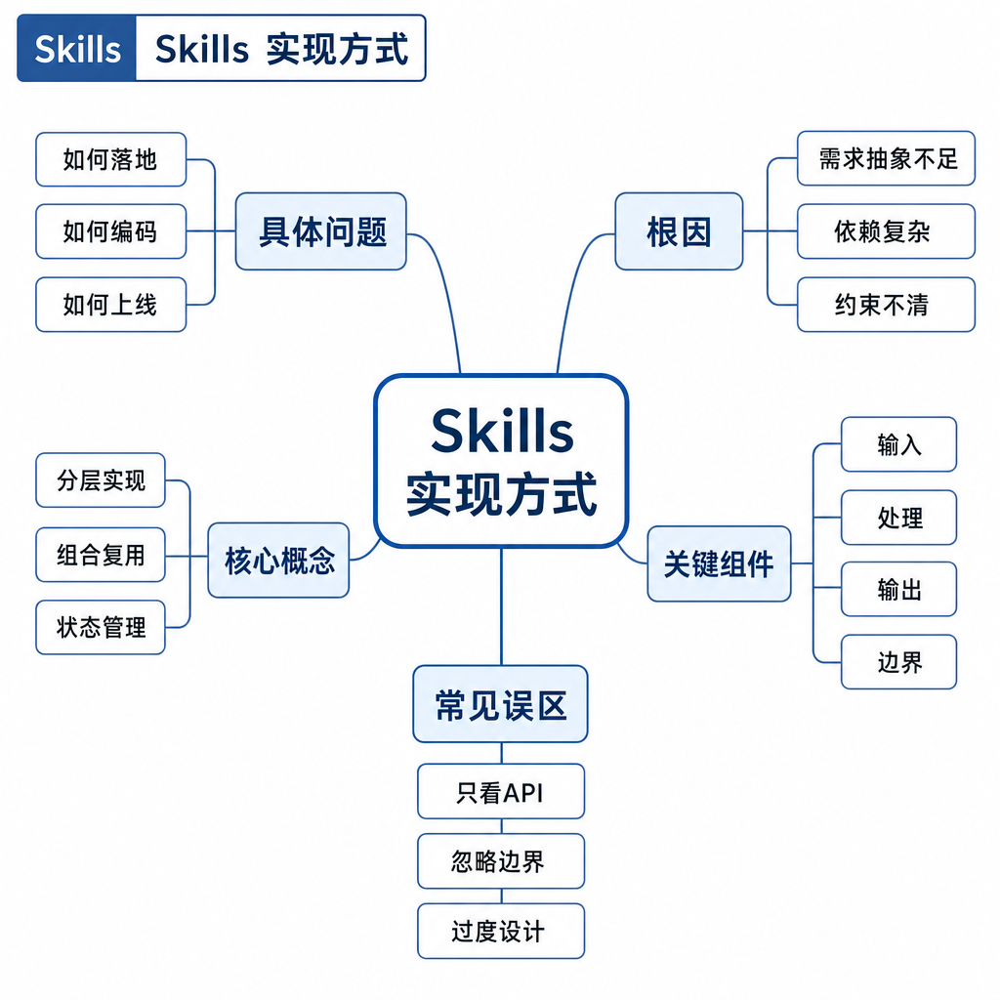
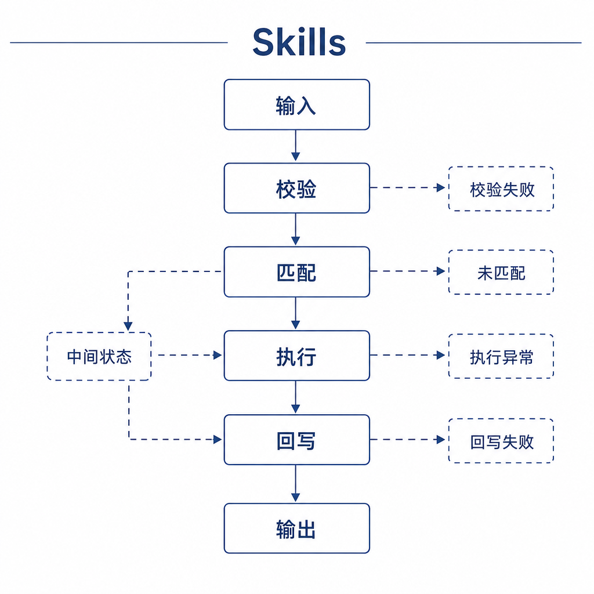
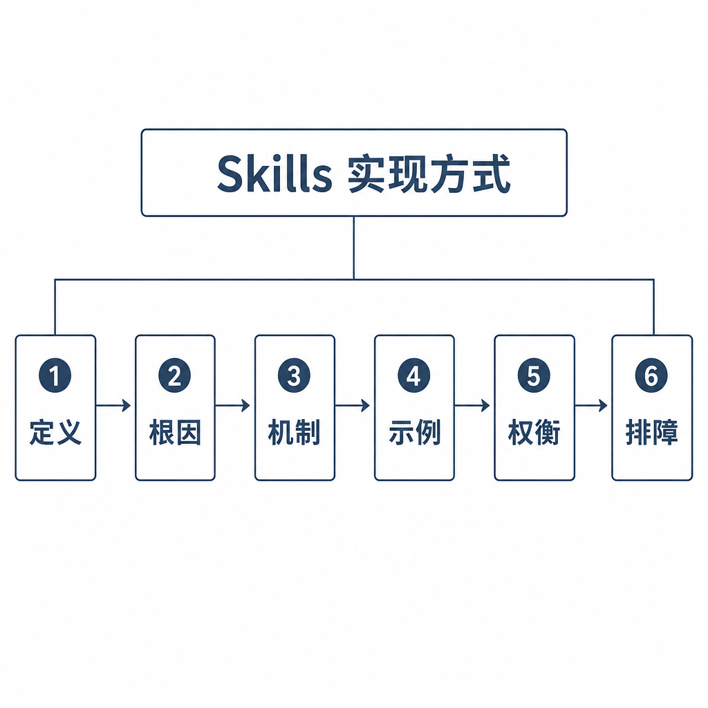

# Skills 实现方式

很多人第一次设计 Skill，会把它写成一段超长 prompt：背景、规则、示例、脚本、异常处理全部塞进去。结果系统启动时加载几十个 Skill，模型还没开始任务，上下文就被 PDF、PPT、代码审查、部署排查等说明淹没。真正触发任务时，它反而抓不住关键步骤。

Skill 的正确理解不是“更长的提示词”，而是可按需加载的任务能力包。面试问 Skills 实现方式，核心是讲清它如何沉淀流程、触发加载、协同工具，并控制边界。

## 核心矛盾：一次性 prompt 不适合沉淀复杂任务

普通 prompt 解决一次交互的指令问题。Skill 解决的是高频任务的能力复用问题。比如生成 PPT、审查 PR、处理 PDF、写项目文档，都不是一句“请认真完成”能稳定解决的任务。它们需要触发条件、输入要求、执行步骤、工具约束、输出格式和失败处理。

Skill 的价值在于把隐性经验显性化。模型遇到特定任务时，不必重新从通用指令推导流程，而是读取对应能力包，按里面的方法和边界执行。

## 底层机制：一个 Skill 通常包含什么

一个 Skill 通常包含四类内容。

第一是元信息。它说明名称、用途和简短描述，帮助系统或模型判断什么时候使用。描述要具体，不能只写“处理文档”。

第二是触发条件。比如“当用户要求生成、合并、拆分、OCR PDF 时使用”。好的触发条件还会写反例，比如“用户只是询问 PDF 概念时，不需要生成文件”。

第三是主体流程。它规定执行步骤、工具优先级、禁止事项、错误处理和输出格式。主体要短而可执行，不要把所有背景知识都堆进去。

第四是可选资源。包括脚本、模板、示例、参考规范、检查清单和领域知识。这些资源只有在任务需要时再读取，避免上下文膨胀。

Skill 不一定直接执行动作。它更像任务操作手册。真正执行可能通过 CLI、MCP Server、Function Calling 或宿主工具完成。Skill 负责告诉模型何时调用、如何组合、如何校验。

## 工程例子：PDF 处理 Skill 如何运行

以“PDF 处理 Skill”为例。它的触发条件可以写成：用户提到 `.pdf` 文件，或要求读取、合并、拆分、旋转、加水印、OCR PDF 时使用。

主体流程会要求先确认输入路径，再根据任务选择工具。读取大文件时按页处理；合并多个 PDF 时保持顺序；OCR 前先判断是否扫描件；输出新文件前说明目标路径；遇到加密文件要提示用户提供密码。

这里 Skill 没有替代 PDF 解析器，也没有替代文件系统权限。它只是把 PDF 任务的稳定流程封装起来，让模型不会每次都临时猜步骤。

## 边界和风险：Skill 不是万能自动化

Skill 写得太宽会误触发。比如“文档处理 Skill”可能和 Markdown 写作、PDF 处理、PPT 生成互相抢任务。写得太窄又会漏触发，用户换一种说法就加载不到。

Skill 也会过时。工具参数变了、项目规范变了、业务流程变了，旧 Skill 会稳定地产生错误。它不像一次 prompt，用完就结束；它是可复用资产，所以必须版本化维护。

安全上，Skill 不能鼓励跳过确认、忽略权限或执行任意命令。涉及文件写入、网络请求、代码执行和凭证读取时，必须写明边界、确认点和回退方式。Skill 是能力包，不是权限包；它不能突破宿主系统的权限控制。

## 面试高频追问

- Skill 和普通 prompt 的区别是什么？
- 一个 Skill 通常包含哪些部分？
- Skill 是否会直接执行工具？
- 如何设计触发条件避免误触发？
- Skill 过时会带来什么问题？

## 可复述答案

Skill 是可复用的任务能力包，不只是长 prompt。它通常包含元信息、触发条件、主体流程、工具使用规范、模板、脚本和输出约束。模型在遇到特定任务时按需加载 Skill，用它指导后续推理和工具调用。Skill 本身不一定执行动作，真正执行可以由 CLI、MCP、Function Calling 或宿主工具完成。工程上要重点设计触发边界、渐进式披露、版本维护、权限控制和失败处理。

## 排查和实践建议

设计 Skill 时先写清“适用任务”和“不适用任务”，再写最短可执行流程。排查问题时看三点：是否正确触发，加载内容是否足够，执行是否遵守 Skill 边界。

如果模型经常误用 Skill，优化触发描述并补充反例；如果执行漏步骤，把关键步骤改成检查清单；如果上下文太长，把细节拆到资源文件并采用渐进式披露。不要为一次性任务写 Skill，优先沉淀高频、边界清晰、流程稳定的任务。
