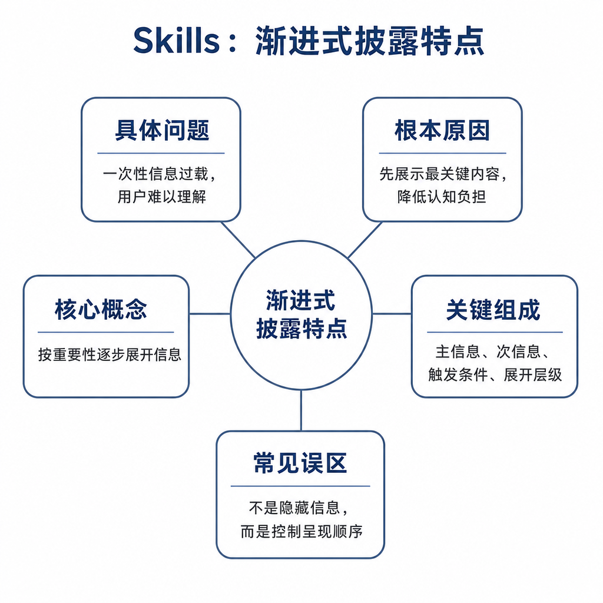
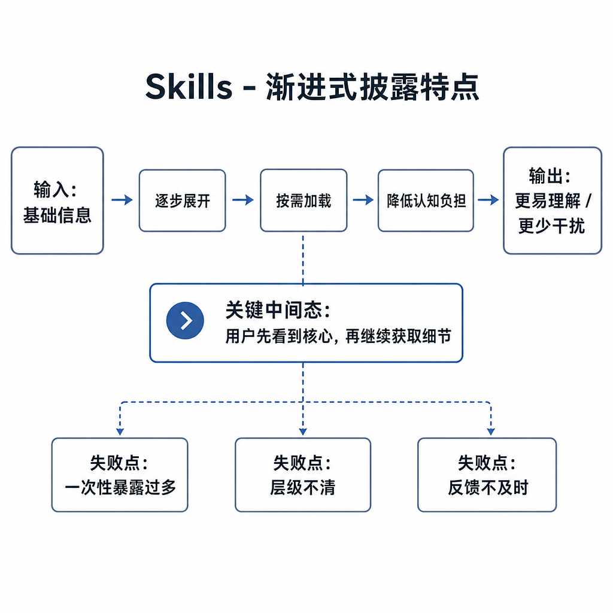
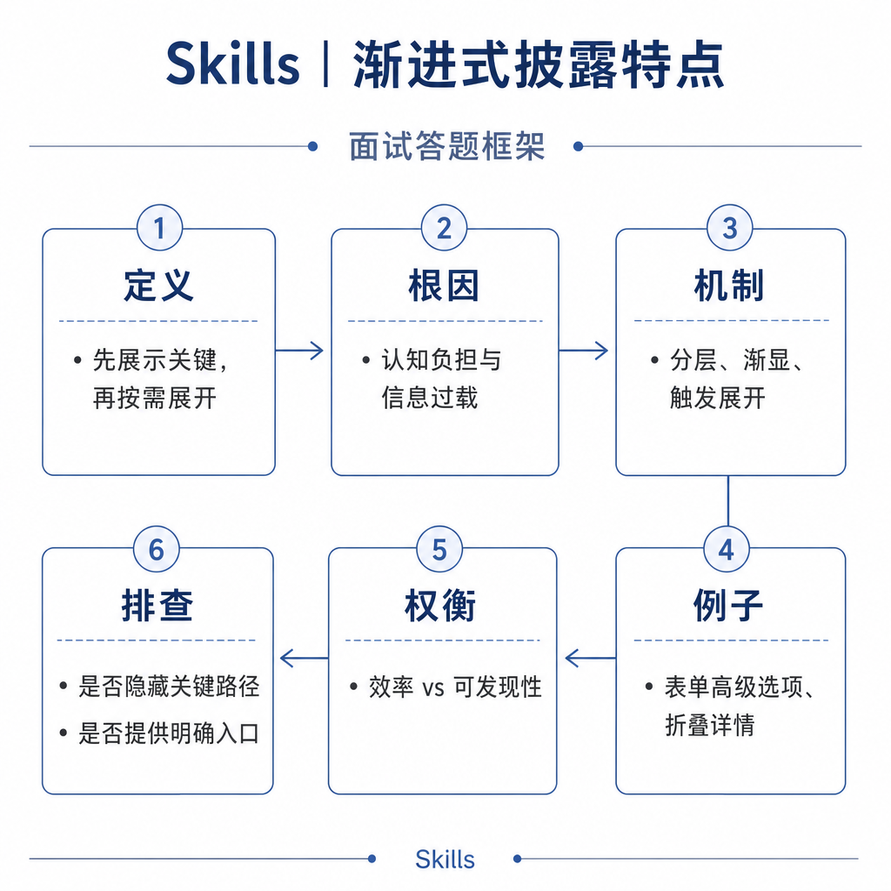

# Skills 渐进式披露特点

一个系统启动时加载几十个 Skill 的完整说明，很快会出问题：PDF、PPT、代码审查、部署排查、文档写作的规则同时进入上下文，模型还没开始任务，就被大量无关信息干扰。用户只是想合并两个 PDF，模型却开始考虑 PPT 版式和代码审查格式。

渐进式披露解决的就是这个问题。它不是少给信息，而是在合适时机给合适粒度的信息。

## 核心矛盾：能力要多，上下文不能无限膨胀

LLM 的上下文窗口有限，注意力也有限。把所有 Skill 细节一次性塞进去，会带来三类问题：成本增加，判断被干扰，指令之间互相冲突。

Skill 的渐进式披露把信息分层。第一层是简短能力描述，用于判断是否触发；第二层是 Skill 主体，用于指导执行；第三层是附加资源，例如脚本、模板、案例和参考规范，只在需要时读取。

这背后其实是上下文工程：不是信息越多越好，而是相关、及时、可执行的信息最有价值。

## 底层机制：从目录到正文再到附录

第一阶段，系统只暴露 Skill 名称和简短描述。模型根据用户请求判断是否需要某个 Skill。比如 `ppt-generation` 的描述是“当用户请求生成或制作演示文稿时使用”。

第二阶段，触发后加载 Skill 主体。主体包含核心流程、工具约束、输出要求和禁止事项。它要足够指导执行，但不能把所有细节都塞满。

第三阶段，任务需要更深细节时，再读取附加资源。比如图片生成规范、PPT 版式模板、PDF OCR 脚本说明、代码审查检查清单。

这个机制类似“目录、正文、附录”。目录用于选择，正文用于执行，附录用于解决复杂分支。它让系统既能拥有很多能力，又不必每次把所有能力塞进模型上下文。

## 工程例子：生成 PPT 的加载过程

用户说“帮我把这三份材料做成汇报 PPT”。系统初始只知道有一个 PPT Skill，简短描述命中后，加载 Skill 主体。主体要求先梳理主题和受众，再生成每页结构，接着生成视觉素材，最后组合成 PPTX 文件。

如果用户要求“科技蓝风格、每页都要配图”，模型再读取图片生成规范和版式模板。如果用户只是问“PPTX 是什么格式”，就不需要加载完整 Skill，更不需要调用生成工具。

这种按需加载能减少上下文噪声，也能避免无关 Skill 的规则影响当前任务。更重要的是，它让系统可以把“常见路径”和“少见分支”分开管理：常见路径放在主体里，保证每次都能稳定执行；少见分支放在资源里，只有遇到特殊需求时再加载。这样既不会牺牲任务质量，也不会让每次调用都背上完整资料库。

## 边界和风险：披露太少和太碎都会失败

渐进式披露常见失败发生在两端。触发描述太弱，会导致该加载时没加载。比如用户说“做个汇报材料”，描述里只写“生成 PPT”，可能漏触发。资源拆分太碎，又会导致执行时缺关键信息，模型不知道还要读哪个附录。

还有一种隐蔽风险是后加载内容与高优先级规则冲突。Skill 资源里不能写“忽略权限提示”“必要时跳过确认”。后加载内容必须服从系统规则、用户授权和工具权限。

安全上，附加资源可能包含脚本或命令示例。模型读取后仍要遵守沙箱、确认和最小权限。渐进式披露不能成为绕过权限的通道。

## 面试高频追问

- 什么是 Skill 的渐进式披露？
- 为什么不一次性加载所有 Skill？
- Skill 信息通常分几层？
- 渐进式披露和 RAG 有什么相似点？
- 触发失败时怎么排查？

## 可复述答案

Skill 的渐进式披露是按需加载任务能力信息的机制。系统先暴露简短描述帮助模型判断是否触发；触发后加载 Skill 主体；需要更深细节时再读取模板、脚本和示例等资源。它的价值是节省上下文、减少干扰、降低指令冲突，并让大量 Skill 可以共存。工程上要设计清晰触发描述、合理资源分层和权限边界，避免误触发、漏触发和后加载内容越权。

## 排查和实践建议

排查时先看用户请求是否命中 Skill 描述，再看主体说明是否被加载，最后看所需资源是否被读取。如果频繁漏触发，补充触发词、同义表达和反例；如果频繁误触发，收窄描述并写明不适用场景；如果执行漏步骤，把关键步骤上移到主体说明，不要埋在附录。

面试中可以把渐进式披露类比为“目录、正文、附录”的上下文分层，但要补一句工程边界：后加载资源不能绕过权限，也不能覆盖更高优先级规则。
