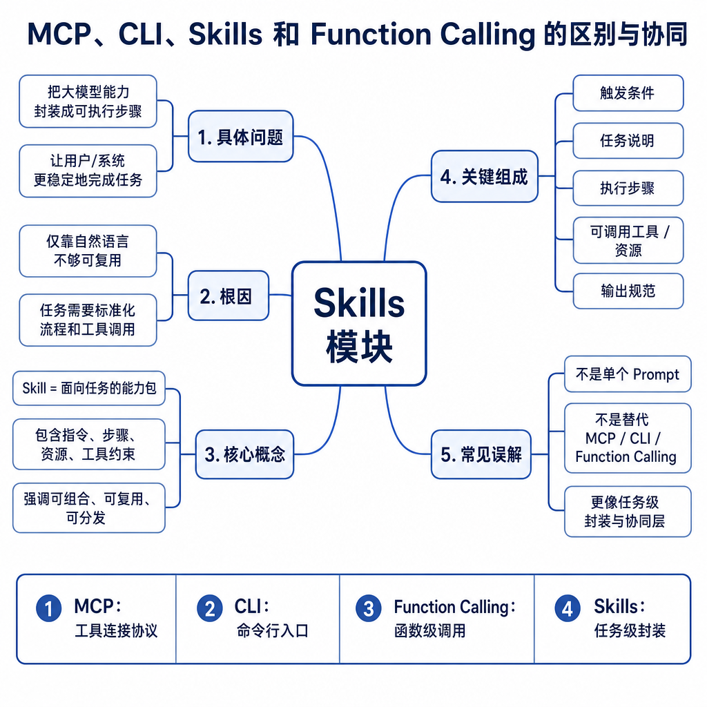
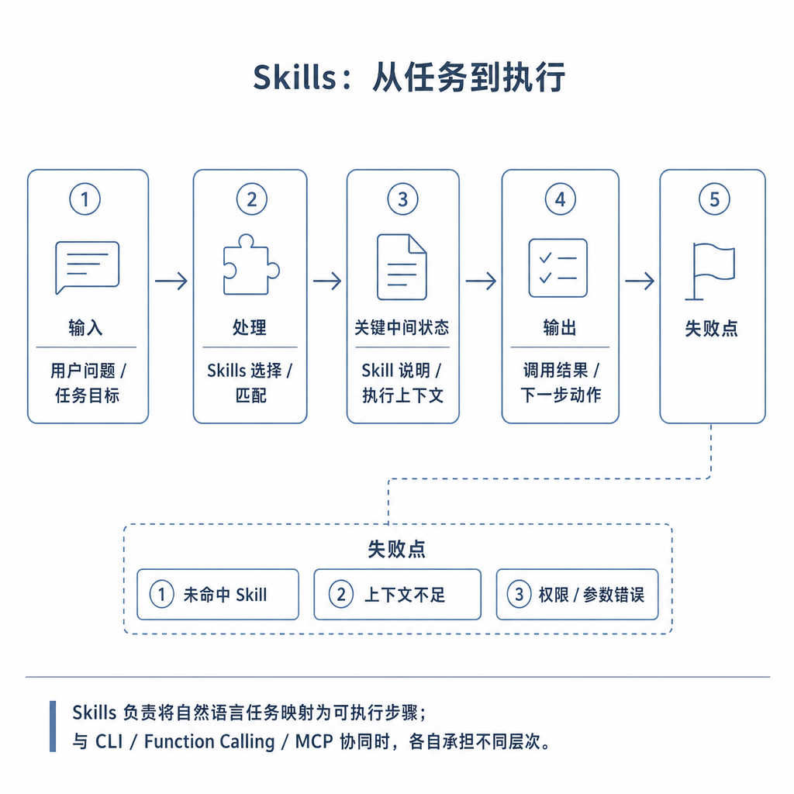
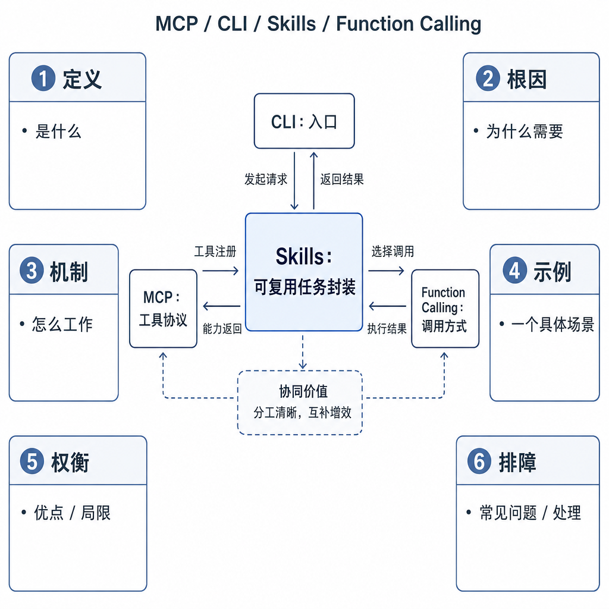

# MCP、CLI、Skills 和 Function Calling 的区别与协同

做 Agent 工程时，很多概念会同时出现：Skill 告诉模型按什么流程完成任务，模型通过 Function Calling 选择工具，工具来自 MCP Server，Server 内部调用 CLI。初学者最容易把它们都叫“工具”，结果设计和排查都混乱。出了问题后，不知道是任务方法错、模型选错工具、Server 连接失败，还是命令参数有问题。

面试问四者区别与协同，最好按层次回答：Skill 是任务方法，Function Calling 是模型接口，MCP 是连接协议，CLI 是底层执行方式。

## 核心矛盾：同一条链路上有四种责任

错误设计通常是让模型读一段操作手册，然后自由拼命令执行。这样四层全混在一起：没有结构化参数，没有能力发现，没有权限隔离，也没有可审计流程。

分层之后，每层责任清楚。Skill 规定“怎么做这个任务”；Function Calling 规定“模型如何表达要调用什么”；MCP 规定“工具能力从哪里来、如何接入”；CLI 负责“最后在系统环境里怎么执行”。

## 底层机制：四层分别解决什么问题

Skill 位于任务经验层。它像可复用 SOP，规定遇到代码审查任务时先看 diff，再识别安全风险，再运行相关测试，最后输出结论。它不一定提供工具，只规定任务流程和边界。

Function Calling 位于模型接口层。它让模型以结构化形式提出 `read_file`、`run_tests`、`search_docs` 等工具请求，并生成符合 schema 的参数。它不负责工具从哪里来，也不负责真实执行。

MCP 位于连接协议层。Host 通过 Client 发现和调用外部 Server 暴露的 tools、resources、prompts。它让工具能力可以被多个 Host 复用，并集中治理权限和错误。

CLI 位于执行层。它是 `git`、`npm`、`python`、`kubectl` 等具体命令。CLI 能力强，但受环境、权限、路径、依赖和退出码影响，也最容易产生真实副作用。

## 工程例子：审查 PR 并运行测试

用户说“帮我审查这个 PR 并跑测试”。代码审查 Skill 先被触发，要求查看 diff、识别风险、关注安全和兼容性、运行相关测试、输出结论。

模型通过 Function Calling 请求读取 diff 和运行测试。`get_diff` 工具可能来自 Git MCP Server，`run_test` 工具可能来自项目工具 Server。Server 内部再调用受限 CLI，例如 `git diff` 或 `npm test -- login.spec.ts`。执行结果返回 Server，再经 Host 回填给模型。模型最后按 Skill 要求组织审查报告。

这里 Skill 没有替代 MCP，MCP 也没有替代 Function Calling。它们串起来后，才形成可复用、可控、可审计的工具链。

## 边界和风险：跨层越权最危险

每层都有自己的失败模式。Skill 可能触发错或流程过时；Function Calling 可能选错工具或生成坏参数；MCP 可能连接失败、能力描述不一致或权限配置错误；CLI 可能因为依赖缺失、路径错误、命令注入或权限不足失败。

安全上最危险的是跨层越权。比如 Skill 写“必要时执行任意命令”，Function Calling 又暴露 `run_command(command: string)`，MCP Server 不限制工作目录，CLI 就可能删除真实文件或泄露环境变量。

正确设计要逐层收口：Skill 写清适用边界和禁止事项；Function Calling 用 schema 限制参数；MCP 做能力发现、权限治理和审计；CLI 放进沙箱，限制命令集合、工作目录和超时。

## 面试高频追问

- Skill、Function Calling、MCP、CLI 分别解决什么问题？
- 它们在一个 Agent 系统中如何协同？
- 为什么 Skill 不能替代 MCP？
- 为什么 MCP 不能替代 Function Calling？
- 哪一层最需要做权限控制？

## 可复述答案

Skill 是任务能力包，解决“这类任务应该怎么做”；Function Calling 是模型接口，解决“模型如何结构化选择工具和生成参数”；MCP 是连接协议，解决“Host 如何发现和调用外部 Server 的 tools、resources、prompts”；CLI 是执行方式，解决“底层命令如何完成具体动作”。它们可以串起来：Skill 指导流程，模型用 Function Calling 选择 MCP tool，MCP Server 内部调用受限 CLI。工程上要逐层做 schema、权限、沙箱、超时和审计，不能让模型直接自由执行命令。

## 排查和实践建议

排查时按层切分，不要混在一起猜。任务步骤不合理，看 Skill；工具选择错误，看 Function Calling 描述和 schema；工具不存在或连接失败，看 MCP 能力发现和 Server 日志；命令报错，看 CLI 环境、参数、退出码和权限。

设计时先写 Skill 的任务边界，再定义窄工具 schema，再决定是否用 MCP 暴露能力，最后把 CLI 封装成安全执行单元。面试中用“四层模型”回答，逻辑会很清楚。
