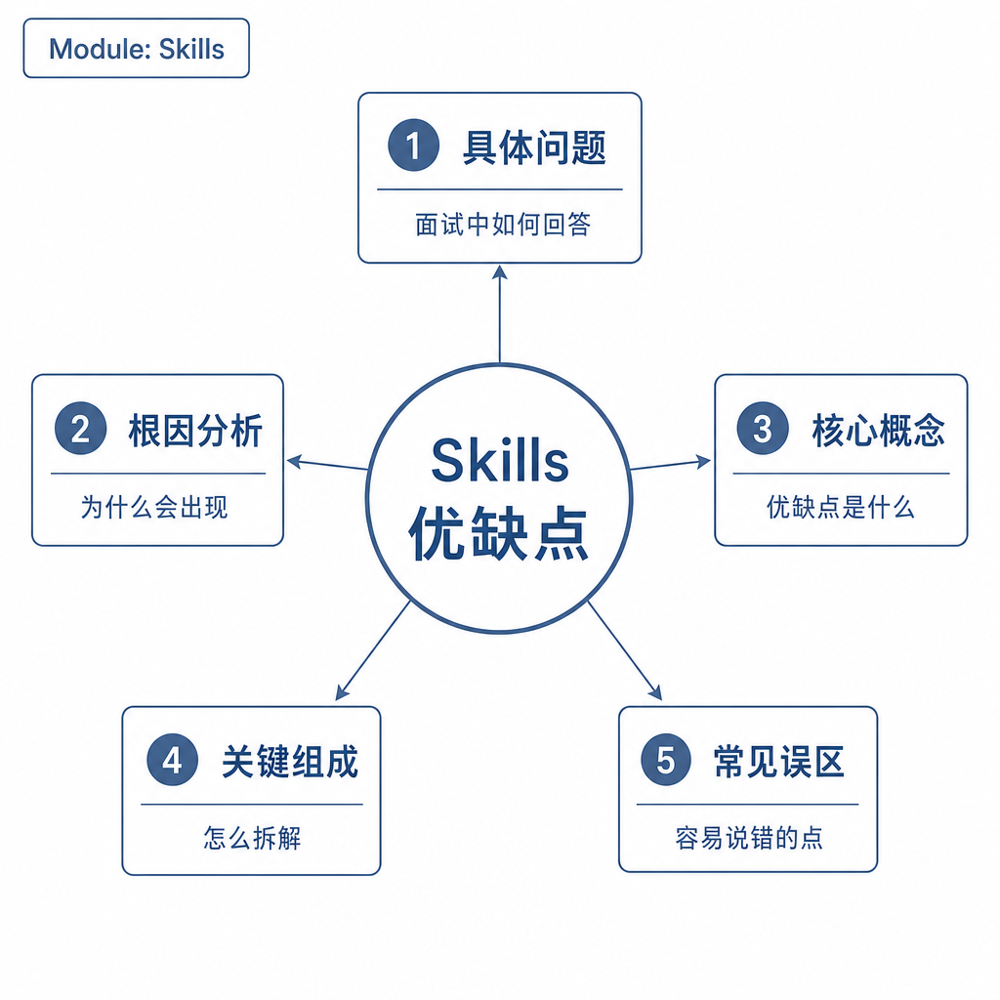
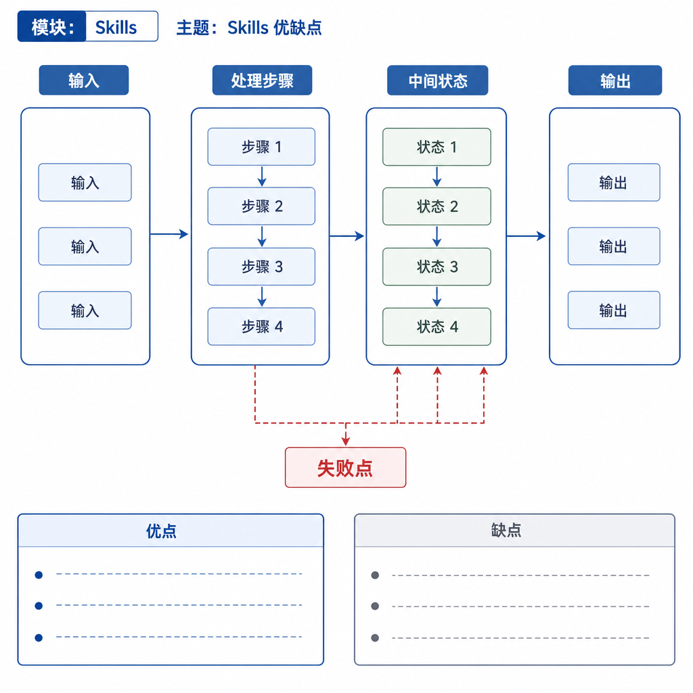
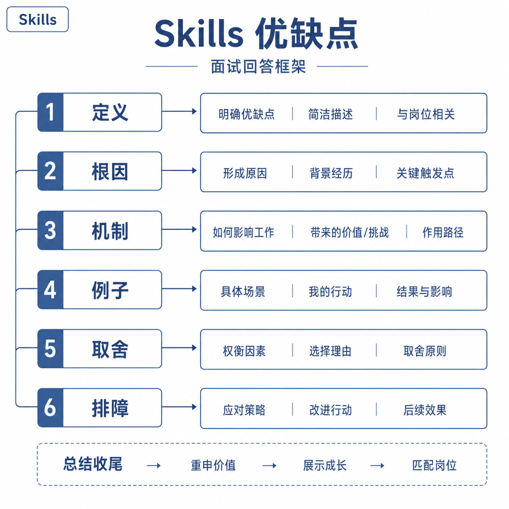

# Skills 优缺点

Skill 看起来很适合规模化复用：写一次代码审查 Skill，以后所有 PR 都按同一套流程检查；写一次 PPT 生成 Skill，以后所有汇报都能自动生成。但它也会稳定放大错误：如果流程过时、触发条件模糊、工具权限过大，模型会每次都按错误方式执行。

面试问 Skills 优缺点，要同时讲清复用价值和维护风险。Skill 不是越多越好，它适合沉淀高频、边界清楚、流程稳定的任务。

## 核心矛盾：经验可以复用，错误也会复用

Skill 的本质是把一类任务的经验沉淀成可加载能力。它减少重复提示，让模型在复杂任务中有稳定流程和检查清单。比如上线检查、代码审查、PDF 处理、PPT 生成，都有明确步骤和常见坑。

代价是，这些流程一旦写入 Skill，就会成为模型的强上下文。Skill 质量低，错误会被系统性复制；Skill 太多，触发冲突和上下文竞争会增加；Skill 过时，模型会稳定执行旧流程。

## 优点：复用、稳定和工程沉淀

第一个优点是复用。团队不用每次把同样流程重新写进 prompt，模型也不必临时推导任务步骤。

第二个优点是稳定。Skill 把步骤、工具顺序、输出格式和禁止事项固定下来，减少模型自由发挥。对新人和复杂任务尤其有价值。

第三个优点是节省上下文。配合渐进式披露，系统平时只加载简短描述，触发后再加载主体说明，需要时才读取资源文件。

第四个优点是工程沉淀。经验、模板、脚本和检查清单可以版本化维护。团队可以不断把真实失败案例写回 Skill，让能力越来越稳定。

对初学者来说，可以把 Skill 理解成“可被模型按需加载的 SOP”，但它不是纯文本模板，而是能和工具、资源、脚本协同的能力包。

## 缺点：维护、触发和安全成本

第一个缺点是维护成本。工具参数变了、业务规则变了、输出格式变了，Skill 必须更新。否则它会稳定地产生旧答案。

第二个缺点是触发歧义。多个 Skill 描述相似时，模型可能选错。比如“文档写作 Skill”和“PDF 处理 Skill”都提到文档，边界不清就会误触发。

第三个缺点是过拟合流程。某些开放式任务需要灵活探索，过强 Skill 会限制模型判断。比如用户只想要一句 SQL 结论，数据分析 Skill 却强制画图、写报告，就是过度执行。

第四个缺点是安全风险。Skill 如果写入高危命令、绕过确认或自动提交的步骤，会让错误更稳定。它不能突破工具权限和用户授权。

## 工程例子：上线检查 Skill 的收益和坑

一个“上线检查 Skill”可以要求模型依次检查配置、数据库迁移、监控告警、回滚方案、灰度策略和测试结果。优点是新人也能按标准流程做发布评审，遗漏率下降。

但如果公司发布平台新增了灰度规则，而 Skill 没更新，它会持续遗漏关键检查项。再比如 Skill 写了“检查完成后自动发布”，那就越过了高风险动作的确认边界。正确做法是让 Skill 生成检查报告和建议，由 Workflow 或人工确认执行发布。

这说明 Skill 适合沉淀方法，不适合无条件接管高风险动作。

## 边界和风险：什么任务不适合做成 Skill

边界模糊、低频、变化快的任务不适合优先做 Skill。为这类任务写 Skill，维护成本可能超过收益。开放探索型任务也要谨慎，过强流程会压制模型发现新路径。

Skill 太多也会带来系统问题：触发冲突、上下文膨胀、版本不一致、权限难治理。团队需要为 Skill 做评测和淘汰，而不是只增不删。

安全上，Skill 不能包含“自动删除”“自动提交”“跳过测试”“读取所有密钥”这类无条件动作。涉及写文件、执行命令、调用外部 API 时，要明确确认点、回退方式和权限边界。

## 面试高频追问

- Skills 的主要优点是什么？
- Skills 的缺点和风险有哪些？
- 什么任务适合做成 Skill？
- Skill 太多会有什么问题？
- 如何维护和评估一个 Skill？

## 可复述答案

Skills 的优点是复用、稳定、节省上下文和沉淀工程经验。它把高频任务的流程、工具规范、模板和输出约束封装成能力包，让模型在触发时按固定方法执行。缺点是维护成本、触发歧义、流程过时和安全风险。适合做成 Skill 的任务通常高频、边界清楚、流程稳定且有明确验收标准；变化快、低频、开放探索型任务不一定适合。工程上要版本化维护、定期评测、控制权限，并配合渐进式披露减少上下文负担。

## 排查和实践建议

评估 Skill 看四个指标：触发准确率、任务完成率、人工修改率和安全违规率。排查时先看是否选对 Skill，再看流程是否过时，最后看工具和输出是否符合约束。

设计时优先沉淀重复出现的问题，不要为一次性任务写 Skill。每个 Skill 都要写适用场景、不适用场景、权限边界和失败处理。面试中记住一句话：Skill 把经验产品化，也会把错误产品化。
