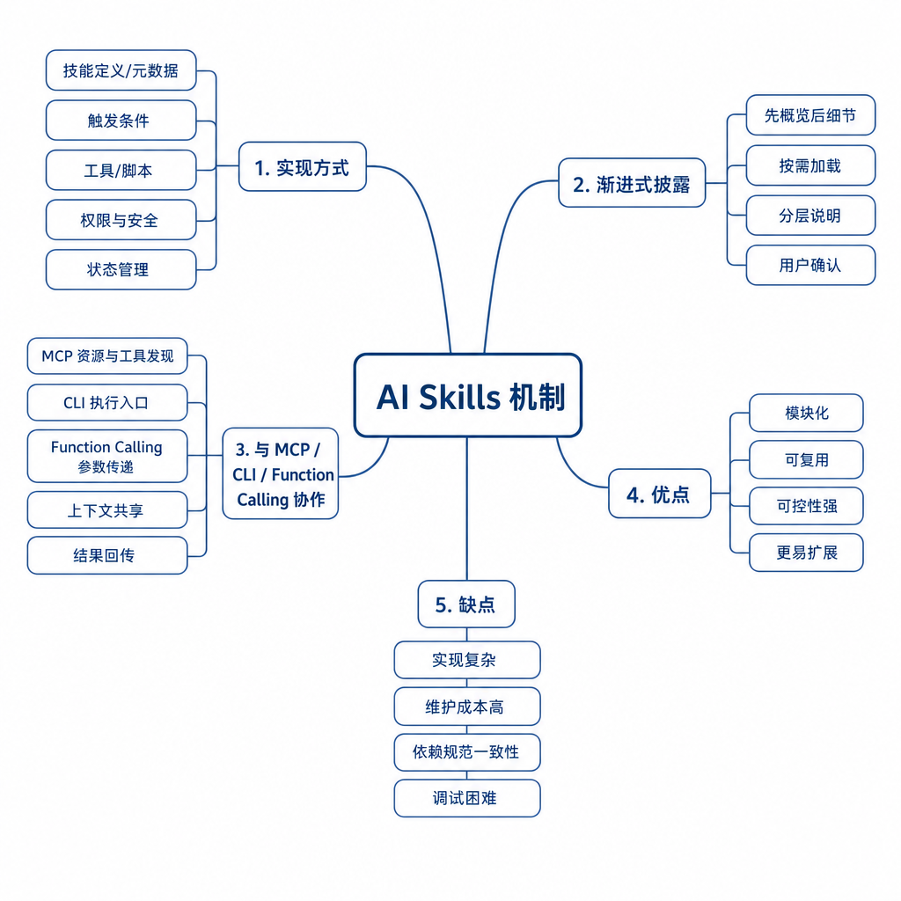

# Skills

Skills 是把任务知识、流程和工具使用方式封装成可复用能力。它更像“任务能力包”，不是单纯的 prompt。

## 考点目录

- [Skills 实现方式](01-Skills实现方式.md)
- [Skills 渐进式披露特点](02-Skills渐进式披露特点.md)
- [MCP、CLI、Skills 和 Function Calling 的区别与协同](03-MCP-CLI-Skills-Function-Calling区别与协同.md)
- [Skills 优缺点](04-Skills优缺点.md)

---

[返回总目录](../README.md)
