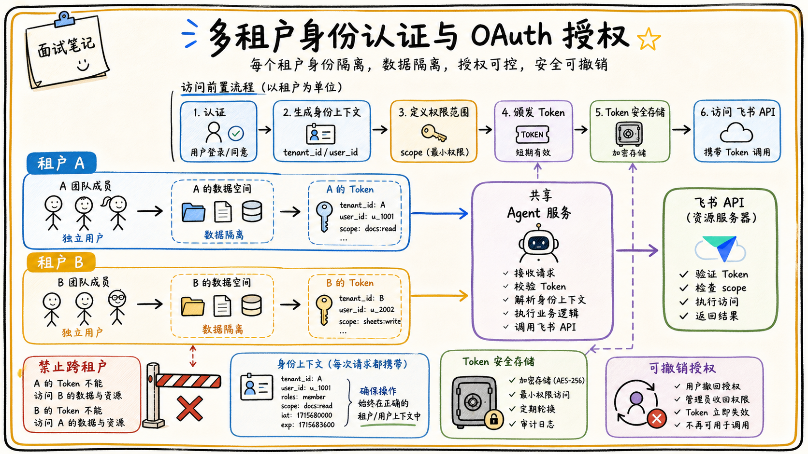

# 05-01 多租户、身份认证与 OAuth 授权怎么设计？

## 面试官追问

**面试官：** 一个飞书 Agent 服务多个企业租户，如何识别用户身份并访问对应数据？

**我：** 登录后拿到 Token，根据 Token 调用飞书 API。

**面试官：** 用户身份、租户身份和应用身份有什么区别？Token 过期或被撤销怎么办？

## 常见错误回答

“把 access_token 存在用户表里，所有请求都复用这个 Token。”

多租户系统中 Token 有租户、用户、scope、过期时间和撤销状态，不能混用或长期明文保存。

## 30 秒简答

我会把租户、用户、飞书应用安装关系和 OAuth 授权记录分开建模。请求进入后先验证登录身份，再解析 tenant_id、user_id、open_id 和授权版本；调用飞书 API 时从安全存储获取对应租户的 Token，按 scope 和资源范围执行最小权限访问。

Token 采用短期访问令牌加安全刷新机制，失败时区分过期、撤销、scope 不足和租户停用。所有缓存键、队列消息和审计记录都带 tenant_id，防止跨租户串数据。

## 原理拆解

### 1. 三种身份不能混淆

用户身份表示谁发起请求，租户身份表示数据和应用属于哪家公司，应用身份表示哪个飞书应用在调用接口。一个用户可能属于多个租户，一个租户也可能安装多个应用，系统必须显式传递上下文。

### 2. OAuth 授权是可撤销关系

授权记录保存 tenant_id、app_id、授权主体、scope、token 状态、过期时间和最后刷新时间。Token 只在服务端使用，日志和 Prompt 中不出现。用户卸载应用、撤销授权或 scope 变化后，缓存和后台任务都要失效。

### 3. 多租户隔离贯穿全链路

数据库行、向量分区、对象存储路径、缓存键、消息队列和 Trace 都要带租户标识。任何只用 user_id、不带 tenant_id 的查询都应视为高风险代码。

## 企业协作场景

同一套 Agent 服务同时为两家公司提供知识问答。员工姓名可能相同，但 tenant_id、文档空间和 OAuth Token 不同；系统必须先完成租户路由，再检索和调用工具。

## 工程方案与取舍

1. 采用租户级配置和密钥隔离，关键租户可以独立数据库或索引。
2. 统一身份上下文对象，禁止业务函数自行从请求头猜租户。
3. Token 只存密文或外部密钥服务，刷新和撤销操作可审计。
4. 为跨租户访问写专门的管理接口，普通 Agent 工具默认禁止跨租户。

## 继续追问

**Q：为什么不把 tenant_id 放在 Prompt？** Prompt 不是隔离边界，租户必须在服务端查询和授权层强制约束。

**Q：授权过期时能自动重新授权吗？** 可以引导用户重新授权，但不能静默扩大 scope 或使用其他用户 Token。

## 面试总结

多租户工程化的核心是身份上下文、授权关系、Token 生命周期和全链路隔离。每一次数据访问和工具调用都要明确“哪个租户、哪个用户、哪个应用、哪些 scope”。

## 深入展开：多租户请求如何安全地走完整链路

### 1. 请求上下文要不可伪造

用户从飞书消息或网页入口进入系统后，服务端先验证登录态或事件签名，再从可信 Token 中解析用户身份。`tenant_id` 不能直接信任客户端传入的普通参数，而应由登录关系、应用安装关系或经过授权的管理接口确定。业务服务接收统一的 `ActorContext`，里面包含租户、用户、应用、scope、权限版本和 trace_id。

### 2. Token 交换和刷新要隔离

用户授权 Token、应用 Token 和内部服务 Token 的作用不同，不能互相替代。Token 只在需要调用外部 API 的适配器中出现，模型、日志、消息队列和数据库普通字段都不保存明文。刷新失败时要停止后台任务并提示重新授权，不要用另一个用户或管理员 Token 代替。

### 3. 租户配置也属于隔离数据

Prompt、模型路由、知识库空间、限流预算、工具白名单和品牌配置都可能按租户不同。配置缓存键必须带 tenant_id，默认配置只能作为缺省值，不能在多个租户间意外共享。大型租户可以使用独立队列和索引分区，降低互相影响。

### 4. 租户生命周期和离职场景

租户停用、应用卸载、员工离职和部门变更都应触发权限缓存、Token、队列任务和索引 ACL 的失效。离职用户创建的后台任务不能继续使用个人授权执行高风险写入，需要转移给服务账号或人工处理。

## 租户生命周期和授权排障

多租户系统首先要在入口建立不可伪造的 request_context，至少包含 tenant_id、user_id、身份来源、会话、权限版本和追踪 ID。后续检索、模型配置、工具调用、缓存和日志都只从这个上下文读取租户，不接受模型或客户端自行传入的租户字段。后台任务也要持久化原始租户和用户，不能因为异步执行就退回成一个共享机器人身份。

OAuth 授权成功不等于永久可用。Token 可能过期、被撤销、scope 不足或对应用户已经离职，服务需要区分刷新、重新授权、降级只读和直接拒绝。管理员替换应用配置、租户停用或用户离开组织时，要清理缓存的授权状态并停止未完成的高风险任务。授权排障应按“身份识别、租户匹配、Token 状态、scope、资源 ACL、源系统状态”顺序进行。

上线前要用两个租户、两个用户和至少一项相同名称的资源做隔离测试，验证搜索、引用、写入、缓存命中和异步任务都不会串租户。日志可以记录资源 ID 和权限结果，但敏感 Token、正文和个人信息必须脱敏。安全边界越靠近运行时，越不依赖模型自觉。

## 面试追问补充：异步任务也不能丢身份

用户在聊天中创建的异步任务要保存租户、用户、授权来源、权限版本、模型和工具策略。消费者执行时重新加载这些信息并校验当前状态，不能只相信任务创建时的 Token。用户离职、租户停用或授权撤销后，未完成的高风险任务应暂停，已经排队的只读任务也要重新判断是否还能继续。

租户配置包括模型、知识源、限额、敏感级别和回调地址，同样属于隔离数据。配置缓存必须带 tenant_id 和配置版本，切换租户时不能复用上一个租户的客户端或授权对象。排查串租户时，优先检查上下文传递、缓存键、队列消息和日志聚合四个位置。

## 面试进阶回答

“我不会把多租户理解成数据库加一个 tenant_id，而是从认证、授权、Token、缓存、队列、索引和审计全链路隔离。请求进入后生成不可伪造的身份上下文，所有资源和工具访问都以它为准；授权撤销、租户停用和用户离职要能让后台任务停止或转交。”

### 一个实用的排查顺序

遇到“用户看到别的租户数据”时，先查入口解析的 tenant_id，再查数据库和缓存键是否带租户，接着查向量检索过滤、工具 Token 选择和引用链接。最后检查异步队列是否丢失租户上下文。不要只检查登录，因为跨租户问题往往发生在后续缓存或后台任务。
