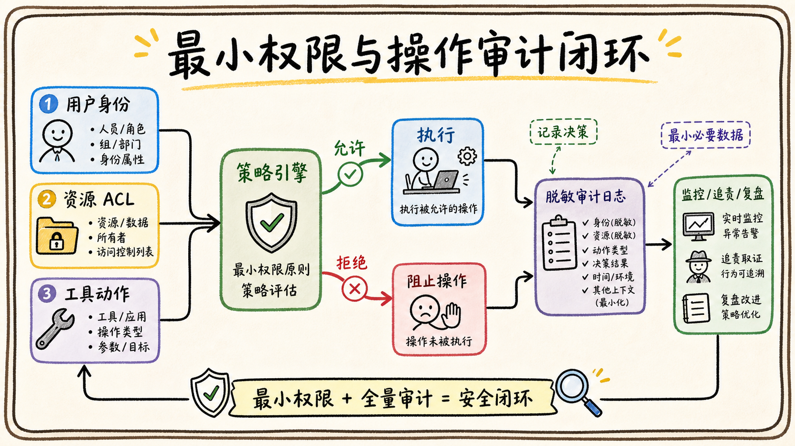

# 05-02 数据权限、最小权限与操作审计怎么落地？

## 面试官追问

**面试官：** Agent 的权限设计和普通后端服务有什么不同？如何知道它有没有越权操作？

**我：** 给应用需要的 API scope，然后记录日志。

**面试官：** scope 够不够？日志里要记录 Prompt 和所有数据吗？

## 常见错误回答

“应用管理员授权了，Agent 就可以访问企业全部数据。”

应用 scope 只是平台层权限，不能代替用户资源权限；审计也不是把敏感数据原样写进日志。

## 30 秒简答

我会采用最小权限：应用只申请必要 scope，工具只暴露必要动作，资源访问再按用户、部门、群组和对象 ACL 过滤。读写分离，高风险操作需要单独授权或审批。

审计记录操作者、租户、工具、资源、动作、权限决策、结果、request_id 和时间，但对 Prompt、文档正文和 Token 做脱敏或摘要。审计日志要防篡改、可检索，并能关联一次 Agent 任务的全部调用。

## 原理拆解

### 1. 从“能调用”细化到“能操作什么”

权限判断通常包含身份、租户、资源、动作和条件。例如用户可以读取某文档，但不能删除；可以更新自己负责的任务，但不能修改财务字段。工具参数中的资源 ID 也必须参与授权判断。

### 2. 审计记录决策而不是只记结果

除了成功和失败，还要记录权限检查的输入摘要、策略版本、命中的规则和拒绝原因。这样排查越权时才能知道是 Token scope、ACL、策略还是工具实现出了问题。

### 3. 敏感日志要可用但不可泄露

正文可以保存 hash、摘要或受控引用，参数中的手机号、邮箱、密钥和 access_token 必须脱敏。调试环境和生产环境使用不同日志级别，审计数据单独设置访问权限和保留期限。

## 企业协作场景

Agent 帮员工查询项目进度时可以读取任务标题和状态，但不能把客户合同正文写入普通日志。若员工要求修改交付日期，系统记录原值摘要、权限决策、确认人和最终变更结果。

## 工程方案与取舍

1. 策略判定集中化，工具服务不自行复制一套隐含权限规则。
2. 对资源级权限采用短缓存，对高敏感动作实时鉴权。
3. 审计日志异步写入但不可影响安全拦截；关键动作写入可靠队列。
4. 定期用审计数据做异常检测，如批量读取、跨部门访问和连续拒绝。

## 继续追问

**Q：管理员身份可以绕过审计吗？** 不应绕过，管理员操作更需要完整记录和必要审批。

**Q：日志越详细越好吗？** 不是，要在排障价值和敏感数据暴露之间平衡。

## 面试总结

最小权限控制访问范围，资源 ACL 决定具体对象，审计记录每次决策。三者共同构成企业 Agent 的责任边界。

## 深入展开：如何把权限和审计变成可执行策略

### 1. 权限策略要有统一入口

工具调用、知识检索、表格查询和文件下载都应该调用同一个授权服务或共享策略库，而不是每个工具自己写 `if department == ...`。策略输入包括主体、租户、资源、动作、资源状态、环境和风险；输出包括 allow、deny、需要确认或需要审批。

### 2. 最小权限可以分三层收紧

第一层是应用 scope，只申请平台 API 真正需要的能力；第二层是工具白名单，只暴露当前场景需要的动作；第三层是资源和字段级 ACL，只返回用户能看的对象和字段。这样即使某一层配置过宽，其他层仍然可以阻断。

### 3. 审计要支持“谁让它做的”

一次 Agent 写操作可能经过用户请求、模型建议、策略判断、用户确认和服务执行。审计链路要记录每个环节的关联 ID、参数摘要、策略版本、确认人和最终结果，区分“模型建议了动作”和“系统真的执行了动作”。

### 4. 审计数据也需要权限

审计日志通常比业务数据更敏感，应单独控制读取权限、保留期限和导出审批。日志中不记录完整密钥和不必要的正文；排障时通过受控回放读取最小数据。

## 权限策略怎样被执行和回放

权限判断最好统一为一个可审计的决策接口，输入主体、资源、动作、租户、时间和上下文，输出 allow、deny、reason、policy_version 和 expiry。搜索、查看、下载、引用、导出和修改是不同动作，不能因为用户能查看就默认能导出或让 Agent 代为修改。策略更新后要让权限版本变化，避免旧缓存继续生效。

最小权限可以分三层：模型只看到完成任务所需的字段和证据；工具只暴露完成当前任务所需的动作；身份只拥有当前用户实际授权的资源范围。即使模型被提示注入，也不能突破工具服务的第二次校验。批量操作要按资源逐项判断，部分资源无权时应明确拒绝并记录，而不是静默扩大范围。

审计记录不仅要记“成功或失败”，还要能回答谁在什么租户、以什么身份、基于哪条用户指令、经过哪个策略版本、调用了什么工具、影响哪些资源、最终结果是什么。回放审计时使用脱敏数据和原权限上下文，不能因为管理员查看日志就自动获得所有原文访问权。这样审计本身也不会成为新的数据泄露入口。

## 面试追问补充：权限决策要可解释

“拒绝访问”至少要能解释是主体无权、资源不存在、权限已过期、策略冲突还是服务不可用。对用户可以返回安全的概括信息，对管理员和审计人员保留更详细的 reason_code。不能用“没有找到”掩盖权限服务故障，也不能把资源名称直接泄露给无权用户。

数据导出和统计同样属于权限动作。用户可以看单条记录，不代表可以导出整个表；Agent 可以生成聚合趋势，也不代表可以暴露小群体的敏感明细。批量操作要设置数量和范围上限，异常时返回部分结果和拒绝清单，并把每一项决定写入审计。

## 面试追问补充：审计和业务操作要能对上

审计日志要保存业务对象的稳定 ID、操作前后摘要和源系统返回的 request_id，不能只保存一段模型文本。用户问“谁改了这个字段”时，系统应能关联原始指令、确认卡片、工具参数、审批实例和最终结果。对于批量操作，逐项结果和整体任务结果都要可查。

审计数据本身也需要保留周期、访问权限和脱敏规则。管理员查询审计不代表可以读取所有原文，导出审计要有审批和水印。这样既满足事故追踪，也避免为了安全审计而复制更多敏感数据。

## 面试进阶回答

“我会把权限判断集中成策略服务，把 scope、工具权限和资源 ACL 分层收紧。审计不只记录成功结果，还记录操作者、模型建议、策略版本、确认事件、拒绝原因和下游 request_id。日志本身也受权限控制，并对敏感字段脱敏。”

## 权限审计示例

一次“给项目群发送会议纪要”的审计记录可以包含：请求用户和租户、读取的文档 ID、文档 ACL 结果、目标群 ID、模型生成的消息草稿摘要、用户确认时间、消息发送工具版本、飞书 request_id 和最终状态。若操作被拒绝，则记录命中的拒绝策略和提示，不记录完整敏感正文。

### 面试中的判断标准

问到“管理员是否可以绕过权限”时，应回答管理员也要经过审计，只有专门的紧急处置流程可以临时提升权限，并设置原因、审批人、有效期和自动回收。最小权限不是降低效率，而是把必要的例外变成可控、可追责的流程。
