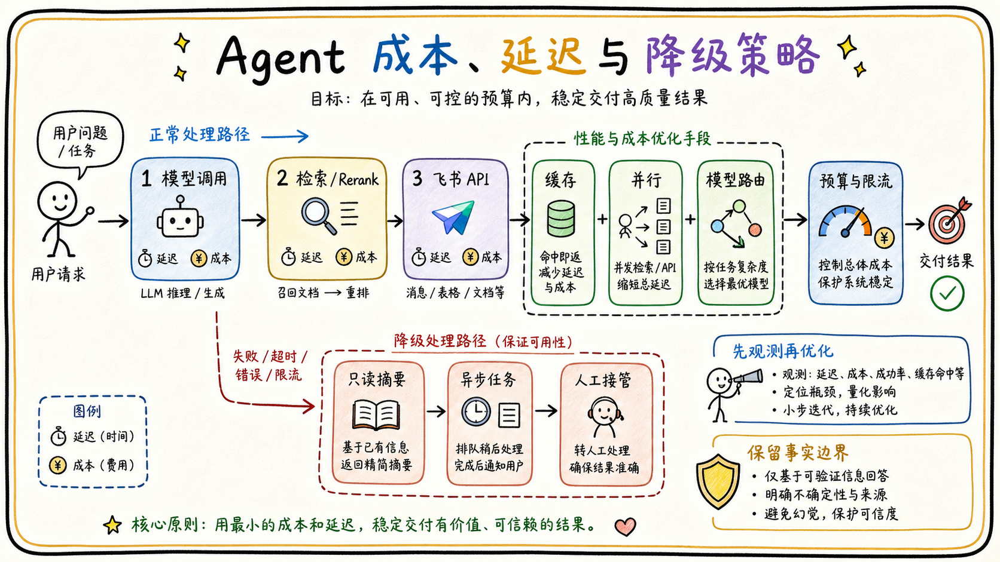

# 05-04 成本、延迟、缓存、限流与降级如何设计？

## 面试官追问

**面试官：** Agent 上线后成本和延迟很高，你会从哪里优化？

**我：** 换一个便宜模型，或者把 Token 限制小一点。

**面试官：** 多轮工具调用、检索、Rerank 和飞书 API 的耗时怎么拆？降级会不会损害正确性？

## 常见错误回答

“设置一个全局超时和一个全局 Token 上限，超过就返回错误。”

Agent 的成本和延迟来自多个阶段，简单截断可能造成答案缺证据，统一超时也不利于定位瓶颈。

## 30 秒简答

我会按任务、模型、检索、工具和用户维度统计 Token、调用轮数、P50/P95 延迟、缓存命中率和失败率。优化顺序通常是减少不必要的 Agent Loop、缓存稳定结果、并行独立检索、限制候选上下文，再做模型路由和 Prompt 压缩。

缓存要区分公开内容、用户权限和任务状态，权限相关结果不能跨用户复用。限流按租户、用户、工具和成本预算设置；下游不可用时优先降级到只读检索、异步任务、较小模型或明确提示，不牺牲权限和事实边界。

## 原理拆解

### 1. 先拆分成本与延迟

一次请求可能包含 Query Rewrite、Embedding、多个召回器、Rerank、模型调用、飞书 API 和卡片发送。Trace 中为每一段记录耗时和 Token，才能判断是模型慢、检索慢还是外部 API 慢。

### 2. 缓存要带权限和版本

公开文档的检索结果可以共享，个人可见结果必须绑定用户和权限版本，动态表格查询要绑定数据版本和查询参数。源文档更新或权限变更时，相关缓存必须失效。

### 3. 降级优先保护正确性

模型不可用时可以返回已确认的缓存答案并标记时间，也可以转为异步处理；Rerank 不可用时回退到混合排序；工具写入失败时不能用模型文本假装成功。

## 企业协作场景

周五下午大量员工同时查询制度。系统复用公开知识的检索缓存，对个人权限结果单独过滤；模型高峰时先返回带引用的检索摘要，复杂分析转为后台任务。

## 工程方案与取舍

1. 建立按租户和任务类型的预算，防止少数请求消耗全部资源。
2. 对独立检索和 Embedding 批量并行，对写操作保持顺序和幂等。
3. 限流返回可理解的重试时间，不让 Agent 无限自动重试。
4. 所有降级状态进入指标和用户提示，避免静默降低质量。

## 继续追问

**Q：缓存答案会不会过期？** 必须绑定版本、TTL 和权限状态，关键数据可只缓存检索结果而不缓存最终答案。

**Q：便宜模型一定更适合吗？** 要看任务风险和评测结果，简单分类可用小模型，高风险决策不能只按价格选型。

## 面试总结

成本优化先靠可观测和流程缩短，再靠缓存、并行和模型路由；降级必须保留权限、引用和事实边界。

## 深入展开：优化顺序和降级原则

### 1. 先削减无效工作

很多成本不是模型本身造成的，而是重复 Query Rewrite、重复检索、过大的上下文和无意义的工具循环。先检查是否可以复用 Query、并行独立召回、减少无关字段、使用父子块摘要和限制最大轮数，再讨论模型替换。

### 2. 缓存按稳定性分层

公开制度的文档解析和 Embedding 可以长时间缓存，检索结果绑定文档版本；用户问题的答案缓存要绑定权限版本、时间和上下文；实时表格结果只在明确允许的时间窗口内缓存。缓存命中也要记录来源和生成时间，不能把缓存答案伪装成实时事实。

### 3. 限流要保护关键任务

按租户、用户、接口、工具和优先级设置配额。高峰时优先保证审批状态查询和高价值业务，低优先级的批量分析转异步。限流响应包含任务 ID、预计等待和重试建议，避免用户和 Agent 反复点击造成更大压力。

### 4. 降级不改变安全边界

模型不可用时可以返回已核验的检索证据，Rerank 不可用时回退到混合排序，飞书写 API 不可用时保存草稿；但权限过滤、引用来源和写入确认不能因为降级而关闭。所有降级都要在界面和指标中显式标记。

## 资源预算和降级顺序

Agent 的成本来自模型 Token、Embedding、Rerank、工具调用、存储和异步任务，延迟则来自这些步骤的串行叠加。可以为每类任务设置总预算、最大模型轮数、最大检索候选数和最长工具等待时间，运行时在每一步扣减预算。预算耗尽时返回已有证据和可解释的未完成状态，不要继续让模型循环。

缓存要按稳定性分层：文档解析和 Embedding 适合长缓存，公开制度的检索候选可以按版本缓存，带用户权限的答案缓存时间更短，实时金额和审批状态原则上直接查询源系统。缓存键至少包括租户、主体或权限版本、问题标准化结果、索引版本和模型版本，任何一个关键版本变化都应失效。

降级顺序应先保护事实和安全，再牺牲速度和表达。例如 Rerank 超时可以退回混合召回，模型超时可以返回引用摘要，非关键异步通知可以延后；权限服务失败、写入状态未知或源数据版本冲突则必须停止。限流也要按租户、用户、工具和任务风险分层，防止低价值循环挤占审批等关键任务。

## 面试追问补充：优化要先找到真正瓶颈

看到延迟高时，先用 Trace 拆分排队、检索、Rerank、模型、工具和网络时间；看到成本高时，拆分输入 Token、输出 Token、Embedding、工具调用和重试次数。不同瓶颈的解决方案不同，不能一律换小模型或增加缓存。优化后必须重新跑核心评测，确认质量没有明显回退。

限流要保护关键路径。可以给普通问答、复杂研究、批量导出和高风险写操作分配不同并发预算，Agent Loop 还要有单任务轮数上限。降级时保留租户隔离、ACL、确认和审计这些硬边界，只降低非关键质量或速度，不降低安全要求。

## 面试追问补充：预算要和业务价值绑定

不同任务的成本上限不能完全相同。简单制度问答可以快速返回，复杂研究或跨表分析允许更长时间，但必须提前展示进度和预计资源。高风险任务宁可转人工，也不能因为节省模型调用而跳过证据、确认和审计。

优化应建立基线和对照：固定问题集，比较模型路由、上下文长度、缓存命中、召回数量和重试策略对质量、P95、成本和接管率的影响。出现指标冲突时，先保证安全和事实，再选择可接受的速度与成本。

## 面试进阶回答

### 成本优化要服从任务目标

可以按任务风险和价值做分层：简单问答优先小模型和短上下文，复杂研究任务才使用更强模型；检索候选先缓存，但权限过滤和最终生成不能省略；重复失败要及时停止，避免 Agent 无限循环。每次优化都同时观察完成率、引用正确率、P95 延迟和人工接管率，不能只因为 Token 下降就判断优化成功。

“我会先用 Trace 找出每个阶段的 Token 和 P95，再优化循环、上下文和重复调用；缓存绑定版本和权限，限流按租户与优先级分层。降级可以降低体验或改成异步，但不能牺牲 ACL、事实来源和高风险确认。”

### 成本优化的量化方法

单任务成本可以拆成输入 Token、输出 Token、Embedding、Rerank、工具调用和存储成本；延迟可以拆成排队、检索、模型、工具和消息发送。每次优化记录“成本下降多少、P95 改善多少、引用或完成率是否回归”，避免只凭感觉说系统变快了。
