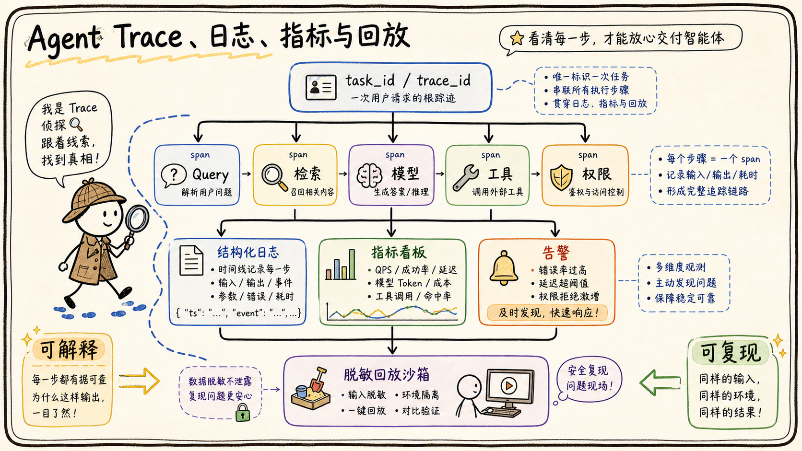

# 05-05 可观测性：Trace、日志、指标、回放怎么做？

## 面试官追问

**面试官：** Agent 明明调用成功了，用户却说答案不对，你如何定位？

**我：** 看服务日志和模型返回内容。

**面试官：** 如何还原当时检索了什么、模型看到了什么、权限如何判定？

## 常见错误回答

“保存完整 Prompt 和响应到日志里，出问题直接搜索关键词。”

完整保存可能泄露企业数据，也无法形成跨服务的调用链。Agent 需要结构化 Trace 和可控的回放数据。

## 30 秒简答

我会为每次用户任务建立 trace_id 和 task_id，把 Query Rewrite、检索、Rerank、模型调用、工具执行、权限决策、卡片交互串成 Span。日志记录结构化事件和脱敏摘要，指标覆盖成功率、引用率、工具错误、延迟、成本、人工接管和安全拦截。

线上故障通过保存的输入摘要、配置版本、候选 ID、模型版本和结果状态回放，必要时在脱敏沙箱重跑。回放系统不能默认访问当前生产数据，权限和数据版本要与原任务隔离。

## 原理拆解

### 1. Trace 记录因果链

根 Span 表示用户任务，子 Span 表示检索器、模型、工具和人工确认。每个 Span 记录输入输出摘要、耗时、版本、状态和 request_id，外部飞书 API 的调用也要透传关联 ID。

### 2. 日志、指标和追踪互补

日志适合看单次细节，指标适合看趋势和告警，Trace 适合看一次任务的跨服务链路。三者通过 trace_id、tenant_id 和 task_id 关联，但敏感正文不应直接作为标签或指标维度。

### 3. 回放要可复现但不越权

回放包保存问题、权限快照、检索候选 ID、配置版本、工具结果摘要和模型版本。需要重新访问原文时，通过受控服务按原权限读取，或者使用脱敏快照，不能让调试人员直接拿到生产全库。

## 企业协作场景

用户反馈“制度答案引用了旧版本”。Trace 可以显示检索命中了哪两个版本、版本过滤规则、Rerank 分数和最终上下文，工程师据此判断是同步、过滤还是 Prompt 的问题。

## 工程方案与取舍

1. 关键字段使用稳定枚举，避免把用户问题全文写成高基数指标标签。
2. 设置慢请求、工具失败、无引用回答和越权拦截告警。
3. 采样保存普通任务，对高风险和失败任务提高采样率。
4. 回放前做敏感信息脱敏和租户隔离，并支持删除。

## 继续追问

**Q：为什么不能只看最终答案？** 最终答案无法说明错误来自检索、权限、工具还是生成，必须保留中间状态。

**Q：Trace 会不会很贵？** 可以采样和分层保存，但关键安全和失败路径要完整记录。

## 面试总结

可观测性让 Agent 从“看起来会回答”变成“可以解释、定位和回放”。Trace 串因果，日志看细节，指标看趋势，回放支撑迭代。

## 深入展开：如何用一条 Trace 解释错误答案

### 1. 每个阶段都要有输入输出摘要

Query Rewrite Span 记录原问题、改写结果和规则版本；检索 Span 记录召回器、候选 ID、分数和过滤原因；模型 Span 记录模型版本、Token 和停止原因；工具 Span 记录参数摘要、权限结果、耗时和下游 request_id；生成 Span 记录引用校验和最终状态。

### 2. 指标要能连接业务结果

除了调用次数和错误率，还要看无引用回答率、无答案拒答率、工具重复调用、人工接管、用户重复提问和任务完成时间。指标按租户、场景、版本和风险等级切分，才能知道某次模型升级究竟影响了谁。

### 3. 回放分为确定性和探索性

确定性回放使用原始权限、候选和工具结果，验证同一版本是否能复现；探索性回放替换模型、Prompt 或检索器，比较新旧方案。两者都不应直接读取未脱敏的生产全库，必要时使用快照和沙箱工具。

### 4. 隐私和保留策略

普通任务可以采样保留，失败、高风险和安全拦截任务提高采样率。日志字段设置保留期限，删除用户数据时能关联清理 Trace、缓存和回放包。调试权限与业务数据权限分离，避免“为了排查问题”扩大访问范围。

## 观测字段和隐私边界

Trace 的根节点代表一次用户任务，子节点记录意图识别、检索、重排、模型调用、工具执行、确认和最终发送。每个节点保存开始结束时间、状态、输入输出摘要、版本、重试次数、错误类型和关联资源。这样可以回答“慢在哪里”“哪一步改变了路线”“为什么引用了这段内容”，而不是只看到一条最终回复。

正文和参数可能包含敏感信息，因此日志要区分可检索摘要、脱敏字段、加密原文和不可记录字段。访问 Trace 也要经过租户和角色权限，导出或回放高敏任务需要审批。保留周期按业务和合规要求设置，删除用户数据时同步处理 Trace、缓存、评测样本和媒体附件。

回放可以分为确定性回放和探索性回放。确定性回放固定模型、Prompt、索引、工具结果和权限快照，用来验证版本是否回归；探索性回放允许替换一个组件，用来比较新策略。两者都要明确不会再次执行真实写操作，所有外部工具默认使用模拟器或只读模式。

## 面试追问补充：从一条 Trace 找到根因

如果用户说答案引用了旧制度，先看请求使用的权限和索引版本，再看召回候选、Rerank 排名、模型上下文和引用生成；如果用户说工具重复创建，再看任务 ID、幂等键、超时、重试和源系统状态。Trace 要保留阶段之间的关联 ID，不能只记录最终文本。

指标聚合要能下钻到样本。P95 变差时能找到慢请求，引用率下降时能找到缺失来源，人工接管上升时能按意图和错误类型分类。回放环境默认隔离真实写操作，工具返回固定结果或模拟结果，避免为了复现问题再次修改线上数据。

## 面试追问补充：观测系统也要有版本

Trace 字段、采样规则、脱敏策略和指标口径改变时，要记录观测版本，否则不同时间的指标无法直接比较。关键高风险任务可以全量采样，普通问答按比例采样，但错误请求、超时请求和人工接管请求应保留完整链路。

回放结果要标识是原始结果、当前版本重跑结果还是替代方案结果。测试环境默认不执行真实写工具，发现差异后关联到代码、Prompt、索引、模型或权限版本。这样可观测性才真正支持发布评估和事故复盘。

## 面试进阶回答

### Trace 要能支持定位和复盘

一次 Trace 至少要关联租户、用户、会话、任务、模型版本、Prompt 版本、检索结果 ID、工具调用参数摘要、延迟、Token、错误类型和最终状态。敏感正文应脱敏或只保留受控引用。回放时固定原始输入和版本，才能判断问题来自数据变化、策略变化还是模型变化，并把确认过的失败样本沉淀到评测集。

“我的 Trace 会把一次任务的改写、召回、权限、模型、工具和引用串起来，并记录版本和 request_id。日志做脱敏摘要，指标看趋势和业务结果，回放使用原权限和脱敏快照。这样可以回答错在哪里、为什么错，以及新版本是否真的改好了。”

### 观测系统的最低落地版本

第一版不必建设复杂平台，但至少要有 task_id、trace_id、模型和 Prompt 版本、检索候选、工具状态、最终引用、耗时和成本。先保证失败请求能找到完整链路，再逐步增加分布式 Trace、采样、指标看板和自动回放。没有这些字段，后续再强的模型也难以定位问题。
