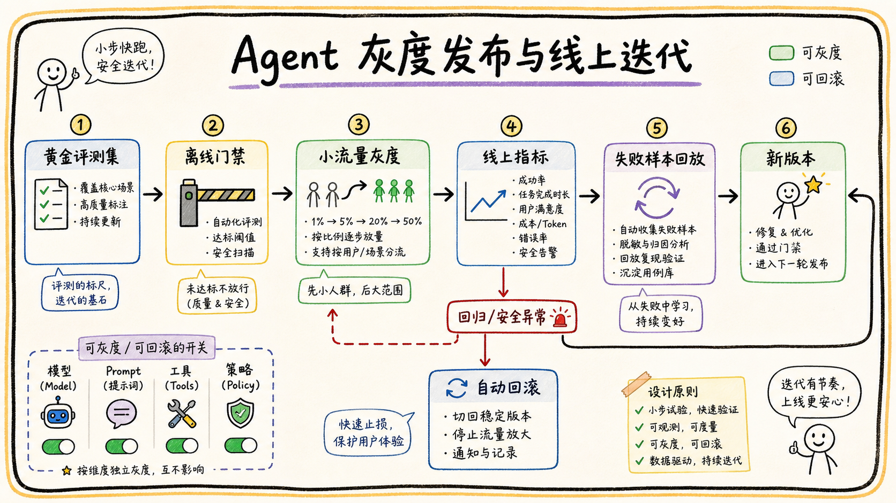

# 05-06 灰度发布、评测集与线上效果迭代怎么做？

## 面试官追问

**面试官：** Agent 从 Demo 到生产，如何灰度？上线后怎样证明效果变好了？

**我：** 先给少量用户试用，收集反馈后继续优化 Prompt。

**面试官：** 少量用户遇到安全问题怎么办？如何区分模型变好和问题变简单？

## 常见错误回答

“A/B 测试只比较点赞率，哪个高就全量发布。”

灰度不仅是流量比例，还要控制租户、任务、模型、工具权限和回滚；线上反馈也必须与固定评测集结合。

## 30 秒简答

我会先建立覆盖核心场景、边界条件、权限和失败恢复的评测集，固定记录问题、身份、标准证据和评价规则。发布时按租户或用户分组灰度，配置版本和工具能力可独立开关，高风险写操作默认关闭。

线上同时观察任务完成率、引用正确率、满意度、P95 延迟、成本、人工接管和安全拦截。新版本先通过离线门禁，再小流量观察，出现回归自动回滚。失败样本进入评测集，形成数据驱动迭代。

## 原理拆解

### 1. 评测集要有版本

评测样本分为正常问题、长尾表达、无答案、权限边界、Prompt Injection、工具失败和高风险动作。每个样本保存标准证据、允许拒答条件和指标版本，防止评测集被悄悄改成更容易的问题。

### 2. 灰度控制多个开关

模型、Prompt、检索配置、工具权限和 UI 体验可以分别灰度。按租户灰度方便企业协同，按用户灰度方便随机实验，按任务灰度方便高风险能力逐步开放。

### 3. 回滚要包含数据和配置

回滚不仅是换模型，还要恢复 Prompt、Rerank、工具版本、策略、缓存和索引版本。发布前记录完整配置快照，确保能在短时间内恢复上一稳定状态。

## 企业协作场景

先让一个部门使用只读知识问答，观察引用和拒答；第二阶段开放低风险任务创建；高风险审批和消息外发保持关闭，直到权限、确认和审计指标都达标。

## 工程方案与取舍

1. 离线门禁必须包含安全样本，不能只看平均回答质量。
2. 实验分流保持用户稳定，避免同一任务在不同版本间跳变。
3. 线上反馈与 Trace 自动关联，减少人工复制问题。
4. 设定停止条件和自动回滚阈值，避免“再观察一下”拖延事故。

## 继续追问

**Q：线上满意度下降但准确率上升怎么办？** 检查任务覆盖、延迟、表达、引用可用性和用户预期，不能只看一个指标。

**Q：灰度期间能开放写操作吗？** 可以，但必须分级、限额、可撤销并保留人工确认。

## 面试总结

生产迭代依赖固定评测集、可控灰度、完整配置快照、线上指标和自动回滚。Prompt 优化只是其中一环，不是完整上线策略。

## 深入展开：灰度发布的实际控制面

### 1. 灰度对象不只是用户比例

可以按租户、部门、用户、任务类型、模型、Prompt、检索配置和工具权限分别切换。第一阶段可能只灰度只读知识问答，第二阶段再灰度草稿生成，写操作和外发动作保持关闭。每个开关都要有负责人、有效期和回滚值。

### 2. 评测集要防止“越测越容易”

黄金集由稳定核心样本、过去失败样本和定期新增的长尾样本组成，样本变更需要审核和版本记录。线上反馈不能直接删除坏样本，而应标注问题类型、期望行为和证据，经过复核后加入评测。

### 3. 回滚要恢复整个配置快照

模型版本、Prompt、工具 Schema、策略、Rerank、索引和缓存都可能影响结果。发布前保存一个完整快照，回滚时同时恢复这些配置；如果数据索引已经变化，还要能切回上一版本或重新构建。

### 4. 线上迭代的停止条件

提前设定关键门槛，例如越权拦截下降、无引用回答上升、P95 超时、成本超预算或高风险动作错误率上升时自动暂停。不能只因为整体满意度略有提升，就忽略安全和长尾回归。

## 线上迭代的证据闭环

灰度对象不只是用户比例，还可以按租户、部门、意图、模型版本、Prompt、索引版本和风险等级切分。发布记录要保存配置快照、评测集版本、观察窗口、基线和停止条件。每次只改变一个主要变量，才能知道完成率或引用率变化究竟由什么造成。

线上样本进入评测集前要去重、脱敏和分类，避免把容易问题越测越多、把困难问题遗忘。高频失败、用户重复追问、人工接管、越权拦截和无证据回答都应优先抽样。修复后先做离线回归，再做小流量灰度，确认硬门槛没有恶化才能继续放量。

回滚不能只切换模型，还可能需要恢复 Prompt、工具 Schema、检索索引、ACL 策略和缓存版本。出现异常时先停止新增风险动作，再保留只读问答或人工流程，最后根据 Trace 定位。把灰度、评测、监控和回滚串成闭环，才能让 Agent 在不断变化的模型和数据环境中稳定演进。

## 面试追问补充：灰度不是只看平均满意度

灰度期间要同时观察完成率、引用正确率、无证据回答、越权拦截、工具失败、P95、成本和人工接管。总体满意度可能被简单问题拉高，因此必须按高风险意图、长尾问题、租户和版本切分。任何安全硬门槛恶化，都应暂停放量而不是等待平均分恢复。

评测集中的线上样本要脱敏、去重并标注来源，修复后记录对应版本和预期影响。发布、回滚和再次灰度都保留配置快照，确保问题能够复现。线上反馈不是直接拿来训练模型，而是先经过分类、人工确认和回归验证，避免把错误答案当成正确样本。

## 面试追问补充：灰度结束也要复盘

灰度结束时要比较新旧版本在相同人群、相同意图和相同时间窗口下的表现，确认提升不是流量结构变化造成的。对新增错误逐条归类，判断是模型、Prompt、检索、权限、工具还是交互问题，再决定进入评测、代码修复或产品流程。

上线记录和反馈要形成版本链。下一次发布前自动回归历史失败样本，发布后观察硬门槛和趋势；如果指标改善但成本、延迟或人工接管超标，就保持小流量或回退。持续迭代的关键是证据可比，而不是发布次数多。

## 面试进阶回答

### 灰度发布要有停止条件

每次灰度都应记录版本、目标人群、流量比例、观察窗口、基线和回滚条件。除了总体完成率，还要单独监控越权拦截、无证据回答、工具写入错误和人工接管。达到安全门槛或体验门槛后再扩大范围；任何硬门槛恶化都应暂停放量并回滚，修复后重新走离线评测和小流量验证。

“我会把评测集和灰度配置都版本化，先离线门禁，再按租户和能力开关做小流量灰度。线上同时看质量、业务、成本、延迟和安全指标，异常达到阈值自动回滚整套配置。每个失败样本经过复核后进入下一版评测集。”

### 灰度记录要包含什么

每次灰度至少记录实验 ID、分流规则、模型和 Prompt 版本、检索与工具配置、评测集版本、开始结束时间、样本量和回滚阈值。分析时先确认两组用户和任务分布相近，再比较指标。若只比较几条用户反馈，很容易把任务难度差异误认为版本效果。

### 迭代的正确顺序

先用失败 Trace 找到问题层次，再只改变一个变量做离线回归；通过门禁后进入小流量灰度；确认安全和成本没有回归，再扩大范围。这样能把“继续调 Prompt”变成有证据的工程迭代。
