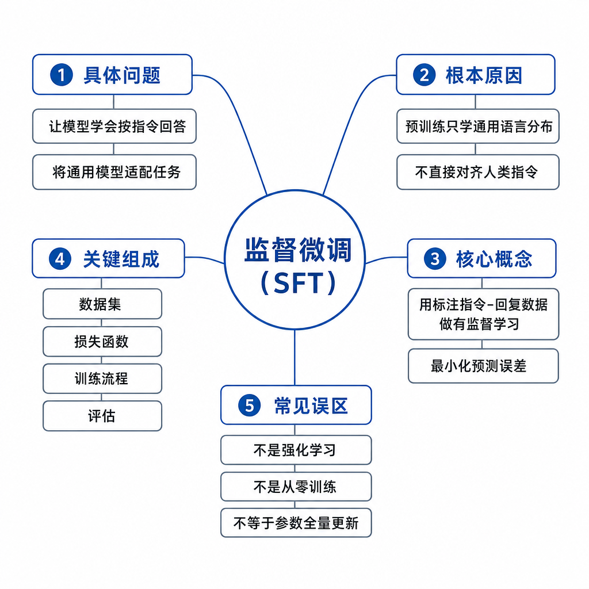
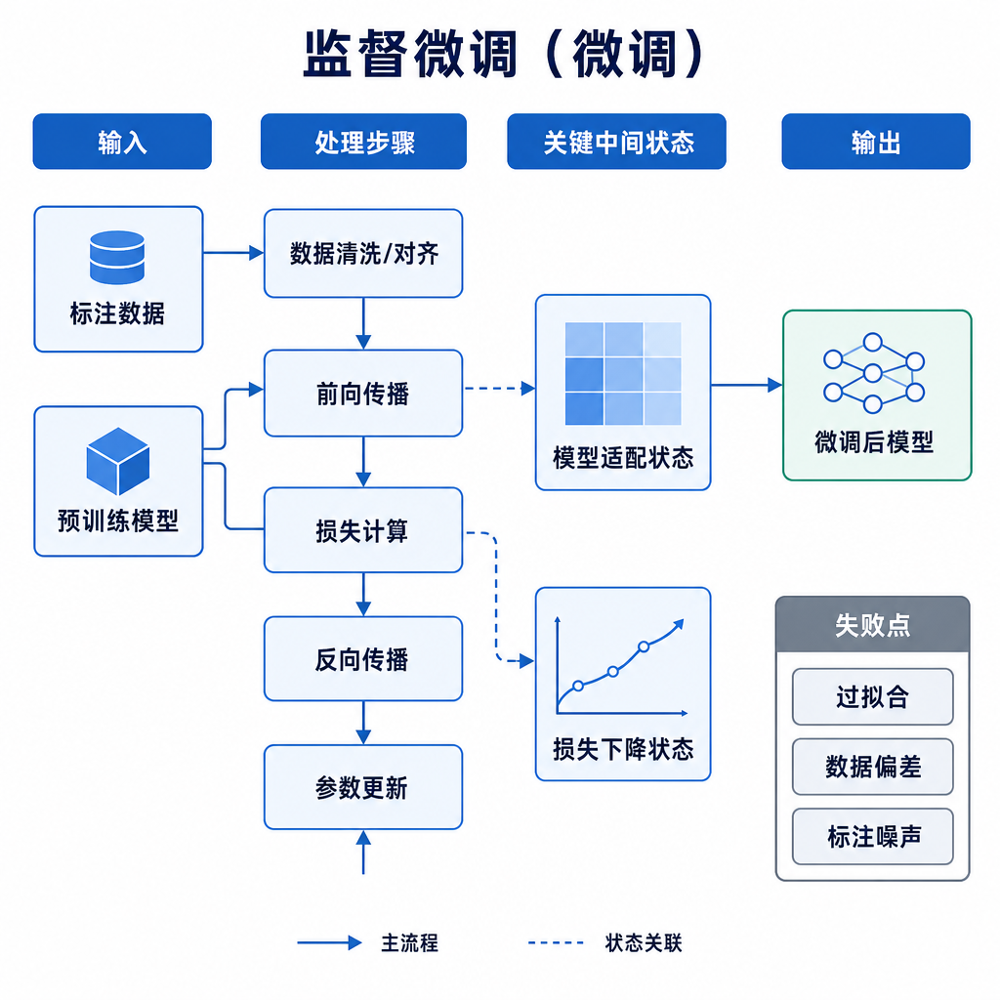
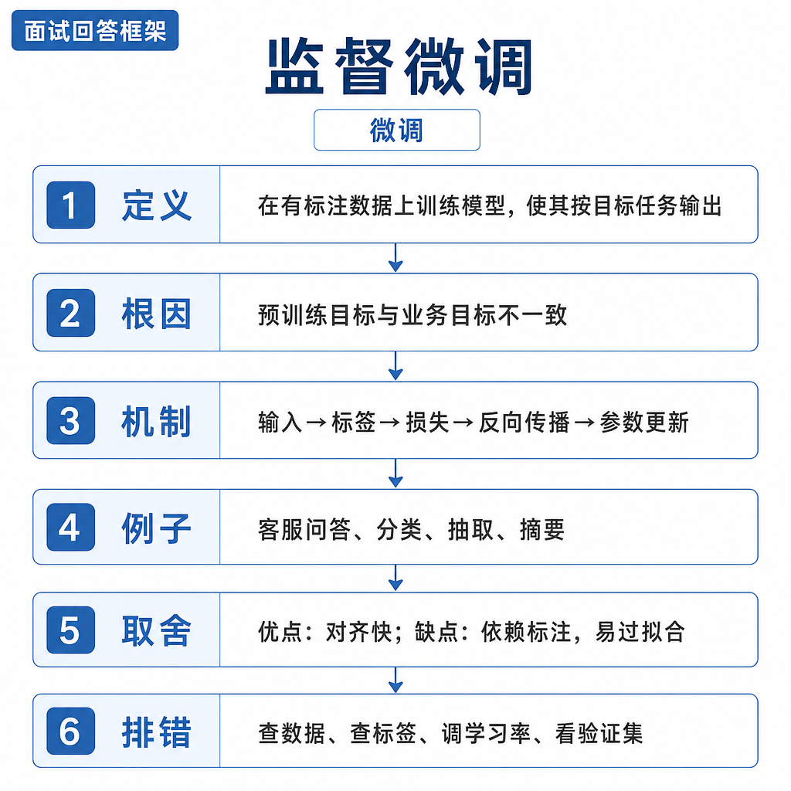

# 监督微调

面试官问：“公司客服模型经常把退款规则答错，你准备用 SFT 解决吗？”候选人马上说：“可以，把最新退款政策做成问答灌进去再训练。”追问来了：政策下周又改怎么办，怎么追溯答案来源，为什么不用 RAG，训练 loss 下降是否代表事实正确？如果这些问题答不上来，说明把监督微调当成了知识库。SFT 的核心不是把所有事实塞进参数，而是让已经具备通用能力的模型学会按任务、格式、语气和边界回答。

## 核心矛盾：行为适配和事实更新不是一回事

预训练模型通过海量文本学习语言规律和通用知识，目标通常是预测下一个 token。SFT 仍然使用类似的交叉熵目标，但训练数据变成了“指令和理想回答”。它强化的是模型在特定上下文里的输出分布：是否遵循系统指令，是否输出 JSON，是否先澄清再回答，是否在医疗、金融、隐私问题上拒绝越界。它能改变回答习惯，却不擅长维护高频变化的事实。

RAG 和工具调用解决的是另一层问题。RAG 在推理时检索外部文档，把证据放进上下文；工具调用在推理时查询订单、库存、账户和日志。它们不要求模型把事实记进参数，因此可更新、可审计、可回滚。合理架构通常是：基座模型提供通用能力，SFT 规范行为，RAG 提供可追溯知识，工具提供实时状态。

## 训练信号、数据格式和优化目标

一条 SFT 样本通常包含 `system`、`user`、`assistant` 三类消息。训练时将消息拼成模型使用的 chat template，再 tokenize。多数实现只对 `assistant` 答案部分计算 loss，避免模型学习复述用户问题或系统提示。优化目标是最大化标准答案 token 的条件概率，也就是让模型在看到相同上下文时更可能生成这类答案。

这里有三个容易被忽略的细节。第一，数据格式必须和线上推理一致。训练时使用一种模板，线上换另一种模板，模型学到的边界可能触发不了。第二，答案不是越长越好。训练集如果总是“首先、其次、最后”，模型会把模板当偏好，在简单问题上也啰嗦。第三，SFT 是示范学习，不是偏好比较。它只告诉模型“这样答”，没有显式告诉模型“另一个答案为什么差”。如果需要让模型区分好坏答案，DPO 或 RLHF 的信号更合适。

## 工程例子：企业客服如何落地

假设你要做一个售后客服。需求包括三类：固定服务口吻、退款政策问答、订单状态查询。固定口吻适合 SFT，例如投诉先表达理解，再确认订单信息，最后给出下一步；退款政策如果每月变化，更适合进入知识库，由 RAG 检索并引用版本；订单状态必须走工具或 API，因为参数训练永远追不上实时数据。

数据构造也要按任务拆开。风格数据用于统一语气，格式数据用于稳定 JSON 或表格输出，安全数据用于拒绝越权查询，工具调用数据用于让模型学会何时调用 `query_order`、参数怎么填、工具失败时如何解释。上线评测不能只看 BLEU 或训练 loss，而要看格式合规率、引用命中率、事实准确率、拒答正确率、人工转接率和用户二次追问率。

## 适用边界和失败模式

SFT 适合稳定、可示范、边界明确的行为学习：摘要风格、分类标签、结构化输出、角色语气、工具调用 schema、行业术语表达和安全拒答。它不适合实时知识、高频政策、个人长期记忆、需要证据链的问题，也不适合用少量数据弥补基座模型没有的底层推理能力。

常见失败有几类。数据错，模型会稳定学错；覆盖窄，线上换一种问法就失效；学习率过大，通用能力被破坏；epoch 过多，模型记住模板而不是任务；长文档硬切问答，模型看似记住片段，却无法保证完整性；安全样本不足，微调后拒答边界被冲淡。

## 排查方式和面试表达

还有一个排查维度是训练信号是否真的落在答案上。很多团队把整段对话都算 loss，结果模型学会复述系统指令和用户问题；也有人把工具返回、检索证据和最终回答混在一起训练，导致模型上线后编造工具结果。正确做法是明确哪些 token 是可学习目标，哪些只是上下文条件。

SFT 后效果差，先抽样看训练数据：是否有错答、重复、模板污染、角色错位和多轮消息截断。再比较基座模型、SFT 模型、RAG 版本在同一评测集上的差异，确认问题是行为、知识还是检索。然后看训练超参：学习率、batch size、warmup、epoch、loss mask 是否正确。最后检查线上 prompt、chat template、停止符和解码参数是否与训练一致。

面试回答可以收束成这一层逻辑：监督微调是在预训练模型上用高质量指令答案继续训练，目标是让模型更稳定地遵循任务格式、表达风格和安全边界。它改参数，适合稳定行为；RAG 不改参数，适合可更新事实；工具适合实时动作。SFT 不是灌知识，尤其不适合维护频繁变化、要求可追溯的事实。工程上我会用 SFT 训练“怎么答”，用 RAG 和工具提供“答什么依据”。
