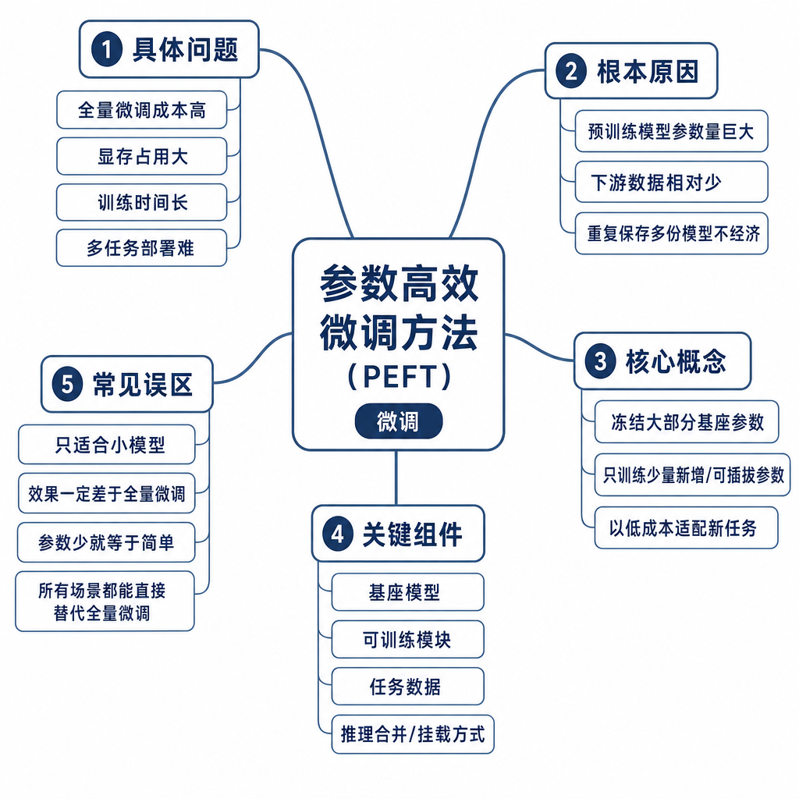
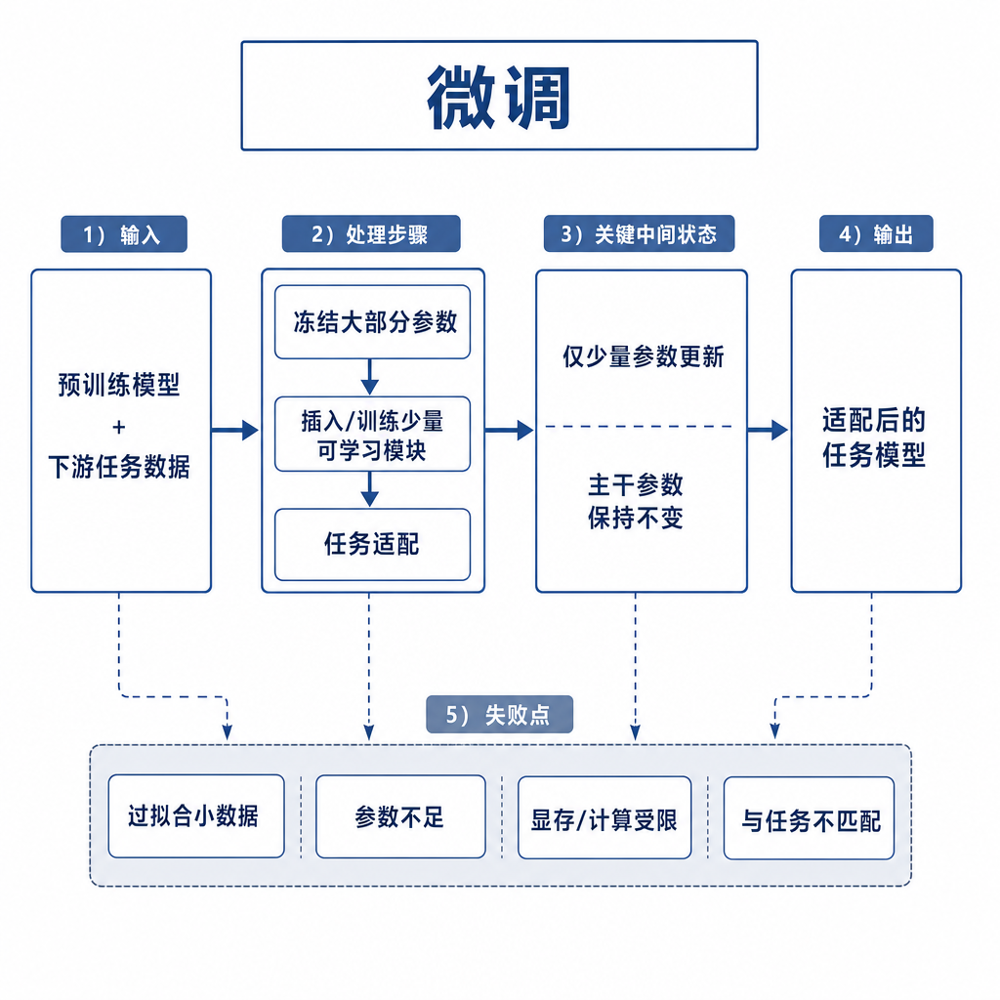
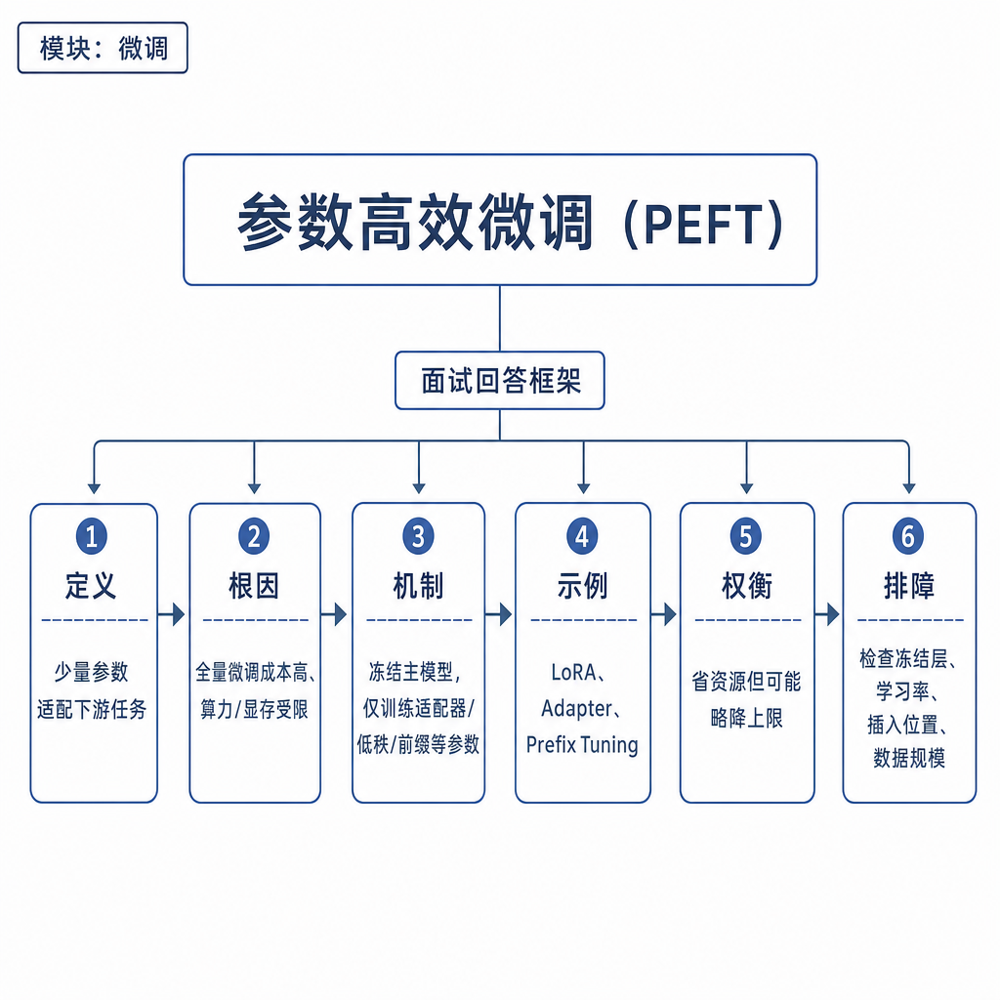

# 参数高效微调方法

面试官问：“你们只有一张 24GB 显卡，要给三个业务线各训练一个 7B 模型，怎么做？”候选人回答：“用 LoRA，少训点参数。”追问来了：LoRA 更新什么、冻结什么，QLoRA 省的是哪部分显存，Prefix Tuning 和 Prompt Tuning 又改了哪里，节省成本牺牲了什么？如果只会说“省显存”，就没有真正理解参数高效微调 PEFT。

## 核心矛盾：适配能力和训练成本的交换

全量微调会更新基座模型所有权重。对大模型来说，显存里不只有权重，还包括梯度、优化器状态和激活值。用 Adam 时，优化器状态常常比参数本身还重。更现实的问题是部署：每个业务保存一份完整模型，灰度、回滚、热切换和版本管理都会变得笨重。

PEFT 的假设是：基座模型已经有通用语言和推理能力，业务适配多数时候只需要小幅改变行为分布。因此冻结大部分原始权重，只训练少量新增参数或软提示，就能让模型学会特定格式、语气、工具调用或领域表达。它节省训练显存、存储空间和多租户部署成本，但表达能力受限，不能把弱基座变成强基座，也不能替代 RAG 维护事实。

## LoRA 和 QLoRA 到底更新什么

LoRA 冻结原始线性层权重 `W`，在旁边加入低秩增量分支。训练时只更新两个小矩阵 `A` 和 `B`，用 `B A` 近似权重更新量。前向计算可以理解为原始输出加上低秩增量输出。常见注入层是 attention 的 `q_proj`、`k_proj`、`v_proj`、`o_proj`，也可以扩展到 MLP。rank 决定增量表达能力，alpha 控制缩放，dropout 缓解过拟合。

LoRA 节省的是梯度和优化器状态，因为大部分基座权重不参与训练；它不一定显著降低推理显存，因为推理仍要加载基座模型。可以在推理时动态加载 adapter，也可以把 LoRA merge 回基座权重。动态加载便于多租户切换，merge 后部署简单但失去灵活性。

QLoRA 进一步把冻结的基座权重量化到 4-bit，通常配合 NF4、double quantization 和分页优化器。训练时仍只更新 LoRA 参数，梯度不会回写到量化基座。它主要节省基座权重占用，让单卡训练更大模型成为可能；牺牲是量化误差和数值稳定性，代码、数学、长上下文任务可能更敏感。

## Prefix Tuning 和 Prompt Tuning 改了哪里

Prefix Tuning 冻结模型权重，在每层 Transformer 的注意力中加入可训练的 prefix key/value。它不是改输入文本，而是在内部注意力缓存里插入一段可学习上下文，让模型在每层都受到任务条件影响。它通常比纯 Prompt Tuning 表达力强，但实现更贴近模型结构，推理时会增加一定 KV 开销。

Prompt Tuning 更轻，只训练输入端的一组软提示向量，模型主体完全冻结。这些向量不是人类可读文本，而是连续 embedding。它参数最少，适合大模型上的轻量任务适配，但对小模型、复杂任务和强格式控制可能不够。两者共同特点是更新软参数，不更新原始权重；节省训练成本，但可解释性弱，跨模型迁移困难。

## 工程例子：多租户行业助手

一个通用 7B 基座要服务法律、金融和售后三个团队。全量微调意味着三份完整模型和三套部署。用 LoRA 时，可以保留一份基座，为每个团队训练一个 adapter。法律 adapter 学合同审查口吻，金融 adapter 学风险提示格式，售后 adapter 学工单工具调用。请求进入时根据租户选择 adapter，常用 adapter 常驻显存，低频 adapter 按需加载。

训练流程要先定目标：是格式适配、风格适配，还是领域术语表达。然后选择方法和注入层。数据少、任务简单可试 Prompt Tuning；需要较强行为改变选 LoRA；显存紧张选 QLoRA；复杂任务且预算充足再考虑全量微调。评测要覆盖业务集、通用能力集和安全集，避免 adapter 学会业务格式却破坏基础能力。

## 失败模式、排查和面试表达

PEFT 失败常见原因包括：rank 太小学不到，rank 太大过拟合；学习率过高导致 adapter 过强，覆盖基座原有能力；只注入 q/v 不够，复杂任务需要 o_proj 或 MLP；QLoRA 量化误差让 loss 下降但真实评测退化；训练 prompt 和线上模板不一致，adapter 无法触发；多个 adapter 叠加时风格冲突。

排查时先看数据质量和模板一致性，再看 rank、alpha、学习率、epoch 和注入层；QLoRA 要额外看量化配置、梯度溢出和显存分页；部署侧看 adapter 是否正确加载、是否 merge 了错误版本。面试可答：PEFT 冻结基座，只训练少量新增参数或软提示。LoRA 训练低秩增量矩阵，QLoRA 量化冻结基座再训练 LoRA，Prefix Tuning 训练每层注意力前缀，Prompt Tuning 训练输入软提示。它们节省训练和版本管理成本，牺牲部分表达能力、稳定性和可解释性，事实更新仍要靠 RAG 或工具。
