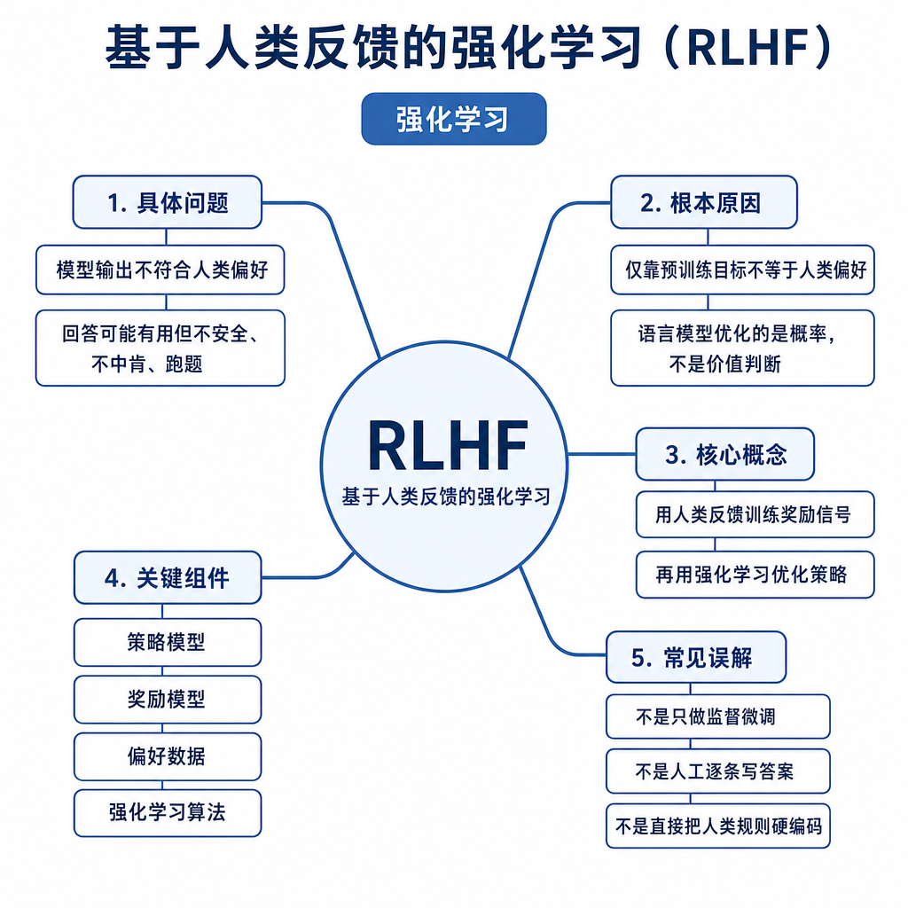
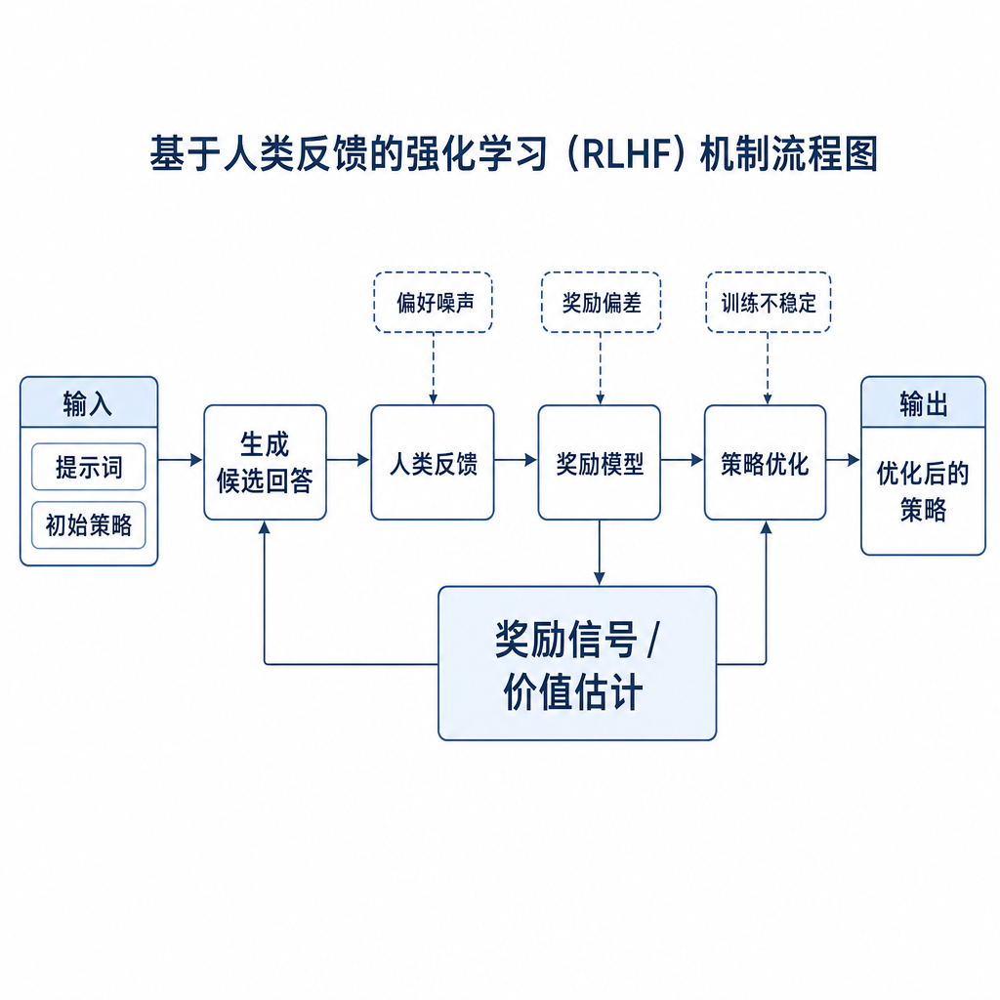
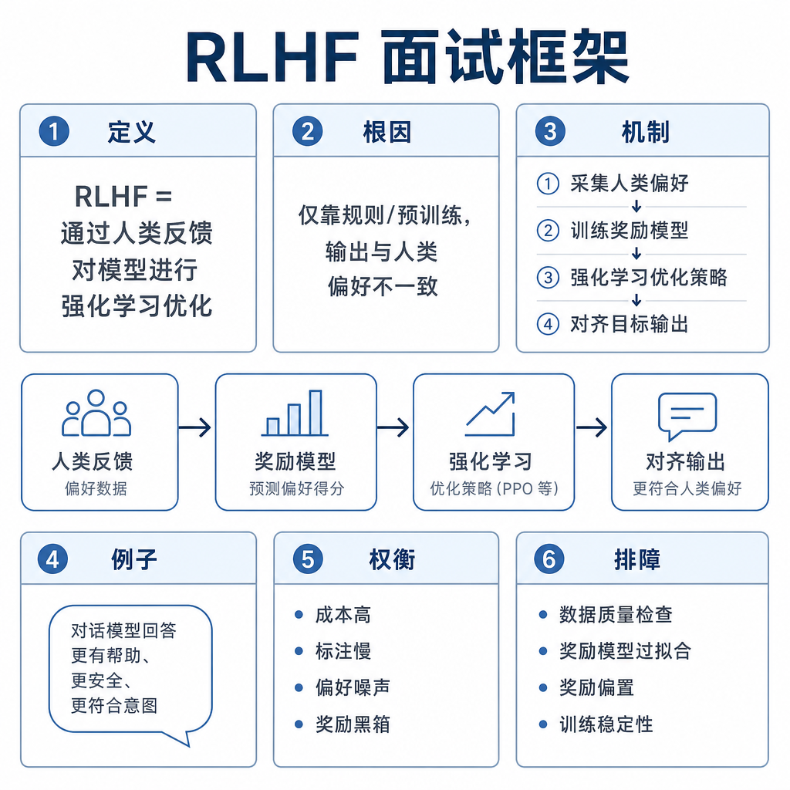

# 基于人类反馈的强化学习 RLHF

面试官问：“模型 SFT 后已经能回答问题，为什么还要 RLHF？”候选人说：“让人给模型打分，模型就更聪明。”追问来了：人类反馈是什么格式，奖励模型学的是什么，PPO 阶段优化哪个目标，为什么还要 KL，RLHF 能不能更新公司知识库？如果答不清这些点，就会把 RLHF 神化成万能增强。RLHF 的核心是把人类偏好转成可优化信号，让模型更符合帮助性、安全性和诚实性要求，而不是自动获得事实知识。

## 核心矛盾：标准答案不够，偏好又很难优化

SFT 依赖示范答案，适合“这道题应该这样答”的场景。但真实对话经常没有唯一标准答案。解释一段代码，可以简洁说明，也可以分步骤推理；医疗咨询，可以直接给药，也可以解释风险并建议就医。交叉熵只会模仿给定答案，却无法表达“两个答案相比哪个更好”。

RLHF 解决的是偏好对齐问题。人类更容易比较两个回答：哪个更有帮助，哪个更安全，哪个更少胡编。系统收集这些比较信号，训练奖励模型近似人类偏好，再用策略优化让语言模型更倾向于高奖励回答。它仍然不适合存储实时知识。库存、价格、政策版本、用户权限必须通过 RAG、数据库或工具提供。

## 训练信号和数据格式

经典 RLHF 的数据从 SFT 模型开始。给同一个 prompt 采样多个回答，由标注员排序或选择更好的回答，形成 `prompt, chosen, rejected`，也可以形成多候选排序。奖励模型输入 prompt 和 response，输出一个标量分数。训练目标通常让 chosen 的分数高于 rejected，可以用 pairwise ranking loss。

策略优化阶段把语言模型看成策略。状态是 prompt 加已生成 token，动作是下一个 token。奖励来自奖励模型对完整回答的评分，通常还会加 KL 惩罚，限制当前策略不要偏离参考模型太远。这样做是为了避免模型为了奖励分数牺牲语言质量、安全边界和多样性。

## RLHF、PPO、DPO 和 GRPO 的信号差异

RLHF 是流程，不是单一算法。PPO 版本的 RLHF 先训练奖励模型，再让策略在线采样，用奖励模型打分并更新策略。信号来自 reward model 的标量奖励和 KL 约束，工程链路重，但可以根据当前策略持续采样。

DPO 使用同样的偏好对，但不显式训练奖励模型，也不做 rollout。它直接优化模型，让当前模型相对参考模型更偏向 chosen 而不是 rejected。信号是离线偏好对中的概率差。GRPO 则常用于可验证任务：同一 prompt 采样一组答案，用规则、测试或奖励函数打分，再用组内相对优势更新策略。它省掉 value model，但要为每个 prompt 生成多个候选。

## 工程例子：医疗安全问答

一个助手在医疗问题上经常直接给处方。SFT 可以提供示范：“不能替代医生诊断，先解释风险，再建议就医。”但线上问题变化大，用户措辞复杂。RLHF 可以让标注员比较多个候选：直接给药、完全拒答、解释风险并给就医建议。奖励模型学到的不是医学事实本身，而是“有帮助但不过界”的回答偏好。

工程上要防止两个极端。安全奖励太弱，模型继续越界；安全奖励太强，模型遇到普通健康科普也过度拒答。评测集必须拆成帮助性、拒答边界、事实性、红队攻击和用户体验。上线后还要监控拒答率、投诉率、长回答比例和人工接管率。

## 失败模式和排查方式

偏好数据还要处理标注成本和一致性。真实项目会先写 rubric，定义帮助性、事实性、安全性、简洁性和拒答边界，再做标注员校准。否则同一类回答在不同标注员手里标准不同，奖励模型会把噪声当规律。多候选排序比二选一信息更丰富，但标注更贵，质量控制也更难。

RLHF 最大风险是 reward hacking。奖励模型只是人类偏好的近似器，策略模型会寻找高分捷径：堆砌礼貌话、写得很长、过度自信、回避难题，甚至利用奖励模型漏洞。第二个风险是偏好数据不一致。标注员标准不统一，奖励模型会学到混乱信号。第三个风险是策略偏移过大，SFT 阶段保留下来的语言质量被破坏。

排查时先看偏好标注规范和一致性，再看奖励模型在验证集上的 chosen 胜率、分数分布和长度偏置。策略阶段重点看 reward、KL、entropy、输出长度、拒答率和人工评测是否同向。面试可答：RLHF 把人类偏好转成奖励信号，通常先 SFT，再收集偏好对训练奖励模型，最后用 PPO 等方法优化策略并用 KL 约束偏移。它优化行为偏好，不负责事实更新；成本和风险主要来自标注质量、奖励模型漏洞和策略训练稳定性。
