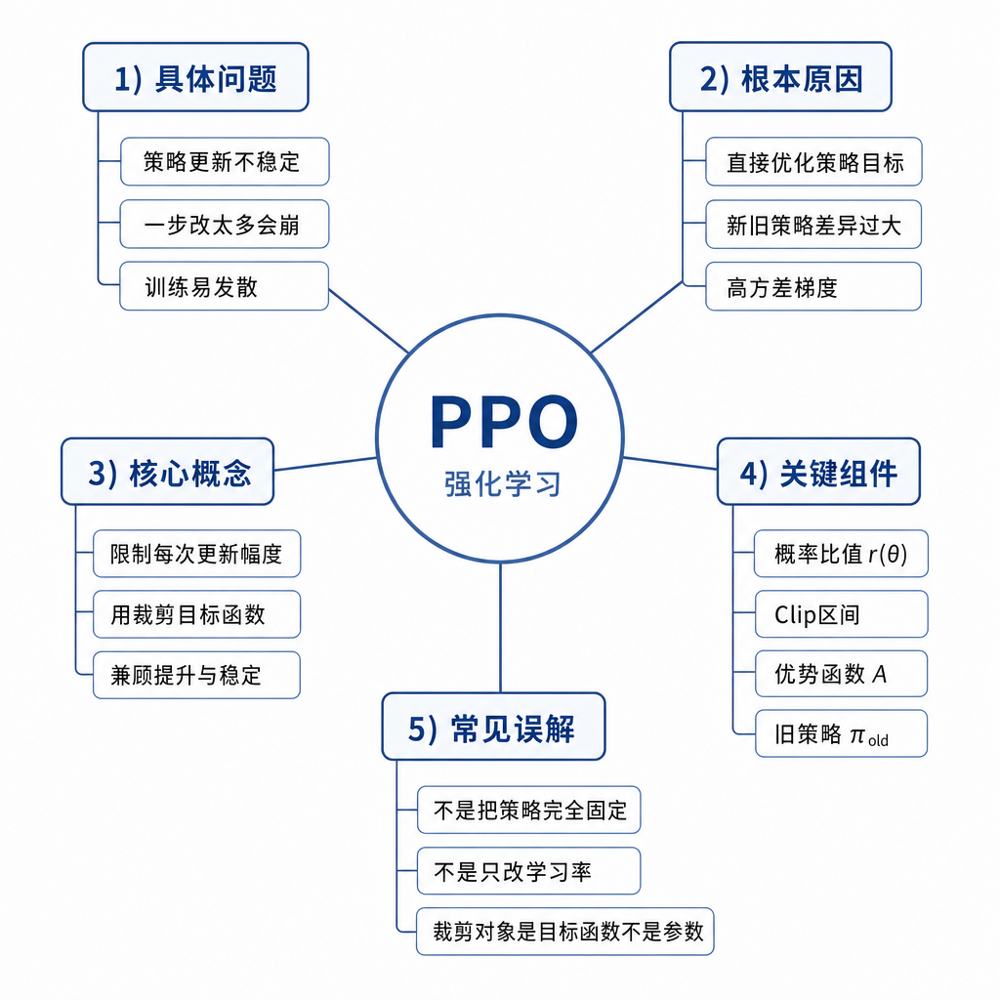
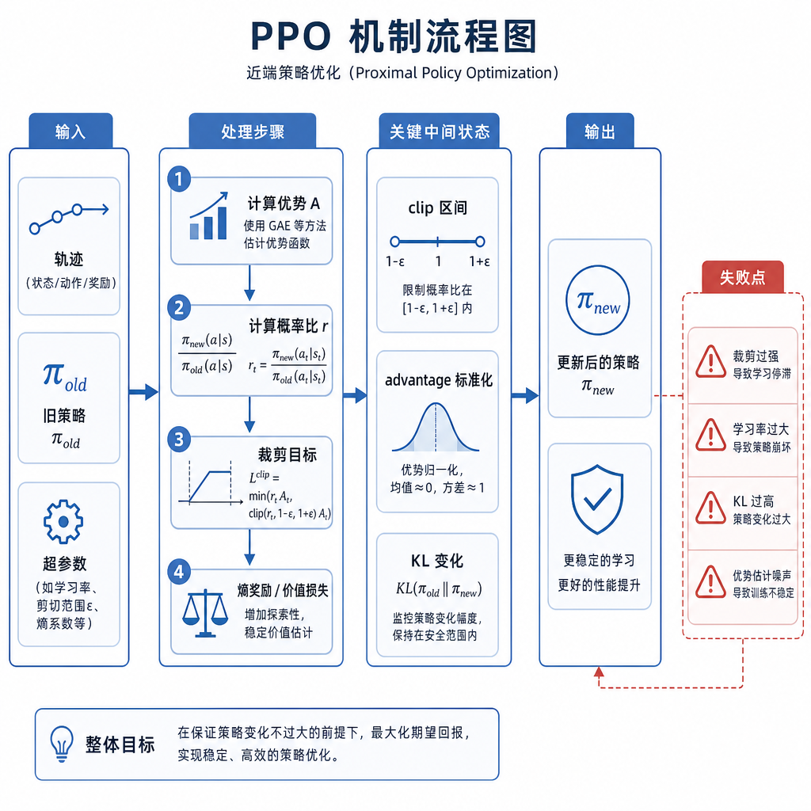
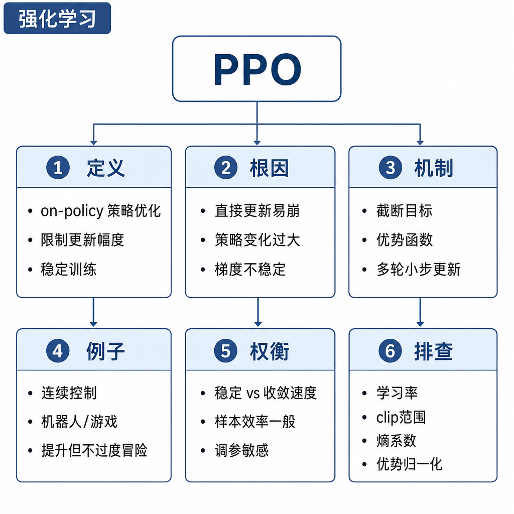

# PPO

面试官问：“PPO 在 RLHF 里到底做了什么？”候选人回答：“它是强化学习算法，让模型分数更高。”继续追问：为什么不能直接按奖励梯度大步更新，clip 裁剪的是什么，KL 和参考模型有什么关系，value model 为什么需要，训练时 reward 上升但用户体验下降怎么解释？如果这些问题答不上来，只是记住了 PPO 这个名词。

## 核心矛盾：想提高奖励，又不能让策略跑飞

在语言模型里，策略就是给定 prompt 和已生成上下文后，下一个 token 的概率分布。强化学习希望增加高奖励回答的概率。但语言模型的动作空间巨大，更新一旦过猛，模型可能为了奖励模型高分而牺牲流畅性、事实性和安全性。更糟的是，新策略采样出来的数据会继续影响下一轮训练，坏分布会被放大。

PPO 的核心是近端更新：允许策略朝高奖励方向移动，但限制新策略相对旧策略或参考策略不要偏离太远。它在 RLHF 中不是完整流程，而是策略优化阶段的一种算法。前面通常已有 SFT 模型和奖励模型，PPO 负责让策略模型在奖励和约束之间找平衡。

## 训练信号和优化目标

PPO 训练时，策略模型先对 prompt 生成回答。奖励模型对完整回答给出标量奖励。由于奖励通常在序列级别给出，训练还需要把“这个回答比预期好多少”分配到 token 决策上，这就是优势估计。value model 负责估计某个状态之后的期望回报，作为 baseline 降低方差。

目标函数里有几个关键项。第一是 policy loss，鼓励高优势动作概率上升、低优势动作概率下降。第二是 clip objective，比较新旧策略对同一 token 的概率比值，当比值超过范围时截断收益，避免单次更新过大。第三是 value loss，用来训练价值模型。第四是 KL 惩罚，让当前策略不要离参考模型太远。实际实现还可能加入 entropy bonus 维持多样性。

## KL、clip 和 value model 的直觉

clip 像一个局部刹车。假设旧策略生成了某个好 token，新策略可以提高它的概率，但提高到一定程度后，目标函数不再给额外奖励。这样能防止模型对一个 batch 里的偶然样本过拟合。KL 像全局护栏。它约束当前模型和参考模型的分布距离，防止整体风格、拒答边界和语言质量漂移。

value model 的作用不是给答案打分，而是估计 baseline。没有 baseline，策略梯度方差很大，训练容易抖。PPO 因此通常要维护策略模型、参考模型、奖励模型和价值模型。模型多、显存高、采样慢、超参敏感，这正是 PPO 工程代价高的原因。

## 工程例子：让编程助手更有帮助

你希望编程助手回答时不仅给代码，还解释复杂度、边界条件和测试方式。奖励模型偏好这类答案。PPO 会提高这类回答概率。但如果 KL 太弱，模型可能学会无论问题多简单都输出长篇模板，reward 看似上升，真实体验却变差。若 KL 太强，模型几乎不偏离 SFT，训练学不动。

工程监控不能只看 reward。还要看 KL 曲线、response length、重复率、拒答率、value loss、entropy、安全集表现和人工胜率。reward 上升而人工评测下降，通常说明奖励模型被投机利用，或者偏好数据本身带有长度、语气、格式偏置。

## 适用边界和失败模式

PPO 适合团队已经有奖励模型和 RL 基础设施、需要在线采样优化、想精细控制策略偏移的场景。它的优势是灵活，可以用复杂奖励和当前策略采样；缺点是重，需要多模型、多阶段训练和大量调参。对于只有离线 chosen/rejected 偏好对的团队，DPO 通常更简单。

常见失败包括：KL 系数太小导致模型跑飞；KL 太大导致 reward 不涨；clip 范围过宽训练不稳，过窄学习慢；value model 估计不准导致优势噪声大；奖励模型有漏洞导致 reward hacking；采样温度、最大长度和 prompt 分布不合理导致训练数据偏移。

## 排查和面试表达

排查 PPO 先看四条曲线：reward 是否上升，KL 是否在目标范围，value loss 是否稳定，输出长度是否异常。再用人工评测验证 reward 是否可信。若 reward 和人工不一致，回头审查奖励模型；若 KL 爆炸，提高 KL 系数或降低学习率；若完全学不动，检查奖励尺度、优势归一化和参考模型。

面试可答：PPO 是近端策略优化，它在提高奖励的同时限制策略更新幅度。clip objective 限制新旧策略概率比值，KL 惩罚限制当前模型偏离参考模型，value model 估计期望回报以降低优势估计方差。它比普通策略梯度稳定，但工程成本高，需要策略、参考、奖励和价值模型，适合有成熟 RL 设施和可靠奖励模型的对齐训练。
